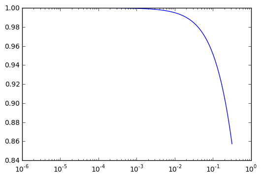
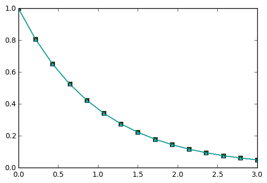

# 2 Analysis
<!-- toc orderedList:0 depthFrom:1 depthTo:6 -->

* [2 Analysis](#2-analysis)
  * [2.1 Experimental Investigations](#21-experimental-investigations)
    * [2.1.1 Discouraging Numerical Solutions](#211-discouraging-numerical-solutions)
    * [2.1.2 Detailed Experiments](#212-detailed-experiments)
  * [2.2 Stability](#22-stability)
    * [2.2.1 Exact Numerical Solution](#221-exact-numerical-solution)
    * [2.2.2 Stability Properties Derived from the Amplification Factor 45](#222-stability-properties-derived-from-the-amplification-factor-45)
  * [2.3 Accuracy](#23-accuracy)
    * [2.3.1 Visual Comparison of Amplification Factors](#231-visual-comparison-of-amplification-factors)
    * [2.3.2 Series Expansion of Amplification Factors](#232-series-expansion-of-amplification-factors)
    * [2.3.3 The Ratio of Numerical and Exact Amplification Factors](#233-the-ratio-of-numerical-and-exact-amplification-factors)
    * [2.3.4 The Global Error at a Point](#234-the-global-error-at-a-point)
    * [2.3.5 Integrated Error](#235-integrated-error)
    * [2.3.6 Truncation Error](#236-truncation-error)
    * [2.3.7 Consistency, Stability, and Convergence](#237-consistency-stability-and-convergence)
  * [2.4 Various Types of Errors in a Differential Equation Model](#24-various-types-of-errors-in-a-differential-equation-model)
    * [2.4.1 Model Errors](#241-model-errors)
    * [2.4.2 Data Errors](#242-data-errors)
    * [2.4.3 Discretization Errors](#243-discretization-errors)
    * [2.4.4 Rounding Errors](#244-rounding-errors)
    * [2.4.5 Discussion of the Size of Various Errors](#245-discussion-of-the-size-of-various-errors)
  * [2.5 Exercises](#25-exercises)
    * [Problem 2.1: Visualize the accuracy of finite differences](#problem-21-visualize-the-accuracy-of-finite-differences)
    * [Problem 2.2: Explore the 0 -rule for exponential growth](#problem-22-explore-the-0-rule-for-exponential-growth)
    * [Problem 2.3: Explore rounding errors in numerical calculus](#problem-23-explore-rounding-errors-in-numerical-calculus)

<!-- tocstop -->


<div id='toc'></div>


```python
import sys
sys.path.append('./analysis/')
```

## 2.1 Experimental Investigations

### 2.1.1 Discouraging Numerical Solutions

* http://tinyurl.com/ofkw6kc/analysis


```python

```

### 2.1.2 Detailed Experiments

* http://tinyurl.com/ofkw6kc/analysis/decay_osc_regions.py


```python
# %load analysis/decay_osc_regions.py
from decay_mod import solver
import numpy as np
import scitools.std as st

def non_physical_behavior(I, a, T, dt, theta):
    """
    Given lists/arrays a and dt, and numbers I, dt, and theta,
    make a two-dimensional contour line B=0.5, where B=1>0.5
    means oscillatory (unstable) solution, and B=0<0.5 means
    monotone solution of u'=-au.
    """
    a = np.asarray(a); dt = np.asarray(dt)  # must be arrays
    B = np.zeros((len(a), len(dt)))         # results
    for i in range(len(a)):
        for j in range(len(dt)):
            u, t = solver(I, a[i], T, dt[j], theta)
            # Does u have the right monotone decay properties?
            correct_qualitative_behavior = True
            for n in range(1, len(u)):
                if u[n] > u[n-1]:  # Not decaying?
                    correct_qualitative_behavior = False
                    break  # Jump out of loop
            B[i,j] = float(correct_qualitative_behavior)
    a_, dt_ = st.ndgrid(a, dt)  # make mesh of a and dt values
    st.contour(a_, dt_, B, 1)
    st.grid('on')
    st.title('theta=%g' % theta)
    st.xlabel('a'); st.ylabel('dt')
    st.savefig('osc_region_theta_%s.png' % theta)
    st.savefig('osc_region_theta_%s.pdf' % theta)

non_physical_behavior(
    I=1,
    a=np.linspace(0.01, 4, 22),
    dt=np.linspace(0.01, 4, 22),
    T=6,
    theta=0.5)

```

## 2.2 Stability

### 2.2.1 Exact Numerical Solution

### 2.2.2 Stability Properties Derived from the Amplification Factor 45

## 2.3 Accuracy

### 2.3.1 Visual Comparison of Amplification Factors

### 2.3.2 Series Expansion of Amplification Factors


```python
>>> from sympy import *
>>> # Create p as a mathematical symbol with name 'p'
>>> p = Symbols('p')
>>> # Create a mathematical expression with p
>>> A_e = exp(-p)
>>> # Find the first 6 terms of the Taylor series of A_e
>>> A_e. series(p, 0, 6)
1 + (1/2)*p**2 - p - 1/6*p**3 - 1/120*p**5 + (1/24)*p**4 + O(p**6)
```

### 2.3.3 The Ratio of Numerical and Exact Amplification Factors


```python
>>> FE = 1 - (A.subs(theta, 0)/A_e).series(p, 0, 4)
>>> BE = 1 - (A.subs(theta, 1)/A_e).series(p, 0, 4)
>>> CN = 1 - (A.subs(theta, half)/A_e).series(p, 0, 4)
>>> FE
(1/2)*p**2 + (1/3)*p**3 + O(p**4)
>>> BE
-1/2*p**2 + (1/3)*p**3 + O(p**4)
>>> CN
(1/12)*p**3 + O(p**4)
```

### 2.3.4 The Global Error at a Point


```python
>>> n = Symbol('n' )
>>> u_e = exp(-p*n)
>>> u_n = A**n
>>> FE = u_e.series(p, 0, 4) - u_n.subs(theta, 0).series(p, 0, 4)
>>> BE = u_e.series(p, 0, 4) - u_n.subs(theta, 1).series(p, 0, 4)
>>> CN = u_e.series(p, 0, 4) - u_n.subs(theta, half).series(p, 0, 4)
>>> FE
(1/2)*n*p**2 - 1/2*n**2*p**3 + (1/3)*n*p**3 + O(p**4)
>>> BE
(1/2)*n**2*p**3 - 1/2*n*p**2 + (1/3)*n*p**3 + O(p**4)
>>> CN
(1/12)*n*p**3 + O(p**4)
```

### 2.3.5 Integrated Error


```python
import sympy as sym
p, n, a, dt, t, T, theta = sym. symbols('p n a dt t T theta' )
A = (1-(1-theta)*p)/(1+theta*p)
u_e = sym. exp(-p*n)
u_n = A**n
error = u_e. series(p, 0, 4) - u_n. subs(theta, 0). series(p, 0, 4)
# Introduce t and dt instead of n and p
error = error. subs('n' , 't/dt' ). subs(p, 'a*dt' )
error = error. as_leading_term(dt) # study only the first term
print error
error_L2 = sym. sqrt(sym. integrate(error**2, (t, 0, T)))
print 'L2 error:' , sym. simplify(error_error_L2)
```

### 2.3.6 Truncation Error

### 2.3.7 Consistency, Stability, and Convergence

## 2.4 Various Types of Errors in a Differential Equation Model

* http://en.wikipedia.org/wiki/Lax_equivalence_theorem

### 2.4.1 Model Errors


```python
from numpy import linspace, exp
from matplotlib. pyplot import \
    plot, show, xlabel, ylabel, legend, savefig, figure, title
def model_errors():
    p_values = [0.01, 0.1, 1]
    a = 1
    I = 1
    t = linspace(0, 4, 101)
    legends = []
    # Work with figure(1) for the discrepancy and figure(2+i)
    # for plotting the model and the true model for p value no i
    for i, p in enumerate(p_values):
        u = model(t, I, a)
        u_true = true_model(t, I, a, p)
        discrepancy = u_true - u
        figure(1)
        plot(t, discrepancy)
        figure(2+i)
        plot(t, u, 'r-' , t, u_true, 'b--')
        legends. append('p=%g' % p)
    figure(1)
    legend(legends, loc='lower right')
    savefig('tmp1.png'); savefig('tmp1.pdf')
    for i, p in enumerate(p_values):
        figure(2+i)
        legend(['model' , 'true model' ])
        title('p=%g' % p)
        savefig('tmp%d.png' % (2+i)); savefig('tmp%d.pdf' % (2+i))

def derive_true_solution():
    import sympy as sym
    u = sym. symbols('u' , cls=sym. Function) # function u(t)
    t, a, p, I = sym. symbols('t a p I' , real=True)

    def ode(u, t, a, p):
        """Define ODE: u' = (a + p*t)*u. Return residual."""
        return sym. diff(u, t) + (a + p*t)*u

    eq = ode(u(t), t, a, p)
    s = sym. dsolve(eq)
    # s is sym.Eq object u(t) == expression, we want u = expression,
    # so grab the right-hand side of the equality (Eq obj.)
    u = s. rhs
    print u

    # u contains C1, replace it with a symbol we can fit to
    # the initial condition
    C1 = sym. symbols('C1' , real=True)
    u = u. subs('C1' , C1)
    print u

    # Initial condition equation
    eq = u. subs(t, 0) - I
    s = sym. solve(eq, C1) # solve eq wrt C1
    print s

    # s is a list s[0] = ...
    # Replace C1 in u by the solution
    u = u. subs(C1, s[0])
    print 'u:' , u
    print sym. latex(u) # latex formula for reports

    # Consistency check: u must fulfill ODE and initial condition
    print 'ODE is fulfilled:' , sym. simplify(ode(u, t, a, p))
    print 'u(0)-I:' , sym. simplify(u. subs(t, 0) - I)

    # Convert u expression to Python numerical function
    # (modules='numpy' allows numpy arrays as arguments,
    # we want this for t)
    u_func = sym. lambdify([t, I, a, p], u, modules='numpy' )
    return u_func

true_model = derive_true_solution()
```

    C1*exp(t*(-a - p*t/2))
    C1*exp(t*(-a - p*t/2))
    [I]
    u: I*exp(t*(-a - p*t/2))
    I e^{t \left(- a - \frac{p t}{2}\right)}
    ODE is fulfilled: 0
    u(0)-I: 0


### 2.4.2 Data Errors


```python
def data_errors():
    from numpy import random, mean, std
    from matplotlib. pyplot import hist
    N = 10000

    # Draw random numbers for I and a
    I_values = random. normal(1, 0.2, N)
    a_values = random. uniform(0.5, 1.5, N)

    # Compute corresponding u values for some t values
    t = [0, 1, 3]
    u_values = {} # samples for various t values
    u_mean = {}
    u_std = {}

    for t_ in t:
        # Compute u samples corresponding to I and a samples
        u_values[t_] = [model(t_, I, a)
        for I, a in zip(I_values, a_values)]
        u_mean[t_] = mean(u_values[t_])
        u_std[t_] = std(u_values[t_])
        figure()
        dummy1, bins, dummy2 = hist(
            u_values[t_], bins=30, range=(0, I_values. max()),
            normed=True, facecolor='green' )
        #plot(bins)
        title('t=%g' % t_)
        savefig('tmp_%g.png' % t_); savefig('tmp_%g.pdf' % t_)

    # Table of mean and standard deviation values
    print 'time mean st.dev.'
    for t_ in t:
        print '%3g %.2f %.3f' % (t_, u_mean[t_], u_std[t_])
```

### 2.4.3 Discretization Errors


```python
def discretization_errors():
    from numpy import log, abs
    I = 1
    a = 1
    T = 4
    t = linspace(0, T, 101)
    schemes = {'FE' : 0, 'BE' : 1, 'CN' : 0.5} # theta to scheme name
    dt_values = [0.8, 0.4, 0.1, 0.01]

    for dt in dt_values:
        figure()
        legends = []
        for scheme in schemes:
            theta = schemes[scheme]
            u, t = solver(I, a, T, dt, theta)
            u_e = model(t, I, a)
            error = u_e - u
            print '%s: dt=%.2f, %d steps, max error: %.2E'%\
                (scheme, dt, len(u)-1, abs(error). max())
            # Plot log(error), but exclude error[0] since it is 0
            plot(t[1:], log(abs(error[1:])))
            legends. append(scheme)
        xlabel('t' ); ylabel('log(abs(numerical error))' )
        legend(legends, loc='upper right' )
        title(r'$\Delta t=%g$'%dt)
        savefig('tmp_dt%g.png'%dt); savefig('tmp_dt%g.pdf'%dt)
```

### 2.4.4 Rounding Errors


```python
1.0/51*51
```


    1.0


```python
1.0/49*49
```


    0.9999999999999999


* https://en.wikipedia.org/wiki/Floating_point

* https://docs.python.org/2/library/decimal.html


```python
def rounding_errors(I=1, a=1, T=4, dt=0.1):
    import decimal
    from numpy import log, array, abs
    digits_values = [4, 16, 64, 128]
    # "Exact" arithmetics is taken as 1000 decimals here
    decimal.getcontext().prec = 1000
    u_e, t = solver_decimal(I=I, a=a, T=T, dt=dt, theta=0.5)
    for digits in digits_values:
        decimal.getcontext().prec = digits # set no of digits
        u, t = solver_decimal(I=I, a=a, T=T, dt=dt, theta=0.5)
        error = u_e - u
        error = array(error[1:], dtype=float)
        print '%d digits, %d steps, max abs(error): %.2E' % \
            (digits, len(u)-1, abs(error).max())
```

### 2.4.5 Discussion of the Size of Various Errors

## 2.5 Exercises

### Problem 2.1: Visualize the accuracy of finite differences


```python
%matplotlib inline
from numpy import logspace, exp
from matplotlib.pyplot import semilogx
p = logspace(-6, -0.5, 101)
y = (1-exp(-p))/p
semilogx(p, y)
```


    [<matplotlib.lines.Line2D at 0xcaa5d30>]





### Problem 2.2: Explore the 0 -rule for exponential growth

### Problem 2.3: Explore rounding errors in numerical calculus

* http://tinyurl.com/ofkw6kc/analysis/decay_ampf_plot.py


```python
"""Plot of amplification factors for the theta scheme."""

from numpy import linspace, exp
#from matplotlib.pyplot import *
from scitools.std import *

def A_exact(p):
    return exp(-p)

def A(p, theta):
    return (1-(1-theta)*p)/(1+theta*p)

def amplification_factor(names):
    curves = {}
    p = linspace(0, 3, 15)
    curves['exact'] = A_exact(p)
    plot(p, curves['exact'])
    hold('on')
    name2theta = dict(FE=0, BE=1, CN=0.5)
    for name in names:
        curves[name] = A(p, name2theta[name])
        plot(p, curves[name])
    plot([p[0], p[-1]], [0, 0], '--')  # A=0 line
    title('Amplification factors')
    grid('on')
    legend(['exact'] + names, loc='lower left', fancybox=True)
    xlabel('$p=a\Delta t$')
    ylabel('Amplification factor')
    savefig('A_factors.png')
    savefig('A_factors.pdf')
    show()

if __name__ == '__main__':
    if len(sys.argv) > 1:
        names = sys.argv[1:]
    else: # default
        names = 'FE BE CN'.split()
amplification_factor(names)
```


    ---------------------------------------------------------------------------

    KeyError                                  Traceback (most recent call last)

    <ipython-input-12-4375dbd56e17> in <module>()
         36     else: # default
         37         names = 'FE BE CN'.split()
    ---> 38 amplification_factor(names)


    <ipython-input-12-4375dbd56e17> in amplification_factor(names)
         19     name2theta = dict(FE=0, BE=1, CN=0.5)
         20     for name in names:
    ---> 21         curves[name] = A(p, name2theta[name])
         22         plot(p, curves[name])
         23     plot([p[0], p[-1]], [0, 0], '--')  # A=0 line


    KeyError: '-f'





```python

```
