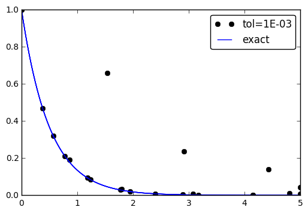

# 3 Generalizations
<!-- toc orderedList:0 depthFrom:1 depthTo:6 -->

* [3 Generalizations](#3-generalizations)
  * [3.1 Model Extensions](#31-model-extensions)
    * [3.1.1 Generalization: Including a Variable Coefficient](#311-generalization-including-a-variable-coefficient)
    * [3.1.2 Generalization: Including a Source Term](#312-generalization-including-a-source-term)
    * [3.1.3 Implementation of the Generalized Model Problem](#313-implementation-of-the-generalized-model-problem)
    * [3.1.4 Verifying a Constant Solution](#314-verifying-a-constant-solution)
    * [3.1.5 Verification via Manufactured Solutions](#315-verification-via-manufactured-solutions)
    * [3.1.6 Computing Convergence Rates](#316-computing-convergence-rates)
    * [3.1.7 Extension to Systems of ODEs](#317-extension-to-systems-of-odes)
  * [3.2 General First-Order ODEs](#32-general-first-order-odes)
    * [3.2.1 Generic Form of First-Order ODEs](#321-generic-form-of-first-order-odes)
    * [3.2.2 The theta-Rule](#322-the-theta-rule)
    * [3.2.3 An Implicit 2-Step Backward Scheme](#323-an-implicit-2-step-backward-scheme)
    * [3.2.4 Leapfrog Schemes](#324-leapfrog-schemes)
    * [3.2.5 The 2nd-Order Runge–Kutta Method](#325-the-2nd-order-rungekutta-method)
    * [3.2.6 A 2nd-Order Taylor-Series Method](#326-a-2nd-order-taylor-series-method)
    * [3.2.7 The 2nd- and 3rd-Order Adams–Bashforth Schemes](#327-the-2nd-and-3rd-order-adamsbashforth-schemes)
    * [3.2.8 The 4th-Order Runge–Kutta Method](#328-the-4th-order-rungekutta-method)
    * [3.2.9 The Odespy Software](#329-the-odespy-software)
    * [3.2.10 Example: Runge–Kutta Methods](#3210-example-rungekutta-methods)
    * [3.2.11 Example: Adaptive Runge–Kutta Methods](#3211-example-adaptive-rungekutta-methods)
  * [3.3 Exercises](#33-exercises)
    * [Exercise 3.1: Experiment with precision in tests and the size of u](#exercise-31-experiment-with-precision-in-tests-and-the-size-of-u)
    * [Exercise 3.2: Implement the 2-step backward scheme](#exercise-32-implement-the-2-step-backward-scheme)
    * [Exercise 3.3: Implement the 2nd-order Adams–Bashforth scheme](#exercise-33-implement-the-2nd-order-adamsbashforth-scheme)
    * [Exercise 3.4: Implement the 3rd-order Adams–Bashforth scheme](#exercise-34-implement-the-3rd-order-adamsbashforth-scheme)
    * [Exercise 3.5: Analyze explicit 2nd-order methods](#exercise-35-analyze-explicit-2nd-order-methods)
    * [Exercise 3.6: Implement and investigate the Leapfrog scheme](#exercise-36-implement-and-investigate-the-leapfrog-scheme)
    * [Exercise 3.7: Make a unified implementation of many schemes](#exercise-37-make-a-unified-implementation-of-many-schemes)

<!-- tocstop -->


```python

```

## 3.1 Model Extensions

### 3.1.1 Generalization: Including a Variable Coefficient

### 3.1.2 Generalization: Including a Source Term

### 3.1.3 Implementation of the Generalized Model Problem


```python
# %load genz/decay_vc.py
from numpy import *
from matplotlib.pyplot import *

def solver(I, a, b, T, dt, theta):
    """
    Solve u'=-a(t)*u + b(t), u(0)=I,
    for t in (0,T] with steps of dt.
    a and b are Python functions of t.
    """
    dt = float(dt)            # avoid integer division
    Nt = int(round(T/dt))     # no of time intervals
    T = Nt*dt                 # adjust T to fit time step dt
    u = zeros(Nt+1)           # array of u[n] values
    t = linspace(0, T, Nt+1)  # time mesh

    u[0] = I                  # assign initial condition
    for n in range(0, Nt):    # n=0,1,...,Nt-1
        u[n+1] = ((1 - dt*(1-theta)*a(t[n]))*u[n] + \
                  dt*(theta*b(t[n+1]) + (1-theta)*b(t[n])))/\
                  (1 + dt*theta*a(t[n+1]))
    return u, t

def test_constant_solution():
    """
    Test problem where u=u_const is the exact solution, to be
    reproduced (to machine precision) by any relevant method.
    """
    def u_exact(t):
        return u_const

    def a(t):
        return 2.5*(1+t**3)  # can be arbitrary

    def b(t):
        return a(t)*u_const

    u_const = 2.15
    theta = 0.4; I = u_const; dt = 4
    Nt = 4  # enough with a few steps
    u, t = solver(I=I, a=a, b=b, T=Nt*dt, dt=dt, theta=theta)
    print u
    u_e = u_exact(t)
    difference = abs(u_e - u).max()  # max deviation
    tol = 1E-14
    assert difference < tol

def test_linear_solution():
    """
    Test problem where u=c*t+I is the exact solution, to be
    reproduced (to machine precision) by any relevant method.
    """
    def u_exact(t):
        return c*t + I

    def a(t):
        return t**0.5  # can be arbitrary

    def b(t):
        return c + a(t)*u_exact(t)

    theta = 0.4; I = 0.1; dt = 0.1; c = -0.5
    T = 4
    Nt = int(T/dt)  # no of steps
    u, t = solver(I=I, a=a, b=b, T=Nt*dt, dt=dt, theta=theta)
    u_e = u_exact(t)
    difference = abs(u_e - u).max()  # max deviation
    print difference
    tol = 1E-14  # depends on c!
    assert difference < tol

def test_convergence_rates():
    # Create a manufactured solution with sympy
    import sympy as sym
    t = sym.symbols('t')
    u_e = sym.sin(t)*sym.exp(-2*t)
    a = t**2
    b = sym.diff(u_e, t) + a*u_exact

    # Turn sympy expressions into Python function
    u_exact = sym.lambdify([t], u_e, modules='numpy')
    a = sym.lambdify([t], a, modules='numpy')
    b = sym.lambdify([t], b, modules='numpy')

    def compute_rates(dt_values, E_values):
        m = len(dt_values)
        r = [log(E_values[i-1]/E_values[i])/
             log(dt_values[i-1]/dt_values[i])
             for i in range(1, m, 1)]
        # Round to two decimals
        r = [round(r_, 2) for r_ in r]
        return r

    dt_values = [0.1*2**(-i) for i in range(7)]
    I = u_exact(0)

    for theta in (0, 1, 0.5):
        E_values = []
        for dt in dt_values:
            u, t = solver(I=I, a=a, b=b, T=6, dt=dt, theta=theta)
            u_e = u_exact(t)
            e = u_e - u
            E = sqrt(dt*sum(e**2))
            E_values.append(E)
        r = compute_rates(dt_values, E_values)
        print 'theta=%g, r: %s' % (theta, r)
        expected_rate = 2 if theta == 0.5 else 1
        tol = 0.1
        diff = abs(expected_rate - r[-1])
        assert diff < tol

if __name__ == '__main__':
    test_constant_solution()
    test_linear_solution()
    test_convergence_rates()

```

### 3.1.4 Verifying a Constant Solution

### 3.1.5 Verification via Manufactured Solutions


```python
def test_linear_solution():
    """
    Test problem where u=c*t+I is the exact solution, to be
    reproduced (to machine precision) by any relevant method.
    """
def u_exact(t):
    return c*t + I

def a(t):
    return t**0.5 # can be arbitrary

def b(t):
    return c + a(t)*u_exact(t)

theta = 0.4; I = 0.1; dt = 0.1; c = -0.5
T = 4
Nt = int(T/dt) # no of steps
u, t = solver(I=I, a=a, b=b, T=Nt*dt, dt=dt, theta=theta)
u_e = u_exact(t)
difference = abs(u_e - u).max() # max deviation
print difference
tol = 1E-14 # depends on c!
assert difference < tol
```

    4.4408920985e-16


### 3.1.6 Computing Convergence Rates


```python
def compute_rates(dt_values, E_values):
    m = len(dt_values)
    r = [log(E_values[i-1]/E_values[i])/
    log(dt_values[i-1]/dt_values[i])
    for i in range(1, m, 1)]
        # Round to two decimals
        r = [round(r_, 2) for r_ in r]
    return r
```


```python
def test_convergence_rates():
    # Create a manufactured solution
    # define u_exact(t), a(t), b(t)
    dt_values = [0.1*2**(-i) for i in range(7)]
    I = u_exact(0)
    for theta in (0, 1, 0.5):
        E_values = []
        for dt in dt_values:
            u, t = solver(I=I, a=a, b=b, T=6, dt=dt, theta=theta)
            u_e = u_exact(t)
            e = u_e - u
            E = sqrt(dt*sum(e**2))
            E_values.append(E)
        r = compute_rates(dt_values, E_values)
        print 'theta=%g, r: %s' % (theta, r)
        expected_rate = 2 if theta == 0.5 else 1
        tol = 0.1
        diff = abs(expected_rate - r[-1])
        assert diff < tol
```


```python
# Create a manufactured solution with sympy
import sympy as sym
t = sym.symbols('t')
u_e = sym.sin(t)*sym.exp(-2*t)
a = t**2
b = sym.diff(u_e, t) + a*u_exact
# Turn sympy expressions into Python function
u_exact = sym.lambdify([t], u_e, modules='numpy')
a = sym.lambdify([t], a, modules='numpy')
b = sym.lambdify([t], b, modules='numpy')
```

### 3.1.7 Extension to Systems of ODEs

## 3.2 General First-Order ODEs

### 3.2.1 Generic Form of First-Order ODEs

### 3.2.2 The theta-Rule

### 3.2.3 An Implicit 2-Step Backward Scheme

### 3.2.4 Leapfrog Schemes

### 3.2.5 The 2nd-Order Runge–Kutta Method

### 3.2.6 A 2nd-Order Taylor-Series Method

### 3.2.7 The 2nd- and 3rd-Order Adams–Bashforth Schemes

### 3.2.8 The 4th-Order Runge–Kutta Method

### 3.2.9 The Odespy Software


```python
def f(u, t):
    return -a*u

import odespy
import numpy as np

I = 1; a = 0.5; Nt = 6; dt = 1
solver = odespy.RK4(f)
solver.set_initial_condition(I)
t_mesh = np.linspace(0, Nt*dt, Nt+1)
u, t = solver.solve(t_mesh)
```

* https://github.com/hplgit/odespy
* https://computation.llnl.gov/casc/odepack/odepack_home.html
* https://computation.llnl.gov/casc/odepack/odepack_home.html
* http://www.netlib.org/ode/rkc.f
* http://www.netlib.org/ode/rkf45.f
* http://docs.scipy.org/doc/scipy/reference/generated/scipy.integrate.ode.html
* http://docs.sympy.org/dev/modules/mpmath/calculus/odes.html
* http://olivierverdier.github.com/odelab/

### 3.2.10 Example: Runge–Kutta Methods


```python
# %load genz/decay_odespy.py
import odespy
import numpy as np
import matplotlib.pyplot as plt
import sys

def f(u, t):
    return -a*u

I = 1; a = 2; T = 6
dt = float(sys.argv[1]) if len(sys.argv) >= 2 else 0.75
Nt = int(round(T/dt))
t_mesh = np.linspace(0, Nt*dt, Nt+1)

solvers = [odespy.RK2(f),
           odespy.RK3(f),
           odespy.RK4(f),
           odespy.BackwardEuler(
               f, f_is_linear=True, jac=lambda u, t: -a)]

# (If f_is_linear is not specified in BackwardEuler, a
# nonlinear solver is invoked and this must be Newton
# (nonlinear_solver='Newton') since the default choice,
# nonlinear_solver='Picard', diverges in this problem.)

legends = []
for solver in solvers:
    solver.set_initial_condition(I)
    u, t = solver.solve(t_mesh)

    plt.plot(t, u)
    plt.hold('on')
    legends.append(solver.__class__.__name__)

# Compare with exact solution plotted on a very fine mesh
t_fine = np.linspace(0, T, 10001)
u_e = I*np.exp(-a*t_fine)
plt.plot(t_fine, u_e, '-') # avoid markers by specifying line type
legends.append('exact')

plt.legend(legends)
plt.title('Time step: %g' % dt)
plt.savefig('odespy1_dt_%g.png' % dt)
plt.savefig('odespy1_dt_%g.pdf' % dt)
plt.show()

```


```python
# Compare with exact solution plotted on a very fine mesh
t_fine = np.linspace(0, T, 10001)
u_e = I*np.exp(-a*t_fine)
plt.plot(t_fine, u_e, '-') # avoid markers by specifying line type
legends.append('exact')
plt.legend(legends)
plt.title('Time step: %g' % dt)
plt.show()
```

### 3.2.11 Example: Adaptive Runge–Kutta Methods


```python
import odespy
import numpy as np
import decay_mod
import sys
#import matplotlib.pyplot as plt
import scitools.std as plt

def f(u, t):
    return -a*u

def u_exact(t):
    return I*np.exp(-a*t)

I = 1; a = 2; T = 5
tol = float(sys.argv[1])
solver = odespy.DormandPrince(f, atol=tol, rtol=0.1*tol)

Nt = 1 # just one step - let the scheme find
# its intermediate points

t_mesh = np.linspace(0, T, Nt+1)
t_fine = np.linspace(0, T, 10001)

solver.set_initial_condition(I)
u, t = solver.solve(t_mesh)

# u and t will only consist of [I, u^Nt] and [0,T]
# solver.u_all and solver.t_all contains all computed points
plt.plot(solver.t_all, solver.u_all, 'ko')
plt.hold('on')
plt.plot(t_fine, u_exact(t_fine), 'b-')
plt.legend(['tol=%.0E' % tol, 'exact'])
plt.savefig('tmp_odespy_adaptive.png')
plt.show()
```


```python
%matplotlib inline
```


```python
%run pg3_2_11.py 0.001
```





## 3.3 Exercises

### Exercise 3.1: Experiment with precision in tests and the size of u

### Exercise 3.2: Implement the 2-step backward scheme

### Exercise 3.3: Implement the 2nd-order Adams–Bashforth scheme

### Exercise 3.4: Implement the 3rd-order Adams–Bashforth scheme

### Exercise 3.5: Analyze explicit 2nd-order methods

### Exercise 3.6: Implement and investigate the Leapfrog scheme


```python
import sympy as sym
def  analyze(u):
    t, dt, a = sym.symbols('t dt a')
    print 'Analyzing u_e(t)=%s'%u(t)
    print 'u(0)=%s'%u(t).subs(t,  0)
    # Fit source term to the given u(t) b  =  sym.diff(u(t),  t)  +  a*u(t)
    b  =  sym.simplify(b)
    print 'Source term b:', b
    # Residual in discrete equations; Forward Euler step R_step1  =  (u(t+dt)  - u(t))/dt  +  a*u(t)  - b
    R_step1 = sym.simplify(R_step1)
    print 'Residual Forward Euler step:', R_step1
    # Residual in discrete equations; Leapfrog steps R  =  (u(t+dt)  -  u(t-dt))/(2*dt)  +  a*u(t)  -  b
    R = sym.simplify(R)
    print 'Residual  Leapfrog  steps:',  R

def u_e(t):
    return c*t + I
analyze(u_e)
# or short form: analyze(lambda t: c*t + I)
```

### Exercise 3.7: Make a unified implementation of many schemes


```python

```
