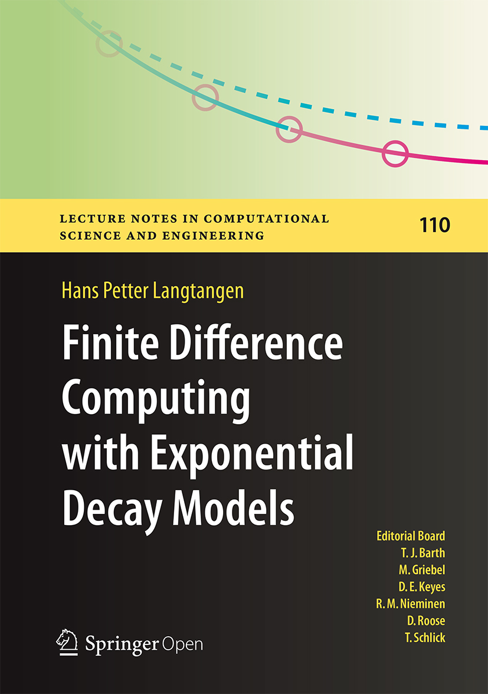

# Finite Difference Computing with Exponential Decay
## INFO

## TOC
* [Ch1 Algorithms and Implementations]()
* [Ch2 Analysis]()
* [Ch3 Generalizations]()
* [Ch4 Models]()
* [Ch5 Scientific Software Engineering]()

## Extra
* odespy module
  * python 2.7