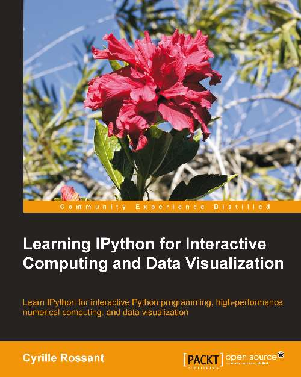

# Learning IPython for Interactive Computing and Data Visualization

## TOC
* [Chapter 1: Getting Started with IPython]()
* [Chapter 2: Interactive Work with IPython]()
* [Chapter 3: Numerical Computing with IPython]()
* [Chapter 4: Interactive Plotting and Graphical Interfaces]()
* [Chapter 5: High-Performance and Parallel Computing]()
* [Chapter 6: Customizing IPython]()