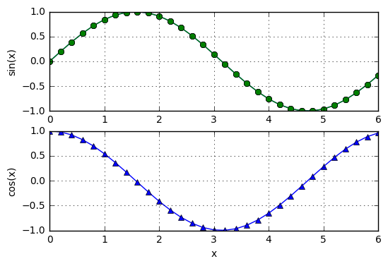

<!-- toc orderedList:0 depthFrom:1 depthTo:6 -->

- [1 Introduction to Python](#1-introduction-to-python)
- [1.1 General Information](#11-general-information)
- [1.2 Core Python](#12-core-python)
	- [variable](#variable)
	- [strings](#strings)
	- [Tuples](#tuples)
	- [List](#list)
	- [Arithmetic Operators](#arithmetic-operators)
	- [Comparison Operators](#comparison-operators)
	- [Conditionals](#conditionals)
	- [Loop](#loop)
		- [while](#while)
		- [else](#else)
		- [for](#for)
		- [break](#break)
		- [continue](#continue)
	- [Type Conversion](#type-conversion)
	- [Mathematical Functions](#mathematical-functions)
	- [Reading Input](#reading-input)
	- [Printing Output](#printing-output)
	- [Opening and Closing a File](#opening-and-closing-a-file)
	- [Reading Data from a File](#reading-data-from-a-file)
	- [Writing Data to a File](#writing-data-to-a-file)
	- [Error Control](#error-control)
- [1.3 Functions and Modules](#13-functions-and-modules)
	- [Functions](#functions)
	- [Lambda Statement](#lambda-statement)
	- [Modules](#modules)
- [1.4 Mathematics Modules](#14-mathematics-modules)
	- [math Module](#math-module)
	- [cmath Module](#cmath-module)
- [1.5 numpy Module](#15-numpy-module)
	- [General Information](#general-information)
	- [Creating an Array](#creating-an-array)
	- [Accessing and Changing Array Elements](#accessing-and-changing-array-elements)
	- [Operations on Arrays](#operations-on-arrays)
	- [Array Functions](#array-functions)
	- [Linear Algebra Module](#linear-algebra-module)
	- [Copying Arrays](#copying-arrays)
	- [Vectorizing Algorithms](#vectorizing-algorithms)
- [1.6 Plotting with matplotlib.pyplot](#16-plotting-with-matplotlibpyplot)
- [1.7 Scoping of Variables](#17-scoping-of-variables)
- [1.8 Writing and Running Programs](#18-writing-and-running-programs)

<!-- tocstop -->


# 1 Introduction to Python

# 1.1 General Information


```python
from numpy import dot
def gaussElimin(a,b):
    n = len(b)
    for k in range(0,n-1):
        for i in range(k+1,n):
            if a[i,k] != 0.0:
                lam = a [i,k]/a[k,k]
                a[i,k+1:n] = a[i,k+1:n] - lam*a[k,k+1:n]
                b[i] = b[i] - lam*b[k]
    for k in range(n-1,-1,-1):
        b[k] = (b[k] - dot(a[k,k+1:n],b[k+1:n]))/a[k,k]
    return b
```

# 1.2 Core Python

## variable


```python
b = 2 # b is integer type
print(b)
```

    2


```python
b = b*2.0 # Now b is float type
print(b)
```

    4.0


## strings


```python
string1 = 'Press return to exit'
string2 = 'the program'
print(string1 + ' ' + string2) # Concatenation
```

    Press return to exit the program


```python
print(string1[0:12]) # Slicing
```

    Press return


```python
s = '3 9 81'
print(s.split()) # Delimiter is white space
```

    ['3', '9', '81']


```python
s = 'Press return to exit'
s[0] = 'p'
```


    ---------------------------------------------------------------------------

    TypeError                                 Traceback (most recent call last)

    <ipython-input-17-b53508ca41ac> in <module>()
          1 s = 'Press return to exit'
    ----> 2 s[0] = 'p'


    TypeError: 'str' object does not support item assignment


## Tuples


```python
rec = ('Smith', 'John', (6,23,68)) # This is a tuple
lastName,firstName,birthdate = rec # Unpacking the tuple
print(firstName)
```

    John


```python
birthYear = birthdate[2]
print(birthYear)
```

    68


```python
name = rec[1] + ' ' + rec[0]
print(name)
```

    John Smith


```python
print(rec[0:2])
```

    ('Smith', 'John')


## List


```python
a = [1.0, 2.0, 3.0] # Create a list
a.append(4.0) # Append 4.0 to list
print(a)
```

    [1.0, 2.0, 3.0, 4.0]


```python
a.insert(0,0.0) # Insert 0.0 in position 0
print(a)
```

    [0.0, 1.0, 2.0, 3.0, 4.0]


```python
print(len(a)) # Determine length of list
```

    5


```python
a[2:4] = [1.0, 1.0, 1.0] # Modify selected elements
print(a)
```

    [0.0, 1.0, 1.0, 1.0, 1.0, 4.0]


```python
a = [1.0, 2.0, 3.0]
b = a # ’b’ is an alias of ’a’
b[0] = 5.0 # Change ’b’
print(a)
```

    [5.0, 2.0, 3.0]


```python
c = a[:] # ’c’ is an independent copy of ’a’
c[0] = 1.0 # Change ’c’
print(a)
```

    [5.0, 2.0, 3.0]


```python
a = [[1, 2, 3], \
     [4, 5, 6], \
     [7, 8, 9]]
print(a[1]) # Print second row (element 1)
```

    [4, 5, 6]


```python
print(a[1][2]) # Print third element of second row
```

## Arithmetic Operators


```python
s = 'Hello '
t = 'to you'
```


```python
a = [1, 2, 3]
print(3*s) # Repetition
```

    Hello Hello Hello


```python
print(3*a) # Repetition
```

    [1, 2, 3, 1, 2, 3, 1, 2, 3]


```python
print(a + [4, 5]) # Append elements
```

    [1, 2, 3, 4, 5]


```python
print(s + t) # Concatenation
```

    Hello to you


```python
print(3 + s) # This addition makes no sense
```


    ---------------------------------------------------------------------------

    TypeError                                 Traceback (most recent call last)

    <ipython-input-34-101616773a90> in <module>()
    ----> 1 print(3 + s) # This addition makes no sense


    TypeError: unsupported operand type(s) for +: 'int' and 'str'


## Comparison Operators


```python
a = 2 # Integer
b = 1.99 # Floating point
c = '2' # String
print(a > b)
```

    True


```python
print(a == c)
```

    False


```python
print((a > b) and (a != c))
```

    True


```python
print((a > b) or (a == b))
```

    True


## Conditionals


```python
def sign_of_a(a):
    if a < 0.0:
        sign = 'negative'
    elif a > 0.0:
        sign = 'positive'
    else:
        sign = 'zero'
    return sign
a = 1.5
print('a is ' + sign_of_a(a))
```

    a is positive


## Loop

### while

### else


```python
nMax = 5
n = 1
a = [] # Create empty list
while n < nMax:
    a.append(1.0/n) # Append element to list
    n = n + 1
print(a)
```

    [1.0, 0.5, 0.3333333333333333, 0.25]


### for


```python
nMax = 5
a = []
for n in range(1,nMax):
    a.append(1.0/n)
print(a)
```

    [1.0, 0.5, 0.3333333333333333, 0.25]


### break


```python
list = ['Jack', 'Jill', 'Tim', 'Dave']
# name = eval(input('Type a name: ')) # Python input prompt
name = input('Type a name: ')
for i in range(len(list)):
    if list[i] == name:
        print(name,'is number',i + 1,'on the list')
        break
    else:
        print(name,'is not on the list')
```

    Type a name: Jack
    Jack is number 1 on the list


### continue


```python
x = [] # Create an empty list
for i in range(1,100):
    if i%7 != 0:
        continue # If not divisible by 7, skip rest of loop
    x.append(i) # Append i to the list
print(x)
```

    [7, 14, 21, 28, 35, 42, 49, 56, 63, 70, 77, 84, 91, 98]


## Type Conversion


```python
a = 5
b = -3.6
d = '4.0'
print(a + b)
```

    1.4


```python
print(int(b))
```

    -3


```python
print(complex(a,b))
```

    (5-3.6j)


```python
print(float(d))
```

    4.0


```python
print(int(d)) # This fails: d is a string
```


    ---------------------------------------------------------------------------

    ValueError                                Traceback (most recent call last)

    <ipython-input-52-70eab31b8846> in <module>()
    ----> 1 print(int(d)) # This fails: d is a string


    ValueError: invalid literal for int() with base 10: '4.0'


## Mathematical Functions

## Reading Input


```python
a = input('Input a: ')
print(a, type(a)) # Print a and its type
```

    Input a: 111
    111 <class 'str'>


```python
b = eval(a)
print(b,type(b)) # Print b and its type
```

    111 <class 'int'>


## Printing Output


```python
a = 1234.56789
b = [2, 4, 6, 8]
print(a,b)
```

    1234.56789 [2, 4, 6, 8]


```python
print('a =',a, '\nb =',b)
```

    a = 1234.56789
    b = [2, 4, 6, 8]


```python
a = 1234.56789
n = 9876
print('{:7.2f}'.format(a))
```

    1234.57


```python
print('n = {:6d}'.format(n)) # Pad with spaces
```

    n =   9876


```python
print('n = {:06d}'.format(n)) # Pad with zeros
```

    n = 009876


```python
print('{:12.4e} {:6d}'.format(a,n))
```

      1.2346e+03   9876


## Opening and Closing a File

## Reading Data from a File


```python
x = []
data = open('sunspots.txt','r')
for line in data:
    x.append(eval(line.split()[3]))
data.close()
```

## Writing Data to a File


```python
f = open('testfile','w')
for k in range(101,111):
    f.write('{:4d} {:6d}'.format(k,k**2))
    f.write('\n')
f.close()
```

## Error Control


```python
try:
    c = 12.0/0.0
except ZeroDivisionError:
    print('Division by zero')
```

    Division by zero


# 1.3 Functions and Modules

## Functions


```python
def derivatives(f, x, h=0.0001): # h has a default value
    df =(f(x+h) - f(x-h))/(2.0*h)
    ddf =(f(x+h) - 2.0*f(x) + f(x-h))/h**2
    return df,ddf
```


```python
from math import atan
df, ddf = derivatives(atan,0.5) # Uses default value of h
print('First derivative =',df)
print('Second derivative =',ddf)
```

    First derivative = 0.7999999995730867
    Second derivative = -0.6399999918915711


## Lambda Statement


```python
c = lambda x,y : x**2 + y**2
print(c(3,4))
```

    25


## Modules

# 1.4 Mathematics Modules

## math Module


```python
from math import log,sin
print(log(sin(0.5)))
```

    -0.7351666863853142


```python
import math
print(math.log(math.sin(0.5)))
```

    -0.7351666863853142


```python
import math as m
print(m.log(m.sin(0.5)))
```

    -0.7351666863853142


```python
import math
dir(math)
```

## cmath Module


```python
from cmath import sin
x = 3.0 -4.5j
y = 1.2 + 0.8j
z = 0.8
print(x/y)
```

    (-2.562053133750361e-16-3.75j)


```python
print(sin(x))
```

    (6.352392998168388+44.55264336489803j)


```python
print(sin(z))
```

    (0.7173560908995228+0j)


# 1.5 numpy Module

## General Information


```python
import numpy
```


```python
dir(numpy)
```

## Creating an Array


```python
from numpy import array
a = array([[2.0, -1.0],[-1.0, 3.0]])
print(a)
```

    [[ 2. -1.]
     [-1.  3.]]


```python
b = array([[2, -1],[-1, 3]],float)
print(b)
```

    [[ 2. -1.]
     [-1.  3.]]


```python
from numpy import *
print(arange(2,10,2))
```

    [2 4 6 8]


```python
print(arange(2.0,10.0,2.0))
```

    [ 2.  4.  6.  8.]


```python
print(zeros(3))
```

    [ 0.  0.  0.]


```python
print(zeros((3),int))
```

    [0 0 0]


```python
print(ones((2,2)))
```

    [[ 1.  1.]
     [ 1.  1.]]


## Accessing and Changing Array Elements


```python
from numpy import *
a = zeros((3,3),int)
print(a)
```

    [[0 0 0]
     [0 0 0]
     [0 0 0]]


```python
a[0] = [2,3,2] # Change a row
a[1,1] = 5 # Change an element
a[2,0:2] = [8,-3] # Change part of a row
print(a)
```

    [[ 2  3  2]
     [ 0  5  0]
     [ 8 -3  0]]


## Operations on Arrays


```python
from numpy import array
a = array([0.0, 4.0, 9.0, 16.0])
```


```python
print(a/16.0)
print(a - 4.0)
```

    [ 0.      0.25    0.5625  1.    ]
    [ -4.   0.   5.  12.]


```python
from numpy import array,sqrt,sin
a = array([1.0, 4.0, 9.0, 16.0])
print(sqrt(a))
```

    [ 1.  2.  3.  4.]


```python
print(sin(a))
```

    [ 0.84147098 -0.7568025   0.41211849 -0.28790332]


```python
from numpy import array
from math import sqrt
a = array([1.0, 4.0, 9.0, 16.0])
print(sqrt(a[1]))
```

    2.0


```python
print(sqrt(a))
```


    ---------------------------------------------------------------------------

    TypeError                                 Traceback (most recent call last)

    <ipython-input-98-2b2acc870c85> in <module>()
    ----> 1 print(sqrt(a))


    TypeError: only length-1 arrays can be converted to Python scalars


## Array Functions


```python
from numpy import *
A = array([[4,-2,1],[-2,4,-2],[1,-2,3]],float)
b = array([1,4,3],float)
print(diagonal(A)) # Principal diagonal
```

    [ 4.  4.  3.]


```python
print(diagonal(A,1)) # First subdiagonal
```

    [-2. -2.]


```python
print(trace(A)) # Sum of diagonal elements
```

    11.0


```python
print(argmax(b)) # Index of largest element
```

    1


```python
print(argmin(A,axis=0)) # Indices of smallest col. elements
```

    [1 0 1]


```python
print(identity(3)) # Identity matrix
```

    [[ 1.  0.  0.]
     [ 0.  1.  0.]
     [ 0.  0.  1.]]


```python
from numpy import *
x = array([7,3])
y = array([2,1])
A = array([[1,2],[3,2]])
B = array([[1,1],[2,2]])
```


```python
# Dot product
print("dot(x,y) =\n",dot(x,y)) # {x}.{y}
print("dot(A,x) =\n",dot(A,x)) # [A]{x}
print("dot(A,B) =\n",dot(A,B)) # [A][B]
```

    dot(x,y) =
     17
    dot(A,x) =
     [13 27]
    dot(A,B) =
     [[5 5]
     [7 7]]


```python
# Inner product
print("inner(x,y) =\n",inner(x,y)) # {x}.{y}
print("inner(A,x) =\n",inner(A,x)) # [A]{x}
print("inner(A,B) =\n",inner(A,B)) # [A][B_transpose]
```

    inner(x,y) =
     17
    inner(A,x) =
     [13 27]
    inner(A,B) =
     [[ 3  6]
     [ 5 10]]


```python
# Outer product
print("outer(x,y) =\n",outer(x,y))
print("outer(A,x) =\n",outer(A,x))
print("outer(A,B) =\n",outer(A,B))
```

    outer(x,y) =
     [[14  7]
     [ 6  3]]
    outer(A,x) =
     [[ 7  3]
     [14  6]
     [21  9]
     [14  6]]
    outer(A,B) =
     [[1 1 2 2]
     [2 2 4 4]
     [3 3 6 6]
     [2 2 4 4]]


## Linear Algebra Module


```python
from numpy import array
from numpy.linalg import inv,solve
A = array([[ 4.0, -2.0, 1.0], \
           [-2.0, 4.0, -2.0], \
           [ 1.0, -2.0, 3.0]])
b = array([1.0, 4.0, 2.0])
print(inv(A)) # Matrix inverse
print(solve(A,b)) # Solve [A]{x} = {b}
```

    [[ 0.33333333  0.16666667  0.        ]
     [ 0.16666667  0.45833333  0.25      ]
     [ 0.          0.25        0.5       ]]
    [ 1.   2.5  2. ]


## Copying Arrays


```python
b = a.copy()
```

## Vectorizing Algorithms


```python
from math import sqrt,sin,pi
x = 0.0; s = 0.0
for i in range(101):
    s = s + sqrt(x)*sin(x)
    x = x + 0.01*pi
print(s)
```

    77.51389798916522


```python
from numpy import sqrt,sin,arange
from math import pi
x = arange(0.0, 1.001*pi, 0.01*pi)
print(sum(sqrt(x)*sin(x)))
```

    77.5138979892


# 1.6 Plotting with matplotlib.pyplot


```python
import matplotlib.pyplot as plt
from numpy import arange,sin,cos
x = arange(0.0,6.2,0.2)
plt.plot(x,sin(x),'o-',x,cos(x),'ˆ-')       # Plot with specified
                                            # line and marker style
plt.xlabel('x')                             # Add label to x-axis
plt.legend(('sine','cosine'),loc = 0)       # Add legend in loc. 3
plt.grid(True)                              # Add coordinate grid
plt.savefig('testplot.png',format='png')    # Save plot in png
                                            # format for future use
plt.show()                                  # Show plot on screen
input("\nPress return to exit")
```


```python
import matplotlib.pyplot as plt
from numpy import arange,sin,cos
x = arange(0.0,6.2,0.2)
plt.subplot(2,1,1)
plt.plot(x,sin(x),'o-')
plt.xlabel('x');plt.ylabel('sin(x)')
plt.grid(True)
plt.subplot(2,1,2)
plt.plot(x,cos(x),'^-')
plt.xlabel('x');plt.ylabel('cos(x)')
plt.grid(True)
plt.show()
input("\nPress return to exit")
```





    Press return to exit


    ''


# 1.7 Scoping of Variables


```python
def divide():
    c = a/b
    print('a/b =',c)
a = 100.0
b = 5.0
divide()
```

    a/b = 20.0


```python
def divide():
    c = a/b
a = 100.0
b = 5.0
divide()
print('a/b =',c)
```

    a/b = <function <lambda> at 0x0000001EF7465BF8>


# 1.8 Writing and Running Programs


```python
## module error
''' err(string).
Prints 'string' and terminates program.
'''
import sys
def err(string):
    print(string)
    input('Press return to exit')
    sys.exit()
```


```python
import error
print(error.__doc__)
```

     err(string).
        Prints 'string' and terminates program.
