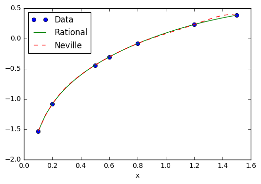

<!-- toc orderedList:0 depthFrom:1 depthTo:6 -->

- [3 Interpolation and Curve Fitting](#3-interpolation-and-curve-fitting)
- [3.1 Introduction](#31-introduction)
- [3.2 Polynomial Interpolation](#32-polynomial-interpolation)
	- [Newton’s Method](#newtons-method)
	- [Neville’s Method](#nevilles-method)
	- [Limitations of Polynomial Interpolation](#limitations-of-polynomial-interpolation)
	- [Rational Function Interpolation](#rational-function-interpolation)
		- [example3_6](#example3_6)
- [3.3 Interpolation with Cubic Spline](#33-interpolation-with-cubic-spline)
	- [EXAMPLE3.9](#example39)
		- [EXAMPLE3.9](#example39-1)
- [3.4 Least-Squares Fit](#34-least-squares-fit)
	- [Overview](#overview)
	- [Fitting a Straight Line](#fitting-a-straight-line)
	- [Fitting Linear Forms](#fitting-linear-forms)
	- [Polynomial Fit](#polynomial-fit)
	- [Weighting of Data](#weighting-of-data)
		- [Weighted linear regression](#weighted-linear-regression)
		- [Fitting exponential functions.](#fitting-exponential-functions)

<!-- tocstop -->


# 3 Interpolation and Curve Fitting

# 3.1 Introduction

# 3.2 Polynomial Interpolation

## Newton’s Method


```python
# %load code/newtonPoly.py
## module newtonPoly
''' p = evalPoly(a,xData,x).
    Evaluates Newton's polynomial p at x. The coefficient
    vector 'a' can be computed by the function 'coeffts'.

    a = coeffts(xData,yData).
    Computes the coefficients of Newton's polynomial.
'''    
def evalPoly(a,xData,x):
    n = len(xData) - 1  # Degree of polynomial
    p = a[n]
    for k in range(1,n+1):
        p = a[n-k] + (x -xData[n-k])*p
    return p

def coeffts(xData,yData):
    m = len(xData)  # Number of data points
    a = yData.copy()
    for k in range(1,m):
        a[k:m] = (a[k:m] - a[k-1])/(xData[k:m] - xData[k-1])
    return a

```

## Neville’s Method


```python
# %load code/neville.py
## module neville
''' p = neville(xData,yData,x).
    Evaluates the polynomial interpolant p(x) that passes
    trough the specified data points by Neville's method.
'''    
def neville(xData,yData,x):
    m = len(xData)   # number of data points
    y = yData.copy()
    for k in range(1,m):
        y[0:m-k] = ((x - xData[k:m])*y[0:m-k] +      \
                    (xData[0:m-k] - x)*y[1:m-k+1])/  \
                    (xData[0:m-k] - xData[k:m])
    return y[0]


```

## Limitations of Polynomial Interpolation

## Rational Function Interpolation


```python
# %load code/rational.py
## module rational
''' p = rational(xData,yData,x)
    Evaluates the diagonal rational function interpolant p(x)
    that passes through he data points
'''    
import numpy as np

def rational(xData,yData,x):
    m = len(xData)
    r = yData.copy()
    rOld = np.zeros(m)
    for k in range(m-1):
        for i in range(m-k-1):
            if abs(x - xData[i+k+1]) < 1.0e-9:
                return yData[i+k+1]
            else:
                c1 = r[i+1] - r[i]
                c2 = r[i+1] - rOld[i+1]
                c3 = (x - xData[i])/(x - xData[i+k+1])
                r[i] = r[i+1] + c1/(c3*(1.0 - c1/c2) - 1.0)
                rOld[i+1] = r[i+1]
    return r[0]


```

### example3_6


```python
#!/usr/bin/python
## example 3_6
import numpy as np
from rational import *
from neville import *
import matplotlib.pyplot as plt

xData = np.array([0.1,0.2,0.5,0.6,0.8,1.2,1.5])
yData = np.array([-1.5342,-1.0811,-0.4445,-0.3085, \
                  -0.0868,0.2281,0.3824])
x = np.arange(0.1,1.55,0.05)
n = len(x)
y = np.zeros((n,2))

for i in range(n):
    y[i,0] = rational(xData,yData,x[i])
    y[i,1] = neville(xData,yData,x[i])

plt.plot(xData,yData,'o',x,y[:,0],'-',x,y[:,1],'--')
plt.xlabel('x')
plt.legend(('Data','Rational','Neville'),loc = 0)
plt.show()
input("\nPress return to exit")
```





    Press return to exit


    ''


# 3.3 Interpolation with Cubic Spline


```python
# %load code/cubicSpline.py
## module cubicSpline
''' k = curvatures(xData,yData).
    Returns the curvatures of cubic spline at its knots.

    y = evalSpline(xData,yData,k,x).
    Evaluates cubic spline at x. The curvatures k can be
    computed with the function 'curvatures'.
'''   
import numpy as np
from LUdecomp3 import *

def curvatures(xData,yData):
    n = len(xData) - 1
    c = np.zeros(n)
    d = np.ones(n+1)
    e = np.zeros(n)
    k = np.zeros(n+1)
    c[0:n-1] = xData[0:n-1] - xData[1:n]
    d[1:n] = 2.0*(xData[0:n-1] - xData[2:n+1])
    e[1:n] = xData[1:n] - xData[2:n+1]
    k[1:n] =6.0*(yData[0:n-1] - yData[1:n]) \
                 /(xData[0:n-1] - xData[1:n]) \
             -6.0*(yData[1:n] - yData[2:n+1])   \
                 /(xData[1:n] - xData[2:n+1])
    LUdecomp3(c,d,e)
    LUsolve3(c,d,e,k)
    return k

def evalSpline(xData,yData,k,x):

    def findSegment(xData,x):
        iLeft = 0
        iRight = len(xData)- 1
        while 1:
            if (iRight-iLeft) <= 1: return iLeft
            i =(iLeft + iRight)/2
            if x < xData[i]: iRight = i
            else: iLeft = i

    i = findSegment(xData,x)
    h = xData[i] - xData[i+1]
    y = ((x - xData[i+1])**3/h - (x - xData[i+1])*h)*k[i]/6.0 \
      - ((x - xData[i])**3/h - (x - xData[i])*h)*k[i+1]/6.0   \
      + (yData[i]*(x - xData[i+1])                            \
       - yData[i+1]*(x - xData[i]))/h
    return y


```

## EXAMPLE3.9
### EXAMPLE3.9


```python
#!/usr/bin/python
## example3_9
import numpy as np
from cubicSpline import *

xData = np.array([1,2,3,4,5],float)
yData = np.array([0,1,0,1,0],float)
k = curvatures(xData,yData)

while True:
    try: x = eval(input("\nx ==> "))
    except SyntaxError: break
    print("y =",evalSpline(xData,yData,k,x))
input("Done. Press return to exit")
```

# 3.4 Least-Squares Fit

## Overview

## Fitting a Straight Line

## Fitting Linear Forms

## Polynomial Fit


```python
# %load code/polyFit.py
## module polyFit
''' c = polyFit(xData,yData,m).
    Returns coefficients of the polynomial
    p(x) = c[0] + c[1]x + c[2]x^2 +...+ c[m]x^m
    that fits the specified data in the least
    squares sense.

    sigma = stdDev(c,xData,yData).
    Computes the std. deviation between p(x)
    and the data.
'''    
import numpy as np
import math
from gaussPivot import *

def polyFit(xData,yData,m):
    a = np.zeros((m+1,m+1))
    b = np.zeros(m+1)
    s = np.zeros(2*m+1)
    for i in range(len(xData)):
        temp = yData[i]
        for j in range(m+1):
            b[j] = b[j] + temp
            temp = temp*xData[i]
        temp = 1.0
        for j in range(2*m+1):
            s[j] = s[j] + temp
            temp = temp*xData[i]
    for i in range(m+1):
        for j in range(m+1):
            a[i,j] = s[i+j]
    return gaussPivot(a,b)

def stdDev(c,xData,yData):

    def evalPoly(c,x):
        m = len(c) - 1
        p = c[m]
        for j in range(m):
            p = p*x + c[m-j-1]
        return p    

    n = len(xData) - 1
    m = len(c) - 1
    sigma = 0.0
    for i in range(n+1):
        p = evalPoly(c,xData[i])
        sigma = sigma + (yData[i] - p)**2
    sigma = math.sqrt(sigma/(n - m))
    return sigma


```


```python
# %load code/plotPoly.py
## module plotPoly
''' plotPoly(xData,yData,coeff,xlab='x',ylab='y')
    Plots data points and the fitting
    polynomial defined by its coefficient
    array coeff = [a0, a1. ...]
    xlab and ylab are optional axis labels
'''    
import numpy as np
import matplotlib.pyplot as plt

def plotPoly(xData,yData,coeff,xlab='x',ylab='y'):
    m = len(coeff)
    x1 = min(xData)
    x2 = max(xData)
    dx = (x2 - x1)/20.0   
    x = np.arange(x1,x2 + dx/10.0,dx)
    y = np.zeros((len(x)))*1.0
    for i in range(m):
        y = y + coeff[i]*x**i
    plt.plot(xData,yData,'o',x,y,'-')
    plt.xlabel(xlab); plt.ylabel(ylab)
    plt.grid (True)
    plt.show()

```

## Weighting of Data

### Weighted linear regression

### Fitting exponential functions.

**EXAMPLE3.12**


```python
#!/usr/bin/python
## example3_12
import numpy as np
from polyFit import *
xData = np.array([-0.04,0.93,1.95,2.90,3.83,5.0, \
                  5.98,7.05,8.21,9.08,10.09])
yData = np.array([-8.66,-6.44,-4.36,-3.27,-0.88,0.87, \
                  3.31,4.63,6.19,7.4,8.85])
while True:
    try:
        m = eval(input("\nDegree of polynomial ==> "))
        coeff = polyFit(xData,yData,m)
        print("Coefficients are:\n",coeff)
        print("Std. deviation =",stdDev(coeff,xData,yData))
    except SyntaxError: break
input("Finished. Press return to exit")
```


```python

```
