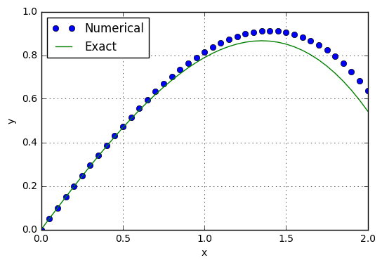
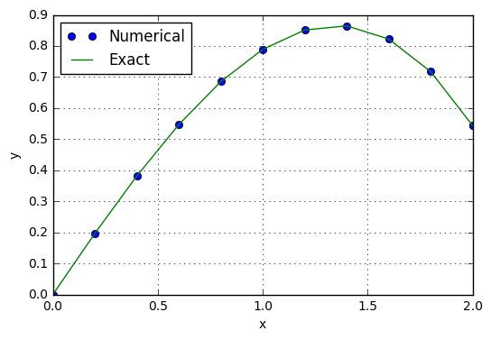
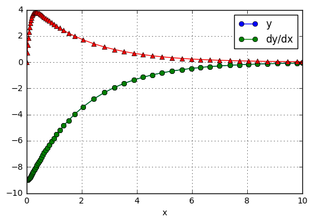
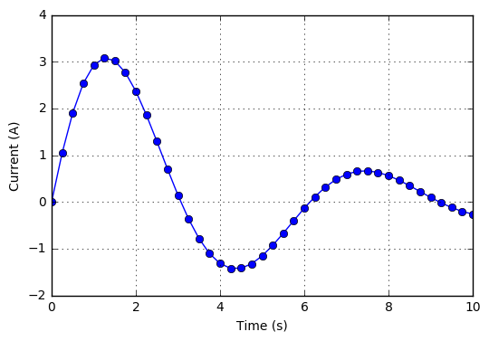

<!-- toc orderedList:0 depthFrom:1 depthTo:6 -->

- [7 Initial Value Problems](#7-initial-value-problems)
- [7.1 Introduction](#71-introduction)
- [7.2 Euler's Method](#72-eulers-method)
	- [euler](#euler)
	- [printSoln](#printsoln)
	- [EXAMPLE7.2](#example72)
- [7.3 Runge-Kutta Methods](#73-runge-kutta-methods)
	- [Second-Order Runge-Kutta Method](#second-order-runge-kutta-method)
	- [Fourth-Order Runge-Kutta Method](#fourth-order-runge-kutta-method)
		- [run kut4](#run-kut4)
		- [EXAMPLE7.4](#example74)
		- [EXAMPLE7.5](#example75)
		- [EXAMPLE7.6](#example76)
- [7.4 Stability and Stiffness](#74-stability-and-stiffness)
	- [Stability of Euler’s Method](#stability-of-eulers-method)
	- [Stiffness](#stiffness)
- [7.5 Adaptive Runge-Kutta Method](#75-adaptive-runge-kutta-method)
		- [run kut5](#run-kut5)
		- [EXAMPLE7.8](#example78)
		- [EXAMPLE7.9](#example79)
- [7.6 Bulirsch-Stoer Method](#76-bulirsch-stoer-method)
	- [Richardson Extrapolation](#richardson-extrapolation)
		- [midpoint](#midpoint)
	- [Bulirsch-Stoer Algorithm](#bulirsch-stoer-algorithm)
		- [bulStoer](#bulstoer)
		- [EXAMPLE7.11](#example711)
- [7.7 Other Methods](#77-other-methods)

<!-- tocstop -->


# 7 Initial Value Problems

# 7.1 Introduction

# 7.2 Euler's Method

## euler


```python
# %load code/euler.py
## module euler
''' X,Y = integrate(F,x,y,xStop,h).
    Euler's method for solving the
    initial value problem {y}' = {F(x,{y})}, where
    {y} = {y[0],y[1],...y[n-1]}.
    x,y   = initial conditions
    xStop = terminal value of x
    h     = increment of x used in integration
    F     = user-supplied function that returns the
            array F(x,y) = {y'[0],y'[1],...,y'[n-1]}.
'''
import numpy as np
def integrate(F,x,y,xStop,h):    
    X = []
    Y = []
    X.append(x)
    Y.append(y)
    while x < xStop:
        h = min(h,xStop - x)
        y = y + h*F(x,y)
        x = x + h
        X.append(x)
        Y.append(y)
    return np.array(X),np.array(Y)


```

## printSoln


```python
# %load code/printSoln.py
## module printSoln
''' printSoln(X,Y,freq).
    Prints X and Y returned from the differential
    equation solvers using printput frequency 'freq'.
        freq = n prints every nth step.
        freq = 0 prints initial and final values only.
'''
def printSoln(X,Y,freq):

    def printHead(n):
        print("\n        x  ",end=" ")
        for i in range (n):
            print("      y[",i,"] ",end=" ")
        print()

    def printLine(x,y,n):
        print("{:13.4e}".format(x),end=" ")
        for i in range (n):
            print("{:13.4e}".format(y[i]),end=" ")
        print()

    m = len(Y)
    try: n = len(Y[0])
    except TypeError: n = 1
    if freq == 0: freq = m
    printHead(n)
    for i in range(0,m,freq):
        printLine(X[i],Y[i],n)
    if i != m - 1: printLine(X[m - 1],Y[m - 1],n)

```

## EXAMPLE7.2


```python
#!/usr/bin/python
## example7_2
import numpy as np
from euler import *
import matplotlib.pyplot as plt

def F(x,y):
    F = np.zeros(2)
    F[0] = y[1]
    F[1] = -0.1*y[1] - x
    return F

x = 0.0 # Start of integration
xStop = 2.0 # End of integration
y = np.array([0.0, 1.0]) # Initial values of {y}
h = 0.05 # Step size
X,Y = integrate(F,x,y,xStop,h)
yExact = 100.0*X - 5.0*X**2 + 990.0*(np.exp(-0.1*X) - 1.0)
plt.plot(X,Y[:,0],'o',X,yExact,'-')
plt.grid(True)
plt.xlabel('x'); plt.ylabel('y')
plt.legend(('Numerical','Exact'),loc=0)
plt.show()
input("Press return to exit")
```





    Press return to exit


    ''


# 7.3 Runge-Kutta Methods

## Second-Order Runge-Kutta Method

## Fourth-Order Runge-Kutta Method

### run kut4


```python
# %load code/run_kut4.py
## module run_kut4
''' X,Y = integrate(F,x,y,xStop,h).
    4th-order Runge-Kutta method for solving the
    initial value problem {y}' = {F(x,{y})}, where
    {y} = {y[0],y[1],...y[n-1]}.
    x,y   = initial conditions
    xStop = terminal value of x
    h     = increment of x used in integration
    F     = user-supplied function that returns the
            array F(x,y) = {y'[0],y'[1],...,y'[n-1]}.
'''
import numpy as np
def integrate(F,x,y,xStop,h):

    def run_kut4(F,x,y,h):
        K0 = h*F(x,y)
        K1 = h*F(x + h/2.0, y + K0/2.0)
        K2 = h*F(x + h/2.0, y + K1/2.0)
        K3 = h*F(x + h, y + K2)
        return (K0 + 2.0*K1 + 2.0*K2 + K3)/6.0    

    X = []
    Y = []
    X.append(x)
    Y.append(y)
    while x < xStop:
        h = min(h,xStop - x)
        y = y + run_kut4(F,x,y,h)
        x = x + h
        X.append(x)
        Y.append(y)
    return np.array(X),np.array(Y)


```

### EXAMPLE7.4


```python
#!/usr/bin/python
## example7_4
import numpy as np
from printSoln import *
from run_kut4 import *
import matplotlib.pyplot as plt

def F(x,y):
    F = np.zeros(2)
    F[0] = y[1]
    F[1] = -0.1*y[1] - x
    return F

x = 0.0 # Start of integration
xStop = 2.0 # End of integration
y = np.array([0.0, 1.0]) # Initial values of {y}
h = 0.2 # Step size
X,Y = integrate(F,x,y,xStop,h)
yExact = 100.0*X - 5.0*X**2 + 990.0*(np.exp(-0.1*X) - 1.0)
plt.plot(X,Y[:,0],'o',X,yExact,'-')
plt.grid(True)
plt.xlabel('x'); plt.ylabel('y')
plt.legend(('Numerical','Exact'),loc=0)
plt.show()
input("Press return to exit")
```





    Press return to exit


    ''


### EXAMPLE7.5


```python
#!/usr/bin/python
## example7_5
import numpy as np
from run_kut4 import *
from printSoln import *
from math import exp

def F(x,y):
    F = np.zeros(1)
    F[0] = 3.0*y[0] - 4.0*exp(-x)
    return F

x = 0.0 # Start of integration
xStop = 10.0 # End of integration
y = np.array([1.0]) # Initial values of {y}
h = 0.1 # Step size
freq = 20 # Printout frequency
X,Y = integrate(F,x,y,xStop,h)
printSoln(X,Y,freq)
input("\nPress return to exit")
```


            x         y[ 0 ]  
       0.0000e+00    1.0000e+00
       2.0000e+00    1.3250e-01
       4.0000e+00   -1.1237e+00
       6.0000e+00   -4.6056e+02
       8.0000e+00   -1.8575e+05
       1.0000e+01   -7.4912e+07
       1.0000e+01   -7.4912e+07

    Press return to exit


    ''


### EXAMPLE7.6


```python
#!/usr/bin/python
## example7_6
import numpy as np
from run_kut4 import *
from printSoln import *
def F(x,y):
    F = np.zeros(4)
    F[0] = y[1]
    F[1] = y[0]*(y[3]**2) - 3.9860e14/(y[0]**2)
    F[2] = y[3]
    F[3] = -2.0*y[1]*y[3]/y[0]
    return F

x = 0.0
xStop = 1200.0
y = np.array([7.15014e6, 0.0, 0.0, 0.937045e-3])
h = 50.0
freq = 2
X,Y = integrate(F,x,y,xStop,h)
printSoln(X,Y,freq)
input("\nPress return to exit")
```


            x         y[ 0 ]        y[ 1 ]        y[ 2 ]        y[ 3 ]  
       0.0000e+00    7.1501e+06    0.0000e+00    0.0000e+00    9.3704e-04
       1.0000e+02    7.1426e+06   -1.5173e+02    9.3771e-02    9.3904e-04
       2.0000e+02    7.1198e+06   -3.0276e+02    1.8794e-01    9.4504e-04
       3.0000e+02    7.0820e+06   -4.5236e+02    2.8292e-01    9.5515e-04
       4.0000e+02    7.0294e+06   -5.9973e+02    3.7911e-01    9.6951e-04
       5.0000e+02    6.9622e+06   -7.4393e+02    4.7697e-01    9.8832e-04
       6.0000e+02    6.8808e+06   -8.8389e+02    5.7693e-01    1.0118e-03
       7.0000e+02    6.7856e+06   -1.0183e+03    6.7950e-01    1.0404e-03
       8.0000e+02    6.6773e+06   -1.1456e+03    7.8520e-01    1.0744e-03
       9.0000e+02    6.5568e+06   -1.2639e+03    8.9459e-01    1.1143e-03
       1.0000e+03    6.4250e+06   -1.3708e+03    1.0083e+00    1.1605e-03
       1.1000e+03    6.2831e+06   -1.4634e+03    1.1269e+00    1.2135e-03
       1.2000e+03    6.1329e+06   -1.5384e+03    1.2512e+00    1.2737e-03

    Press return to exit


    ''


# 7.4 Stability and Stiffness

## Stability of Euler’s Method

## Stiffness

# 7.5 Adaptive Runge-Kutta Method

### run kut5


```python
# %load code/run_kut5.py
## module run_kut5
''' X,Y = integrate(F,x,y,xStop,h,tol=1.0e-6).
    Adaptive Runge-Kutta method with Dormand-Price
    coefficients for solving the
    initial value problem {y}' = {F(x,{y})}, where
    {y} = {y[0],y[1],...y[n-1]}.

    x,y   = initial conditions
    xStop = terminal value of x
    h     = initial increment of x used in integration
    tol   = per-step error tolerance
    F     = user-supplied function that returns the
            array F(x,y) = {y'[0],y'[1],...,y'[n-1]}.
'''
import math
import numpy as np

def integrate(F,x,y,xStop,h,tol=1.0e-6):

    a1 = 0.2; a2 = 0.3; a3 = 0.8; a4 = 8/9; a5 = 1.0
    a6 = 1.0

    c0 = 35/384; c2 = 500/1113; c3 = 125/192
    c4 = -2187/6784; c5 = 11/84

    d0 = 5179/57600; d2 = 7571/16695; d3 = 393/640
    d4 = -92097/339200; d5 = 187/2100; d6 = 1/40

    b10 = 0.2
    b20 = 0.075; b21 = 0.225
    b30 = 44/45; b31 = -56/15; b32 = 32/9
    b40 = 19372/6561; b41 = -25360/2187; b42 = 64448/6561
    b43 = -212/729
    b50 = 9017/3168; b51 =-355/33; b52 = 46732/5247
    b53 = 49/176; b54 = -5103/18656
    b60 = 35/384; b62 = 500/1113; b63 = 125/192;
    b64 = -2187/6784; b65 = 11/84

    X = []
    Y = []
    X.append(x)
    Y.append(y)
    stopper = 0  # Integration stopper(0 = off, 1 = on)
    k0 = h*F(x,y)

    for i in range(10000):
        k1 = h*F(x + a1*h, y + b10*k0)
        k2 = h*F(x + a2*h, y + b20*k0 + b21*k1)
        k3 = h*F(x + a3*h, y + b30*k0 + b31*k1 + b32*k2)
        k4 = h*F(x + a4*h, y + b40*k0 + b41*k1 + b42*k2 + b43*k3)
        k5 = h*F(x + a5*h, y + b50*k0 + b51*k1 + b52*k2 + b53*k3 \
               + b54*k4)
        k6 = h*F(x + a6*h, y + b60*k0 + b62*k2 + b63*k3 + b64*k4 \
               + b65*k5)  

        dy = c0*k0 + c2*k2 + c3*k3 + c4*k4 + c5*k5
        E = (c0 - d0)*k0 + (c2 - d2)*k2 + (c3 - d3)*k3  \
               + (c4 - d4)*k4 + (c5 - d5)*k5 - d6*k6    
        e = math.sqrt(np.sum(E**2)/len(y))
        hNext = 0.9*h*(tol/e)**0.2

      # Accept integration step if error e is within tolerance
        if  e <= tol:
            y = y + dy
            x = x + h
            X.append(x)
            Y.append(y)  
            if stopper == 1: break  # Reached end of x-range
            if abs(hNext) > 10.0*abs(h): hNext = 10.0*h

          # Check if next step is the last one; if so, adjust h
            if (h > 0.0) == ((x + hNext) >= xStop):
                hNext = xStop - x
                stopper = 1
            k0 = k6*hNext/h
        else:
            if abs(hNext) < 0.1*abs(h): hNext = 0.1*h
            k0 = k0*hNext/h

        h = hNext
    return np.array(X),np.array(Y)


```

### EXAMPLE7.8


```python
#!/usr/bin/python
## example7_8
import numpy as np
import math
from run_kut5 import *
from printSoln import *

def F(x,y):
    F = np.zeros(2)
    F[0] = y[1]
    F[1] = -9.80665 + 65.351e-3 * y[1]**2 * math.exp(-10.53e-5*y[0])
    return F

x = 0.0
xStop = 10.0
y = np.array([9000, 0.0])
h = 0.5
freq = 1
X,Y = integrate(F,x,y,xStop,h,1.0e-2)
printSoln(X,Y,freq)
input("\nPress return to exit")
```


            x         y[ 0 ]        y[ 1 ]  
       0.0000e+00    9.0000e+03    0.0000e+00
       5.0000e-01    8.9988e+03   -4.8043e+00
       2.4229e+00    8.9763e+03   -1.6440e+01
       3.4146e+00    8.9589e+03   -1.8388e+01
       4.6318e+00    8.9359e+03   -1.9245e+01
       5.9739e+00    8.9098e+03   -1.9501e+01
       7.6199e+00    8.8777e+03   -1.9549e+01
       9.7063e+00    8.8369e+03   -1.9524e+01
       1.0000e+01    8.8312e+03   -1.9519e+01

    Press return to exit


    ''


### EXAMPLE7.9


```python
## example7_9
import numpy as np
import matplotlib.pyplot as plt
from run_kut5 import *
from printSoln import *

def F(x,y):
    F = np.zeros(2)
    F[0] = y[1]
    F[1] = -4.75*y[0] - 10.0*y[1]
    return F

x = 0.0
xStop = 10.0
y = np.array([-9.0, 0.0])
h = 0.1
freq = 4
X,Y = integrate(F,x,y,xStop,h)
printSoln(X,Y,freq)
plt.plot(X,Y[:,0],'o-',X,Y[:,1],'^-')
plt.xlabel('x')
plt.legend(('y','dy/dx'),loc=0)
plt.grid(True)
plt.show()
input("\nPress return to exit")
```


            x         y[ 0 ]        y[ 1 ]  
       0.0000e+00   -9.0000e+00    0.0000e+00
       7.7774e-02   -8.8988e+00    2.2999e+00
       1.6855e-01   -8.6314e+00    3.4083e+00
       2.7656e-01   -8.2370e+00    3.7933e+00
       4.0945e-01   -7.7311e+00    3.7735e+00
       5.8108e-01   -7.1027e+00    3.5333e+00
       8.2045e-01   -6.3030e+00    3.1497e+00
       1.2036e+00   -5.2043e+00    2.6021e+00
       2.0486e+00   -3.4110e+00    1.7055e+00
       3.5357e+00   -1.6216e+00    8.1081e-01
       4.9062e+00   -8.1724e-01    4.0862e-01
       6.3008e+00   -4.0694e-01    2.0347e-01
       7.7202e+00   -2.0012e-01    1.0006e-01
       9.1023e+00   -1.0028e-01    5.0137e-02
       1.0000e+01   -6.4010e-02    3.2005e-02





    Press return to exit


    ''


# 7.6 Bulirsch-Stoer Method

## Richardson Extrapolation

### midpoint


```python
# %load code/midpoint.py
## module midpoint
''' yStop = integrate (F,x,y,xStop,tol=1.0e-6)
    Modified midpoint method for solving the
    initial value problem y' = F(x,y}.
    x,y   = initial conditions
    xStop = terminal value of x
    yStop = y(xStop)
    F     = user-supplied function that returns the
            array F(x,y) = {y'[0],y'[1],...,y'[n-1]}.
'''
import numpy as np
import math
def integrate(F,x,y,xStop,tol):

    def midpoint(F,x,y,xStop,nSteps):

  # Midpoint formulas
        h = (xStop - x)/nSteps
        y0 = y
        y1 = y0 + h*F(x,y0)
        for i in range(nSteps-1):
            x = x + h
            y2 = y0 + 2.0*h*F(x,y1)
            y0 = y1
            y1 = y2
        return 0.5*(y1 + y0 + h*F(x,y2))

    def richardson(r,k):
  # Richardson's extrapolation      
        for j in range(k-1,0,-1):
            const = (k/(k - 1.0))**(2.0*(k-j))
            r[j] = (const*r[j+1] - r[j])/(const - 1.0)
        return

    kMax = 51
    n = len(y)
    r = np.zeros((kMax,n))
  # Start with two integration steps
    nSteps = 2
    r[1] = midpoint(F,x,y,xStop,nSteps)
    r_old = r[1].copy()
  # Increase the number of integration points by 2
  # and refine result by Richardson extrapolation
    for k in range(2,kMax):
        nSteps = 2*k
        r[k] = midpoint(F,x,y,xStop,nSteps)
        richardson(r,k)
      # Compute RMS change in solution
        e = math.sqrt(np.sum((r[1] - r_old)**2)/n)
      # Check for convergence
        if e < tol: return r[1]
        r_old = r[1].copy()
    print("Midpoint method did not converge")


```

## Bulirsch-Stoer Algorithm

### bulStoer


```python
# %load code/bulStoer.py
## module bulStoer
''' X,Y = bulStoer(F,x,y,xStop,H,tol=1.0e-6).
    Simplified Bulirsch-Stoer method for solving the
    initial value problem {y}' = {F(x,{y})}, where
    {y} = {y[0],y[1],...y[n-1]}.
    x,y   = initial conditions
    xStop = terminal value of x
    H     = increment of x at which results are stored
    F     = user-supplied function that returns the
            array F(x,y) = {y'[0],y'[1],...,y'[n-1]}.
'''
import numpy as np
from midpoint import *

def bulStoer(F,x,y,xStop,H,tol=1.0e-6):
    X = []
    Y = []
    X.append(x)
    Y.append(y)
    while x < xStop:
        H = min(H,xStop - x)
        y = integrate(F,x,y,x + H,tol) # Midpoint method
        x = x + H
        X.append(x)
        Y.append(y)
    return np.array(X),np.array(Y)

```

### EXAMPLE7.11


```python
#!/usr/bin/python
## example7_11
from bulStoer import *
import numpy as np
import matplotlib.pyplot as plt

def F(x,y):
    F = np.zeros(2)
    F[0] = y[1]
    F[1] =(-y[1] - y[0]/0.45 + 9.0)/2.0
    return F

H = 0.25
xStop = 10.0
x = 0.0
y = np.array([0.0, 0.0])
X,Y = bulStoer(F,x,y,xStop,H)
plt.plot(X,Y[:,1],'o-')
plt.xlabel('Time (s)')
plt.ylabel('Current (A)')
plt.grid(True)
plt.show()
input("\nPress return to exit")
```





    Press return to exit


    ''


# 7.7 Other Methods
