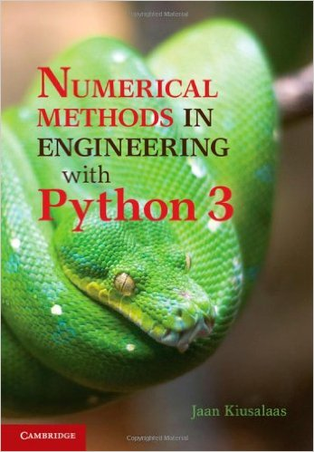

# INFO
  
[link](http://www.cambridge.org/tw/academic/subjects/engineering/engineering-mathematics-and-programming/numerical-methods-engineering-python-3-3rd-edition?format=HB&isbn=9781107033856)

# TOC
* [Ch01 Introduction to Python](Ch01_Introduction_to_Python.md)  
* [Ch02 Systems of linear algebraic equations](Ch02_Systems_of_linear_algebraic_equations.md)  
* [Ch03 Interpolation and curve fitting](Ch03_Interpolation_and_curve_fitting.md)  
* [Ch04 Roots of equations](Ch04_Roots_of_equations.md)  
* [Ch05 Numerical differentiation](Ch05_Numerical_differentiation.md)  
* [Ch06 Numerical integration](Ch06_Numerical_integration.md)  
* [Ch07 Initial value problems](Ch07_Initial_value_problems.md)  
* [Ch08 Two point boundary value problems](Ch08_Two_point_boundary_value_problems.md)  
* [Ch09 Symmetric matrix eigenvalue problems](Ch09_Symmetric_matrix_eigenvalue_problems.md)  
* [Ch10 Introduction to optimization](Ch10_Introduction_to_optimization.md)  
* Appendices  
  * A1 Taylor Series  
  * A2 Matrix Algebra  
