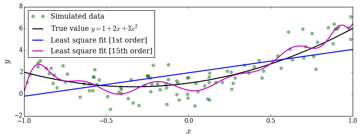
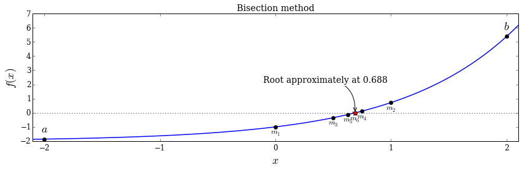

# Chapter 5: Equation solving
<!-- toc orderedList:0 depthFrom:1 depthTo:6 -->

* [Chapter 5: Equation solving](#chapter-5-equation-solving)
  * [Linear Algebra - Linear Equation Systems](#linear-algebra-linear-equation-systems)
    * [Symbolic approach](#symbolic-approach)
    * [Numerical approach](#numerical-approach)
    * [Example : rank and condition numbers -> numerical errors](#example-rank-and-condition-numbers-numerical-errors)
    * [Rectangular systems](#rectangular-systems)
    * [Underdetermined](#underdetermined)
    * [Overdetermined: least squares](#overdetermined-least-squares)
  * [Eigenvalue problems](#eigenvalue-problems)
  * [Nonlinear equations](#nonlinear-equations)
    * [Univariate](#univariate)
    * [Symbolic](#symbolic)
    * [Bisection method](#bisection-method)
    * [`scipy.optimize` functions for root-finding](#scipyoptimize-functions-for-root-finding)
    * [Multivariate](#multivariate)
  * [Versions](#versions)

<!-- tocstop -->


---

Robert Johansson

Source code listings for [Numerical Python - A Practical Techniques Approach for Industry](http://www.apress.com/9781484205549) (ISBN 978-1-484205-54-9).

The source code listings can be downloaded from http://www.apress.com/9781484205549


```python
from scipy import linalg as la
```


```python
from scipy import optimize
```


```python
import sympy
```


```python
sympy.init_printing()
```


```python
import numpy as np
```


```python
import matplotlib.pyplot as plt
%matplotlib inline

import matplotlib as mpl
mpl.rcParams["font.family"] = "serif"
mpl.rcParams["font.size"] = "12"
```


```python
from __future__ import division
```

## Linear Algebra - Linear Equation Systems

$$
2 x_1 + 3 x_2 = 4
$$

$$
5 x_1 + 4 x_2 = 3
$$


```python
fig, ax = plt.subplots(figsize=(8, 4))

x1 = np.linspace(-4, 2, 100)

x2_1 = (4 - 2 * x1)/3
x2_2 = (3 - 5 * x1)/4

ax.plot(x1, x2_1, 'r', lw=2, label=r"$2x_1+3x_2-4=0$")
ax.plot(x1, x2_2, 'b', lw=2, label=r"$5x_1+4x_2-3=0$")

A = np.array([[2, 3], [5, 4]])
b = np.array([4, 3])
x = la.solve(A, b)

ax.plot(x[0], x[1], 'ko', lw=2)
ax.annotate("The intersection point of\nthe two lines is the solution\nto the equation system",
            xy=(x[0], x[1]), xycoords='data',
            xytext=(-120, -75), textcoords='offset points',
            arrowprops=dict(arrowstyle="->", connectionstyle="arc3, rad=-.3"))

ax.set_xlabel(r"$x_1$", fontsize=18)
ax.set_ylabel(r"$x_2$", fontsize=18)
ax.legend();

fig.tight_layout()
fig.savefig('ch5-linear-systems-simple.pdf')
```


### Symbolic approach


```python
A = sympy.Matrix([[2, 3], [5, 4]])
b = sympy.Matrix([4, 3])
```


```python
A.rank()
```


$$2$$


```python
A.condition_number()
```


$$\frac{\sqrt{2 \sqrt{170} + 27}}{\sqrt{- 2 \sqrt{170} + 27}}$$


```python
sympy.N(_)
```


$$7.58240137440151$$


```python
A.norm()
```


$$3 \sqrt{6}$$


```python
L, U, _ = A.LUdecomposition()
```


```python
L
```


$$\left[\begin{matrix}1 & 0\\\frac{5}{2} & 1\end{matrix}\right]$$


```python
U
```


$$\left[\begin{matrix}2 & 3\\0 & - \frac{7}{2}\end{matrix}\right]$$


```python
L * U
```


$$\left[\begin{matrix}2 & 3\\5 & 4\end{matrix}\right]$$


```python
x = A.solve(b)
```


```python
x
```


$$\left[\begin{matrix}-1\\2\end{matrix}\right]$$


### Numerical approach


```python
A = np.array([[2, 3], [5, 4]])
b = np.array([4, 3])
```


```python
np.linalg.matrix_rank(A)
```


$$2$$


```python
np.linalg.cond(A)
```


$$7.5824013744$$


```python
np.linalg.norm(A)
```


$$7.34846922835$$


```python
P, L, U = la.lu(A)
```


```python
L
```


    array([[ 1. ,  0. ],
           [ 0.4,  1. ]])


```python
U
```


    array([[ 5. ,  4. ],
           [ 0. ,  1.4]])


```python
L*U
```


    array([[ 5. ,  0. ],
           [ 0. ,  1.4]])


```python
la.solve(A, b)
```


    array([-1.,  2.])


### Example : rank and condition numbers -> numerical errors


```python
p = sympy.symbols("p", positive=True)
```


```python
A = sympy.Matrix([[1, sympy.sqrt(p)], [1, 1/sympy.sqrt(p)]])
```


```python
b = sympy.Matrix([1, 2])
```


```python
sympy.simplify(A.solve(b))
```


$$\left[\begin{matrix}\frac{2 p - 1}{p - 1}\\- \frac{\sqrt{p}}{p - 1}\end{matrix}\right]$$


```python
# Symbolic problem specification
p = sympy.symbols("p", positive=True)
A = sympy.Matrix([[1, sympy.sqrt(p)], [1, 1/sympy.sqrt(p)]])
b = sympy.Matrix([1, 2])

# Solve symbolically
x_sym_sol = A.solve(b)
x_sym_sol.simplify()
x_sym_sol
Acond = A.condition_number().simplify()

# Function for solving numerically
AA = lambda p: np.array([[1, np.sqrt(p)], [1, 1/np.sqrt(p)]])
bb = np.array([1, 2])
x_num_sol = lambda p: np.linalg.solve(AA(p), bb)

# Graph the difference between the symbolic (exact) and numerical results.
p_vec = np.linspace(0.9, 1.1, 200)

fig, axes = plt.subplots(1, 2, figsize=(12, 4))

for n in range(2):
    x_sym = np.array([x_sym_sol[n].subs(p, pp).evalf() for pp in p_vec])
    x_num = np.array([x_num_sol(pp)[n] for pp in p_vec])
    axes[0].plot(p_vec, (x_num - x_sym)/x_sym, 'k')
axes[0].set_title("Error in solution\n(numerical - symbolic)/symbolic")
axes[0].set_xlabel(r'$p$', fontsize=18)

axes[1].plot(p_vec, [Acond.subs(p, pp).evalf() for pp in p_vec])
axes[1].set_title("Condition number")
axes[1].set_xlabel(r'$p$', fontsize=18)

fig.tight_layout()
fig.savefig('ch5-linear-systems-condition-number.pdf')
```


### Rectangular systems

### Underdetermined


```python
unknown = sympy.symbols("x, y, z")
```


```python
A = sympy.Matrix([[1, 2, 3], [4, 5, 6]])
```


```python
x = sympy.Matrix(unknown)
```


```python
b = sympy.Matrix([7, 8])
```


```python
AA = A * x - b
```


```python
sympy.solve(A*x - b, unknown)
```


$$\left \{ x : z - \frac{19}{3}, \quad y : - 2 z + \frac{20}{3}\right \}$$


### Overdetermined: least squares


```python
np.random.seed(1234)

# define true model parameters
x = np.linspace(-1, 1, 100)
a, b, c = 1, 2, 3
y_exact = a + b * x + c * x**2

# simulate noisy data points
m = 100
X = 1 - 2 * np.random.rand(m)
Y = a + b * X + c * X**2 + np.random.randn(m)

# fit the data to the model using linear least square
A = np.vstack([X**0, X**1, X**2])  # see np.vander for alternative
sol, r, rank, sv = la.lstsq(A.T, Y)
y_fit = sol[0] + sol[1] * x + sol[2] * x**2
fig, ax = plt.subplots(figsize=(12, 4))

ax.plot(X, Y, 'go', alpha=0.5, label='Simulated data')
ax.plot(x, y_exact, 'k', lw=2, label='True value $y = 1 + 2x + 3x^2$')
ax.plot(x, y_fit, 'b', lw=2, label='Least square fit')
ax.set_xlabel(r"$x$", fontsize=18)
ax.set_ylabel(r"$y$", fontsize=18)
ax.legend(loc=2);

fig.savefig('ch5-linear-systems-least-square.pdf')
```


```python
# fit the data to the model using linear least square:
# 1st order polynomial
A = np.vstack([X**n for n in range(2)])
sol, r, rank, sv = la.lstsq(A.T, Y)
y_fit1 = sum([s * x**n for n, s in enumerate(sol)])

# 15th order polynomial
A = np.vstack([X**n for n in range(16)])
sol, r, rank, sv = la.lstsq(A.T, Y)
y_fit15 = sum([s * x**n for n, s in enumerate(sol)])

fig, ax = plt.subplots(figsize=(12, 4))
ax.plot(X, Y, 'go', alpha=0.5, label='Simulated data')
ax.plot(x, y_exact, 'k', lw=2, label='True value $y = 1 + 2x + 3x^2$')
ax.plot(x, y_fit1, 'b', lw=2, label='Least square fit [1st order]')
ax.plot(x, y_fit15, 'm', lw=2, label='Least square fit [15th order]')
ax.set_xlabel(r"$x$", fontsize=18)
ax.set_ylabel(r"$y$", fontsize=18)
ax.legend(loc=2);

fig.savefig('ch5-linear-systems-least-square-2.pdf')
```





## Eigenvalue problems


```python
eps, delta = sympy.symbols("epsilon, delta")
```


```python
H = sympy.Matrix([[eps, delta], [delta, -eps]])
H
```


$$\left[\begin{matrix}\epsilon & \delta\\\delta & - \epsilon\end{matrix}\right]$$


```python
eval1, eval2 = H.eigenvals()
```


```python
eval1, eval2
```


$$\left ( - \sqrt{\delta^{2} + \epsilon^{2}}, \quad \sqrt{\delta^{2} + \epsilon^{2}}\right )$$


```python
H.eigenvects()
```


$$\left [ \left ( - \sqrt{\delta^{2} + \epsilon^{2}}, \quad 1, \quad \left [ \left[\begin{matrix}- \frac{\delta}{\epsilon + \sqrt{\delta^{2} + \epsilon^{2}}}\\1\end{matrix}\right]\right ]\right ), \quad \left ( \sqrt{\delta^{2} + \epsilon^{2}}, \quad 1, \quad \left [ \left[\begin{matrix}- \frac{\delta}{\epsilon - \sqrt{\delta^{2} + \epsilon^{2}}}\\1\end{matrix}\right]\right ]\right )\right ]$$


```python
(eval1, _, evec1), (eval2, _, evec2) = H.eigenvects()
```


```python
sympy.simplify(evec1[0].T * evec2[0])
```


$$\left[\begin{matrix}0\end{matrix}\right]$$


```python
A = np.array([[1, 3, 5], [3, 5, 3], [5, 3, 9]])
A
```


    array([[1, 3, 5],
           [3, 5, 3],
           [5, 3, 9]])


```python
evals, evecs = la.eig(A)
```


```python
evals
```


    array([ 13.35310908+0.j,  -1.75902942+0.j,   3.40592034+0.j])


```python
evecs
```


    array([[ 0.42663918,  0.90353276, -0.04009445],
           [ 0.43751227, -0.24498225, -0.8651975 ],
           [ 0.79155671, -0.35158534,  0.49982569]])


```python
la.eigvalsh(A)
```


    array([ -1.75902942,   3.40592034,  13.35310908])


## Nonlinear equations

### Univariate


```python
x = np.linspace(-2, 2, 1000)

# four examples of nonlinear functions
f1 = x**2 - x - 1
f2 = x**3 - 3 * np.sin(x)
f3 = np.exp(x) - 2
f4 = 1 - x**2 + np.sin(50 / (1 + x**2))

# plot each function
fig, axes = plt.subplots(1, 4, figsize=(12, 3), sharey=True)

for n, f in enumerate([f1, f2, f3, f4]):
    axes[n].plot(x, f, lw=1.5)
    axes[n].axhline(0, ls=':', color='k')
    axes[n].set_ylim(-5, 5)
    axes[n].set_xticks([-2, -1, 0, 1, 2])
    axes[n].set_xlabel(r'$x$', fontsize=18)

axes[0].set_ylabel(r'$f(x)$', fontsize=18)

titles = [r'$f(x)=x^2-x-1$', r'$f(x)=x^3-3\sin(x)$',
          r'$f(x)=\exp(x)-2$', r'$f(x)=\sin\left(50/(1+x^2)\right)+1-x^2$']
for n, title in enumerate(titles):
    axes[n].set_title(title)

fig.tight_layout()
fig.savefig('ch5-nonlinear-plot-equations.pdf')
```


### Symbolic


```python
import sympy as s
```


```python
x, a, b, c = sympy.symbols("x, a, b, c")
```


```python
sympy.solve(a + b*x + c*x**2, x)
```


$$\left [ \frac{1}{2 c} \left(- b + \sqrt{- 4 a c + b^{2}}\right), \quad - \frac{1}{2 c} \left(b + \sqrt{- 4 a c + b^{2}}\right)\right ]$$


```python
sympy.solve(a * sympy.cos(x) - b * sympy.sin(x), x)
```


$$\left [ - 2 \operatorname{atan}{\left (\frac{1}{a} \left(b - \sqrt{a^{2} + b^{2}}\right) \right )}, \quad - 2 \operatorname{atan}{\left (\frac{1}{a} \left(b + \sqrt{a^{2} + b^{2}}\right) \right )}\right ]$$


```python
sympy.solve(sympy.sin(x)-x, x)
```


    ---------------------------------------------------------------------------

    NotImplementedError                       Traceback (most recent call last)

    <ipython-input-59-5e1a5dc1567d> in <module>()
    ----> 1 sympy.solve(sympy.sin(x)-x, x)


    /Users/rob/miniconda/envs/py27-npm/lib/python2.7/site-packages/sympy/solvers/solvers.pyc in solve(f, *symbols, **flags)
        907     ###########################################################################
        908     if bare_f:
    --> 909         solution = _solve(f[0], *symbols, **flags)
        910     else:
        911         solution = _solve_system(f, symbols, **flags)


    /Users/rob/miniconda/envs/py27-npm/lib/python2.7/site-packages/sympy/solvers/solvers.pyc in _solve(f, *symbols, **flags)
       1412     if result is False:
       1413         raise NotImplementedError(msg +
    -> 1414         "\nNo algorithms are implemented to solve equation %s" % f)
       1415
       1416     if flags.get('simplify', True):


    NotImplementedError: multiple generators [x, sin(x)]
    No algorithms are implemented to solve equation -x + sin(x)


### Bisection method


```python
# define a function, desired tolerance and starting interval [a, b]
f = lambda x: np.exp(x) - 2
tol = 0.1
a, b = -2, 2
x = np.linspace(-2.1, 2.1, 1000)

# graph the function f
fig, ax = plt.subplots(1, 1, figsize=(12, 4))

ax.plot(x, f(x), lw=1.5)
ax.axhline(0, ls=':', color='k')
ax.set_xticks([-2, -1, 0, 1, 2])
ax.set_xlabel(r'$x$', fontsize=18)
ax.set_ylabel(r'$f(x)$', fontsize=18)

# find the root using the bisection method and visualize
# the steps in the method in the graph
fa, fb = f(a), f(b)

ax.plot(a, fa, 'ko')
ax.plot(b, fb, 'ko')
ax.text(a, fa + 0.5, r"$a$", ha='center', fontsize=18)
ax.text(b, fb + 0.5, r"$b$", ha='center', fontsize=18)

n = 1
while b - a > tol:
    m = a + (b - a)/2
    fm = f(m)

    ax.plot(m, fm, 'ko')
    ax.text(m, fm - 0.5, r"$m_%d$" % n, ha='center')
    n += 1

    if np.sign(fa) == np.sign(fm):
        a, fa = m, fm
    else:
        b, fb = m, fm

ax.plot(m, fm, 'r*', markersize=10)
ax.annotate("Root approximately at %.3f" % m,
            fontsize=14, family="serif",
            xy=(a, fm), xycoords='data',
            xytext=(-150, +50), textcoords='offset points',
            arrowprops=dict(arrowstyle="->", connectionstyle="arc3, rad=-.5"))

ax.set_title("Bisection method")

fig.tight_layout()
fig.savefig('ch5-nonlinear-bisection.pdf')
```





```python
# define a function, desired tolerance and starting point xk
tol = 0.01
xk = 2

s_x = sympy.symbols("x")
s_f = sympy.exp(s_x) - 2

f = lambda x: sympy.lambdify(s_x, s_f, 'numpy')(x)
fp = lambda x: sympy.lambdify(s_x, sympy.diff(s_f, s_x), 'numpy')(x)

x = np.linspace(-1, 2.1, 1000)

# setup a graph for visualizing the root finding steps
fig, ax = plt.subplots(1, 1, figsize=(12,4))

ax.plot(x, f(x))
ax.axhline(0, ls=':', color='k')

# repeat Newton's method until convergence to the desired tolerance has been reached
n = 0
while f(xk) > tol:
    xk_new = xk - f(xk) / fp(xk)

    ax.plot([xk, xk], [0, f(xk)], color='k', ls=':')
    ax.plot(xk, f(xk), 'ko')
    ax.text(xk, -.5, r'$x_%d$' % n, ha='center')
    ax.plot([xk, xk_new], [f(xk), 0], 'k-')

    xk = xk_new
    n += 1

ax.plot(xk, f(xk), 'r*', markersize=15)
ax.annotate("Root approximately at %.3f" % xk,
            fontsize=14, family="serif",
            xy=(xk, f(xk)), xycoords='data',
            xytext=(-150, +50), textcoords='offset points',
            arrowprops=dict(arrowstyle="->", connectionstyle="arc3, rad=-.5"))

ax.set_title("Newton's method")
ax.set_xticks([-1, 0, 1, 2])
fig.tight_layout()
fig.savefig('ch5-nonlinear-newton.pdf')
```


### `scipy.optimize` functions for root-finding


```python
optimize.bisect(lambda x: np.exp(x) - 2, -2, 2)
```


$$0.693147180559$$


```python
optimize.newton(lambda x: np.exp(x) - 2, 2)
```


$$0.69314718056$$


```python
x_root_guess = 2
```


```python
f = lambda x: np.exp(x) - 2
```


```python
fprime = lambda x: np.exp(x)
```


```python
optimize.newton(f, x_root_guess)
```


$$0.69314718056$$


```python
optimize.newton(f, x_root_guess, fprime=fprime)
```


$$0.69314718056$$


```python
optimize.brentq(lambda x: np.exp(x) - 2, -2, 2)
```


$$0.69314718056$$


```python
optimize.brenth(lambda x: np.exp(x) - 2, -2, 2)
```


$$0.69314718056$$


```python
optimize.ridder(lambda x: np.exp(x) - 2, -2, 2)
```


$$0.69314718056$$


### Multivariate


```python
def f(x):
    return [x[1] - x[0]**3 - 2 * x[0]**2 + 1, x[1] + x[0]**2 - 1]
```


```python
optimize.fsolve(f, [1, 1])
```


    array([ 0.73205081,  0.46410162])


```python
def f_jacobian(x):
    return [[-3*x[0]**2-4*x[0], 1], [2*x[0], 1]]
```


```python
optimize.fsolve(f, [1, 1], fprime=f_jacobian)
```


    array([ 0.73205081,  0.46410162])


```python
#import sympy as s
```


```python
x, y = sympy.symbols("x, y")

f_mat = sympy.Matrix([y - x**3 -2*x**2 + 1, y + x**2 - 1])
f_mat.jacobian(sympy.Matrix([x, y]))
```


$$\left[\begin{matrix}- 3 x^{2} - 4 x & 1\\2 x & 1\end{matrix}\right]$$


```python
#def f(x):
#    return [x[1] - x[0]**3 - 2 * x[0]**2 + 1, x[1] + x[0]**2 - 1]

x = np.linspace(-3, 2, 5000)
y1 = x**3 + 2 * x**2 -1
y2 = -x**2 + 1

fig, ax = plt.subplots(figsize=(8, 4))

ax.plot(x, y1, 'b', lw=1.5, label=r'$y = x^3 + 2x^2 - 1$')
ax.plot(x, y2, 'g', lw=1.5, label=r'$y = -x^2 + 1$')

x_guesses = [[-2, 2], [1, -1], [-2, -5]]
for x_guess in x_guesses:
    sol = optimize.fsolve(f, x_guess)
    ax.plot(sol[0], sol[1], 'r*', markersize=15)

    ax.plot(x_guess[0], x_guess[1], 'ko')
    ax.annotate("", xy=(sol[0], sol[1]), xytext=(x_guess[0], x_guess[1]),
                arrowprops=dict(arrowstyle="->", linewidth=2.5))

ax.legend(loc=0)
ax.set_xlabel(r'$x$', fontsize=18)
fig.tight_layout()
fig.savefig('ch5-nonlinear-system.pdf')
```


```python
optimize.broyden2(f, x_guesses[1])
```


    array([ 0.73205079,  0.46410162])


```python
def f(x):
    return [x[1] - x[0]**3 - 2 * x[0]**2 + 1,
            x[1] + x[0]**2 - 1]

x = np.linspace(-3, 2, 5000)
y1 = x**3 + 2 * x**2 -1
y2 = -x**2 + 1

fig, ax = plt.subplots(figsize=(8, 4))

ax.plot(x, y1, 'k', lw=1.5, label=r'$y = x^3 + 2x^2 - 1$')
ax.plot(x, y2, 'k', lw=1.5, label=r'$y = -x^2 + 1$')

sol1 = optimize.fsolve(f, [-2,  2])
sol2 = optimize.fsolve(f, [ 1, -1])
sol3 = optimize.fsolve(f, [-2, -5])

colors = ['r', 'b', 'g']
for m in np.linspace(-4, 3, 80):
    for n in np.linspace(-15, 15, 40):
        x_guess = [m, n]
        sol = optimize.fsolve(f, x_guess)

        for idx, s in enumerate([sol1, sol2, sol3]):
            if abs(s-sol).max() < 1e-8:
                ax.plot(sol[0], sol[1], colors[idx]+'*', markersize=15)
                ax.plot(x_guess[0], x_guess[1], colors[idx]+'.')

ax.set_xlabel(r'$x$', fontsize=18)
fig.tight_layout()
fig.savefig('ch5-nonlinear-system-map.pdf')
```

    /Users/rob/miniconda/envs/py27-npm/lib/python2.7/site-packages/scipy/optimize/minpack.py:236: RuntimeWarning: The iteration is not making good progress, as measured by the
      improvement from the last ten iterations.
      warnings.warn(msg, RuntimeWarning)


## Versions


```python
%reload_ext version_information
```


```python
%version_information sympy, scipy, numpy, matplotlib
```


<table><tr><th>Software</th><th>Version</th></tr><tr><td>Python</td><td>2.7.10 64bit [GCC 4.2.1 (Apple Inc. build 5577)]</td></tr><tr><td>IPython</td><td>3.2.1</td></tr><tr><td>OS</td><td>Darwin 14.1.0 x86_64 i386 64bit</td></tr><tr><td>sympy</td><td>0.7.6</td></tr><tr><td>scipy</td><td>0.16.0</td></tr><tr><td>numpy</td><td>1.9.2</td></tr><tr><td>matplotlib</td><td>1.4.3</td></tr></table>
