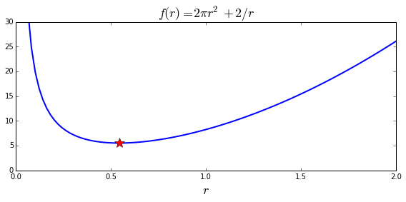
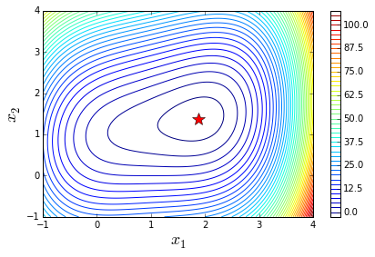
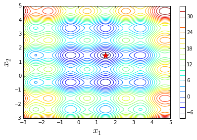
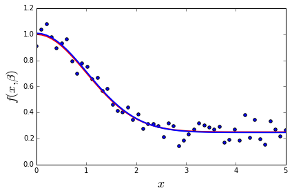
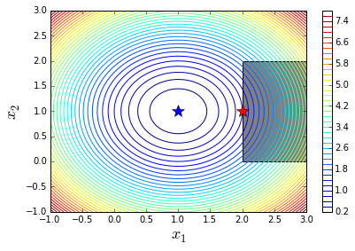
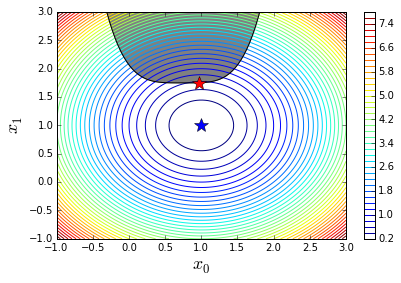

# Chapter 6: Optimization
<!-- toc orderedList:0 depthFrom:1 depthTo:6 -->

* [Chapter 6: Optimization](#chapter-6-optimization)
  * [Univariate](#univariate)
  * [Two-dimensional](#two-dimensional)
  * [Brute force search for initial point](#brute-force-search-for-initial-point)
  * [Nonlinear least square](#nonlinear-least-square)
  * [Constrained optimization](#constrained-optimization)
    * [Bounds](#bounds)
  * [Lagrange multiplier](#lagrange-multiplier)
  * [Inequality constraints](#inequality-constraints)
  * [Linear programming](#linear-programming)
  * [Versions](#versions)

<!-- tocstop -->


---

Robert Johansson

Source code listings for [Numerical Python - A Practical Techniques Approach for Industry](http://www.apress.com/9781484205549) (ISBN 978-1-484205-54-9).

The source code listings can be downloaded from http://www.apress.com/9781484205549


```python
%matplotlib inline
import matplotlib.pyplot as plt
```


```python
import numpy as np
```


```python
import sympy
```


```python
sympy.init_printing()
```


```python
from scipy import optimize
```


```python
import cvxopt
```


```python
from __future__ import division
```

## Univariate


```python
r, h = sympy.symbols("r, h")
```


```python
Area = 2 * sympy.pi * r**2 + 2 * sympy.pi * r * h
```


```python
Volume = sympy.pi * r**2 * h
```


```python
h_r = sympy.solve(Volume - 1)[0]
```


```python
Area_r = Area.subs(h_r)
```


```python
rsol = sympy.solve(Area_r.diff(r))[0]
```


```python
rsol
```


$$\frac{2^{\frac{2}{3}}}{2 \sqrt[3]{\pi}}$$


```python
_.evalf()
```


$$0.541926070139289$$


```python
# verify that the second derivative is positive, so that rsol is a minimum
Area_r.diff(r, 2).subs(r, rsol)
```


$$12 \pi$$


```python
Area_r.subs(r, rsol)
```


$$3 \sqrt[3]{2} \sqrt[3]{\pi}$$


```python
_.evalf()
```


$$5.53581044593209$$


```python
def f(r):
    return 2 * np.pi * r**2 + 2 / r
```


```python
r_min = optimize.brent(f, brack=(0.1, 4))
```


```python
r_min
```


$$0.541926077256$$


```python
f(r_min)
```


$$5.53581044593$$


```python
optimize.minimize_scalar(f, bracket=(0.1, 5))
```


      fun: 5.5358104459320856
     nfev: 14
      nit: 13
        x: 0.54192606489766715


```python
r = np.linspace(0, 2, 100)
```


```python
fig, ax = plt.subplots(figsize=(8, 4))

ax.plot(r, f(r), lw=2, color='b')
ax.plot(r_min, f(r_min), 'r*', markersize=15)
ax.set_title(r"$f(r) = 2\pi r^2+2/r$", fontsize=18)
ax.set_xlabel(r"$r$", fontsize=18)
ax.set_xticks([0, 0.5, 1, 1.5, 2])
ax.set_ylim(0, 30)

fig.tight_layout()
fig.savefig('ch6-univariate-optimization-example.pdf')
```

    /Users/rob/miniconda/envs/py27-npm/lib/python2.7/site-packages/IPython/kernel/__main__.py:2: RuntimeWarning: divide by zero encountered in true_divide
      from IPython.kernel.zmq import kernelapp as app





## Two-dimensional


```python
x1, x2 = sympy.symbols("x_1, x_2")
```


```python
f_sym = (x1-1)**4 + 5 * (x2-1)**2 - 2*x1*x2
```


```python
fprime_sym = [f_sym.diff(x_) for x_ in (x1, x2)]
```


```python
# Gradient
sympy.Matrix(fprime_sym)
```


$$\left[\begin{matrix}- 2 x_{2} + 4 \left(x_{1} - 1\right)^{3}\\- 2 x_{1} + 10 x_{2} - 10\end{matrix}\right]$$


```python
fhess_sym = [[f_sym.diff(x1_, x2_) for x1_ in (x1, x2)] for x2_ in (x1, x2)]
```


```python
# Hessian
sympy.Matrix(fhess_sym)
```


$$\left[\begin{matrix}12 \left(x_{1} - 1\right)^{2} & -2\\-2 & 10\end{matrix}\right]$$


```python
f_lmbda = sympy.lambdify((x1, x2), f_sym, 'numpy')
```


```python
fprime_lmbda = sympy.lambdify((x1, x2), fprime_sym, 'numpy')
```


```python
fhess_lmbda = sympy.lambdify((x1, x2), fhess_sym, 'numpy')
```


```python
def func_XY_X_Y(f):
    """
    Wrapper for f(X) -> f(X[0], X[1])
    """
    return lambda X: np.array(f(X[0], X[1]))
```


```python
f = func_XY_X_Y(f_lmbda)
```


```python
fprime = func_XY_X_Y(fprime_lmbda)
```


```python
fhess = func_XY_X_Y(fhess_lmbda)
```


```python
X_opt = optimize.fmin_ncg(f, (0, 0), fprime=fprime, fhess=fhess)
```

    Optimization terminated successfully.
             Current function value: -3.867223
             Iterations: 8
             Function evaluations: 10
             Gradient evaluations: 17
             Hessian evaluations: 8


```python
X_opt
```


    array([ 1.88292613,  1.37658523])


```python
fig, ax = plt.subplots(figsize=(6, 4))
x_ = y_ = np.linspace(-1, 4, 100)
X, Y = np.meshgrid(x_, y_)
c = ax.contour(X, Y, f_lmbda(X, Y), 50)
ax.plot(X_opt[0], X_opt[1], 'r*', markersize=15)
ax.set_xlabel(r"$x_1$", fontsize=18)
ax.set_ylabel(r"$x_2$", fontsize=18)
plt.colorbar(c, ax=ax)
fig.tight_layout()
fig.savefig('ch6-examaple-two-dim.pdf');
```





## Brute force search for initial point


```python
def f(X):
    x, y = X
    return (4 * np.sin(np.pi * x) + 6 * np.sin(np.pi * y)) + (x - 1)**2 + (y - 1)**2
```


```python
x_start = optimize.brute(f, (slice(-3, 5, 0.5), slice(-3, 5, 0.5)), finish=None)
```


```python
x_start
```


    array([ 1.5,  1.5])


```python
f(x_start)
```


$$-9.5$$


```python
x_opt = optimize.fmin_bfgs(f, x_start)
```

    Optimization terminated successfully.
             Current function value: -9.520229
             Iterations: 4
             Function evaluations: 28
             Gradient evaluations: 7


```python
x_opt
```


    array([ 1.47586906,  1.48365788])


```python
f(x_opt)
```


$$-9.52022927306$$


```python
def func_X_Y_to_XY(f, X, Y):
    s = np.shape(X)
    return f(np.vstack([X.ravel(), Y.ravel()])).reshape(*s)
```


```python
fig, ax = plt.subplots(figsize=(6, 4))
x_ = y_ = np.linspace(-3, 5, 100)
X, Y = np.meshgrid(x_, y_)
c = ax.contour(X, Y, func_X_Y_to_XY(f, X, Y), 25)
ax.plot(x_opt[0], x_opt[1], 'r*', markersize=15)
ax.set_xlabel(r"$x_1$", fontsize=18)
ax.set_ylabel(r"$x_2$", fontsize=18)
plt.colorbar(c, ax=ax)
fig.tight_layout()
fig.savefig('ch6-example-2d-many-minima.pdf');
```





## Nonlinear least square


```python
def f(x, beta0, beta1, beta2):
    return beta0 + beta1 * np.exp(-beta2 * x**2)
```


```python
beta = (0.25, 0.75, 0.5)
```


```python
xdata = np.linspace(0, 5, 50)
```


```python
y = f(xdata, *beta)
```


```python
ydata = y + 0.05 * np.random.randn(len(xdata))
```


```python
def g(beta):
    return ydata - f(xdata, *beta)
```


```python
beta_start = (1, 1, 1)
```


```python
beta_opt, beta_cov = optimize.leastsq(g, beta_start)
```


```python
beta_opt
```


    array([ 0.24647649,  0.76175477,  0.48895486])


```python
fig, ax = plt.subplots()

ax.scatter(xdata, ydata)
ax.plot(xdata, y, 'r', lw=2)
ax.plot(xdata, f(xdata, *beta_opt), 'b', lw=2)
ax.set_xlim(0, 5)
ax.set_xlabel(r"$x$", fontsize=18)
ax.set_ylabel(r"$f(x, \beta)$", fontsize=18)

fig.tight_layout()
fig.savefig('ch6-nonlinear-least-square.pdf')
```





```python
beta_opt, beta_cov = optimize.curve_fit(f, xdata, ydata)
```


```python
beta_opt
```


    array([ 0.24647649,  0.76175477,  0.48895486])


## Constrained optimization

### Bounds


```python
def f(X):
    x, y = X
    return (x-1)**2 + (y-1)**2
```


```python
x_opt = optimize.minimize(f, (0, 0), method='BFGS').x
```


```python
bnd_x1, bnd_x2 = (2, 3), (0, 2)
```


```python
x_cons_opt = optimize.minimize(f, np.array([0, 0]), method='L-BFGS-B', bounds=[bnd_x1, bnd_x2]).x
```


```python
fig, ax = plt.subplots(figsize=(6, 4))
x_ = y_ = np.linspace(-1, 3, 100)
X, Y = np.meshgrid(x_, y_)
c = ax.contour(X, Y, func_X_Y_to_XY(f, X, Y), 50)
ax.plot(x_opt[0], x_opt[1], 'b*', markersize=15)
ax.plot(x_cons_opt[0], x_cons_opt[1], 'r*', markersize=15)
bound_rect = plt.Rectangle((bnd_x1[0], bnd_x2[0]),
                           bnd_x1[1] - bnd_x1[0], bnd_x2[1] - bnd_x2[0],
                           facecolor="grey")
ax.add_patch(bound_rect)
ax.set_xlabel(r"$x_1$", fontsize=18)
ax.set_ylabel(r"$x_2$", fontsize=18)
plt.colorbar(c, ax=ax)

fig.tight_layout()
fig.savefig('ch6-example-constraint-bound.pdf');
```





## Lagrange multiplier


```python
x = x1, x2, x3, l = sympy.symbols("x_1, x_2, x_3, lambda")
```


```python
f = x1 * x2 * x3
```


```python
g = 2 * (x1 * x2 + x2 * x3 + x3 * x1) - 1
```


```python
L = f + l * g
```


```python
grad_L = [sympy.diff(L, x_) for x_ in x]
```


```python
sols = sympy.solve(grad_L)
sols
```


$$\left [ \left \{ \lambda : - \frac{\sqrt{6}}{24}, \quad x_{1} : \frac{\sqrt{6}}{6}, \quad x_{2} : \frac{\sqrt{6}}{6}, \quad x_{3} : \frac{\sqrt{6}}{6}\right \}, \quad \left \{ \lambda : \frac{\sqrt{6}}{24}, \quad x_{1} : - \frac{\sqrt{6}}{6}, \quad x_{2} : - \frac{\sqrt{6}}{6}, \quad x_{3} : - \frac{\sqrt{6}}{6}\right \}\right ]$$


```python
g.subs(sols[0])
```


$$0$$


```python
f.subs(sols[0])
```


$$\frac{\sqrt{6}}{36}$$


```python
def f(X):
    return -X[0] * X[1] * X[2]
```


```python
def g(X):
    return 2 * (X[0]*X[1] + X[1] * X[2] + X[2] * X[0]) - 1
```


```python
constraints = [dict(type='eq', fun=g)]
```


```python
result = optimize.minimize(f, [0.5, 1, 1.5], method='SLSQP', constraints=constraints)
```


```python
result
```


      status: 0
     success: True
        njev: 18
        nfev: 95
         fun: -0.068041368623352985
           x: array([ 0.40824187,  0.40825127,  0.40825165])
     message: 'Optimization terminated successfully.'
         jac: array([-0.16666925, -0.16666542, -0.16666527,  0.        ])
         nit: 18


```python
result.x
```


    array([ 0.40824187,  0.40825127,  0.40825165])


## Inequality constraints


```python
def f(X):
    return (X[0] - 1)**2 + (X[1] - 1)**2

def g(X):
    return X[1] - 1.75 - (X[0] - 0.75)**4
```


```python
x_opt = optimize.minimize(f, (0, 0), method='BFGS').x
```


```python
constraints = [dict(type='ineq', fun=g)]
```


```python
x_cons_opt = optimize.minimize(f, (0, 0), method='SLSQP', constraints=constraints).x
```


```python
x_cons_opt = optimize.minimize(f, (0, 0), method='COBYLA', constraints=constraints).x
```


```python
fig, ax = plt.subplots(figsize=(6, 4))
x_ = y_ = np.linspace(-1, 3, 100)
X, Y = np.meshgrid(x_, y_)
c = ax.contour(X, Y, func_X_Y_to_XY(f, X, Y), 50)
ax.plot(x_opt[0], x_opt[1], 'b*', markersize=15)

ax.plot(x_, 1.75 + (x_-0.75)**4, 'k-', markersize=15)
ax.fill_between(x_, 1.75 + (x_-0.75)**4, 3, color="grey")
ax.plot(x_cons_opt[0], x_cons_opt[1], 'r*', markersize=15)

ax.set_ylim(-1, 3)
ax.set_xlabel(r"$x_0$", fontsize=18)
ax.set_ylabel(r"$x_1$", fontsize=18)
plt.colorbar(c, ax=ax)

fig.tight_layout()
fig.savefig('ch6-example-constraint-inequality.pdf');
```





## Linear programming


```python
c = np.array([-1.0, 2.0, -3.0])

A = np.array([[ 1.0, 1.0, 0.0],
              [-1.0, 3.0, 0.0],
              [ 0.0, -1.0, 1.0]])

b = np.array([1.0, 2.0, 3.0])
```


```python
A_ = cvxopt.matrix(A)
b_ = cvxopt.matrix(b)
c_ = cvxopt.matrix(c)
```


```python
sol = cvxopt.solvers.lp(c_, A_, b_)
```

    Optimal solution found.


```python
x = np.array(sol['x'])
```


```python
x
```


    array([[ 0.25],
           [ 0.75],
           [ 3.75]])


```python
sol
```


    {'dual infeasibility': 1.4835979218054372e-16,
     'dual objective': -10.0,
     'dual slack': 0.0,
     'gap': 0.0,
     'iterations': 0,
     'primal infeasibility': 0.0,
     'primal objective': -10.0,
     'primal slack': -0.0,
     'relative gap': 0.0,
     'residual as dual infeasibility certificate': None,
     'residual as primal infeasibility certificate': None,
     's': <3x1 matrix, tc='d'>,
     'status': 'optimal',
     'x': <3x1 matrix, tc='d'>,
     'y': <0x1 matrix, tc='d'>,
     'z': <3x1 matrix, tc='d'>}


```python
sol['primal objective']
```


$$-10.0$$


## Versions


```python
%reload_ext version_information
```


```python
%version_information numpy, scipy, cvxopt, sympy, matplotlib
```


<table><tr><th>Software</th><th>Version</th></tr><tr><td>Python</td><td>2.7.10 64bit [GCC 4.2.1 (Apple Inc. build 5577)]</td></tr><tr><td>IPython</td><td>3.2.1</td></tr><tr><td>OS</td><td>Darwin 14.1.0 x86_64 i386 64bit</td></tr><tr><td>numpy</td><td>1.9.2</td></tr><tr><td>scipy</td><td>0.16.0</td></tr><tr><td>cvxopt</td><td>1.1.7</td></tr><tr><td>sympy</td><td>0.7.6</td></tr><tr><td>matplotlib</td><td>1.4.3</td></tr></table>
