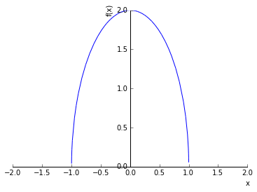

# Chapter 8: Integration
<!-- toc orderedList:0 depthFrom:1 depthTo:6 -->

* [Chapter 8: Integration](#chapter-8-integration)
* [Simpson's rule](#simpsons-rule)
  * [SciPy `integrate`](#scipy-integrate)
    * [Simple integration example](#simple-integration-example)
    * [Extra arguments](#extra-arguments)
    * [Reshuffle arguments](#reshuffle-arguments)
    * [Infinite limits](#infinite-limits)
    * [Singularity](#singularity)
  * [Tabulated integrand](#tabulated-integrand)
  * [Higher dimension](#higher-dimension)
    * [nquad](#nquad)
    * [Monte Carlo integration](#monte-carlo-integration)
  * [Symbolic and multi-precision quadrature](#symbolic-and-multi-precision-quadrature)
    * [double and triple integrals](#double-and-triple-integrals)
  * [Line integrals](#line-integrals)
  * [Integral transformations](#integral-transformations)
    * [Laplace transforms](#laplace-transforms)
    * [Fourier Transforms](#fourier-transforms)
  * [Versions](#versions)

<!-- tocstop -->


---

Robert Johansson

Source code listings for [Numerical Python - A Practical Techniques Approach for Industry](http://www.apress.com/9781484205549) (ISBN 978-1-484205-54-9).

The source code listings can be downloaded from http://www.apress.com/9781484205549


```python
%matplotlib inline
import matplotlib.pyplot as plt
import matplotlib as mpl
```


```python
import numpy as np
```


```python
from scipy import integrate
```


```python
import sympy
```


```python
sympy.init_printing()
```

# Simpson's rule


```python
a, b, X = sympy.symbols("a, b, x")
f = sympy.Function("f")
```


```python
#x = a, (a+b)/3, 2 * (a+b)/3, b # 3rd order quadrature rule
x = a, (a+b)/2, b # simpson's rule
#x = a, b # trapezoid rule
#x = ((b+a)/2,)  # mid-point rule
```


```python
w = [sympy.symbols("w_%d" % i) for i in range(len(x))]
```


```python
q_rule = sum([w[i] * f(x[i]) for i in range(len(x))])
```


```python
q_rule
```


$$w_{0} f{\left (a \right )} + w_{1} f{\left (\frac{a}{2} + \frac{b}{2} \right )} + w_{2} f{\left (b \right )}$$


```python
phi = [sympy.Lambda(X, X**n) for n in range(len(x))]
```


```python
phi
```


$$\left [ \left( x \mapsto 1 \right), \quad \left( x \mapsto x \right), \quad \left( x \mapsto x^{2} \right)\right ]$$


```python
eqs = [q_rule.subs(f, phi[n]) - sympy.integrate(phi[n](X), (X, a, b)) for n in range(len(phi))]
```


```python
eqs
```


$$\left [ a - b + w_{0} + w_{1} + w_{2}, \quad \frac{a^{2}}{2} + a w_{0} - \frac{b^{2}}{2} + b w_{2} + w_{1} \left(\frac{a}{2} + \frac{b}{2}\right), \quad \frac{a^{3}}{3} + a^{2} w_{0} - \frac{b^{3}}{3} + b^{2} w_{2} + w_{1} \left(\frac{a}{2} + \frac{b}{2}\right)^{2}\right ]$$


```python
w_sol = sympy.solve(eqs, w)
```


```python
w_sol
```


$$\left \{ w_{0} : - \frac{a}{6} + \frac{b}{6}, \quad w_{1} : - \frac{2 a}{3} + \frac{2 b}{3}, \quad w_{2} : - \frac{a}{6} + \frac{b}{6}\right \}$$


```python
q_rule.subs(w_sol).simplify()
```


$$- \frac{1}{6} \left(a - b\right) \left(f{\left (a \right )} + f{\left (b \right )} + 4 f{\left (\frac{a}{2} + \frac{b}{2} \right )}\right)$$


## SciPy `integrate`

### Simple integration example


```python
def f(x):
    return np.exp(-x**2)
```


```python
val, err = integrate.quad(f, -1, 1)
```


```python
val
```


$$1.49364826562$$


```python
err
```


$$1.65828269519e-14$$


```python
val, err = integrate.quadrature(f, -1, 1)
```


```python
val
```


$$1.49364826565$$


```python
err
```


$$7.45989714446e-10$$


### Extra arguments


```python
def f(x, a, b, c):
    return a * np.exp(-((x-b)/c)**2)
```


```python
val, err = integrate.quad(f, -1, 1, args=(1, 2, 3))
```


```python
val
```


$$1.2763068351$$


```python
err
```


$$1.41698523482e-14$$


### Reshuffle arguments


```python
from scipy.special import jv
```


```python
val, err = integrate.quad(lambda x: jv(0, x), 0, 5)
```


```python
val
```


$$0.715311917785$$


```python
err
```


$$2.4726073829e-14$$


### Infinite limits


```python
f = lambda x: np.exp(-x**2)
```


```python
val, err = integrate.quad(f, -np.inf, np.inf)
```


```python
val
```


$$1.77245385091$$


```python
err
```


$$1.42026367809e-08$$


### Singularity


```python
f = lambda x: 1/np.sqrt(abs(x))
```


```python
a, b = -1, 1
```


```python
integrate.quad(f, a, b)
```

    /Users/rob/miniconda/envs/py27-npm/lib/python2.7/site-packages/IPython/kernel/__main__.py:1: RuntimeWarning: divide by zero encountered in double_scalars
      if __name__ == '__main__':


$$\left ( inf, \quad inf\right )$$


```python
integrate.quad(f, a, b, points=[0])
```


$$\left ( 4.0, \quad 5.68434188608e-14\right )$$


```python
fig, ax = plt.subplots(figsize=(8, 3))

x = np.linspace(a, b, 10000)
ax.plot(x, f(x), lw=2)
ax.fill_between(x, f(x), color='green', alpha=0.5)
ax.set_xlabel("$x$", fontsize=18)
ax.set_ylabel("$f(x)$", fontsize=18)
ax.set_ylim(0, 25)

fig.tight_layout()
fig.savefig("ch8-diverging-integrand.pdf")
```


## Tabulated integrand


```python
f = lambda x: np.sqrt(x)
```


```python
a, b = 0, 2
```


```python
x = np.linspace(a, b, 25)
```


```python
y = f(x)
```


```python
fig, ax = plt.subplots(figsize=(8, 3))
ax.plot(x, y, 'bo')
xx = np.linspace(a, b, 500)
ax.plot(xx, f(xx), 'b-')
ax.fill_between(xx, f(xx), color='green', alpha=0.5)
ax.set_xlabel(r"$x$", fontsize=18)
ax.set_ylabel(r"$f(x)$", fontsize=18)
fig.tight_layout()
fig.savefig("ch8-tabulated-integrand.pdf")
```


```python
val_trapz = integrate.trapz(y, x)
```


```python
val_trapz
```


$$1.88082171605$$


```python
val_simps = integrate.simps(y, x)
```


```python
val_simps
```


$$1.88366510245$$


```python
val_exact = 2.0/3.0 * (b-a)**(3.0/2.0)
```


```python
val_exact
```


$$1.88561808316$$


```python
val_exact - val_trapz
```


$$0.00479636711328$$


```python
val_exact - val_simps
```


$$0.00195298071541$$


```python
x = np.linspace(a, b, 1 + 2**6)
```


```python
len(x)
```


$$65$$


```python
y = f(x)
```


```python
val_exact - integrate.romb(y, dx=(x[1]-x[0]))
```


$$0.000378798422913$$


```python
val_exact - integrate.simps(y, dx=x[1]-x[0])
```


$$0.000448485554158$$


## Higher dimension


```python
def f(x):
    return np.exp(-x**2)
```


```python
%time integrate.quad(f, a, b)
```

    CPU times: user 98 µs, sys: 46 µs, total: 144 µs
    Wall time: 142 µs


$$\left ( 0.882081390762, \quad 9.79307069618e-15\right )$$


```python
def f(x, y):
    return np.exp(-x**2-y**2)
```


```python
a, b = 0, 1
```


```python
g = lambda x: 0
```


```python
h = lambda x: 1
```


```python
integrate.dblquad(f, a, b, g, h)
```


$$\left ( 0.557746285351, \quad 6.19222767896e-15\right )$$


```python
integrate.dblquad(lambda x, y: np.exp(-x**2-y**2), 0, 1, lambda x: 0, lambda x: 1)
```


$$\left ( 0.557746285351, \quad 6.19222767896e-15\right )$$


```python
fig, ax = plt.subplots(figsize=(6, 5))

x = y = np.linspace(-1.25, 1.25, 75)
X, Y = np.meshgrid(x, y)

c = ax.contour(X, Y, f(X, Y), 15, cmap=mpl.cm.RdBu, vmin=-1, vmax=1)

bound_rect = plt.Rectangle((0, 0), 1, 1,
                           facecolor="grey")
ax.add_patch(bound_rect)

ax.axis('tight')
ax.set_xlabel('$x$', fontsize=18)
ax.set_ylabel('$y$', fontsize=18)

fig.tight_layout()
fig.savefig("ch8-multi-dim-integrand.pdf")
```


```python
integrate.dblquad(f, 0, 1, lambda x: -1 + x, lambda x: 1 - x)
```


$$\left ( 0.732093100001, \quad 8.1278661579e-15\right )$$


```python
def f(x, y, z):
    return np.exp(-x**2-y**2-z**2)
```


```python
integrate.tplquad(f, 0, 1, lambda x : 0, lambda x : 1, lambda x, y : 0, lambda x, y : 1)
```


$$\left ( 0.416538385887, \quad 4.62450506652e-15\right )$$


```python
integrate.nquad(f, [(0, 1), (0, 1), (0, 1)])
```


$$\left ( 0.416538385887, \quad 8.29133528731e-15\right )$$


### nquad


```python
def f(*args):
    return  np.exp(-np.sum(np.array(args)**2))
```


```python
%time integrate.nquad(f, [(0,1)] * 1)
```

    CPU times: user 361 µs, sys: 94 µs, total: 455 µs
    Wall time: 440 µs


$$\left ( 0.746824132812, \quad 8.29141347594e-15\right )$$


```python
%time integrate.nquad(f, [(0,1)] * 2)
```

    CPU times: user 10.5 ms, sys: 1.79 ms, total: 12.3 ms
    Wall time: 11.6 ms


$$\left ( 0.557746285351, \quad 8.29137438154e-15\right )$$


```python
%time integrate.nquad(f, [(0,1)] * 3)
```

    CPU times: user 130 ms, sys: 15.2 ms, total: 146 ms
    Wall time: 135 ms


$$\left ( 0.416538385887, \quad 8.29133528731e-15\right )$$


```python
%time integrate.nquad(f, [(0,1)] * 4)
```

    CPU times: user 2.59 s, sys: 43.5 ms, total: 2.63 s
    Wall time: 2.67 s


$$\left ( 0.311080918823, \quad 8.29129619328e-15\right )$$


```python
%time integrate.nquad(f, [(0,1)] * 5)
```

    CPU times: user 51.8 s, sys: 1.93 s, total: 53.7 s
    Wall time: 52.8 s


$$\left ( 0.232322737434, \quad 8.29125709943e-15\right )$$


### Monte Carlo integration


```python
from skmonaco import mcquad
```


```python
%time val, err = mcquad(f, xl=np.zeros(5), xu=np.ones(5), npoints=100000)
```

    CPU times: user 1.23 s, sys: 50 ms, total: 1.28 s
    Wall time: 1.28 s


```python
val, err
```


$$\left ( 0.232011116953, \quad 0.000472864897239\right )$$


```python
%time val, err = mcquad(f, xl=np.zeros(10), xu=np.ones(10), npoints=100000)
```

    CPU times: user 1.23 s, sys: 49.1 ms, total: 1.28 s
    Wall time: 1.27 s


```python
val, err
```


$$\left ( 0.0540787152508, \quad 0.000170681220268\right )$$


## Symbolic and multi-precision quadrature


```python
x = sympy.symbols("x")
```


```python
f = 2 * sympy.sqrt(1-x**2)
```


```python
a, b = -1, 1
```


```python
sympy.plot(f, (x, -2, 2));
```





```python
val_sym = sympy.integrate(f, (x, a, b))
```


```python
val_sym
```


$$\pi$$


```python
sympy.mpmath.mp.dps = 75
```


```python
f_mpmath = sympy.lambdify(x, f, 'mpmath')
```


```python
val = sympy.mpmath.quad(f_mpmath, (a, b))
```


```python
sympy.sympify(val)
```


$$3.14159265358979323846264338327950288419716939937510582097494459230781640629$$


```python
sympy.N(val_sym, sympy.mpmath.mp.dps+1) - val
```


$$6.90893484407555570030908149024031965689280029154902510801896277613487344253 \cdot 10^{-77}$$


```python
%timeit sympy.mpmath.quad(f_mpmath, [a, b])
```

    100 loops, best of 3: 12.3 ms per loop


```python
f_numpy = sympy.lambdify(x, f, 'numpy')
```


```python
%timeit integrate.quad(f_numpy, a, b)
```

    1000 loops, best of 3: 996 µs per loop


### double and triple integrals


```python
def f2(x, y):
    return np.cos(x)*np.cos(y)*np.exp(-x**2-y**2)

def f3(x, y, z):
    return np.cos(x)*np.cos(y)*np.cos(z)*np.exp(-x**2-y**2-z**2)
```


```python
integrate.dblquad(f2, 0, 1, lambda x : 0, lambda x : 1)
```


$$\left ( 0.430564794306, \quad 4.78022948232e-15\right )$$


```python
integrate.tplquad(f3, 0, 1, lambda x : 0, lambda x : 1, lambda x, y : 0, lambda x, y : 1)
```


$$\left ( 0.282525579518, \quad 3.13666403427e-15\right )$$


```python
x, y, z = sympy.symbols("x, y, z")
```


```python
f2 = sympy.cos(x)*sympy.cos(y)*sympy.exp(-x**2-y**2)
```


```python
f3 = sympy.exp(-x**2 - y**2 - z**2)
```


```python
f2_numpy = sympy.lambdify((x, y), f2, 'numpy')
```


```python
integrate.dblquad(f2_numpy, 0, 1, lambda x: 0, lambda x: 1)
```


$$\left ( 0.430564794306, \quad 4.78022948232e-15\right )$$


```python
f3_numpy = sympy.lambdify((x, y, z), f3, 'numpy')
```


```python
integrate.tplquad(f3_numpy, 0, 1, lambda x: 0, lambda x: 1, lambda x, y: 0, lambda x, y: 1)
```


$$\left ( 0.416538385887, \quad 4.62450506652e-15\right )$$


```python
sympy.mpmath.mp.dps = 30
```


```python
f2_mpmath = sympy.lambdify((x, y), f2, 'mpmath')
```


```python
sympy.mpmath.quad(f2_mpmath, (0, 1), (0, 1))
```


    mpf('0.430564794306099099242308990195783')


```python
f3_mpmath = sympy.lambdify((x, y, z), f3, 'mpmath')
```


```python
res = sympy.mpmath.quad(f3_mpmath, (0, 1), (0, 1), (0, 1))
```


```python
sympy.sympify(res)
```


$$0.416538385886638169609660243601$$


## Line integrals


```python
t, x, y = sympy.symbols("t, x, y")
```


```python
C = sympy.Curve([sympy.cos(t), sympy.sin(t)], (t, 0, 2 * sympy.pi))
```


```python
sympy.line_integrate(1, C, [x, y])
```


$$2 \pi$$


```python
sympy.line_integrate(x**2 * y**2, C, [x, y])
```


$$\frac{\pi}{4}$$


## Integral transformations

### Laplace transforms


```python
s = sympy.symbols("s")
```


```python
a, t = sympy.symbols("a, t", positive=True)
```


```python
f = sympy.sin(a*t)
```


```python
sympy.laplace_transform(f, t, s)
```


$$\left ( \frac{a}{a^{2} + s^{2}}, \quad -\infty, \quad 0 < \Re{s}\right )$$


```python
F = sympy.laplace_transform(f, t, s, noconds=True)
```


```python
F
```


$$\frac{a}{a^{2} + s^{2}}$$


```python
sympy.inverse_laplace_transform(F, s, t, noconds=True)
```


$$\sin{\left (a t \right )}$$


```python
[sympy.laplace_transform(f, t, s, noconds=True) for f in [t, t**2, t**3, t**4]]
```


$$\left [ \frac{1}{s^{2}}, \quad \frac{2}{s^{3}}, \quad \frac{6}{s^{4}}, \quad \frac{24}{s^{5}}\right ]$$


```python
n = sympy.symbols("n", integer=True, positive=True)
```


```python
sympy.laplace_transform(t**n, t, s, noconds=True)
```


$$\frac{\Gamma{\left(n + 1 \right)}}{s^{n + 1}}$$


```python
sympy.laplace_transform((1 - a*t) * sympy.exp(-a*t), t, s, noconds=True)
```


$$\frac{s}{\left(a + s\right)^{2}}$$


### Fourier Transforms


```python
w = sympy.symbols("omega")
```


```python
f = sympy.exp(-a*t**2)
```


```python
help(sympy.fourier_transform)
```

    Help on function fourier_transform in module sympy.integrals.transforms:

    fourier_transform(f, x, k, **hints)
        Compute the unitary, ordinary-frequency Fourier transform of `f`, defined
        as

        .. math:: F(k) = \int_{-\infty}^\infty f(x) e^{-2\pi i x k} \mathrm{d} x.

        If the transform cannot be computed in closed form, this
        function returns an unevaluated :class:`FourierTransform` object.

        For other Fourier transform conventions, see the function
        :func:`sympy.integrals.transforms._fourier_transform`.

        For a description of possible hints, refer to the docstring of
        :func:`sympy.integrals.transforms.IntegralTransform.doit`.
        Note that for this transform, by default ``noconds=True``.

        >>> from sympy import fourier_transform, exp
        >>> from sympy.abc import x, k
        >>> fourier_transform(exp(-x**2), x, k)
        sqrt(pi)*exp(-pi**2*k**2)
        >>> fourier_transform(exp(-x**2), x, k, noconds=False)
        (sqrt(pi)*exp(-pi**2*k**2), True)

        See Also
        ========

        inverse_fourier_transform
        sine_transform, inverse_sine_transform
        cosine_transform, inverse_cosine_transform
        hankel_transform, inverse_hankel_transform
        mellin_transform, laplace_transform


```python
F = sympy.fourier_transform(f, t, w)
```


```python
F
```


$$\frac{\sqrt{\pi}}{\sqrt{a}} e^{- \frac{\pi^{2} \omega^{2}}{a}}$$


```python
sympy.inverse_fourier_transform(F, w, t)
```


$$e^{- a t^{2}}$$


## Versions


```python
%reload_ext version_information
```


```python
%version_information numpy, matplotlib, scipy, sympy
```


<table><tr><th>Software</th><th>Version</th></tr><tr><td>Python</td><td>2.7.10 64bit [GCC 4.2.1 (Apple Inc. build 5577)]</td></tr><tr><td>IPython</td><td>3.2.1</td></tr><tr><td>OS</td><td>Darwin 14.1.0 x86_64 i386 64bit</td></tr><tr><td>numpy</td><td>1.9.2</td></tr><tr><td>matplotlib</td><td>1.4.3</td></tr><tr><td>scipy</td><td>0.16.0</td></tr><tr><td>sympy</td><td>0.7.6</td></tr></table>
