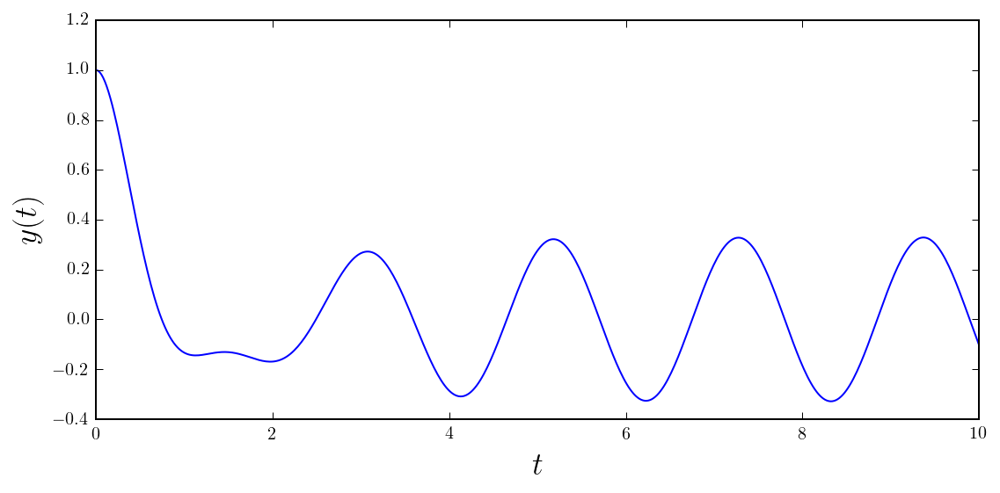

# Chapter 9: Ordinary differential equations
<!-- toc orderedList:0 depthFrom:1 depthTo:6 -->

* [Chapter 9: Ordinary differential equations](#chapter-9-ordinary-differential-equations)
  * [Symbolic ODE solving with SymPy](#symbolic-ode-solving-with-sympy)
  * [Newton's law of cooling](#newtons-law-of-cooling)
    * [Function for applying initial conditions](#function-for-applying-initial-conditions)
    * [Damped harmonic oscillator](#damped-harmonic-oscillator)
    * [Direction fields](#direction-fields)
    * [Inexact solutions to ODEs](#inexact-solutions-to-odes)
  * [Laplace transformation method](#laplace-transformation-method)
  * [Numerical integration of ODEs using SciPy](#numerical-integration-of-odes-using-scipy)
  * [Lotka-Volterra equations for predator/pray populations](#lotka-volterra-equations-for-predatorpray-populations)
  * [Lorenz equations](#lorenz-equations)
  * [Coupled damped springs](#coupled-damped-springs)
      * [Same calculation as above, but with specifying the Jacobian as well:](#same-calculation-as-above-but-with-specifying-the-jacobian-as-well)
    * [Same calculating, but using SymPy to setup the problem for SciPy](#same-calculating-but-using-sympy-to-setup-the-problem-for-scipy)
  * [Doube pendulum](#doube-pendulum)
  * [Versions](#versions)

<!-- tocstop -->


---

Robert Johansson

Source code listings for [Numerical Python - A Practical Techniques Approach for Industry](http://www.apress.com/9781484205549) (ISBN 978-1-484205-54-9).

The source code listings can be downloaded from http://www.apress.com/9781484205549


```python
import numpy as np
```


```python
%matplotlib inline
%config InlineBackend.figure_format='retina'
import matplotlib.pyplot as plt
import matplotlib as mpl
mpl.rcParams['text.usetex'] = True
```


```python
import sympy
sympy.init_printing()
```


```python
from scipy import integrate
```

## Symbolic ODE solving with SymPy

## Newton's law of cooling


```python
t, k, T0, Ta = sympy.symbols("t, k, T_0, T_a")
```


```python
T = sympy.Function("T")
```


```python
ode = T(t).diff(t) + k*(T(t) - Ta)
```


```python
ode
```


$$k \left(- T_{a} + T{\left (t \right )}\right) + \frac{d}{d t} T{\left (t \right )}$$


```python
ode_sol = sympy.dsolve(ode)
```


```python
ode_sol
```


$$T{\left (t \right )} = C_{1} e^{- k t} + T_{a}$$


```python
ode_sol.lhs
```


$$T{\left (t \right )}$$


```python
ode_sol.rhs
```


$$C_{1} e^{- k t} + T_{a}$$


```python
ics = {T(0): T0}
```


```python
ics
```


$$\left \{ T{\left (0 \right )} : T_{0}\right \}$$


```python
C_eq = sympy.Eq(ode_sol.lhs.subs(t, 0).subs(ics), ode_sol.rhs.subs(t, 0))
```


```python
C_eq
```


$$T_{0} = C_{1} + T_{a}$$


```python
C_sol = sympy.solve(C_eq)
```


```python
C_sol
```


$$\left [ \left \{ C_{1} : T_{0} - T_{a}\right \}\right ]$$


```python
ode_sol.subs(C_sol[0])
```


$$T{\left (t \right )} = T_{a} + \left(T_{0} - T_{a}\right) e^{- k t}$$


### Function for applying initial conditions


```python
def apply_ics(sol, ics, x, known_params):
    """
    Apply the initial conditions (ics), given as a dictionary on
    the form ics = {y(0): y0: y(x).diff(x).subs(x, 0): yp0, ...}
    to the solution of the ODE with indepdendent variable x.
    The undetermined integration constants C1, C2, ... are extracted
    from the free symbols of the ODE solution, excluding symbols in
    the known_params list.
    """
    free_params = sol.free_symbols - set(known_params)
    eqs = [(sol.lhs.diff(x, n) - sol.rhs.diff(x, n)).subs(x, 0).subs(ics)
           for n in range(len(ics))]
    sol_params = sympy.solve(eqs, free_params)
    return sol.subs(sol_params)
```


```python
ode_sol
```


$$T{\left (t \right )} = C_{1} e^{- k t} + T_{a}$$


```python
apply_ics(ode_sol, ics, t, [k, Ta])
```


$$T{\left (t \right )} = T_{a} + \left(T_{0} - T_{a}\right) e^{- k t}$$


```python
ode_sol = apply_ics(ode_sol, ics, t, [k, Ta]).simplify()
```


```python
ode_sol
```


$$T{\left (t \right )} = \left(T_{0} + T_{a} e^{k t} - T_{a}\right) e^{- k t}$$


```python
y_x = sympy.lambdify((t, k), ode_sol.rhs.subs({T0: 5, Ta: 1}), 'numpy')
```


```python
fig, ax = plt.subplots(figsize=(8, 4))

x = np.linspace(0, 4, 100)

for k in [1, 2, 3]:
    ax.plot(x, y_x(x, k), label=r"$k=%d$" % k)

ax.set_title(r"$%s$" % sympy.latex(ode_sol), fontsize=18)
ax.set_xlabel(r"$x$", fontsize=18)
ax.set_ylabel(r"$y$", fontsize=18)
ax.legend()

fig.tight_layout()
```


### Damped harmonic oscillator


```python
t, omega0 = sympy.symbols("t, omega_0", positive=True)
gamma = sympy.symbols("gamma", complex=True)
```


```python
x = sympy.Function("x")
```


```python
ode = x(t).diff(t, 2) + 2 * gamma * omega0 * x(t).diff(t) + omega0**2 * x(t)
```


```python
ode
```


$$2 \gamma \omega_{0} \frac{d}{d t} x{\left (t \right )} + \omega_{0}^{2} x{\left (t \right )} + \frac{d^{2}}{d t^{2}}  x{\left (t \right )}$$


```python
ode_sol = sympy.dsolve(ode)
```


```python
ode_sol
```


$$x{\left (t \right )} = C_{1} e^{\omega_{0} t \left(- \gamma - \sqrt{\gamma^{2} - 1}\right)} + C_{2} e^{\omega_{0} t \left(- \gamma + \sqrt{\gamma^{2} - 1}\right)}$$


```python
ics = {x(0): 1, x(t).diff(t).subs(t, 0): 0}
```


```python
ics
```


$$\left \{ x{\left (0 \right )} : 1, \quad \left. \frac{d}{d t} x{\left (t \right )} \right|_{\substack{ t=0 }} : 0\right \}$$


```python
x_t_sol = apply_ics(ode_sol, ics, t, [omega0, gamma])
```


```python
x_t_sol
```


$$x{\left (t \right )} = \left(- \frac{\gamma}{2 \sqrt{\gamma^{2} - 1}} + \frac{1}{2}\right) e^{\omega_{0} t \left(- \gamma - \sqrt{\gamma^{2} - 1}\right)} + \left(\frac{\gamma}{2 \sqrt{\gamma^{2} - 1}} + \frac{1}{2}\right) e^{\omega_{0} t \left(- \gamma + \sqrt{\gamma^{2} - 1}\right)}$$


```python
x_t_critical = sympy.limit(x_t_sol.rhs, gamma, 1)
```


```python
x_t_critical
```


$$\frac{\omega_{0} t + 1}{e^{\omega_{0} t}}$$


```python
fig, ax = plt.subplots(figsize=(8, 4))

tt = np.linspace(0, 3, 250)
for g in [0.1, 0.5, 1, 2.0, 5.0]:
    if g == 1:
        x_t = sympy.lambdify(t, x_t_critical.subs({omega0: 2.0 * sympy.pi}), 'numpy')
    else:
        x_t = sympy.lambdify(t, x_t_sol.rhs.subs({omega0: 2.0 * sympy.pi, gamma: g}), 'numpy')
    ax.plot(tt, x_t(tt).real, label=r"$\gamma = %.1f$" % g)

ax.set_xlabel(r"$t$", fontsize=18)
ax.set_ylabel(r"$x(t)$", fontsize=18)
ax.legend()

fig.tight_layout()
fig.savefig('ch9-harmonic-oscillator.pdf')
```


### Direction fields


```python
def plot_direction_field(x, y_x, f_xy, x_lim=(-5, 5), y_lim=(-5, 5), ax=None):

    f_np = sympy.lambdify((x, y_x), f_xy, 'numpy')

    x_vec = np.linspace(x_lim[0], x_lim[1], 20)
    y_vec = np.linspace(y_lim[0], y_lim[1], 20)

    if ax is None:
        _, ax = plt.subplots(figsize=(4, 4))

    dx = x_vec[1] - x_vec[0]
    dy = y_vec[1] - y_vec[0]

    for m, xx in enumerate(x_vec):
        for n, yy in enumerate(y_vec):
            Dy = f_np(xx, yy) * dx
            Dx = 0.8 * dx**2 / np.sqrt(dx**2 + Dy**2)
            Dy = 0.8 * Dy*dy / np.sqrt(dx**2 + Dy**2)
            ax.plot([xx - Dx/2, xx + Dx/2],
                    [yy - Dy/2, yy + Dy/2], 'b', lw=0.5)
    ax.axis('tight')

    ax.set_title(r"$%s$" %
                 (sympy.latex(sympy.Eq(y(x).diff(x), f_xy))),
                 fontsize=18)

    return ax
```


```python
x = sympy.symbols("x")
```


```python
y = sympy.Function("y")
```


```python
fig, axes = plt.subplots(1, 3, figsize=(12, 4))

plot_direction_field(x, y(x), y(x)**2 + x, ax=axes[0])
plot_direction_field(x, y(x), -x / y(x), ax=axes[1])
plot_direction_field(x, y(x), y(x)**2 / x, ax=axes[2])

fig.tight_layout()
fig.savefig('ch9-direction-field.pdf')
```


### Inexact solutions to ODEs


```python
x = sympy.symbols("x")
```


```python
y = sympy.Function("y")
```


```python
f = y(x)**2 + x
#f = sympy.cos(y(x)**2) + x
#f = sympy.sqrt(y(x)) * sympy.cos(x**2)
#f = y(x)**2 / x
```


```python
sympy.Eq(y(x).diff(x), f)
```


$$\frac{d}{d x} y{\left (x \right )} = x + y^{2}{\left (x \right )}$$


```python
ics = {y(0): 0}
```


```python
ode_sol = sympy.dsolve(y(x).diff(x) - f)
```


```python
ode_sol
```


$$y{\left (x \right )} = \frac{x^{2}}{2} \left(2 C_{1} + 1\right) + \frac{x^{5}}{60} \left(C_{1}^{2} \left(C_{1} + 45\right) + 20 C_{1} + 3\right) + C_{1} + C_{1} x + \frac{7 C_{1}}{6} x^{3} + \frac{C_{1} x^{4}}{12} \left(C_{1} + 5\right) + \mathcal{O}\left(x^{6}\right)$$


```python
ode_sol = apply_ics(ode_sol, {y(0): 0}, x, [])
```


```python
ode_sol
```


$$y{\left (x \right )} = \frac{x^{2}}{2} + \frac{x^{5}}{20} + \mathcal{O}\left(x^{6}\right)$$


```python
ode_sol = sympy.dsolve(y(x).diff(x) - f, ics=ics)
```


```python
ode_sol
```


$$y{\left (x \right )} = \frac{x^{2}}{2} + \frac{x^{5}}{20} + \mathcal{O}\left(x^{6}\right)$$


```python
fig, axes = plt.subplots(1, 2, figsize=(8, 4))

plot_direction_field(x, y(x), f, ax=axes[0])
x_vec = np.linspace(-3, 3, 100)
axes[0].plot(x_vec, sympy.lambdify(x, ode_sol.rhs.removeO())(x_vec), 'b', lw=2)
axes[0].set_ylim(-5, 5)

plot_direction_field(x, y(x), f, ax=axes[1])
x_vec = np.linspace(-1, 1, 100)
axes[1].plot(x_vec, sympy.lambdify(x, ode_sol.rhs.removeO())(x_vec), 'b', lw=2)

ode_sol_m = ode_sol_p = ode_sol
dx = 0.125
for x0 in np.arange(1, 2., dx):
    x_vec = np.linspace(x0, x0 + dx, 100)
    ics = {y(x0): ode_sol_p.rhs.removeO().subs(x, x0)}
    ode_sol_p = sympy.dsolve(y(x).diff(x) - f, ics=ics, n=6)
    axes[1].plot(x_vec, sympy.lambdify(x, ode_sol_p.rhs.removeO())(x_vec), 'r', lw=2)

for x0 in np.arange(1, 5, dx):
    x_vec = np.linspace(-x0-dx, -x0, 100)
    ics = {y(-x0): ode_sol_m.rhs.removeO().subs(x, -x0)}
    ode_sol_m = sympy.dsolve(y(x).diff(x) - f, ics=ics, n=6)
    axes[1].plot(x_vec, sympy.lambdify(x, ode_sol_m.rhs.removeO())(x_vec), 'r', lw=2)

fig.tight_layout()
fig.savefig("ch9-direction-field-and-approx-sol.pdf")
```


## Laplace transformation method


```python
t = sympy.symbols("t", positive=True)
```


```python
s, Y = sympy.symbols("s, Y", real=True)
```


```python
y = sympy.Function("y")
```


```python
ode = y(t).diff(t, 2) + 2 * y(t).diff(t) + 10 * y(t) - 2 * sympy.sin(3*t)
```


```python
ode
```


$$10 y{\left (t \right )} - 2 \sin{\left (3 t \right )} + 2 \frac{d}{d t} y{\left (t \right )} + \frac{d^{2}}{d t^{2}}  y{\left (t \right )}$$


```python
L_y = sympy.laplace_transform(y(t), t, s)
```


```python
L_y
```


$$\mathcal{L}_{t}\left[y{\left (t \right )}\right]\left(s\right)$$


```python
L_ode = sympy.laplace_transform(ode, t, s, noconds=True)
```


```python
L_ode
```


$$10 \mathcal{L}_{t}\left[y{\left (t \right )}\right]\left(s\right) + 2 \mathcal{L}_{t}\left[\frac{d}{d t} y{\left (t \right )}\right]\left(s\right) + \mathcal{L}_{t}\left[\frac{d^{2}}{d t^{2}}  y{\left (t \right )}\right]\left(s\right) - \frac{6}{s^{2} + 9}$$


```python
def laplace_transform_derivatives(e):
    """
    Evaluate the unevaluted laplace transforms of derivatives
    of functions
    """
    if isinstance(e, sympy.LaplaceTransform):
        if isinstance(e.args[0], sympy.Derivative):
            d, t, s = e.args
            n = len(d.args) - 1
            return ((s**n) * sympy.LaplaceTransform(d.args[0], t, s) -
                    sum([s**(n-i) * sympy.diff(d.args[0], t, i-1).subs(t, 0)
                         for i in range(1, n+1)]))

    if isinstance(e, (sympy.Add, sympy.Mul)):
        t = type(e)
        return t(*[laplace_transform_derivatives(arg) for arg in e.args])

    return e
```


```python
L_ode_2 = laplace_transform_derivatives(L_ode)
```


```python
L_ode_2
```


$$s^{2} \mathcal{L}_{t}\left[y{\left (t \right )}\right]\left(s\right) + 2 s \mathcal{L}_{t}\left[y{\left (t \right )}\right]\left(s\right) - s y{\left (0 \right )} + 10 \mathcal{L}_{t}\left[y{\left (t \right )}\right]\left(s\right) - 2 y{\left (0 \right )} - \left. \frac{d}{d t} y{\left (t \right )} \right|_{\substack{ t=0 }} - \frac{6}{s^{2} + 9}$$


```python
L_ode_3 = L_ode_2.subs(L_y, Y)
```


```python
L_ode_3
```


$$Y s^{2} + 2 Y s + 10 Y - s y{\left (0 \right )} - 2 y{\left (0 \right )} - \left. \frac{d}{d t} y{\left (t \right )} \right|_{\substack{ t=0 }} - \frac{6}{s^{2} + 9}$$


```python
ics = {y(0): 1, y(t).diff(t).subs(t, 0): 0}
```


```python
ics
```


$$\left \{ y{\left (0 \right )} : 1, \quad \left. \frac{d}{d t} y{\left (t \right )} \right|_{\substack{ t=0 }} : 0\right \}$$


```python
L_ode_4 = L_ode_3.subs(ics)
```


```python
L_ode_4
```


$$Y s^{2} + 2 Y s + 10 Y - s - 2 - \frac{6}{s^{2} + 9}$$


```python
Y_sol = sympy.solve(L_ode_4, Y)
```


```python
Y_sol
```


$$\left [ \frac{s^{3} + 2 s^{2} + 9 s + 24}{s^{4} + 2 s^{3} + 19 s^{2} + 18 s + 90}\right ]$$


```python
sympy.apart(Y_sol[0])
```


$$- \frac{12 s - 6}{37 s^{2} + 333} + \frac{49 s + 92}{37 s^{2} + 74 s + 370}$$


```python
y_sol = sympy.inverse_laplace_transform(Y_sol[0], s, t)
```


```python
sympy.simplify(y_sol)
```


$$\frac{1}{111 e^{t}} \left(6 \left(\sin{\left (3 t \right )} - 6 \cos{\left (3 t \right )}\right) e^{t} + 43 \sin{\left (3 t \right )} + 147 \cos{\left (3 t \right )}\right)$$


```python
y_t = sympy.lambdify(t, y_sol, 'numpy')
```


```python
fig, ax = plt.subplots(figsize=(8, 4))

tt = np.linspace(0, 10, 500)
ax.plot(tt, y_t(tt).real)
ax.set_xlabel(r"$t$", fontsize=18)
ax.set_ylabel(r"$y(t)$", fontsize=18)
fig.tight_layout()
```





## Numerical integration of ODEs using SciPy


```python
x = sympy.symbols("x")
```


```python
y = sympy.Function("y")
```


```python
f = y(x)**2 + x
```


```python
f_np = sympy.lambdify((y(x), x), f, 'math')
```


```python
y0 = 0
```


```python
xp = np.linspace(0, 1.9, 100)
```


```python
xp.shape
```


$$\left ( 100\right )$$


```python
yp = integrate.odeint(f_np, y0, xp)
```


```python
xm = np.linspace(0, -5, 100)
```


```python
ym = integrate.odeint(f_np, y0, xm)
```


```python
fig, ax = plt.subplots(1, 1, figsize=(4, 4))
plot_direction_field(x, y(x), f, ax=ax)
ax.plot(xm, ym, 'b', lw=2)
ax.plot(xp, yp, 'r', lw=2)
fig.savefig('ch9-odeint-single-eq-example.pdf')
```


## Lotka-Volterra equations for predator/pray populations

$$
x'(t) = a x - b x y
$$

$$
y'(t) = c x y - d y
$$


```python
a, b, c, d = 0.4, 0.002, 0.001, 0.7
```


```python
def f(xy, t):
    x, y = xy
    return [a * x - b * x * y,
            c * x * y - d * y]
```


```python
xy0 = [600, 400]
```


```python
t = np.linspace(0, 50, 250)
```


```python
xy_t = integrate.odeint(f, xy0, t)
```


```python
xy_t.shape
```


$$\left ( 250, \quad 2\right )$$


```python
fig, axes = plt.subplots(1, 2, figsize=(8, 4))

axes[0].plot(t, xy_t[:,0], 'r', label="Prey")
axes[0].plot(t, xy_t[:,1], 'b', label="Predator")
axes[0].set_xlabel("Time")
axes[0].set_ylabel("Number of animals")
axes[0].legend()

axes[1].plot(xy_t[:,0], xy_t[:,1], 'k')
axes[1].set_xlabel("Number of prey")
axes[1].set_ylabel("Number of predators")
fig.tight_layout()
fig.savefig('ch9-lokta-volterra.pdf')
```


## Lorenz equations

$$
x'(t) = \sigma(y - x)
$$
$$
y'(t) = x(\rho - z) - y
$$
$$
z'(t) = x y - \beta z
$$


```python
def f(xyz, t, rho, sigma, beta):
    x, y, z = xyz
    return [sigma * (y - x),
            x * (rho - z) - y,
            x * y - beta * z]
```


```python
rho = 28
sigma = 8
beta = 8/3.0
```


```python
t = np.linspace(0, 25, 10000)
```


```python
xyz0 = [1.0, 1.0, 1.0]
```


```python
xyz1 = integrate.odeint(f, xyz0, t, args=(rho, sigma, beta))
```


```python
xyz2 = integrate.odeint(f, xyz0, t, args=(rho, sigma, 0.6*beta))
```


```python
xyz3 = integrate.odeint(f, xyz0, t, args=(rho, 2*sigma, 0.6*beta))
```


```python
xyz3.shape
```


$$\left ( 10000, \quad 3\right )$$


```python
from mpl_toolkits.mplot3d.axes3d import Axes3D
```


```python
fig, (ax1, ax2, ax3) = plt.subplots(1, 3, figsize=(12, 3.5), subplot_kw={'projection': '3d'})

for ax, xyz, c in [(ax1, xyz1, 'r'), (ax2, xyz2, 'b'), (ax3, xyz3, 'g')]:
    ax.plot(xyz[:,0], xyz[:,1], xyz[:,2], c, alpha=0.5)
    ax.set_xlabel('$x$', fontsize=16)
    ax.set_ylabel('$y$', fontsize=16)
    ax.set_zlabel('$z$', fontsize=16)
    ax.set_xticks([-15, 0, 15])
    ax.set_yticks([-20, 0, 20])
    ax.set_zticks([0, 20, 40])

fig.tight_layout()
fig.savefig('ch9-lorenz-equations.pdf')
```


## Coupled damped springs

As second-order equations:

\begin{eqnarray}
m_1 x_1''(t) + \gamma_1 x_1'(t) + k_1 (x_1(t) - l_1) - k_2 (x_2(t) - x_1(t) - l_2) &=& 0\\
m_2 x_2''(t) + \gamma_2 x_2' + k_2 (x_2 - x_1 - l_2) &=& 0
\end{eqnarray}

On standard form:

\begin{align}
y_1'(t) &= y_2(t) \\
y_2'(t) &= -\gamma_1/m_1 y_2(t) - k_1/m_1 (y_1(t) - l_1) + k_2 (y_3(t) - y_1(t) - l_2)/m_1 \\
y_3'(t) &= y_4(t) \\
y_4'(t) &= - \gamma_2 y_4(t)/m_2 - k_2 (y_3(t) - y_1(t) - l_2)/m_2 \\
\end{align}


```python
def f(t, y, args):
    m1, k1, g1, m2, k2, g2 = args

    return [y[1],
            - k1/m1 * y[0] + k2/m1 * (y[2] - y[0]) - g1/m1 * y[1],
            y[3],
            - k2/m2 * (y[2] - y[0]) - g2/m2 * y[3] ]
```


```python
m1, k1, g1 = 1.0, 10.0, 0.5
```


```python
m2, k2, g2 = 2.0, 40.0, 0.25
```


```python
args = (m1, k1, g1, m2, k2, g2)
```


```python
y0 = [1.0, 0, 0.5, 0]
```


```python
t = np.linspace(0, 20, 1000)
```


```python
r = integrate.ode(f)
```


```python
r.set_integrator('lsoda');
```


```python
r.set_initial_value(y0, t[0]);
```


```python
r.set_f_params(args);
```


```python
dt = t[1] - t[0]
y = np.zeros((len(t), len(y0)))
idx = 0
while r.successful() and r.t < t[-1]:
    y[idx, :] = r.y
    r.integrate(r.t + dt)
    idx += 1
```


```python
fig = plt.figure(figsize=(10, 4))
ax1 = plt.subplot2grid((2, 5), (0, 0), colspan=3)
ax2 = plt.subplot2grid((2, 5), (1, 0), colspan=3)
ax3 = plt.subplot2grid((2, 5), (0, 3), colspan=2, rowspan=2)

ax1.plot(t, y[:, 0], 'r')
ax1.set_ylabel('$x_1$', fontsize=18)
ax1.set_yticks([-1, -.5, 0, .5, 1])

ax2.plot(t, y[:, 2], 'b')
ax2.set_xlabel('$t$', fontsize=18)
ax2.set_ylabel('$x_2$', fontsize=18)
ax2.set_yticks([-1, -.5, 0, .5, 1])

ax3.plot(y[:, 0], y[:, 2], 'k')
ax3.set_xlabel('$x_1$', fontsize=18)
ax3.set_ylabel('$x_2$', fontsize=18)
ax3.set_xticks([-1, -.5, 0, .5, 1])
ax3.set_yticks([-1, -.5, 0, .5, 1])

fig.tight_layout()
fig.savefig('ch9-coupled-damped-springs.pdf')
```


#### Same calculation as above, but with specifying the Jacobian as well:


```python
def jac(t, y, args):
    m1, k1, g1, m2, k2, g2 = args

    return [[0, 1, 0, 0],
            [- k1/m1 - k2/m1, - g1/m1 * y[1], k2/m1, 0],
            [0, 0, 1, 0],
            [k2/m2, 0, - k2/m2, - g2/m2]]
```


```python
r = integrate.ode(f, jac).set_f_params(args).set_jac_params(args).set_initial_value(y0, t[0])
```


```python
dt = t[1] - t[0]
y = np.zeros((len(t), len(y0)))
idx = 0
while r.successful() and r.t < t[-1]:
    y[idx, :] = r.y
    r.integrate(r.t + dt)
    idx += 1
```


```python
fig = plt.figure(figsize=(10, 4))
ax1 = plt.subplot2grid((2, 5), (0, 0), colspan=3)
ax2 = plt.subplot2grid((2, 5), (1, 0), colspan=3)
ax3 = plt.subplot2grid((2, 5), (0, 3), colspan=2, rowspan=2)

ax1.plot(t, y[:, 0], 'r')
ax1.set_ylabel('$x_1$', fontsize=18)
ax1.set_yticks([-1, -.5, 0, .5, 1])

ax2.plot(t, y[:, 2], 'b')
ax2.set_xlabel('$t$', fontsize=18)
ax2.set_ylabel('$x_2$', fontsize=18)
ax2.set_yticks([-1, -.5, 0, .5, 1])

ax3.plot(y[:, 0], y[:, 2], 'k')
ax3.set_xlabel('$x_1$', fontsize=18)
ax3.set_ylabel('$x_2$', fontsize=18)
ax3.set_xticks([-1, -.5, 0, .5, 1])
ax3.set_yticks([-1, -.5, 0, .5, 1])

fig.tight_layout()
```


### Same calculating, but using SymPy to setup the problem for SciPy


```python
L1 = L2 = 0
t = sympy.symbols("t")
m1, k1, b1 = sympy.symbols("m_1, k_1, b_1")
m2, k2, b2 = sympy.symbols("m_2, k_2, b_2")
```


```python
x1 = sympy.Function("x_1")
x2 = sympy.Function("x_2")
```


```python
ode1 = sympy.Eq(m1 * x1(t).diff(t,t,) + b1 * x1(t).diff(t) + k1*(x1(t)-L1) - k2*(x2(t)-x1(t) - L2))
```


```python
ode2 = sympy.Eq(m2 * x2(t).diff(t,t,) + b2 * x2(t).diff(t) + k2*(x2(t)-x1(t)-L2))
```


```python
params = {m1: 1.0, k1: 10.0, b1: 0.5,
          m2: 2.0, k2: 40.0, b2: 0.25}
```


```python
args
```


$$\left ( 1.0, \quad 10.0, \quad 0.5, \quad 2.0, \quad 40.0, \quad 0.25\right )$$


```python
y1 = sympy.Function("y_1")
y2 = sympy.Function("y_2")
y3 = sympy.Function("y_3")
y4 = sympy.Function("y_4")
```


```python
varchange = {x1(t).diff(t, t): y2(t).diff(t),
             x1(t): y1(t),
             x2(t).diff(t, t): y4(t).diff(t),
             x2(t): y3(t)}
```


```python
(ode1.subs(varchange).lhs, ode2.subs(varchange).lhs)
```


$$\left ( b_{1} \frac{d}{d t} \operatorname{y_{1}}{\left (t \right )} + k_{1} \operatorname{y_{1}}{\left (t \right )} - k_{2} \left(- \operatorname{y_{1}}{\left (t \right )} + \operatorname{y_{3}}{\left (t \right )}\right) + m_{1} \frac{d}{d t} \operatorname{y_{2}}{\left (t \right )}, \quad b_{2} \frac{d}{d t} \operatorname{y_{3}}{\left (t \right )} + k_{2} \left(- \operatorname{y_{1}}{\left (t \right )} + \operatorname{y_{3}}{\left (t \right )}\right) + m_{2} \frac{d}{d t} \operatorname{y_{4}}{\left (t \right )}\right )$$


```python
ode3 = y1(t).diff(t) - y2(t)
```


```python
ode4 = y3(t).diff(t) - y4(t)
```


```python
vcsol = sympy.solve((ode1.subs(varchange), ode2.subs(varchange), ode3, ode4),
                    (y1(t).diff(t), y2(t).diff(t), y3(t).diff(t), y4(t).diff(t)))
```


```python
vcsol
```


$$\left \{ \frac{d}{d t} \operatorname{y_{1}}{\left (t \right )} : \operatorname{y_{2}}{\left (t \right )}, \quad \frac{d}{d t} \operatorname{y_{2}}{\left (t \right )} : \frac{1}{m_{1}} \left(- b_{1} \operatorname{y_{2}}{\left (t \right )} - k_{1} \operatorname{y_{1}}{\left (t \right )} - k_{2} \operatorname{y_{1}}{\left (t \right )} + k_{2} \operatorname{y_{3}}{\left (t \right )}\right), \quad \frac{d}{d t} \operatorname{y_{3}}{\left (t \right )} : \operatorname{y_{4}}{\left (t \right )}, \quad \frac{d}{d t} \operatorname{y_{4}}{\left (t \right )} : \frac{1}{m_{2}} \left(- b_{2} \operatorname{y_{4}}{\left (t \right )} + k_{2} \operatorname{y_{1}}{\left (t \right )} - k_{2} \operatorname{y_{3}}{\left (t \right )}\right)\right \}$$


```python
ode_rhs = sympy.Matrix([y1(t).diff(t), y2(t).diff(t), y3(t).diff(t), y4(t).diff(t)]).subs(vcsol)
```


```python
y = sympy.Matrix([y1(t), y2(t), y3(t), y4(t)])
```


```python
sympy.Eq(y.diff(t), ode_rhs)
```


$$\left[\begin{matrix}\frac{d}{d t} \operatorname{y_{1}}{\left (t \right )}\\\frac{d}{d t} \operatorname{y_{2}}{\left (t \right )}\\\frac{d}{d t} \operatorname{y_{3}}{\left (t \right )}\\\frac{d}{d t} \operatorname{y_{4}}{\left (t \right )}\end{matrix}\right] = \left[\begin{matrix}\operatorname{y_{2}}{\left (t \right )}\\\frac{1}{m_{1}} \left(- b_{1} \operatorname{y_{2}}{\left (t \right )} - k_{1} \operatorname{y_{1}}{\left (t \right )} - k_{2} \operatorname{y_{1}}{\left (t \right )} + k_{2} \operatorname{y_{3}}{\left (t \right )}\right)\\\operatorname{y_{4}}{\left (t \right )}\\\frac{1}{m_{2}} \left(- b_{2} \operatorname{y_{4}}{\left (t \right )} + k_{2} \operatorname{y_{1}}{\left (t \right )} - k_{2} \operatorname{y_{3}}{\left (t \right )}\right)\end{matrix}\right]$$


```python
f_np = sympy.lambdify((t, y), ode_rhs.subs(params), 'numpy')
```


```python
y0 = [1.0, 0, 0.5, 0]
t = np.linspace(0, 20, 1000)

r = integrate.ode(f_np)
r.set_integrator('lsoda');
r.set_initial_value(y0, t[0]);

dt = t[1] - t[0]
y = np.zeros((len(t), len(y0)))
idx = 0
while r.successful() and r.t < t[-1]:
    y[idx, :] = r.y
    r.integrate(r.t + dt)
    idx += 1
```


```python
fig = plt.figure(figsize=(10, 4))
ax1 = plt.subplot2grid((2, 5), (0, 0), colspan=3)
ax2 = plt.subplot2grid((2, 5), (1, 0), colspan=3)
ax3 = plt.subplot2grid((2, 5), (0, 3), colspan=2, rowspan=2)

ax1.plot(t, y[:, 0], 'r')
ax1.set_ylabel('$x_1$', fontsize=18)
ax1.set_yticks([-1, -.5, 0, .5, 1])

ax2.plot(t, y[:, 2], 'b')
ax2.set_xlabel('$t$', fontsize=18)
ax2.set_ylabel('$x_2$', fontsize=18)
ax2.set_yticks([-1, -.5, 0, .5, 1])

ax3.plot(y[:, 0], y[:, 2], 'k')
ax3.set_xlabel('$x_1$', fontsize=18)
ax3.set_ylabel('$x_2$', fontsize=18)
ax3.set_xticks([-1, -.5, 0, .5, 1])
ax3.set_yticks([-1, -.5, 0, .5, 1])

fig.tight_layout()
```


## Doube pendulum

http://scienceworld.wolfram.com/physics/DoublePendulum.html

$$
(m_1+m_2) l_1\theta_1'' + m_2l_2\theta_2''\cos(\theta_1-\theta_2)
+ m_2l_2(\theta_2')^2\sin(\theta_1-\theta_2)+g(m_1+m_2)\sin(\theta_1) = 0
$$

$$
m_2l_2\theta_2'' + m_2l_1\theta_1''\cos(\theta_1-\theta_2) - m_2l_1 (\theta_1')^2 \sin(\theta_1-\theta_2)
+m_2g\sin(\theta_2) = 0
$$


```python
t, g, m1, l1, m2, l2 = sympy.symbols("t, g, m_1, l_1, m_2, l_2")
```


```python
theta1, theta2 = sympy.symbols("theta_1, theta_2", cls=sympy.Function)
```


```python
ode1 = sympy.Eq((m1+m2)*l1 * theta1(t).diff(t,t) +
                m2*l2 * theta2(t).diff(t,t) +
                m2*l2 * theta2(t).diff(t)**2 * sympy.sin(theta1(t)-theta2(t)) +
                g*(m1+m2) * sympy.sin(theta1(t)))
ode1
```


$$g \left(m_{1} + m_{2}\right) \sin{\left (\theta_{1}{\left (t \right )} \right )} + l_{1} \left(m_{1} + m_{2}\right) \frac{d^{2}}{d t^{2}}  \theta_{1}{\left (t \right )} + l_{2} m_{2} \sin{\left (\theta_{1}{\left (t \right )} - \theta_{2}{\left (t \right )} \right )} \left(\frac{d}{d t} \theta_{2}{\left (t \right )}\right)^{2} + l_{2} m_{2} \frac{d^{2}}{d t^{2}}  \theta_{2}{\left (t \right )} = 0$$


```python
ode2 = sympy.Eq(m2*l2 * theta2(t).diff(t,t) +
                m2*l1 * theta1(t).diff(t,t) * sympy.cos(theta1(t)-theta2(t)) -
                m2*l1 * theta1(t).diff(t)**2 * sympy.sin(theta1(t) - theta2(t)) +
                m2*g * sympy.sin(theta2(t)))
ode2
```


$$g m_{2} \sin{\left (\theta_{2}{\left (t \right )} \right )} - l_{1} m_{2} \sin{\left (\theta_{1}{\left (t \right )} - \theta_{2}{\left (t \right )} \right )} \left(\frac{d}{d t} \theta_{1}{\left (t \right )}\right)^{2} + l_{1} m_{2} \cos{\left (\theta_{1}{\left (t \right )} - \theta_{2}{\left (t \right )} \right )} \frac{d^{2}}{d t^{2}}  \theta_{1}{\left (t \right )} + l_{2} m_{2} \frac{d^{2}}{d t^{2}}  \theta_{2}{\left (t \right )} = 0$$


```python
# this is fruitless, sympy cannot solve these ODEs
try:
    sympy.dsolve(ode1, ode2)
except Exception as e:
    print(e)
```

    cannot determine truth value of
    g*m_2*sin(theta_2(t)) - l_1*m_2*sin(theta_1(t) - theta_2(t))*Derivative(theta_1(t), t)**2 + l_1*m_2*cos(theta_1(t) - theta_2(t))*Derivative(theta_1(t), t, t) + l_2*m_2*Derivative(theta_2(t), t, t) == 0


```python
y1, y2, y3, y4 = sympy.symbols("y_1, y_2, y_3, y_4", cls=sympy.Function)
```


```python
varchange = {theta1(t).diff(t, t): y2(t).diff(t),
             theta1(t): y1(t),
             theta2(t).diff(t, t): y4(t).diff(t),
             theta2(t): y3(t)}
```


```python
ode1_vc = ode1.subs(varchange)
```


```python
ode2_vc = ode2.subs(varchange)
```


```python
ode3 = y1(t).diff(t) - y2(t)
```


```python
ode4 = y3(t).diff(t) - y4(t)
```


```python
y = sympy.Matrix([y1(t), y2(t), y3(t), y4(t)])
```


```python
vcsol = sympy.solve((ode1_vc, ode2_vc, ode3, ode4), y.diff(t), dict=True)
```


```python
f = y.diff(t).subs(vcsol[0])
```


```python
sympy.Eq(y.diff(t), f)
```


$$\left[\begin{matrix}\frac{d}{d t} \operatorname{y_{1}}{\left (t \right )}\\\frac{d}{d t} \operatorname{y_{2}}{\left (t \right )}\\\frac{d}{d t} \operatorname{y_{3}}{\left (t \right )}\\\frac{d}{d t} \operatorname{y_{4}}{\left (t \right )}\end{matrix}\right] = \left[\begin{matrix}\operatorname{y_{2}}{\left (t \right )}\\\frac{1}{l_{1} \left(m_{1} - m_{2} \cos{\left (\operatorname{y_{1}}{\left (t \right )} - \operatorname{y_{3}}{\left (t \right )} \right )} + m_{2}\right)} \left(- g m_{1} \sin{\left (\operatorname{y_{1}}{\left (t \right )} \right )} - g m_{2} \sin{\left (\operatorname{y_{1}}{\left (t \right )} \right )} + g m_{2} \sin{\left (\operatorname{y_{3}}{\left (t \right )} \right )} - l_{1} m_{2} \operatorname{y_{2}}^{2}{\left (t \right )} \sin{\left (\operatorname{y_{1}}{\left (t \right )} - \operatorname{y_{3}}{\left (t \right )} \right )} - l_{2} m_{2} \operatorname{y_{4}}^{2}{\left (t \right )} \sin{\left (\operatorname{y_{1}}{\left (t \right )} - \operatorname{y_{3}}{\left (t \right )} \right )}\right)\\\operatorname{y_{4}}{\left (t \right )}\\\frac{1}{2 l_{2} \left(m_{1} - m_{2} \cos{\left (\operatorname{y_{1}}{\left (t \right )} - \operatorname{y_{3}}{\left (t \right )} \right )} + m_{2}\right)} \left(g m_{1} \sin{\left (2 \operatorname{y_{1}}{\left (t \right )} - \operatorname{y_{3}}{\left (t \right )} \right )} - g m_{1} \sin{\left (\operatorname{y_{3}}{\left (t \right )} \right )} + g m_{2} \sin{\left (2 \operatorname{y_{1}}{\left (t \right )} - \operatorname{y_{3}}{\left (t \right )} \right )} - g m_{2} \sin{\left (\operatorname{y_{3}}{\left (t \right )} \right )} + 2 l_{1} m_{1} \operatorname{y_{2}}^{2}{\left (t \right )} \sin{\left (\operatorname{y_{1}}{\left (t \right )} - \operatorname{y_{3}}{\left (t \right )} \right )} + 2 l_{1} m_{2} \operatorname{y_{2}}^{2}{\left (t \right )} \sin{\left (\operatorname{y_{1}}{\left (t \right )} - \operatorname{y_{3}}{\left (t \right )} \right )} + l_{2} m_{2} \operatorname{y_{4}}^{2}{\left (t \right )} \sin{\left (2 \operatorname{y_{1}}{\left (t \right )} - 2 \operatorname{y_{3}}{\left (t \right )} \right )}\right)\end{matrix}\right]$$


```python
params = {m1: 5.0, l1: 2.0,
          m2: 1.0, l2: 1.0, g: 10.0}
```


```python
f_np = sympy.lambdify((t, y), f.subs(params), 'numpy')
```


```python
jac = sympy.Matrix([[fj.diff(yi) for yi in y] for fj in f])
```


```python
jac_np = sympy.lambdify((t, y), jac.subs(params), 'numpy')
```


```python
y0 = [2.0, 0, 0.0, 0]
```


```python
t = np.linspace(0, 20, 1000)
```


```python
jac_np(0, y0)
```


    matrix([[ 0.        ,  1.        ,  0.        ,  0.        ],
            [ 2.54831741, -0.        ,  0.1767457 , -0.        ],
            [ 0.        ,  0.        ,  0.        ,  1.        ],
            [-5.61099875,  0.        , -2.12094846, -0.        ]])


```python
r = integrate.ode(f_np, jac_np).set_initial_value(y0, t[0]);

dt = t[1] - t[0]
y = np.zeros((len(t), len(y0)))
idx = 0
while r.successful() and r.t < t[-1]:
    y[idx, :] = r.y
    r.integrate(r.t + dt)
    idx += 1
```


```python
fig = plt.figure(figsize=(10, 4))
ax1 = plt.subplot2grid((2, 5), (0, 0), colspan=3)
ax2 = plt.subplot2grid((2, 5), (1, 0), colspan=3)
ax3 = plt.subplot2grid((2, 5), (0, 3), colspan=2, rowspan=2)

ax1.plot(t, y[:, 0], 'r')
ax1.set_ylabel(r'$\theta_1$', fontsize=18)

ax2.plot(t, y[:, 2], 'b')
ax2.set_xlabel('$t$', fontsize=18)
ax2.set_ylabel(r'$\theta_2$', fontsize=18)

ax3.plot(y[:, 0], y[:, 2], 'k')
ax3.set_xlabel(r'$\theta_1$', fontsize=18)
ax3.set_ylabel(r'$\theta_2$', fontsize=18)

fig.tight_layout()
```


```python
theta1_np, theta2_np = y[:, 0], y[:, 2]
```


```python
x1 = params[l1] * np.sin(theta1_np)
y1 = -params[l1] * np.cos(theta1_np)
x2 = x1 + params[l2] * np.sin(theta2_np)
y2 = y1 - params[l2] * np.cos(theta2_np)
```


```python
fig = plt.figure(figsize=(10, 4))
ax1 = plt.subplot2grid((2, 5), (0, 0), colspan=3)
ax2 = plt.subplot2grid((2, 5), (1, 0), colspan=3)
ax3 = plt.subplot2grid((2, 5), (0, 3), colspan=2, rowspan=2)

ax1.plot(t, x1, 'r')
ax1.plot(t, y1, 'b')
ax1.set_ylabel('$x_1, y_1$', fontsize=18)
ax1.set_yticks([-3, 0, 3])

ax2.plot(t, x2, 'r')
ax2.plot(t, y2, 'b')
ax2.set_xlabel('$t$', fontsize=18)
ax2.set_ylabel('$x_2, y_2$', fontsize=18)
ax2.set_yticks([-3, 0, 3])

ax3.plot(x1, y1, 'r')
ax3.plot(x2, y2, 'b', lw=0.5)
ax3.set_xlabel('$x$', fontsize=18)
ax3.set_ylabel('$y$', fontsize=18)
ax3.set_xticks([-3, 0, 3])
ax3.set_yticks([-3, 0, 3])

fig.tight_layout()
fig.savefig('ch9-double-pendulum.pdf')
```


## Versions


```python
%reload_ext version_information
```


```python
%version_information numpy, scipy, sympy, matplotlib
```


<table><tr><th>Software</th><th>Version</th></tr><tr><td>Python</td><td>2.7.10 64bit [GCC 4.2.1 (Apple Inc. build 5577)]</td></tr><tr><td>IPython</td><td>3.2.1</td></tr><tr><td>OS</td><td>Darwin 14.1.0 x86_64 i386 64bit</td></tr><tr><td>numpy</td><td>1.9.2</td></tr><tr><td>scipy</td><td>0.16.0</td></tr><tr><td>sympy</td><td>0.7.6</td></tr><tr><td>matplotlib</td><td>1.4.3</td></tr></table>
