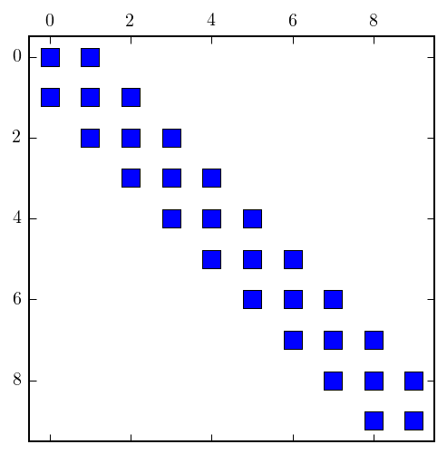
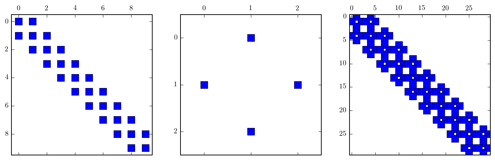
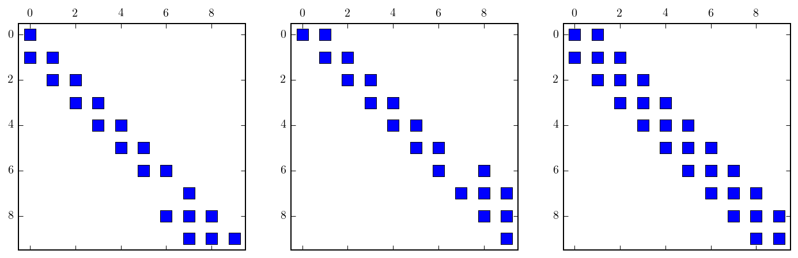
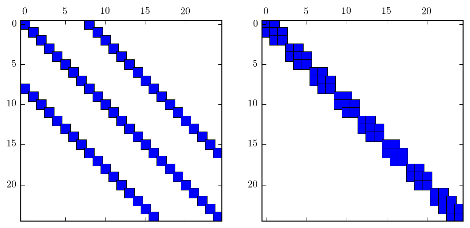
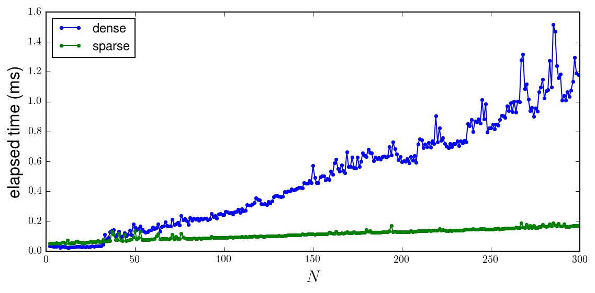
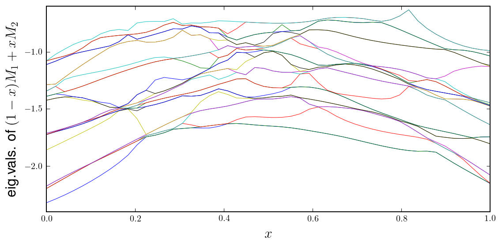
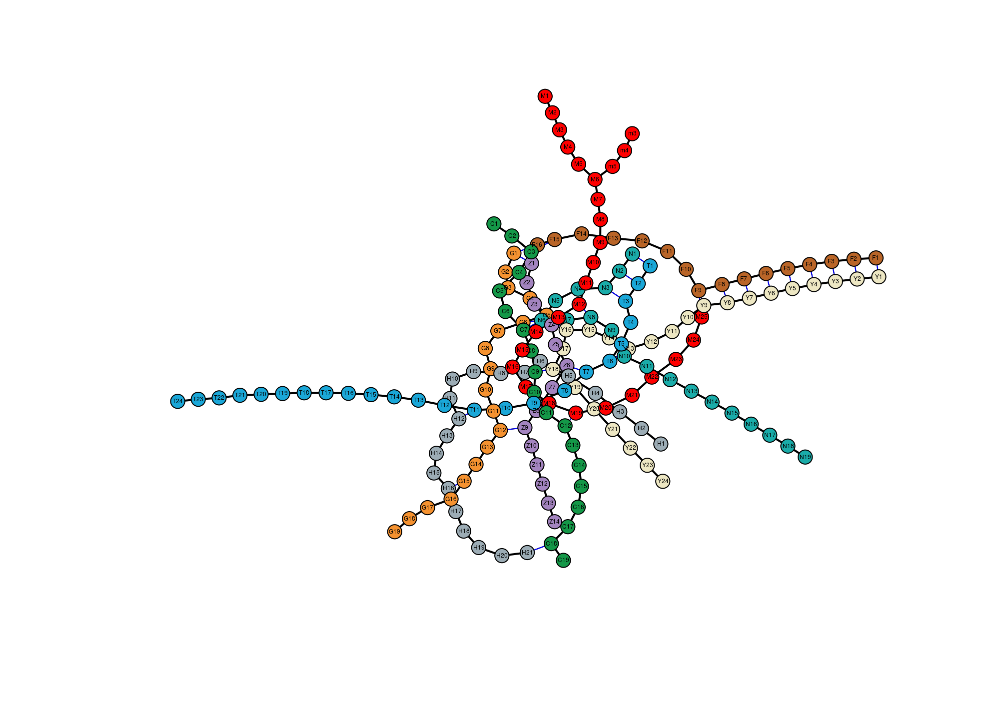
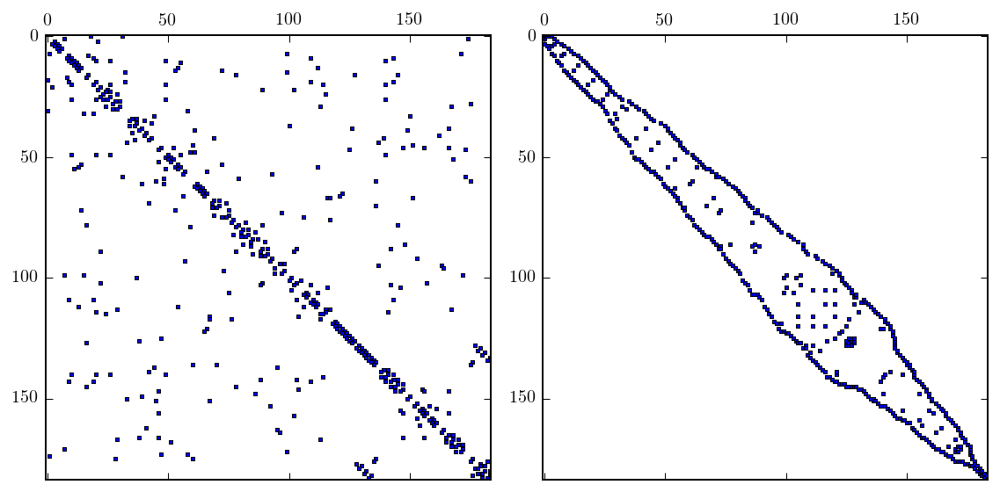

# Chapter 10: Sparse matrices and graphs
<!-- toc orderedList:0 depthFrom:1 depthTo:6 -->

* [Chapter 10: Sparse matrices and graphs](#chapter-10-sparse-matrices-and-graphs)
  * [Coordinate list format](#coordinate-list-format)
  * [CSR](#csr)
  * [Functions for constructing sparse matrices](#functions-for-constructing-sparse-matrices)
  * [Sparse linear algebra](#sparse-linear-algebra)
    * [An example of a matrix reording method: Reverse Cuthil McKee](#an-example-of-a-matrix-reording-method-reverse-cuthil-mckee)
    * [Performance comparison sparse/dense](#performance-comparison-sparsedense)
    * [Eigenvalue problems](#eigenvalue-problems)
      * [Random matrix example](#random-matrix-example)
  * [Graphs](#graphs)
  * [Versions](#versions)

<!-- tocstop -->


---

Robert Johansson

Source code listings for [Numerical Python - A Practical Techniques Approach for Industry](http://www.apress.com/9781484205549) (ISBN 978-1-484205-54-9).

The source code listings can be downloaded from http://www.apress.com/9781484205549


```python
%matplotlib inline
%config InlineBackend.figure_format='retina'
```


```python
import matplotlib.pyplot as plt
import matplotlib as mpl
mpl.rcParams['text.usetex'] = True
```


```python
import scipy.sparse as sp
```


```python
import scipy.sparse.linalg
```


```python
import numpy as np
```


```python
import scipy.linalg as la
```


```python
import networkx as nx
```

## Coordinate list format


```python
values = [1, 2, 3, 4]
```


```python
rows = [0, 1, 2, 3]
```


```python
cols = [1, 3, 2, 0]
```


```python
A = sp.coo_matrix((values, (rows, cols)), shape=[4, 4])
```


```python
A.todense()
```


    matrix([[0, 1, 0, 0],
            [0, 0, 0, 2],
            [0, 0, 3, 0],
            [4, 0, 0, 0]])


```python
A
```


    <4x4 sparse matrix of type '<type 'numpy.int64'>'
    	with 4 stored elements in COOrdinate format>


```python
A.shape, A.size, A.dtype, A.ndim
```


    ((4, 4), 4, dtype('int64'), 2)


```python
A.nnz, A.data
```


    (4, array([1, 2, 3, 4]))


```python
A.row
```


    array([0, 1, 2, 3], dtype=int32)


```python
A.col
```


    array([1, 3, 2, 0], dtype=int32)


```python
A.tocsr()
```


    <4x4 sparse matrix of type '<type 'numpy.int64'>'
    	with 4 stored elements in Compressed Sparse Row format>


```python
A.toarray()
```


    array([[0, 1, 0, 0],
           [0, 0, 0, 2],
           [0, 0, 3, 0],
           [4, 0, 0, 0]])


```python
A.todense()
```


    matrix([[0, 1, 0, 0],
            [0, 0, 0, 2],
            [0, 0, 3, 0],
            [4, 0, 0, 0]])


Not all sparse matrix formats supports indexing:


```python
A[1,2]
```


    ---------------------------------------------------------------------------

    TypeError                                 Traceback (most recent call last)

    <ipython-input-21-13df355f18af> in <module>()
    ----> 1 A[1,2]


    TypeError: 'coo_matrix' object has no attribute '__getitem__'


```python
A.tobsr()[1,2]
```


    ---------------------------------------------------------------------------

    NotImplementedError                       Traceback (most recent call last)

    <ipython-input-22-7f4c44f6556f> in <module>()
    ----> 1 A.tobsr()[1,2]


    /Users/rob/miniconda/envs/py27-npm/lib/python2.7/site-packages/scipy/sparse/bsr.pyc in __getitem__(self, key)
        297
        298     def __getitem__(self,key):
    --> 299         raise NotImplementedError
        300
        301     def __setitem__(self,key,val):


    NotImplementedError:


But some do:


```python
A.tocsr()[1,2]
```


    0


```python
A.tolil()[1:3,3]
```


    <2x1 sparse matrix of type '<type 'numpy.int64'>'
    	with 1 stored elements in LInked List format>


## CSR


```python
A = np.array([[1, 2, 0, 0], [0, 3, 4, 0], [0, 0, 5, 6], [7, 0, 8, 9]]); A
```


    array([[1, 2, 0, 0],
           [0, 3, 4, 0],
           [0, 0, 5, 6],
           [7, 0, 8, 9]])


```python
A = sp.csr_matrix(A)
```


```python
A.data
```


    array([1, 2, 3, 4, 5, 6, 7, 8, 9])


```python
A.indices
```


    array([0, 1, 1, 2, 2, 3, 0, 2, 3], dtype=int32)


```python
A.indptr
```


    array([0, 2, 4, 6, 9], dtype=int32)


```python
i = 2
```


```python
A.indptr[i], A.indptr[i+1]-1
```


    (4, 5)


```python
A.indices[A.indptr[i]:A.indptr[i+1]]
```


    array([2, 3], dtype=int32)


```python
A.data[A.indptr[i]:A.indptr[i+1]]
```


    array([5, 6])


## Functions for constructing sparse matrices


```python
N = 10
```


```python
A = -2 * sp.eye(N) + sp.eye(N, k=1) + sp.eye(N, k=-1)
```


```python
A
```


    <10x10 sparse matrix of type '<type 'numpy.float64'>'
    	with 28 stored elements in Compressed Sparse Row format>


```python
A.todense()
```


    matrix([[-2.,  1.,  0.,  0.,  0.,  0.,  0.,  0.,  0.,  0.],
            [ 1., -2.,  1.,  0.,  0.,  0.,  0.,  0.,  0.,  0.],
            [ 0.,  1., -2.,  1.,  0.,  0.,  0.,  0.,  0.,  0.],
            [ 0.,  0.,  1., -2.,  1.,  0.,  0.,  0.,  0.,  0.],
            [ 0.,  0.,  0.,  1., -2.,  1.,  0.,  0.,  0.,  0.],
            [ 0.,  0.,  0.,  0.,  1., -2.,  1.,  0.,  0.,  0.],
            [ 0.,  0.,  0.,  0.,  0.,  1., -2.,  1.,  0.,  0.],
            [ 0.,  0.,  0.,  0.,  0.,  0.,  1., -2.,  1.,  0.],
            [ 0.,  0.,  0.,  0.,  0.,  0.,  0.,  1., -2.,  1.],
            [ 0.,  0.,  0.,  0.,  0.,  0.,  0.,  0.,  1., -2.]])


```python
fig, ax = plt.subplots()
ax.spy(A)
fig.savefig("ch10-sparse-matrix-1.pdf");
```





```python
A = sp.diags([1,-2,1], [1,0,-1], shape=[N, N], format='csc')
```


```python
A
```


    <10x10 sparse matrix of type '<type 'numpy.float64'>'
    	with 28 stored elements in Compressed Sparse Column format>


```python
fig, ax = plt.subplots()
ax.spy(A);
```


```python
B = sp.diags([1, 1], [-1, 1], shape=[3,3])
```


```python
B
```


    <3x3 sparse matrix of type '<type 'numpy.float64'>'
    	with 4 stored elements (2 diagonals) in DIAgonal format>


```python
C = sp.kron(A, B, format='csr')
C
```


    <30x30 sparse matrix of type '<type 'numpy.float64'>'
    	with 112 stored elements in Compressed Sparse Row format>


```python
fig, (ax_A, ax_B, ax_C) = plt.subplots(1, 3, figsize=(12, 4))
ax_A.spy(A)
ax_B.spy(B)
ax_C.spy(C)
fig.savefig("ch10-sparse-matrix-2.pdf");
```





## Sparse linear algebra


```python
N = 10
```


```python
A = sp.diags([1, -2, 1], [1, 0, -1], shape=[N, N], format='csc')
```


```python
b = -np.ones(N)
```


```python
x = sp.linalg.spsolve(A, b)
```


```python
x
```


    array([  5.,   9.,  12.,  14.,  15.,  15.,  14.,  12.,   9.,   5.])


```python
np.linalg.solve(A.todense(), b)
```


    array([  5.,   9.,  12.,  14.,  15.,  15.,  14.,  12.,   9.,   5.])


```python
lu = sp.linalg.splu(A)
```


```python
lu.L
```


    <10x10 sparse matrix of type '<type 'numpy.float64'>'
    	with 20 stored elements in Compressed Sparse Column format>


```python
lu.perm_r
```


    array([0, 1, 2, 3, 4, 5, 6, 8, 7, 9], dtype=int32)


```python
lu.U
```


    <10x10 sparse matrix of type '<type 'numpy.float64'>'
    	with 20 stored elements in Compressed Sparse Column format>


```python
lu.perm_c
```


    array([0, 1, 2, 3, 4, 5, 6, 8, 7, 9], dtype=int32)


```python
def sp_permute(A, perm_r, perm_c):
    """ permute rows and columns of A """
    M, N = A.shape
    # row permumation matrix
    Pr = sp.coo_matrix((np.ones(M), (perm_r, np.arange(N)))).tocsr()
    # column permutation matrix
    Pc = sp.coo_matrix((np.ones(M), (np.arange(M), perm_c))).tocsr()
    return Pr.T * A * Pc.T
```


```python
lu.L * lu.U - A
```


    <10x10 sparse matrix of type '<type 'numpy.float64'>'
    	with 8 stored elements in Compressed Sparse Column format>


```python
sp_permute(lu.L * lu.U, lu.perm_r, lu.perm_c) - A
```


    <10x10 sparse matrix of type '<type 'numpy.float64'>'
    	with 0 stored elements in Compressed Sparse Column format>


```python
fig, (ax1, ax2, ax3) = plt.subplots(1, 3, figsize=(12, 4))
ax1.spy(lu.L)
ax2.spy(lu.U)
ax3.spy(A)
```


    <matplotlib.lines.Line2D at 0x10985a810>





```python
x = lu.solve(b)
```


```python
x
```


    array([  5.,   9.,  12.,  14.,  15.,  15.,  14.,  12.,   9.,   5.])


```python
# use_umfpack=True is only effective if scikit-umfpack is installed
# (in which case UMFPACK is the default solver)
x = sp.linalg.spsolve(A, b, use_umfpack=True)
```


```python
x
```


    array([  5.,   9.,  12.,  14.,  15.,  15.,  14.,  12.,   9.,   5.])


```python
x, info = sp.linalg.cg(A, b)
```


```python
x
```


    array([  5.,   9.,  12.,  14.,  15.,  15.,  14.,  12.,   9.,   5.])


```python
x, info = sp.linalg.bicgstab(A, b)
```


```python
x
```


    array([  5.,   9.,  12.,  14.,  15.,  15.,  14.,  12.,   9.,   5.])


```python
x, info = sp.linalg.lgmres(A, b)
```


```python
x
```


    array([  5.,   9.,  12.,  14.,  15.,  15.,  14.,  12.,   9.,   5.])


```python
N = 25
```


```python
A = sp.diags([1, -2, 1], [8, 0, -8], shape=[N, N], format='csc')
```

### An example of a matrix reording method: Reverse Cuthil McKee


```python
perm = sp.csgraph.reverse_cuthill_mckee(A)
perm
```


    array([ 7, 15, 23,  1,  9, 17,  2, 10, 18,  3, 11, 19,  4, 12, 20,  5, 13,
           21,  6, 14, 22, 24, 16,  8,  0], dtype=int32)


```python
fig, (ax1, ax2) = plt.subplots(1, 2, figsize=(8, 4))
ax1.spy(A)
ax2.spy(sp_permute(A, perm, perm))
```


    <matplotlib.lines.Line2D at 0x105c2cf10>





### Performance comparison sparse/dense


```python
# compare performance of solving Ax=b vs system size N,
# where A is the sparse matrix for the 1d poisson problem
import time

def setup(N):
    A = sp.diags([1,-2,1], [1,0,-1], shape=[N, N], format='csr')
    b = -np.ones(N)
    return A, A.todense(), b

reps = 10
N_vec = np.arange(2, 300, 1)
t_sparse = np.empty(len(N_vec))
t_dense = np.empty(len(N_vec))
for idx, N in enumerate(N_vec):
    A, A_dense, b = setup(N)
    t = time.time()
    for r in range(reps):
        x = np.linalg.solve(A_dense, b)
    t_dense[idx] = (time.time() - t)/reps
    t = time.time()
    for r in range(reps):
        #x = la.solve(A_dense, b)
        x = sp.linalg.spsolve(A, b, use_umfpack=True)
    t_sparse[idx] = (time.time() - t)/reps

fig, ax = plt.subplots(figsize=(8, 4))
ax.plot(N_vec, t_dense * 1e3, '.-', label="dense")
ax.plot(N_vec, t_sparse * 1e3, '.-', label="sparse")
ax.set_xlabel(r"$N$", fontsize=16)
ax.set_ylabel("elapsed time (ms)", fontsize=16)
ax.legend(loc=0)
fig.tight_layout()
fig.savefig("ch10-sparse-vs-dense.pdf")
```





### Eigenvalue problems


```python
N = 10
```


```python
A = sp.diags([1, -2, 1], [1, 0, -1], shape=[N, N], format='csc')
```


```python
evals, evecs = sp.linalg.eigs(A, k=4, which='LM')
```


```python
evals
```


    array([-3.91898595+0.j, -3.68250707+0.j, -3.30972147+0.j, -2.83083003+0.j])


```python
np.allclose(A.dot(evecs[:,0]), evals[0] * evecs[:,0])
```


    True


```python
evals, evecs = sp.linalg.eigsh(A, k=4, which='LM')
```


```python
evals
```


    array([-3.91898595, -3.68250707, -3.30972147, -2.83083003])


```python
evals, evecs = sp.linalg.eigs(A, k=4, which='SR')
```


```python
evals
```


    array([-3.91898595+0.j, -3.68250707+0.j, -3.30972147+0.j, -2.83083003+0.j])


```python
np.real(evals).argsort()
```


    array([0, 1, 2, 3])


```python
def sp_eigs_sorted(A, k=6, which='SR'):
    """ compute and return eigenvalues sorted by real value """
    evals, evecs = sp.linalg.eigs(A, k=k, which=which)
    idx = np.real(evals).argsort()
    return evals[idx], evecs[idx]
```


```python
evals, evecs = sp_eigs_sorted(A, k=4, which='SM')
```


```python
evals
```


    array([-1.16916997+0.j, -0.69027853+0.j, -0.31749293+0.j, -0.08101405+0.j])


#### Random matrix example


```python
N = 100
```


```python
x_vec = np.linspace(0, 1, 50)
```


```python
# seed sp.rand with random_state to obtain a reproducible result
M1 = sp.rand(N, N, density=0.2, random_state=112312321)
M2 = sp.rand(N, N, density=0.2, random_state=984592134)
```


```python
evals = np.array([sp_eigs_sorted((1-x)*M1 + x*M2, k=25)[0] for x in x_vec])
```


```python
fig, ax = plt.subplots(figsize=(8, 4))

for idx in range(evals.shape[1]):
    ax.plot(x_vec, np.real(evals[:,idx]), lw=0.5)

ax.set_xlabel(r"$x$", fontsize=16)
ax.set_ylabel(r"eig.vals. of $(1-x)M_1+xM_2$", fontsize=16)

fig.tight_layout()
fig.savefig("ch10-sparse-eigs.pdf")
```





## Graphs


```python
g = nx.MultiGraph()
```


```python
g.add_node(1)
```


```python
g.nodes()
```


    [1]


```python
g.add_nodes_from([3, 4, 5])
```


```python
g.nodes()
```


    [1, 3, 4, 5]


```python
g.add_edge(1, 2)
```


```python
g.edges()
```


    [(1, 2)]


```python
g.add_edges_from([(3, 4), (5, 6)])
```


```python
g.edges()
```


    [(1, 2), (3, 4), (5, 6)]


```python
g.add_weighted_edges_from([(1, 3, 1.5), (3, 5, 2.5)])
```


```python
g.edges(data=True)
```


    [(1, 2, {}),
     (1, 3, {'weight': 1.5}),
     (3, 4, {}),
     (3, 5, {'weight': 2.5}),
     (5, 6, {})]


```python
g.add_weighted_edges_from([(6, 7, 1.5)])
```


```python
g.nodes()
```


    [1, 2, 3, 4, 5, 6, 7]


```python
g.edges()
```


    [(1, 2), (1, 3), (3, 4), (3, 5), (5, 6), (6, 7)]


```python
import numpy as np
```


```python
import json
```


```python
with open("tokyo-metro.json") as f:
    data = json.load(f)
```


```python
data.keys()
```


    [u'C', u'G', u'F', u'H', u'M', u'N', u'T', u'Y', u'Z']


```python
data["C"]
```


    {u'color': u'#149848',
     u'transfers': [[u'C3', u'F15'],
      [u'C4', u'Z2'],
      [u'C4', u'G2'],
      [u'C7', u'M14'],
      [u'C7', u'N6'],
      [u'C7', u'G6'],
      [u'C8', u'M15'],
      [u'C8', u'H6'],
      [u'C9', u'H7'],
      [u'C9', u'Y18'],
      [u'C11', u'T9'],
      [u'C11', u'M18'],
      [u'C11', u'Z8'],
      [u'C12', u'M19'],
      [u'C18', u'H21']],
     u'travel_times': [[u'C1', u'C2', 2],
      [u'C2', u'C3', 2],
      [u'C3', u'C4', 1],
      [u'C4', u'C5', 2],
      [u'C5', u'C6', 2],
      [u'C6', u'C7', 2],
      [u'C7', u'C8', 1],
      [u'C8', u'C9', 3],
      [u'C9', u'C10', 1],
      [u'C10', u'C11', 2],
      [u'C11', u'C12', 2],
      [u'C12', u'C13', 2],
      [u'C13', u'C14', 2],
      [u'C14', u'C15', 2],
      [u'C15', u'C16', 2],
      [u'C16', u'C17', 3],
      [u'C17', u'C18', 3],
      [u'C18', u'C19', 3]]}


```python
data
```


    {u'C': {u'color': u'#149848',
      u'transfers': [[u'C3', u'F15'],
       [u'C4', u'Z2'],
       [u'C4', u'G2'],
       [u'C7', u'M14'],
       [u'C7', u'N6'],
       [u'C7', u'G6'],
       [u'C8', u'M15'],
       [u'C8', u'H6'],
       [u'C9', u'H7'],
       [u'C9', u'Y18'],
       [u'C11', u'T9'],
       [u'C11', u'M18'],
       [u'C11', u'Z8'],
       [u'C12', u'M19'],
       [u'C18', u'H21']],
      u'travel_times': [[u'C1', u'C2', 2],
       [u'C2', u'C3', 2],
       [u'C3', u'C4', 1],
       [u'C4', u'C5', 2],
       [u'C5', u'C6', 2],
       [u'C6', u'C7', 2],
       [u'C7', u'C8', 1],
       [u'C8', u'C9', 3],
       [u'C9', u'C10', 1],
       [u'C10', u'C11', 2],
       [u'C11', u'C12', 2],
       [u'C12', u'C13', 2],
       [u'C13', u'C14', 2],
       [u'C14', u'C15', 2],
       [u'C15', u'C16', 2],
       [u'C16', u'C17', 3],
       [u'C17', u'C18', 3],
       [u'C18', u'C19', 3]]},
     u'F': {u'color': u'#b96528',
      u'transfers': [[u'F1', u'Y1'],
       [u'F2', u'Y2'],
       [u'F3', u'Y3'],
       [u'F4', u'Y4'],
       [u'F5', u'Y5'],
       [u'F6', u'Y6'],
       [u'F7', u'Y7'],
       [u'F8', u'Y8'],
       [u'F9', u'Y9'],
       [u'F9', u'M25'],
       [u'F13', u'M9'],
       [u'F15', u'C3'],
       [u'F16', u'Z1'],
       [u'F16', u'G1']],
      u'travel_times': [[u'F1', u'F2', 3],
       [u'F2', u'F3', 2],
       [u'F3', u'F4', 3],
       [u'F4', u'F5', 2],
       [u'F5', u'F6', 2],
       [u'F6', u'F7', 2],
       [u'F7', u'F8', 2],
       [u'F8', u'F9', 2],
       [u'F9', u'F10', 3],
       [u'F10', u'F11', 2],
       [u'F11', u'F12', 2],
       [u'F12', u'F13', 2],
       [u'F13', u'F14', 3],
       [u'F14', u'F15', 2],
       [u'F15', u'F16', 2]]},
     u'G': {u'color': u'#f59230',
      u'transfers': [[u'G1', u'Z1'],
       [u'G1', u'F16'],
       [u'G2', u'Z2'],
       [u'G2', u'C4'],
       [u'G4', u'Z3'],
       [u'G5', u'M13'],
       [u'G5', u'Y16'],
       [u'G5', u'Z4'],
       [u'G5', u'N7'],
       [u'G6', u'N6'],
       [u'G6', u'M14'],
       [u'G6', u'C7'],
       [u'G9', u'M16'],
       [u'G9', u'H8'],
       [u'G11', u'T10'],
       [u'G12', u'Z9'],
       [u'G15', u'H16'],
       [u'G16', u'H17']],
      u'travel_times': [[u'G1', u'G2', 2],
       [u'G2', u'G3', 1],
       [u'G3', u'G4', 2],
       [u'G4', u'G5', 2],
       [u'G5', u'G6', 2],
       [u'G6', u'G7', 2],
       [u'G7', u'G8', 2],
       [u'G8', u'G9', 2],
       [u'G9', u'G10', 1],
       [u'G10', u'G11', 2],
       [u'G11', u'G12', 2],
       [u'G12', u'G13', 1],
       [u'G13', u'G14', 2],
       [u'G14', u'G15', 2],
       [u'G15', u'G16', 1],
       [u'G16', u'G17', 2],
       [u'G17', u'G18', 1],
       [u'G18', u'G19', 2]]},
     u'H': {u'color': u'#9cacb5',
      u'transfers': [[u'H6', u'M15'],
       [u'H6', u'C8'],
       [u'H7', u'Y18'],
       [u'H7', u'C9'],
       [u'H8', u'M16'],
       [u'H8', u'G9'],
       [u'H12', u'T11'],
       [u'H16', u'G15'],
       [u'H17', u'G16'],
       [u'H21', u'C18']],
      u'travel_times': [[u'H1', u'H2', 3],
       [u'H2', u'H3', 3],
       [u'H3', u'H4', 3],
       [u'H4', u'H5', 3],
       [u'H5', u'H6', 2],
       [u'H6', u'H7', 3],
       [u'H7', u'H8', 1],
       [u'H8', u'H9', 2],
       [u'H9', u'H10', 2],
       [u'H10', u'H11', 2],
       [u'H11', u'H12', 1],
       [u'H12', u'H13', 3],
       [u'H13', u'H14', 1],
       [u'H14', u'H15', 2],
       [u'H15', u'H16', 2],
       [u'H16', u'H17', 1],
       [u'H17', u'H18', 2],
       [u'H18', u'H19', 2],
       [u'H19', u'H20', 2],
       [u'H20', u'H21', 3]]},
     u'M': {u'color': u'#ff0000',
      u'transfers': [[u'M9', u'F13'],
       [u'M12', u'N8'],
       [u'M13', u'G5'],
       [u'M13', u'Y16'],
       [u'M13', u'Z4'],
       [u'M13', u'N7'],
       [u'M14', u'C7'],
       [u'M14', u'G6'],
       [u'M14', u'N6'],
       [u'M15', u'H6'],
       [u'M15', u'C8'],
       [u'M16', u'G9'],
       [u'M16', u'H8'],
       [u'M18', u'T9'],
       [u'M18', u'C11'],
       [u'M18', u'Z8'],
       [u'M19', u'C12'],
       [u'M22', u'N11'],
       [u'M25', u'Y9'],
       [u'M25', u'F9']],
      u'travel_times': [[u'M1', u'M2', 2],
       [u'M2', u'M3', 2],
       [u'M3', u'M4', 2],
       [u'M4', u'M5', 2],
       [u'M5', u'M6', 2],
       [u'M6', u'M7', 2],
       [u'M7', u'M8', 2],
       [u'M8', u'M9', 2],
       [u'M9', u'M10', 1],
       [u'M10', u'M11', 2],
       [u'M11', u'M12', 2],
       [u'M12', u'M13', 3],
       [u'M13', u'M14', 2],
       [u'M14', u'M15', 1],
       [u'M15', u'M16', 3],
       [u'M16', u'M17', 2],
       [u'M17', u'M18', 2],
       [u'M18', u'M19', 2],
       [u'M19', u'M20', 1],
       [u'M20', u'M21', 2],
       [u'M21', u'M22', 2],
       [u'M22', u'M23', 3],
       [u'M23', u'M24', 2],
       [u'M24', u'M25', 3],
       [u'm3', u'm4', 2],
       [u'm4', u'm5', 2],
       [u'm5', u'M6', 2]]},
     u'N': {u'color': u'#1aaca9',
      u'transfers': [[u'N1', u'T1'],
       [u'N2', u'T2'],
       [u'N3', u'T3'],
       [u'N6', u'G6'],
       [u'N6', u'M14'],
       [u'N6', u'C7'],
       [u'N7', u'Y16'],
       [u'N7', u'Z4'],
       [u'N7', u'G5'],
       [u'N7', u'M13'],
       [u'N8', u'M12'],
       [u'N9', u'Y14'],
       [u'N10', u'Y13'],
       [u'N10', u'T6'],
       [u'N11', u'M22']],
      u'travel_times': [[u'N1', u'N2', 2],
       [u'N2', u'N3', 2],
       [u'N3', u'N4', 2],
       [u'N4', u'N5', 2],
       [u'N5', u'N6', 2],
       [u'N6', u'N7', 2],
       [u'N7', u'N8', 2],
       [u'N8', u'N9', 2],
       [u'N9', u'N10', 2],
       [u'N10', u'N11', 2],
       [u'N11', u'N12', 3],
       [u'N12', u'N13', 2],
       [u'N13', u'N14', 2],
       [u'N14', u'N15', 3],
       [u'N15', u'N16', 1],
       [u'N16', u'N17', 3],
       [u'N17', u'N18', 2],
       [u'N18', u'N19', 2]]},
     u'T': {u'color': u'#1aa7d8',
      u'transfers': [[u'T6', u'N10'],
       [u'T6', u'Y13'],
       [u'T7', u'Z6'],
       [u'T9', u'M18'],
       [u'T9', u'C11'],
       [u'T9', u'Z8'],
       [u'T10', u'G11'],
       [u'T11', u'H12']],
      u'travel_times': [[u'T1', u'T2', 0],
       [u'T2', u'T3', 3],
       [u'T3', u'T4', 6],
       [u'T4', u'T5', 9],
       [u'T5', u'T6', 11],
       [u'T6', u'T7', 13],
       [u'T7', u'T8', 14],
       [u'T8', u'T9', 16],
       [u'T9', u'T10', 18],
       [u'T10', u'T11', 20],
       [u'T11', u'T12', 21],
       [u'T12', u'T13', 24],
       [u'T13', u'T14', 26],
       [u'T14', u'T15', 27],
       [u'T15', u'T16', 30],
       [u'T16', u'T17', 33],
       [u'T17', u'T18', 35],
       [u'T18', u'T19', 37],
       [u'T19', u'T20', 39],
       [u'T20', u'T21', 41],
       [u'T21', u'T22', 43],
       [u'T22', u'T23', 46],
       [u'T23', u'T24', 49]]},
     u'Y': {u'color': u'#ede7c3',
      u'transfers': [[u'Y1', u'F1'],
       [u'Y2', u'F2'],
       [u'Y3', u'F3'],
       [u'Y4', u'F4'],
       [u'Y5', u'F5'],
       [u'Y6', u'F6'],
       [u'Y7', u'F7'],
       [u'Y8', u'F8'],
       [u'Y9', u'F9'],
       [u'Y9', u'M25'],
       [u'Y13', u'T6'],
       [u'Y13', u'N10'],
       [u'Y14', u'N9'],
       [u'Y16', u'Z4'],
       [u'Y16', u'N7'],
       [u'Y16', u'G5'],
       [u'Y16', u'M13'],
       [u'Y18', u'H7'],
       [u'Y18', u'C9']],
      u'travel_times': [[u'Y1', u'Y2', 4],
       [u'Y2', u'Y3', 2],
       [u'Y3', u'Y4', 3],
       [u'Y4', u'Y5', 2],
       [u'Y5', u'Y6', 2],
       [u'Y6', u'Y7', 2],
       [u'Y7', u'Y8', 2],
       [u'Y8', u'Y9', 3],
       [u'Y9', u'Y10', 2],
       [u'Y10', u'Y11', 2],
       [u'Y11', u'Y12', 2],
       [u'Y12', u'Y13', 3],
       [u'Y13', u'Y14', 2],
       [u'Y14', u'Y15', 2],
       [u'Y15', u'Y16', 1],
       [u'Y16', u'Y17', 2],
       [u'Y17', u'Y18', 2],
       [u'Y18', u'Y19', 2],
       [u'Y19', u'Y20', 2],
       [u'Y20', u'Y21', 2],
       [u'Y21', u'Y22', 2],
       [u'Y22', u'Y23', 3],
       [u'Y23', u'Y24', 2]]},
     u'Z': {u'color': u'#a384bf',
      u'transfers': [[u'Z1', u'F16'],
       [u'Z1', u'G1'],
       [u'Z2', u'C4'],
       [u'Z2', u'G2'],
       [u'Z3', u'G4'],
       [u'Z4', u'Y16'],
       [u'Z4', u'N7'],
       [u'Z4', u'M13'],
       [u'Z4', u'G5'],
       [u'Z6', u'T7'],
       [u'Z8', u'M18'],
       [u'Z8', u'C11'],
       [u'Z8', u'T9'],
       [u'Z9', u'G12']],
      u'travel_times': [[u'Z1', u'Z2', 3],
       [u'Z2', u'Z3', 2],
       [u'Z3', u'Z4', 2],
       [u'Z4', u'Z5', 2],
       [u'Z5', u'Z6', 2],
       [u'Z6', u'Z7', 2],
       [u'Z7', u'Z8', 2],
       [u'Z8', u'Z9', 2],
       [u'Z9', u'Z10', 3],
       [u'Z10', u'Z11', 3],
       [u'Z11', u'Z12', 3],
       [u'Z12', u'Z13', 2],
       [u'Z13', u'Z14', 2]]}}


```python
g = nx.Graph()

for line in data.values():
    g.add_weighted_edges_from(line["travel_times"])
    g.add_edges_from(line["transfers"])
```


```python
for n1, n2 in g.edges_iter():
    g[n1][n2]["transfer"] = "weight" not in g[n1][n2]
```


```python
g.number_of_nodes()
```


    184


```python
g.nodes()[:5]
```


    [u'Z13', u'N1', u'Y20', u'Y21', u'Y22']


```python
g.number_of_edges()
```


    243


```python
g.edges()[:5]
```


    [(u'Z13', u'Z14'),
     (u'Z13', u'Z12'),
     (u'N1', u'N2'),
     (u'N1', u'T1'),
     (u'Y20', u'Y21')]


```python
on_foot = [edge for edge in g.edges_iter() if g.get_edge_data(*edge)["transfer"]]
```


```python
on_train = [edge for edge in g.edges_iter() if not g.get_edge_data(*edge)["transfer"]]
```


```python
colors = [data[n[0].upper()]["color"] for n in g.nodes()]
```


```python
fig, ax = plt.subplots(1, 1, figsize=(14, 10))

pos = nx.graphviz_layout(g, prog="neato")
nx.draw(g, pos, ax=ax, node_size=200, node_color=colors)
nx.draw_networkx_labels(g, pos=pos, ax=ax, font_size=6)
nx.draw_networkx_edges(g, pos=pos, ax=ax, edgelist=on_train, width=2)
nx.draw_networkx_edges(g, pos=pos, ax=ax, edgelist=on_foot, edge_color="blue")

# removing the default axis on all sides:
for side in ['bottom','right','top','left']:
    ax.spines[side].set_visible(False)

# removing the axis labels and ticks
ax.set_xticks([])
ax.set_yticks([])
ax.xaxis.set_ticks_position('none')
ax.yaxis.set_ticks_position('none')

fig.savefig("ch10-metro-graph.pdf")
fig.savefig("ch10-metro-graph.png")
fig.tight_layout()
```





```python
#g.degree()
```


```python
d_max = max(g.degree().values())
```


```python
[(n, d) for (n, d) in g.degree().items() if d == d_max]
```


    [(u'G5', 6), (u'Y16', 6), (u'Z4', 6), (u'N7', 6), (u'M13', 6)]


```python
p = nx.shortest_path(g, "Y24", "C19")
```


```python
np.array(p)
```


    array([u'Y24', u'Y23', u'Y22', u'Y21', u'Y20', u'Y19', u'Y18', u'C9',
           u'C10', u'C11', u'C12', u'C13', u'C14', u'C15', u'C16', u'C17',
           u'C18', u'C19'],
          dtype='<U3')


```python
np.sum([g[p[n]][p[n+1]]["weight"] for n in range(len(p)-1) if "weight" in g[p[n]][p[n+1]]])
```


    35


```python
h = g.copy()
```


```python
for n1, n2 in h.edges_iter():
    if "transfer" in h[n1][n2]:
        h[n1][n2]["weight"] = 5
```


```python
p = nx.shortest_path(h, "Y24", "C19")
```


```python
np.array(p)
```


    array([u'Y24', u'Y23', u'Y22', u'Y21', u'Y20', u'Y19', u'Y18', u'C9',
           u'C10', u'C11', u'C12', u'C13', u'C14', u'C15', u'C16', u'C17',
           u'C18', u'C19'],
          dtype='<U3')


```python
np.sum([h[p[n]][p[n+1]]["weight"] for n in range(len(p)-1)])
```


    85


```python
p = nx.shortest_path(h, "Z1", "H16")
```


```python
np.sum([h[p[n]][p[n+1]]["weight"] for n in range(len(p)-1)])
```


    65


```python
A = nx.to_scipy_sparse_matrix(g)
```


```python
A
```


    <184x184 sparse matrix of type '<type 'numpy.int64'>'
    	with 486 stored elements in Compressed Sparse Row format>


```python
perm = sp.csgraph.reverse_cuthill_mckee(A)
```


```python
fig, (ax1, ax2) = plt.subplots(1, 2, figsize=(8, 4))
ax1.spy(A, markersize=2)
ax2.spy(sp_permute(A, perm, perm), markersize=2)
fig.tight_layout()
fig.savefig("ch12-rcm-graph.pdf")
```





## Versions


```python
%reload_ext version_information
```


```python
%version_information numpy, scipy, matplotlib, networkx, pygraphviz
```


<table><tr><th>Software</th><th>Version</th></tr><tr><td>Python</td><td>2.7.10 64bit [GCC 4.2.1 (Apple Inc. build 5577)]</td></tr><tr><td>IPython</td><td>3.2.1</td></tr><tr><td>OS</td><td>Darwin 14.1.0 x86_64 i386 64bit</td></tr><tr><td>numpy</td><td>1.9.2</td></tr><tr><td>scipy</td><td>0.16.0</td></tr><tr><td>matplotlib</td><td>1.4.3</td></tr><tr><td>networkx</td><td>1.9.1</td></tr><tr><td>pygraphviz</td><td>1.2</td></tr></table>
