# Chapter 11: Partial differential equations
<!-- toc orderedList:0 depthFrom:1 depthTo:6 -->

* [Chapter 11: Partial differential equations](#chapter-11-partial-differential-equations)
  * [Finite-difference method](#finite-difference-method)
  * [1d example](#1d-example)
  * [2d example](#2d-example)
* [(u[m + N *(n-1)] - 2u[m + N* n] + u[m + N(n+1]))/dy^2](#um-n-n-1-2um-n-n-um-nn1dy2)
    * [Compare performance when using dense/sparse matrices](#compare-performance-when-using-densesparse-matrices)
    * [2d example with source term](#2d-example-with-source-term)
  * [FEniCS](#fenics)
    * [Function space from mesh](#function-space-from-mesh)
    * [Variational problem](#variational-problem)
    * [Boundary conditions](#boundary-conditions)
    * [Solve the problem](#solve-the-problem)
    * [Dolfin plot](#dolfin-plot)
    * [Save VTK files](#save-vtk-files)
    * [Function evaluation](#function-evaluation)
    * [Obtain NumPy arrays](#obtain-numpy-arrays)
    * [Triangulation](#triangulation)
  * [Dirichlet boundary conditions](#dirichlet-boundary-conditions)
  * [Circular geometry](#circular-geometry)
    * [Post processing](#post-processing)
  * [Mesh refining](#mesh-refining)
    * [Refined mesh with Dirichlet boundary conditions](#refined-mesh-with-dirichlet-boundary-conditions)
  * [Refined mesh with Dirichlet and von Neumann boundary conditions](#refined-mesh-with-dirichlet-and-von-neumann-boundary-conditions)
  * [Versions](#versions)

<!-- tocstop -->


---

Robert Johansson

Source code listings for [Numerical Python - A Practical Techniques Approach for Industry](http://www.apress.com/9781484205549) (ISBN 978-1-484205-54-9).

The source code listings can be downloaded from http://www.apress.com/9781484205549


```python
import numpy as np
```


```python
%matplotlib inline
%config InlineBackend.figure_format='retina'
import matplotlib.pyplot as plt
import matplotlib as mpl
```


```python
import mpl_toolkits.mplot3d
```


```python
import scipy.sparse as sp
```


```python
import scipy.sparse.linalg
```


```python
import scipy.linalg as la
```

## Finite-difference method

## 1d example

Heat equation:

$$-5 = u_{xx}, u(x=0) = 1, u(x=1) = 2$$

$$
u_{xx}[n] = (u[n-1] - 2u[n] + u[n+1])/dx^2
$$


```python
N = 5
```


```python
u0 = 1
u1 = 2
```


```python
dx = 1.0 / (N + 1)
```


```python
A = (np.eye(N, k=-1) - 2 * np.eye(N) + np.eye(N, k=1)) / dx**2
```


```python
A
```


    array([[-72.,  36.,   0.,   0.,   0.],
           [ 36., -72.,  36.,   0.,   0.],
           [  0.,  36., -72.,  36.,   0.],
           [  0.,   0.,  36., -72.,  36.],
           [  0.,   0.,   0.,  36., -72.]])


```python
d = -5 * np.ones(N)
d[0] -= u0 / dx**2
d[N-1] -= u1 / dx**2
```


```python
u = np.linalg.solve(A, d)
```


```python
x = np.linspace(0, 1, N+2)
```


```python
U = np.hstack([[u0], u, [u1]])
```


```python
fig, ax = plt.subplots(figsize=(8, 4))
ax.plot(x, U)
ax.plot(x[1:-1], u, 'ks')
ax.set_xlim(0, 1)
ax.set_xlabel(r"$x$", fontsize=18)
ax.set_ylabel(r"$u(x)$", fontsize=18)
fig.savefig("ch11-fdm-1d.pdf")
fig.tight_layout();
```


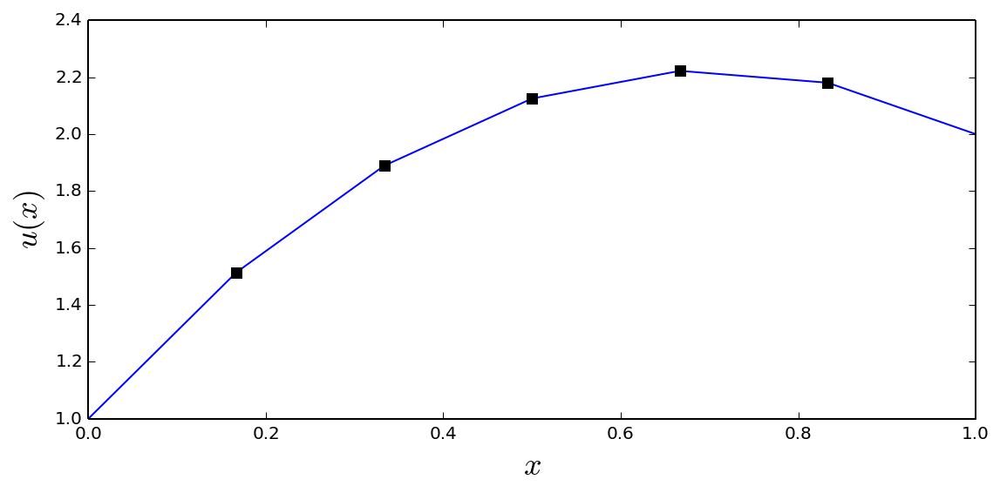


## 2d example

laplace equation: $u_{xx} + u_{yy} = 0$

on boundary:

$$
u(x=0) = u(x=1) = u(y = 0) = u(y = 1) = 10
$$

$$
u_{xx}[m, n] = (u[m-1, n] - 2u[m,n] + u[m+1,n])/dx^2
$$

$$
u_{yy}[m, n] = (u[m, n-1] - 2u[m,n] + u[m,n+1])/dy^2
$$

final equation

$$
0
=
(u[m-1 + N n] - 2u[m + N n] + u[m+1 + N n])/dx^2
+
(u[m + N *(n-1)] - 2u[m + N* n] + u[m + N(n+1]))/dy^2
=
(u[m + N n -1] - 2u[m + N n] + u[m + N n + 1])/dx^2
+
(u[m + N n -N)] - 2u[m + N n] + u[m + N n + N]))/dy^2
$$


```python
N = 100
```


```python
u0_t, u0_b = 5, -5
```


```python
u0_l, u0_r = 3, -1
```


```python
dx = 1. / (N+1)
```


```python
A_1d = (sp.eye(N, k=-1) + sp.eye(N, k=1) - 4 * sp.eye(N))/dx**2
```


```python
A = sp.kron(sp.eye(N), A_1d) + (sp.eye(N**2, k=-N) + sp.eye(N**2, k=N))/dx**2
```


```python
A
```


    <10000x10000 sparse matrix of type '<type 'numpy.float64'>'
    	with 49600 stored elements in Compressed Sparse Row format>


```python
A.nnz * 1.0/ np.prod(A.shape) * 2000
```


    0.992


```python
d = np.zeros((N, N))

d[0, :] += -u0_b
d[-1, :] += -u0_t
d[:, 0] += -u0_l
d[:, -1] += -u0_r

d = d.reshape(N**2) / dx**2
```


```python
u = sp.linalg.spsolve(A, d).reshape(N, N)
```


```python
U = np.vstack([np.ones((1, N+2)) * u0_b,
               np.hstack([np.ones((N, 1)) * u0_l, u, np.ones((N, 1)) * u0_r]),
               np.ones((1, N+2)) * u0_t])
```


```python
fig, ax = plt.subplots(1, 1, figsize=(8, 6))

x = np.linspace(0, 1, N+2)
X, Y = np.meshgrid(x, x)

c = ax.pcolor(X, Y, U, vmin=-5, vmax=5, cmap=mpl.cm.get_cmap('RdBu_r'))
cb = plt.colorbar(c, ax=ax)

ax.set_xlabel(r"$x_1$", fontsize=18)
ax.set_ylabel(r"$x_2$", fontsize=18)
cb.set_label(r"$u(x_1, x_2)$", fontsize=18)
fig.savefig("ch11-fdm-2d.pdf")
fig.tight_layout()
```


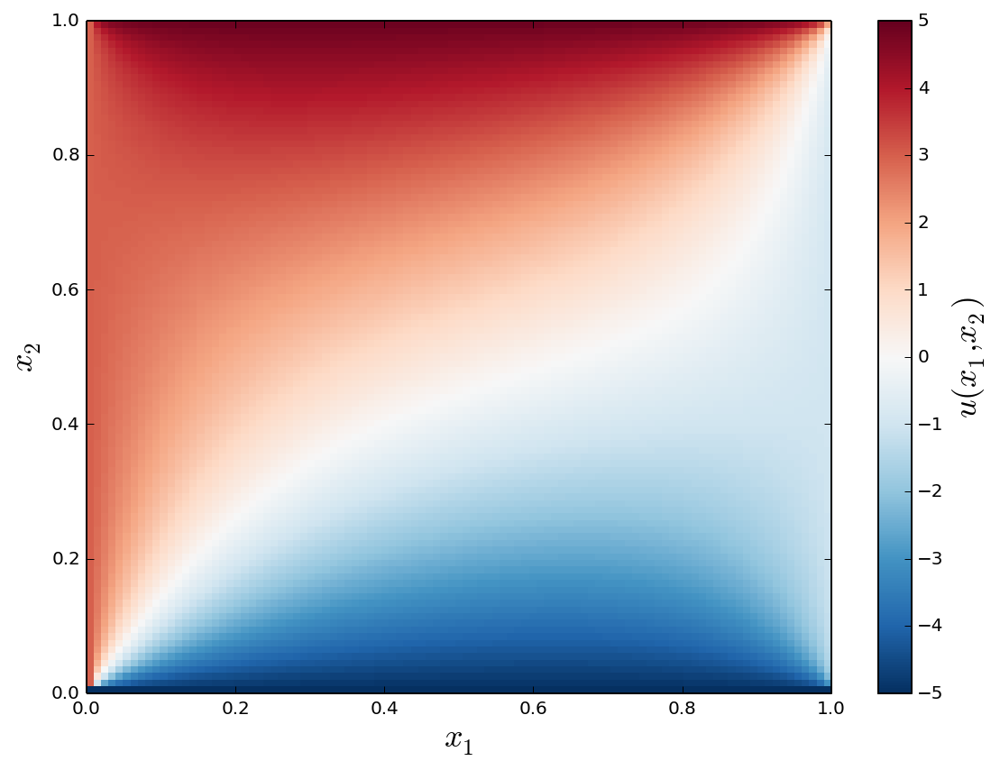


```python
x = np.linspace(0, 1, N+2)
X, Y = np.meshgrid(x, x)
```


```python
fig = plt.figure(figsize=(12, 5.5))
cmap = mpl.cm.get_cmap('RdBu_r')

ax = fig.add_subplot(1, 2, 1)
p = ax.pcolor(X, Y, U, vmin=-5, vmax=5, cmap=cmap)
ax.set_xlabel(r"$x_1$", fontsize=18)
ax.set_ylabel(r"$x_2$", fontsize=18)

ax = fig.add_subplot(1, 2, 2, projection='3d')
p = ax.plot_surface(X, Y, U, vmin=-5, vmax=5, rstride=3, cstride=3, linewidth=0, cmap=cmap)
ax.set_xlabel(r"$x_1$", fontsize=16)
ax.set_ylabel(r"$x_2$", fontsize=16)
cb = plt.colorbar(p, ax=ax, shrink=0.75)
cb.set_label(r"$u(x_1, x_2)$", fontsize=18)

fig.savefig("ch11-fdm-2d.pdf")
fig.savefig("ch11-fdm-2d.png")
fig.tight_layout()
```


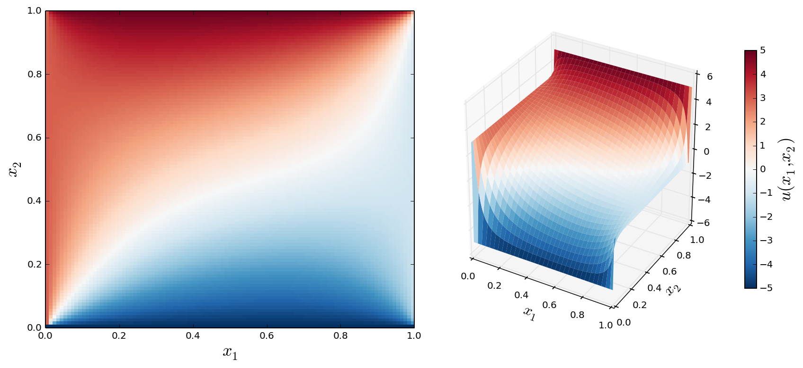


### Compare performance when using dense/sparse matrices


```python
A_dense = A.todense()
```


```python
%timeit np.linalg.solve(A_dense, d)
```

    1 loops, best of 3: 10.1 s per loop


```python
%timeit la.solve(A_dense, d)
```

    1 loops, best of 3: 12.2 s per loop


```python
%timeit sp.linalg.spsolve(A, d)
```

    10 loops, best of 3: 33.9 ms per loop


```python
10.8 / 31.9e-3
```


    338.5579937304076


### 2d example with source term


```python
d = - np.ones((N, N))
d = d.reshape(N**2)
```


```python
u = sp.linalg.spsolve(A, d).reshape(N, N)
```


```python
U = np.vstack([np.zeros((1, N+2)),
               np.hstack([np.zeros((N, 1)), u, np.zeros((N, 1))]),
               np.zeros((1, N+2))])
```


```python
x = np.linspace(0, 1, N+2)
X, Y = np.meshgrid(x, x)
```


```python
fig, ax = plt.subplots(1, 1, figsize=(8, 6), subplot_kw={'projection': '3d'})

p = ax.plot_surface(X, Y, U, rstride=4, cstride=4, linewidth=0, cmap=mpl.cm.get_cmap("Reds"))
cb = fig.colorbar(p, shrink=0.5)

ax.set_xlabel(r"$x_1$", fontsize=18)
ax.set_ylabel(r"$x_2$", fontsize=18)
cb.set_label(r"$u(x_1, x_2)$", fontsize=18)
```


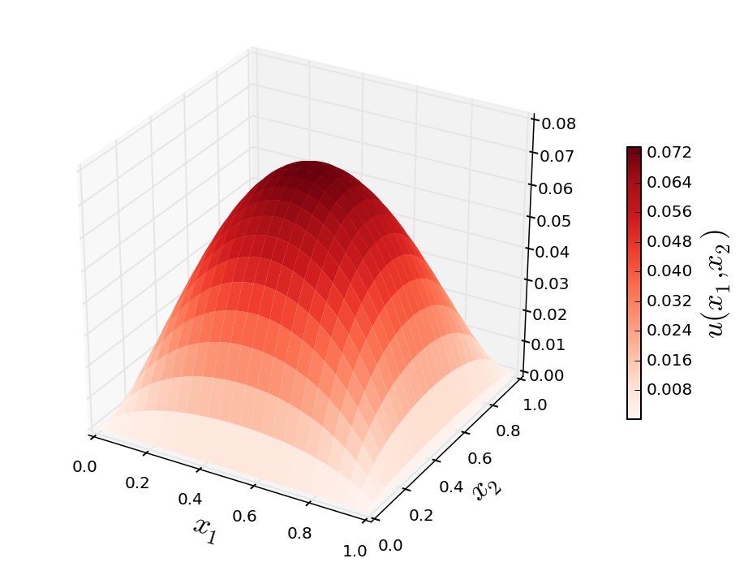


## FEniCS


```python
import dolfin
```


```python
import mshr
```


```python
dolfin.parameters["reorder_dofs_serial"] = False
dolfin.parameters["allow_extrapolation"] = True
```


```python
N1 = N2 = 75
```


```python
mesh = dolfin.RectangleMesh(0, 0, 1, 1, N1, N2)
```


```python
dolfin.RectangleMesh(0, 0, 1, 1, 10, 10)
```


### Function space from mesh


```python
V = dolfin.FunctionSpace(mesh, 'Lagrange', 1)
```

    DEBUG:FFC:Reusing form from cache.


### Variational problem


```python
u = dolfin.TrialFunction(V)
```


```python
v = dolfin.TestFunction(V)
```


```python
a = dolfin.inner(dolfin.nabla_grad(u), dolfin.nabla_grad(v)) * dolfin.dx
```


```python
f1 = dolfin.Constant(1.0)
```


```python
L1 = f1 * v * dolfin.dx
```


```python
f2 = dolfin.Expression("x[0]*x[0] + x[1]*x[1]")
```


```python
L2 = f2 * v * dolfin.dx
```

### Boundary conditions


```python
u0 = dolfin.Constant(0)
```


```python
def u0_boundary(x, on_boundary):
    # try to pin down the function at some interior region:
    #if np.sqrt((x[0]-0.5)**2 + (x[1]-0.5)**2) < 0.1:
    #    return True
    return on_boundary
```


```python
bc = dolfin.DirichletBC(V, u0, u0_boundary)
```

### Solve the problem


```python
A = dolfin.assemble(a)
```

    DEBUG:FFC:Reusing form from cache.


```python
b = dolfin.assemble(L1)
```

    DEBUG:FFC:Reusing form from cache.


```python
bc.apply(A, b)
```


```python
u_sol1 = dolfin.Function(V)
```


```python
dolfin.solve(A, u_sol1.vector(), b)
```


    1


```python
u_sol2 = dolfin.Function(V)
```


```python
dolfin.solve(a == L2, u_sol2, bc)
```

    DEBUG:FFC:Reusing form from cache.
    DEBUG:FFC:Reusing form from cache.


### Dolfin plot


```python
dolfin.plot(u_sol1)
dolfin.interactive()
```

### Save VTK files


```python
dolfin.File('u_sol1.pvd') << u_sol1
```


```python
dolfin.File('u_sol2.pvd') << u_sol2
```


```python
f = dolfin.File('combined.pvd')
f << mesh
f << u_sol1
f << u_sol2
```

### Function evaluation


```python
u_sol1([0.21, 0.67])
```


    0.0466076997781351


### Obtain NumPy arrays


```python
u_mat1 = u_sol1.vector().array().reshape(N1+1, N2+1)
```


```python
u_mat2 = u_sol2.vector().array().reshape(N1+1, N2+1)
```


```python
X, Y = np.meshgrid(np.linspace(0, 1, N1+2), np.linspace(0, 1, N2+2))
```


```python
fig, (ax1, ax2) = plt.subplots(1, 2, figsize=(12, 5))
cmap = mpl.cm.get_cmap('Reds')

c = ax1.pcolor(X, Y, u_mat1, cmap=cmap)
cb = plt.colorbar(c, ax=ax1)
ax1.set_xlabel(r"$x$", fontsize=18)
ax1.set_ylabel(r"$y$", fontsize=18)
cb.set_label(r"$u(x, y)$", fontsize=18)
cb.set_ticks([0.0, 0.02, 0.04, 0.06])

c = ax2.pcolor(X, Y, u_mat2, cmap=cmap)
cb = plt.colorbar(c, ax=ax2)
ax1.set_xlabel(r"$x$", fontsize=18)
ax1.set_ylabel(r"$y$", fontsize=18)
cb.set_label(r"$u(x, y)$", fontsize=18)
cb.set_ticks([0.0, 0.02, 0.04])

fig.savefig("ch11-fdm-2d-ex1.pdf")
fig.savefig("ch11-fdm-2d-ex1.png")
fig.tight_layout()
```


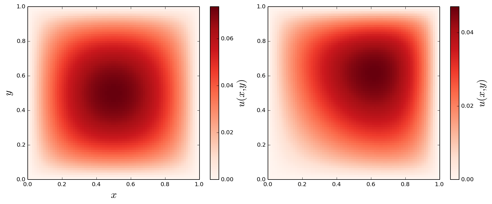


```python
X, Y = np.meshgrid(np.linspace(0, 1, N1+1), np.linspace(0, 1, N2+1))
```


```python
fig, (ax1, ax2) = plt.subplots(1, 2, figsize=(16, 6), subplot_kw={'projection': '3d'})

p = ax1.plot_surface(X, Y, u_mat1, rstride=4, cstride=4, linewidth=0, cmap=mpl.cm.get_cmap("Reds"))
cb = fig.colorbar(p, ax=ax1, shrink=0.5)
ax1.set_xlabel(r"$x_1$", fontsize=18)
ax1.set_ylabel(r"$x_2$", fontsize=18)
cb.set_label(r"$u(x_1, x_2)$", fontsize=18)

p = ax2.plot_surface(X, Y, u_mat2, rstride=4, cstride=4, linewidth=0, cmap=mpl.cm.get_cmap("Reds"))
cb = fig.colorbar(p, ax=ax2, shrink=0.5)
ax2.set_xlabel(r"$x_1$", fontsize=18)
ax2.set_ylabel(r"$x_2$", fontsize=18)
cb.set_label(r"$u(x_1, x_2)$", fontsize=18)
```


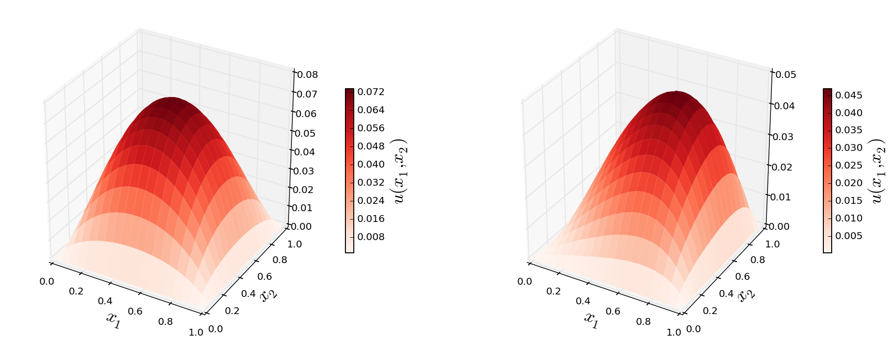


### Triangulation


```python
def mesh_triangulation(mesh):
    coordinates = mesh.coordinates()
    triangles = mesh.cells()
    triangulation = mpl.tri.Triangulation(coordinates[:, 0], coordinates[:, 1], triangles)
    return triangulation
```


```python
triangulation = mesh_triangulation(mesh)
```


```python
fig, (ax1, ax2) = plt.subplots(1, 2, figsize=(10, 4))

ax1.triplot(triangulation)
ax1.set_xlabel(r"$x$", fontsize=18)
ax1.set_ylabel(r"$y$", fontsize=18)

c = ax2.tripcolor(triangulation, u_sol2.vector().array(), cmap=cmap)
cb = plt.colorbar(c, ax=ax2)
ax2.set_xlabel(r"$x$", fontsize=18)
ax2.set_ylabel(r"$y$", fontsize=18)
cb.set_label(r"$u(x, y)$", fontsize=18)
cb.set_ticks([0.0, 0.02, 0.04])

fig.savefig("ch11-fdm-2d-ex2.pdf")
fig.savefig("ch11-fdm-2d-ex2.png")
fig.tight_layout()
```


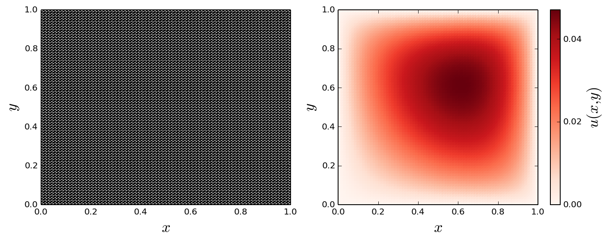


## Dirichlet boundary conditions


```python
N1 = N2 = 75
```


```python
mesh = dolfin.RectangleMesh(0, 0, 1, 1, N1, N2)
```


```python
V = dolfin.FunctionSpace(mesh, 'Lagrange', 1)
```

    DEBUG:FFC:Reusing form from cache.


```python
u = dolfin.TrialFunction(V)
```


```python
v = dolfin.TestFunction(V)
```


```python
a = dolfin.inner(dolfin.nabla_grad(u), dolfin.nabla_grad(v)) * dolfin.dx
```


```python
f = dolfin.Constant(0.0)
```


```python
L = f * v * dolfin.dx
```


```python
def u0_top_boundary(x, on_boundary):
    return on_boundary and abs(x[1]-1) < 1e-8
```


```python
def u0_bottom_boundary(x, on_boundary):
    return on_boundary and abs(x[1]) < 1e-8
```


```python
def u0_left_boundary(x, on_boundary):
    return on_boundary and abs(x[0]) < 1e-8
```


```python
def u0_right_boundary(x, on_boundary):
    return on_boundary and abs(x[0]-1) < 1e-8
```


```python
bc_t = dolfin.DirichletBC(V, dolfin.Constant(5), u0_top_boundary)
bc_b = dolfin.DirichletBC(V, dolfin.Constant(-5), u0_bottom_boundary)
bc_l = dolfin.DirichletBC(V, dolfin.Constant(3), u0_left_boundary)
bc_r = dolfin.DirichletBC(V, dolfin.Constant(-1), u0_right_boundary)
```


```python
bcs = [bc_t, bc_b, bc_r, bc_l]
```


```python
u_sol = dolfin.Function(V)
```


```python
dolfin.solve(a == L, u_sol, bcs)
```

    DEBUG:FFC:Reusing form from cache.
    DEBUG:FFC:Reusing form from cache.


```python
u_mat = u_sol.vector().array().reshape(N1+1, N2+1)
```


```python
x = np.linspace(0, 1, N1+2)
y = np.linspace(0, 1, N1+2)
X, Y = np.meshgrid(x, y)
```


```python
fig, ax = plt.subplots(1, 1, figsize=(8, 6))

c = ax.pcolor(X, Y, u_mat, vmin=-5, vmax=5, cmap=mpl.cm.get_cmap('RdBu_r'))
cb = plt.colorbar(c, ax=ax)
ax.set_xlabel(r"$x_1$", fontsize=18)
ax.set_ylabel(r"$x_2$", fontsize=18)
cb.set_label(r"$u(x_1, x_2)$", fontsize=18)
fig.savefig("ch11-fdm-2d-ex3.pdf")
fig.savefig("ch11-fdm-2d-ex3.png")
fig.tight_layout()
```


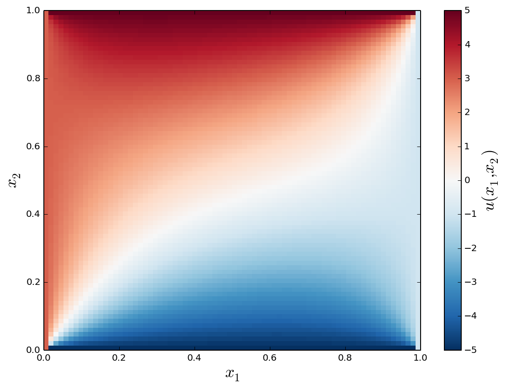


## Circular geometry


```python
r_outer = 1
r_inner = 0.25
r_middle = 0.1
x0, y0 = 0.4, 0.4
```


```python
domain = mshr.Circle(dolfin.Point(.0, .0), r_outer) \
    - mshr.Circle(dolfin.Point(.0, .0), r_inner) \
    - mshr.Circle(dolfin.Point( x0,  y0), r_middle) \
    - mshr.Circle(dolfin.Point( x0, -y0), r_middle) \
    - mshr.Circle(dolfin.Point(-x0,  y0), r_middle) \
    - mshr.Circle(dolfin.Point(-x0, -y0), r_middle)
```


```python
mesh = mshr.generate_mesh(domain, 10)
```


```python
mesh
```


```python
V = dolfin.FunctionSpace(mesh, 'Lagrange', 1)
```

    DEBUG:FFC:Reusing form from cache.


```python
u = dolfin.TrialFunction(V)
```


```python
v = dolfin.TestFunction(V)
```


```python
a = dolfin.inner(dolfin.nabla_grad(u), dolfin.nabla_grad(v)) * dolfin.dx
```


```python
f = dolfin.Constant(1.0)
```


```python
L = f * v * dolfin.dx
```


```python
def u0_outer_boundary(x, on_boundary):
    x, y = x[0], x[1]
    return on_boundary and abs(np.sqrt(x**2 + y**2) - r_outer) < 5e-2
```


```python
def u0_inner_boundary(x, on_boundary):
    x, y = x[0], x[1]
    return on_boundary and abs(np.sqrt(x**2 + y**2) - r_inner) < 5e-2
```


```python
def u0_middle_boundary(x, on_boundary):
    x, y = x[0], x[1]
    if on_boundary:
        for _x0 in [-x0, x0]:
            for _y0 in [-y0, y0]:
                if abs(np.sqrt((x+_x0)**2 + (y+_y0)**2) - r_middle) < 5e-2:
                    return True

    return False
```


```python
bc_inner = dolfin.DirichletBC(V, dolfin.Constant(15), u0_inner_boundary)
bc_middle = dolfin.DirichletBC(V, dolfin.Constant(0), u0_middle_boundary)
```


```python
bcs = [bc_inner, bc_middle]
```


```python
u_sol = dolfin.Function(V)
```


```python
dolfin.solve(a == L, u_sol, bcs)
```

    DEBUG:FFC:Reusing form from cache.
    DEBUG:FFC:Reusing form from cache.


```python
triangulation = mesh_triangulation(mesh)
```


```python
fig, (ax1, ax2) = plt.subplots(1, 2, figsize=(10, 4))

ax1.triplot(triangulation)
ax1.set_xlabel(r"$x$", fontsize=18)
ax1.set_ylabel(r"$y$", fontsize=18)

c = ax2.tripcolor(triangulation, u_sol.vector().array(), cmap=mpl.cm.get_cmap("Reds"))
cb = plt.colorbar(c, ax=ax2)
ax2.set_xlabel(r"$x$", fontsize=18)
ax2.set_ylabel(r"$y$", fontsize=18)
cb.set_label(r"$u(x, y)$", fontsize=18)
cb.set_ticks([0.0, 5, 10, 15])

fig.savefig("ch11-fdm-2d-ex4.pdf")
fig.savefig("ch11-fdm-2d-ex4.png")
fig.tight_layout()
```


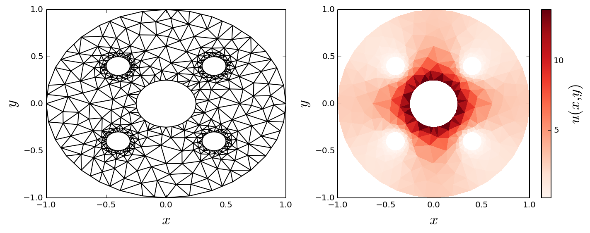


### Post processing


```python
outer_boundary = dolfin.AutoSubDomain(lambda x, on_bnd: on_bnd and abs(np.sqrt(x[0]**2 + x[1]**2) - r_outer) < 5e-2)
```


```python
bc_outer = dolfin.DirichletBC(V, 1, outer_boundary)
```


```python
mask_outer = dolfin.Function(V)
```


```python
bc_outer.apply(mask_outer.vector())
```


```python
u_outer = u_sol.vector()[mask_outer.vector() == 1]
```


```python
x_outer = mesh.coordinates()[mask_outer.vector() == 1]
```


```python
phi = np.angle(x_outer[:, 0] + 1j * x_outer[:, 1])
```


```python
order = np.argsort(phi)
```


```python
fig, ax = plt.subplots(1, 1, figsize=(8, 4))
ax.plot(phi[order], u_outer[order], 's-', lw=2)
ax.set_ylabel(r"$u(x,y)$ at $x^2+y^2=1$", fontsize=18)
ax.set_xlabel(r"$\phi$", fontsize=18)
ax.set_xlim(-np.pi, np.pi)
fig.tight_layout()
fig.savefig("ch11-fem-2d-ex5.pdf")
```


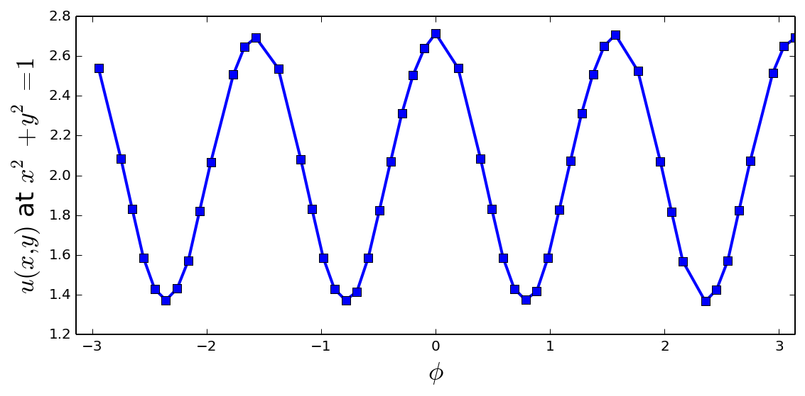


## Mesh refining


```python
domain = mshr.Circle(dolfin.Point(.0, .0), 1.0) - mshr.Rectangle(dolfin.Point(0.0, -1.0), dolfin.Point(1.0, 0.0))
```


```python
mesh = mshr.generate_mesh(domain, 10)
```


```python
refined_mesh = mesh
for r in [0.5, 0.25]:
    cell_markers = dolfin.CellFunction("bool", refined_mesh)
    cell_markers.set_all(False)
    for cell in dolfin.cells(refined_mesh):
        if cell.distance(dolfin.Point(.0, .0)) < r:
            cell_markers[cell] = True
    refined_mesh = dolfin.refine(refined_mesh, cell_markers)
```


```python
fig, (ax1, ax2) = plt.subplots(1, 2, figsize=(8, 4))

ax1.triplot(mesh_triangulation(mesh))
ax2.triplot(mesh_triangulation(refined_mesh))

for ax in [ax1, ax2]:
    for side in ['bottom','right','top','left']:
        ax.spines[side].set_visible(False)
        ax.set_xticks([])
        ax.set_yticks([])
        ax.xaxis.set_ticks_position('none')
        ax.yaxis.set_ticks_position('none')

    ax.set_xlabel(r"$x$", fontsize=18)
    ax.set_ylabel(r"$y$", fontsize=18)

fig.savefig("ch11-fem-2d-mesh-refine.pdf")
fig.savefig("ch11-fem-2d-mesh-refine.png")
fig.tight_layout()
```


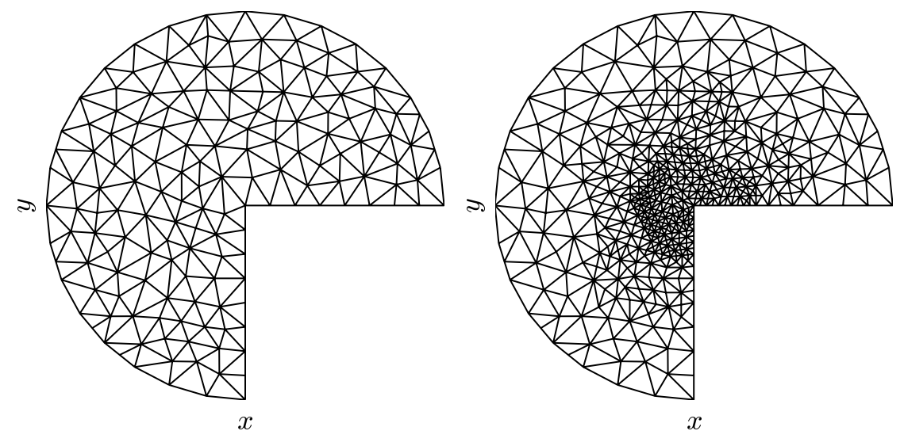


### Refined mesh with Dirichlet boundary conditions


```python
mesh = refined_mesh
```


```python
V = dolfin.FunctionSpace(mesh, 'Lagrange', 1)
```

    DEBUG:FFC:Reusing form from cache.


```python
u = dolfin.TrialFunction(V)
```


```python
v = dolfin.TestFunction(V)
```


```python
a = dolfin.inner(dolfin.nabla_grad(u), dolfin.nabla_grad(v)) * dolfin.dx
```


```python
f = dolfin.Constant(0.0)
```


```python
L = f * v * dolfin.dx
```


```python
def u0_vertical_boundary(x, on_boundary):
    x, y = x[0], x[1]
    return on_boundary and abs(x) < 1e-2 and y < 0.0
```


```python
def u0_horizontal_boundary(x, on_boundary):
    x, y = x[0], x[1]
    return on_boundary and abs(y) < 1e-2 and x > 0.0
```


```python
bc_vertical = dolfin.DirichletBC(V, dolfin.Constant(-5), u0_vertical_boundary)
```


```python
bc_horizontal = dolfin.DirichletBC(V, dolfin.Constant(5), u0_horizontal_boundary)
```


```python
bcs = [bc_vertical, bc_horizontal]
```


```python
u_sol = dolfin.Function(V)
```


```python
dolfin.solve(a == L, u_sol, bcs)
```

    DEBUG:FFC:Reusing form from cache.
    DEBUG:FFC:Reusing form from cache.


```python
triangulation = mesh_triangulation(mesh)
```


```python
fig, (ax1, ax2) = plt.subplots(1, 2, figsize=(10, 4))

ax1.triplot(triangulation)
ax1.set_xlabel(r"$x$", fontsize=18)
ax1.set_ylabel(r"$y$", fontsize=18)

c = ax2.tripcolor(triangulation, u_sol.vector().array(), cmap=mpl.cm.get_cmap("RdBu_r"))
cb = plt.colorbar(c, ax=ax2)
ax2.set_xlabel(r"$x$", fontsize=18)
ax2.set_ylabel(r"$y$", fontsize=18)
cb.set_label(r"$u(x, y)$", fontsize=18)

fig.tight_layout()
```


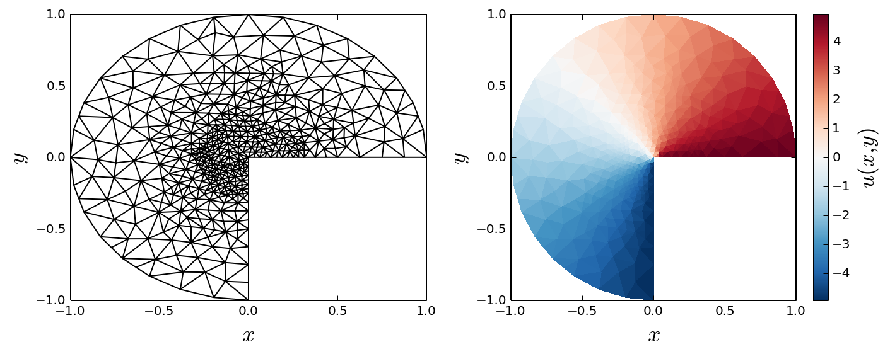


## Refined mesh with Dirichlet and von Neumann boundary conditions


```python
mesh = refined_mesh
```


```python
V = dolfin.FunctionSpace(mesh, 'Lagrange', 1)
```

    DEBUG:FFC:Reusing form from cache.


```python
u = dolfin.TrialFunction(V)
```


```python
v = dolfin.TestFunction(V)
```


```python
boundary_parts = dolfin.MeshFunction("size_t", mesh, mesh.topology().dim()-1)
```


```python
def v_boundary_func(x, on_boundary):
    """ the vertical edge of the mesh, where x = 0 and y < 0"""
    x, y = x[0], x[1]
    return on_boundary and abs(x) < 1e-4 and y < 0.0
```


```python
v_boundary = dolfin.AutoSubDomain(v_boundary_func)
```


```python
v_boundary.mark(boundary_parts, 0)
```


```python
def h_boundary_func(x, on_boundary):
    """ the horizontal edge of the mesh, where y = 0 and x > 0"""
    x, y = x[0], x[1]
    return on_boundary and abs(y) < 1e-4 and x > 0.0
```


```python
h_boundary = dolfin.AutoSubDomain(h_boundary_func)
```


```python
h_boundary.mark(boundary_parts, 1)
```


```python
def outer_boundary_func(x, on_boundary):
    x, y = x[0], x[1]
    return on_boundary and abs(x**2 + y**2-1) < 1e-2
```


```python
outer_boundary = dolfin.AutoSubDomain(outer_boundary_func)
```


```python
outer_boundary.mark(boundary_parts, 2)
```


```python
bc = dolfin.DirichletBC(V, dolfin.Constant(0.0), boundary_parts, 2)
```


```python
a = dolfin.inner(dolfin.nabla_grad(u), dolfin.nabla_grad(v)) * dolfin.dx(domain=mesh, subdomain_data=boundary_parts)
```


```python
f = dolfin.Constant(0.0)
```


```python
g_v = dolfin.Constant(-2.0)
```


```python
g_h = dolfin.Constant(1.0)
```


```python
L = f * v * dolfin.dx(domain=mesh, subdomain_data=boundary_parts)
```


```python
L += g_v * v * dolfin.ds(0, domain=mesh, subdomain_data=boundary_parts)
```


```python
L += g_h * v * dolfin.ds(1, domain=mesh, subdomain_data=boundary_parts)
```


```python
u_sol = dolfin.Function(V)
```


```python
dolfin.solve(a == L, u_sol, bc)
```

    DEBUG:FFC:Reusing form from cache.
    DEBUG:FFC:Reusing form from cache.


```python
triangulation = mesh_triangulation(mesh)
```


```python
fig, (ax1, ax2) = plt.subplots(1, 2, figsize=(10, 4))

ax1.triplot(triangulation)
ax1.set_xlabel(r"$x$", fontsize=18)
ax1.set_ylabel(r"$y$", fontsize=18)

data = u_sol.vector().array()
norm = mpl.colors.Normalize(-abs(data).max(), abs(data).max())
c = ax2.tripcolor(triangulation, data, norm=norm, cmap=mpl.cm.get_cmap("RdBu_r"))
cb = plt.colorbar(c, ax=ax2)
ax2.set_xlabel(r"$x$", fontsize=18)
ax2.set_ylabel(r"$y$", fontsize=18)
cb.set_label(r"$u(x, y)$", fontsize=18)
cb.set_ticks([-.5, 0, .5])

fig.savefig("ch11-fem-2d-ex5.pdf")
fig.savefig("ch11-fem-2d-ex5.png")
fig.tight_layout()
```


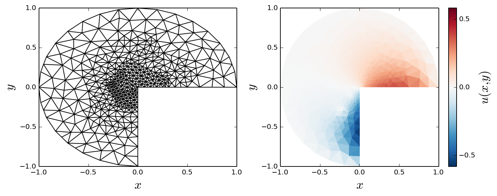


## Versions


```python
%reload_ext version_information
%version_information numpy, scipy, matplotlib, dolfin
```


<table><tr><th>Software</th><th>Version</th></tr><tr><td>Python</td><td>2.7.6 64bit [GCC 4.2.1 Compatible Apple LLVM 6.0 (clang-600.0.39)]</td></tr><tr><td>IPython</td><td>2.4.1</td></tr><tr><td>OS</td><td>Darwin 14.1.0 x86_64 i386 64bit</td></tr><tr><td>numpy</td><td>1.8.0rc1</td></tr><tr><td>scipy</td><td>0.13.0b1</td></tr><tr><td>matplotlib</td><td>1.3.1</td></tr><tr><td>dolfin</td><td>1.5.0</td></tr></table>
