# Chapter 12: Data processing and analysis with `pandas`
<!-- toc orderedList:0 depthFrom:1 depthTo:6 -->

* [Chapter 12: Data processing and analysis with `pandas`](#chapter-12-data-processing-and-analysis-with-pandas)
  * [Series object](#series-object)
  * [DataFrame object](#dataframe-object)
  * [Larger dataset](#larger-dataset)
  * [Time series](#time-series)
    * [Basics](#basics)
    * [Temperature time series example](#temperature-time-series-example)
  * [Selected day](#selected-day)
* [Seaborn statistical visualization library](#seaborn-statistical-visualization-library)
  * [Versions](#versions)

<!-- tocstop -->


---

Robert Johansson

Source code listings for [Numerical Python - A Practical Techniques Approach for Industry](http://www.apress.com/9781484205549) (ISBN 978-1-484205-54-9).

The source code listings can be downloaded from http://www.apress.com/9781484205549


```python
%matplotlib inline
import matplotlib.pyplot as plt
```


```python
import numpy as np
```


```python
import pandas as pd
```


```python
pd.set_option('display.mpl_style', 'default')
```

## Series object


```python
s = pd.Series([909976, 8615246, 2872086, 2273305])
```


```python
s
```


    0     909976
    1    8615246
    2    2872086
    3    2273305
    dtype: int64


```python
type(s)
```


    pandas.core.series.Series


```python
s.dtype
```


    dtype('int64')


```python
s.index
```


    Int64Index([0, 1, 2, 3], dtype='int64')


```python
s.values
```


    array([ 909976, 8615246, 2872086, 2273305])


```python
s.index = ["Stockholm", "London", "Rome", "Paris"]
```


```python
s.name = "Population"
```


```python
s
```


    Stockholm     909976
    London       8615246
    Rome         2872086
    Paris        2273305
    Name: Population, dtype: int64


```python
s = pd.Series([909976, 8615246, 2872086, 2273305],
              index=["Stockholm", "London", "Rome", "Paris"], name="Population")
```


```python
s["London"]
```


    8615246


```python
s.Stockholm
```


    909976


```python
s[["Paris", "Rome"]]
```


    Paris    2273305
    Rome     2872086
    Name: Population, dtype: int64


```python
s.median(), s.mean(), s.std()
```


    (2572695.5, 3667653.25, 3399048.5005155364)


```python
s.min(), s.max()
```


    (909976, 8615246)


```python
s.quantile(q=0.25), s.quantile(q=0.5), s.quantile(q=0.75)
```


    (1932472.75, 2572695.5, 4307876.0)


```python
s.describe()
```


    count          4.000000
    mean     3667653.250000
    std      3399048.500516
    min       909976.000000
    25%      1932472.750000
    50%      2572695.500000
    75%      4307876.000000
    max      8615246.000000
    Name: Population, dtype: float64


```python
fig, axes = plt.subplots(1, 4, figsize=(12, 3))

s.plot(ax=axes[0], kind='line', title="line")
s.plot(ax=axes[1], kind='bar', title="bar")
s.plot(ax=axes[2], kind='box', title="box")
s.plot(ax=axes[3], kind='pie', title="pie")

fig.tight_layout()
fig.savefig("ch12-series-plot.pdf")
fig.savefig("ch12-series-plot.png")
```


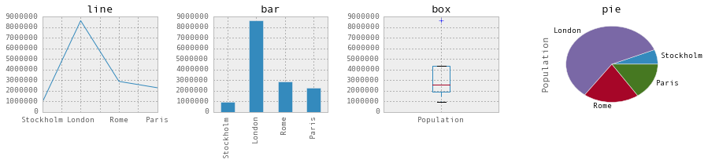


## DataFrame object


```python
df = pd.DataFrame([[909976, 8615246, 2872086, 2273305],
                   ["Sweden", "United kingdom", "Italy", "France"]])
```


```python
df
```


<div>
<table border="1" class="dataframe">
  <thead>
    <tr style="text-align: right;">
      <th></th>
      <th>0</th>
      <th>1</th>
      <th>2</th>
      <th>3</th>
    </tr>
  </thead>
  <tbody>
    <tr>
      <th>0</th>
      <td>909976</td>
      <td>8615246</td>
      <td>2872086</td>
      <td>2273305</td>
    </tr>
    <tr>
      <th>1</th>
      <td>Sweden</td>
      <td>United kingdom</td>
      <td>Italy</td>
      <td>France</td>
    </tr>
  </tbody>
</table>
</div>


```python
df = pd.DataFrame([[909976, "Sweden"],
                   [8615246, "United kingdom"],
                   [2872086, "Italy"],
                   [2273305, "France"]])
```


```python
df
```


<div>
<table border="1" class="dataframe">
  <thead>
    <tr style="text-align: right;">
      <th></th>
      <th>0</th>
      <th>1</th>
    </tr>
  </thead>
  <tbody>
    <tr>
      <th>0</th>
      <td>909976</td>
      <td>Sweden</td>
    </tr>
    <tr>
      <th>1</th>
      <td>8615246</td>
      <td>United kingdom</td>
    </tr>
    <tr>
      <th>2</th>
      <td>2872086</td>
      <td>Italy</td>
    </tr>
    <tr>
      <th>3</th>
      <td>2273305</td>
      <td>France</td>
    </tr>
  </tbody>
</table>
</div>


```python
df.index = ["Stockholm", "London", "Rome", "Paris"]
```


```python
df.columns = ["Population", "State"]
```


```python
df
```


<div>
<table border="1" class="dataframe">
  <thead>
    <tr style="text-align: right;">
      <th></th>
      <th>Population</th>
      <th>State</th>
    </tr>
  </thead>
  <tbody>
    <tr>
      <th>Stockholm</th>
      <td>909976</td>
      <td>Sweden</td>
    </tr>
    <tr>
      <th>London</th>
      <td>8615246</td>
      <td>United kingdom</td>
    </tr>
    <tr>
      <th>Rome</th>
      <td>2872086</td>
      <td>Italy</td>
    </tr>
    <tr>
      <th>Paris</th>
      <td>2273305</td>
      <td>France</td>
    </tr>
  </tbody>
</table>
</div>


```python
df = pd.DataFrame([[909976, "Sweden"],
                   [8615246, "United kingdom"],
                   [2872086, "Italy"],
                   [2273305, "France"]],
                  index=["Stockholm", "London", "Rome", "Paris"],
                  columns=["Population", "State"])
```


```python
df
```


<div>
<table border="1" class="dataframe">
  <thead>
    <tr style="text-align: right;">
      <th></th>
      <th>Population</th>
      <th>State</th>
    </tr>
  </thead>
  <tbody>
    <tr>
      <th>Stockholm</th>
      <td>909976</td>
      <td>Sweden</td>
    </tr>
    <tr>
      <th>London</th>
      <td>8615246</td>
      <td>United kingdom</td>
    </tr>
    <tr>
      <th>Rome</th>
      <td>2872086</td>
      <td>Italy</td>
    </tr>
    <tr>
      <th>Paris</th>
      <td>2273305</td>
      <td>France</td>
    </tr>
  </tbody>
</table>
</div>


```python
df = pd.DataFrame({"Population": [909976, 8615246, 2872086, 2273305],
                   "State": ["Sweden", "United kingdom", "Italy", "France"]},
                  index=["Stockholm", "London", "Rome", "Paris"])
```


```python
df
```


<div>
<table border="1" class="dataframe">
  <thead>
    <tr style="text-align: right;">
      <th></th>
      <th>Population</th>
      <th>State</th>
    </tr>
  </thead>
  <tbody>
    <tr>
      <th>Stockholm</th>
      <td>909976</td>
      <td>Sweden</td>
    </tr>
    <tr>
      <th>London</th>
      <td>8615246</td>
      <td>United kingdom</td>
    </tr>
    <tr>
      <th>Rome</th>
      <td>2872086</td>
      <td>Italy</td>
    </tr>
    <tr>
      <th>Paris</th>
      <td>2273305</td>
      <td>France</td>
    </tr>
  </tbody>
</table>
</div>


```python
df.index
```


    Index([u'Stockholm', u'London', u'Rome', u'Paris'], dtype='object')


```python
df.columns
```


    Index([u'Population', u'State'], dtype='object')


```python
df.values
```


    array([[909976, 'Sweden'],
           [8615246, 'United kingdom'],
           [2872086, 'Italy'],
           [2273305, 'France']], dtype=object)


```python
df.Population
```


    Stockholm     909976
    London       8615246
    Rome         2872086
    Paris        2273305
    Name: Population, dtype: int64


```python
df["Population"]
```


    Stockholm     909976
    London       8615246
    Rome         2872086
    Paris        2273305
    Name: Population, dtype: int64


```python
type(df.Population)
```


    pandas.core.series.Series


```python
df.Population.Stockholm
```


    909976


```python
type(df.ix)
```


    pandas.core.indexing._IXIndexer


```python
df.ix["Stockholm"]
```


    Population    909976
    State         Sweden
    Name: Stockholm, dtype: object


```python
type(df.ix["Stockholm"])
```


    pandas.core.series.Series


```python
df.ix[["Paris", "Rome"]]
```


<div>
<table border="1" class="dataframe">
  <thead>
    <tr style="text-align: right;">
      <th></th>
      <th>Population</th>
      <th>State</th>
    </tr>
  </thead>
  <tbody>
    <tr>
      <th>Paris</th>
      <td>2273305</td>
      <td>France</td>
    </tr>
    <tr>
      <th>Rome</th>
      <td>2872086</td>
      <td>Italy</td>
    </tr>
  </tbody>
</table>
</div>


```python
df.ix[["Paris", "Rome"], "Population"]
```


    Paris    2273305
    Rome     2872086
    Name: Population, dtype: int64


```python
df.ix["Paris", "Population"]
```


    2273305


```python
df.mean()
```


    Population    3667653.25
    dtype: float64


```python
df.info()
```

    <class 'pandas.core.frame.DataFrame'>
    Index: 4 entries, Stockholm to Paris
    Data columns (total 2 columns):
    Population    4 non-null int64
    State         4 non-null object
    dtypes: int64(1), object(1)
    memory usage: 96.0+ bytes


```python
df.dtypes
```


    Population     int64
    State         object
    dtype: object


```python
df.head()
```


<div>
<table border="1" class="dataframe">
  <thead>
    <tr style="text-align: right;">
      <th></th>
      <th>Population</th>
      <th>State</th>
    </tr>
  </thead>
  <tbody>
    <tr>
      <th>Stockholm</th>
      <td>909976</td>
      <td>Sweden</td>
    </tr>
    <tr>
      <th>London</th>
      <td>8615246</td>
      <td>United kingdom</td>
    </tr>
    <tr>
      <th>Rome</th>
      <td>2872086</td>
      <td>Italy</td>
    </tr>
    <tr>
      <th>Paris</th>
      <td>2273305</td>
      <td>France</td>
    </tr>
  </tbody>
</table>
</div>


```python
!head -n5 /home/rob/datasets/european_cities.csv
```

    Rank,City,State,Official population,Date of census/estimate

    1,London[2], United Kingdom,"8,615,246",1 June 2014

    2,Berlin, Germany,"3,437,916",31 May 2014

    3,Madrid, Spain,"3,165,235",1 January 2014

    4,Rome, Italy,"2,872,086",30 September 2014


## Larger dataset


```python
df_pop = pd.read_csv("european_cities.csv")
```


```python
df_pop.head()
```


<div>
<table border="1" class="dataframe">
  <thead>
    <tr style="text-align: right;">
      <th></th>
      <th>Rank</th>
      <th>City</th>
      <th>State</th>
      <th>Population</th>
      <th>Date of census/estimate</th>
    </tr>
  </thead>
  <tbody>
    <tr>
      <th>0</th>
      <td>1</td>
      <td>London[2]</td>
      <td>United Kingdom</td>
      <td>8,615,246</td>
      <td>1 June 2014</td>
    </tr>
    <tr>
      <th>1</th>
      <td>2</td>
      <td>Berlin</td>
      <td>Germany</td>
      <td>3,437,916</td>
      <td>31 May 2014</td>
    </tr>
    <tr>
      <th>2</th>
      <td>3</td>
      <td>Madrid</td>
      <td>Spain</td>
      <td>3,165,235</td>
      <td>1 January 2014</td>
    </tr>
    <tr>
      <th>3</th>
      <td>4</td>
      <td>Rome</td>
      <td>Italy</td>
      <td>2,872,086</td>
      <td>30 September 2014</td>
    </tr>
    <tr>
      <th>4</th>
      <td>5</td>
      <td>Paris</td>
      <td>France</td>
      <td>2,273,305</td>
      <td>1 January 2013</td>
    </tr>
  </tbody>
</table>
</div>


```python
df_pop = pd.read_csv("european_cities.csv", delimiter=",", encoding="utf-8", header=0)
```


```python
df_pop.info()
```

    <class 'pandas.core.frame.DataFrame'>
    Int64Index: 105 entries, 0 to 104
    Data columns (total 5 columns):
    Rank                       105 non-null int64
    City                       105 non-null object
    State                      105 non-null object
    Population                 105 non-null object
    Date of census/estimate    105 non-null object
    dtypes: int64(1), object(4)
    memory usage: 4.9+ KB


```python
df_pop.head()
```


<div>
<table border="1" class="dataframe">
  <thead>
    <tr style="text-align: right;">
      <th></th>
      <th>Rank</th>
      <th>City</th>
      <th>State</th>
      <th>Population</th>
      <th>Date of census/estimate</th>
    </tr>
  </thead>
  <tbody>
    <tr>
      <th>0</th>
      <td>1</td>
      <td>London[2]</td>
      <td>United Kingdom</td>
      <td>8,615,246</td>
      <td>1 June 2014</td>
    </tr>
    <tr>
      <th>1</th>
      <td>2</td>
      <td>Berlin</td>
      <td>Germany</td>
      <td>3,437,916</td>
      <td>31 May 2014</td>
    </tr>
    <tr>
      <th>2</th>
      <td>3</td>
      <td>Madrid</td>
      <td>Spain</td>
      <td>3,165,235</td>
      <td>1 January 2014</td>
    </tr>
    <tr>
      <th>3</th>
      <td>4</td>
      <td>Rome</td>
      <td>Italy</td>
      <td>2,872,086</td>
      <td>30 September 2014</td>
    </tr>
    <tr>
      <th>4</th>
      <td>5</td>
      <td>Paris</td>
      <td>France</td>
      <td>2,273,305</td>
      <td>1 January 2013</td>
    </tr>
  </tbody>
</table>
</div>


```python
df_pop["NumericPopulation"] = df_pop.Population.apply(lambda x: int(x.replace(",", "")))
```


```python
df_pop["State"].values[:3]
```


    array([u' United Kingdom', u' Germany', u' Spain'], dtype=object)


```python
df_pop["State"] = df_pop["State"].apply(lambda x: x.strip())
```


```python
df_pop.head()
```


<div>
<table border="1" class="dataframe">
  <thead>
    <tr style="text-align: right;">
      <th></th>
      <th>Rank</th>
      <th>City</th>
      <th>State</th>
      <th>Population</th>
      <th>Date of census/estimate</th>
      <th>NumericPopulation</th>
    </tr>
  </thead>
  <tbody>
    <tr>
      <th>0</th>
      <td>1</td>
      <td>London[2]</td>
      <td>United Kingdom</td>
      <td>8,615,246</td>
      <td>1 June 2014</td>
      <td>8615246</td>
    </tr>
    <tr>
      <th>1</th>
      <td>2</td>
      <td>Berlin</td>
      <td>Germany</td>
      <td>3,437,916</td>
      <td>31 May 2014</td>
      <td>3437916</td>
    </tr>
    <tr>
      <th>2</th>
      <td>3</td>
      <td>Madrid</td>
      <td>Spain</td>
      <td>3,165,235</td>
      <td>1 January 2014</td>
      <td>3165235</td>
    </tr>
    <tr>
      <th>3</th>
      <td>4</td>
      <td>Rome</td>
      <td>Italy</td>
      <td>2,872,086</td>
      <td>30 September 2014</td>
      <td>2872086</td>
    </tr>
    <tr>
      <th>4</th>
      <td>5</td>
      <td>Paris</td>
      <td>France</td>
      <td>2,273,305</td>
      <td>1 January 2013</td>
      <td>2273305</td>
    </tr>
  </tbody>
</table>
</div>


```python
df_pop.dtypes
```


    Rank                        int64
    City                       object
    State                      object
    Population                 object
    Date of census/estimate    object
    NumericPopulation           int64
    dtype: object


```python
df_pop2 = df_pop.set_index("City")
```


```python
df_pop2 = df_pop2.sort_index()
```


```python
df_pop2.head()
```


<div>
<table border="1" class="dataframe">
  <thead>
    <tr style="text-align: right;">
      <th></th>
      <th>Rank</th>
      <th>State</th>
      <th>Population</th>
      <th>Date of census/estimate</th>
      <th>NumericPopulation</th>
    </tr>
    <tr>
      <th>City</th>
      <th></th>
      <th></th>
      <th></th>
      <th></th>
      <th></th>
    </tr>
  </thead>
  <tbody>
    <tr>
      <th>Aarhus</th>
      <td>92</td>
      <td>Denmark</td>
      <td>326,676</td>
      <td>1 October 2014</td>
      <td>326676</td>
    </tr>
    <tr>
      <th>Alicante</th>
      <td>86</td>
      <td>Spain</td>
      <td>334,678</td>
      <td>1 January 2012</td>
      <td>334678</td>
    </tr>
    <tr>
      <th>Amsterdam</th>
      <td>23</td>
      <td>Netherlands</td>
      <td>813,562</td>
      <td>31 May 2014</td>
      <td>813562</td>
    </tr>
    <tr>
      <th>Antwerp</th>
      <td>59</td>
      <td>Belgium</td>
      <td>510,610</td>
      <td>1 January 2014</td>
      <td>510610</td>
    </tr>
    <tr>
      <th>Athens</th>
      <td>34</td>
      <td>Greece</td>
      <td>664,046</td>
      <td>24 May 2011</td>
      <td>664046</td>
    </tr>
  </tbody>
</table>
</div>


```python
df_pop2.head()
```


<div>
<table border="1" class="dataframe">
  <thead>
    <tr style="text-align: right;">
      <th></th>
      <th>Rank</th>
      <th>State</th>
      <th>Population</th>
      <th>Date of census/estimate</th>
      <th>NumericPopulation</th>
    </tr>
    <tr>
      <th>City</th>
      <th></th>
      <th></th>
      <th></th>
      <th></th>
      <th></th>
    </tr>
  </thead>
  <tbody>
    <tr>
      <th>Aarhus</th>
      <td>92</td>
      <td>Denmark</td>
      <td>326,676</td>
      <td>1 October 2014</td>
      <td>326676</td>
    </tr>
    <tr>
      <th>Alicante</th>
      <td>86</td>
      <td>Spain</td>
      <td>334,678</td>
      <td>1 January 2012</td>
      <td>334678</td>
    </tr>
    <tr>
      <th>Amsterdam</th>
      <td>23</td>
      <td>Netherlands</td>
      <td>813,562</td>
      <td>31 May 2014</td>
      <td>813562</td>
    </tr>
    <tr>
      <th>Antwerp</th>
      <td>59</td>
      <td>Belgium</td>
      <td>510,610</td>
      <td>1 January 2014</td>
      <td>510610</td>
    </tr>
    <tr>
      <th>Athens</th>
      <td>34</td>
      <td>Greece</td>
      <td>664,046</td>
      <td>24 May 2011</td>
      <td>664046</td>
    </tr>
  </tbody>
</table>
</div>


```python
df_pop3 = df_pop.set_index(["State", "City"]).sortlevel(0)
```


```python
df_pop3.head(7)
```


<div>
<table border="1" class="dataframe">
  <thead>
    <tr style="text-align: right;">
      <th></th>
      <th></th>
      <th>Rank</th>
      <th>Population</th>
      <th>Date of census/estimate</th>
      <th>NumericPopulation</th>
    </tr>
    <tr>
      <th>State</th>
      <th>City</th>
      <th></th>
      <th></th>
      <th></th>
      <th></th>
    </tr>
  </thead>
  <tbody>
    <tr>
      <th>Austria</th>
      <th>Vienna</th>
      <td>7</td>
      <td>1,794,770</td>
      <td>1 January 2015</td>
      <td>1794770</td>
    </tr>
    <tr>
      <th rowspan="2" valign="top">Belgium</th>
      <th>Antwerp</th>
      <td>59</td>
      <td>510,610</td>
      <td>1 January 2014</td>
      <td>510610</td>
    </tr>
    <tr>
      <th>Brussels[17]</th>
      <td>16</td>
      <td>1,175,831</td>
      <td>1 January 2014</td>
      <td>1175831</td>
    </tr>
    <tr>
      <th rowspan="3" valign="top">Bulgaria</th>
      <th>Plovdiv</th>
      <td>84</td>
      <td>341,041</td>
      <td>31 December 2013</td>
      <td>341041</td>
    </tr>
    <tr>
      <th>Sofia</th>
      <td>14</td>
      <td>1,291,895</td>
      <td>14 December 2014</td>
      <td>1291895</td>
    </tr>
    <tr>
      <th>Varna</th>
      <td>85</td>
      <td>335,819</td>
      <td>31 December 2013</td>
      <td>335819</td>
    </tr>
    <tr>
      <th>Croatia</th>
      <th>Zagreb</th>
      <td>24</td>
      <td>790,017</td>
      <td>31 March 2011</td>
      <td>790017</td>
    </tr>
  </tbody>
</table>
</div>


```python
df_pop3.ix["Sweden"]
```


<div>
<table border="1" class="dataframe">
  <thead>
    <tr style="text-align: right;">
      <th></th>
      <th>Rank</th>
      <th>Population</th>
      <th>Date of census/estimate</th>
      <th>NumericPopulation</th>
    </tr>
    <tr>
      <th>City</th>
      <th></th>
      <th></th>
      <th></th>
      <th></th>
    </tr>
  </thead>
  <tbody>
    <tr>
      <th>Gothenburg</th>
      <td>53</td>
      <td>528,014</td>
      <td>31 March 2013</td>
      <td>528014</td>
    </tr>
    <tr>
      <th>Malmö</th>
      <td>102</td>
      <td>309,105</td>
      <td>31 March 2013</td>
      <td>309105</td>
    </tr>
    <tr>
      <th>Stockholm</th>
      <td>20</td>
      <td>909,976</td>
      <td>31 January 2014</td>
      <td>909976</td>
    </tr>
  </tbody>
</table>
</div>


```python
df_pop3.ix[("Sweden", "Gothenburg")]
```


    Rank                                  53
    Population                       528,014
    Date of census/estimate    31 March 2013
    NumericPopulation                 528014
    Name: (Sweden, Gothenburg), dtype: object


```python
df_pop.set_index("City").sort(["State", "NumericPopulation"], ascending=[False, True]).head()
```


<div>
<table border="1" class="dataframe">
  <thead>
    <tr style="text-align: right;">
      <th></th>
      <th>Rank</th>
      <th>State</th>
      <th>Population</th>
      <th>Date of census/estimate</th>
      <th>NumericPopulation</th>
    </tr>
    <tr>
      <th>City</th>
      <th></th>
      <th></th>
      <th></th>
      <th></th>
      <th></th>
    </tr>
  </thead>
  <tbody>
    <tr>
      <th>Nottingham</th>
      <td>103</td>
      <td>United Kingdom</td>
      <td>308,735</td>
      <td>30 June 2012</td>
      <td>308735</td>
    </tr>
    <tr>
      <th>Wirral</th>
      <td>97</td>
      <td>United Kingdom</td>
      <td>320,229</td>
      <td>30 June 2012</td>
      <td>320229</td>
    </tr>
    <tr>
      <th>Coventry</th>
      <td>94</td>
      <td>United Kingdom</td>
      <td>323,132</td>
      <td>30 June 2012</td>
      <td>323132</td>
    </tr>
    <tr>
      <th>Wakefield</th>
      <td>91</td>
      <td>United Kingdom</td>
      <td>327,627</td>
      <td>30 June 2012</td>
      <td>327627</td>
    </tr>
    <tr>
      <th>Leicester</th>
      <td>87</td>
      <td>United Kingdom</td>
      <td>331,606</td>
      <td>30 June 2012</td>
      <td>331606</td>
    </tr>
  </tbody>
</table>
</div>


```python
city_counts = df_pop.State.value_counts()
```


```python
city_counts.name = "# cities in top 105"
```


```python
df_pop3 = df_pop[["State", "City", "NumericPopulation"]].set_index(["State", "City"])
```


```python
df_pop4 = df_pop3.sum(level="State").sort("NumericPopulation", ascending=False)
```


```python
df_pop4.head()
```


<div>
<table border="1" class="dataframe">
  <thead>
    <tr style="text-align: right;">
      <th></th>
      <th>NumericPopulation</th>
    </tr>
    <tr>
      <th>State</th>
      <th></th>
    </tr>
  </thead>
  <tbody>
    <tr>
      <th>United Kingdom</th>
      <td>16011877</td>
    </tr>
    <tr>
      <th>Germany</th>
      <td>15119548</td>
    </tr>
    <tr>
      <th>Spain</th>
      <td>10041639</td>
    </tr>
    <tr>
      <th>Italy</th>
      <td>8764067</td>
    </tr>
    <tr>
      <th>Poland</th>
      <td>6267409</td>
    </tr>
  </tbody>
</table>
</div>


```python
df_pop5 = (df_pop.drop("Rank", axis=1)
                 .groupby("State").sum()
                 .sort("NumericPopulation", ascending=False))
```


```python
df_pop5.head()
```


<div>
<table border="1" class="dataframe">
  <thead>
    <tr style="text-align: right;">
      <th></th>
      <th>NumericPopulation</th>
    </tr>
    <tr>
      <th>State</th>
      <th></th>
    </tr>
  </thead>
  <tbody>
    <tr>
      <th>United Kingdom</th>
      <td>16011877</td>
    </tr>
    <tr>
      <th>Germany</th>
      <td>15119548</td>
    </tr>
    <tr>
      <th>Spain</th>
      <td>10041639</td>
    </tr>
    <tr>
      <th>Italy</th>
      <td>8764067</td>
    </tr>
    <tr>
      <th>Poland</th>
      <td>6267409</td>
    </tr>
  </tbody>
</table>
</div>


```python
fig, (ax1, ax2) = plt.subplots(1, 2, figsize=(12, 4))

city_counts.plot(kind='barh', ax=ax1)
ax1.set_xlabel("# cities in top 105")
df_pop5.NumericPopulation.plot(kind='barh', ax=ax2)
ax2.set_xlabel("Total pop. in top 105 cities")

fig.tight_layout()
fig.savefig("ch12-state-city-counts-sum.pdf")
```


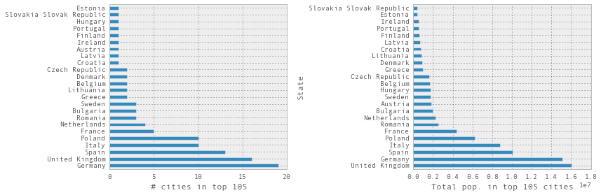


## Time series

### Basics


```python
import datetime
```


```python
pd.date_range("2015-1-1", periods=31)
```


    DatetimeIndex(['2015-01-01', '2015-01-02', '2015-01-03', '2015-01-04',
                   '2015-01-05', '2015-01-06', '2015-01-07', '2015-01-08',
                   '2015-01-09', '2015-01-10', '2015-01-11', '2015-01-12',
                   '2015-01-13', '2015-01-14', '2015-01-15', '2015-01-16',
                   '2015-01-17', '2015-01-18', '2015-01-19', '2015-01-20',
                   '2015-01-21', '2015-01-22', '2015-01-23', '2015-01-24',
                   '2015-01-25', '2015-01-26', '2015-01-27', '2015-01-28',
                   '2015-01-29', '2015-01-30', '2015-01-31'],
                  dtype='datetime64[ns]', freq='D', tz=None)


```python
pd.date_range(datetime.datetime(2015, 1, 1), periods=31)
```


    DatetimeIndex(['2015-01-01', '2015-01-02', '2015-01-03', '2015-01-04',
                   '2015-01-05', '2015-01-06', '2015-01-07', '2015-01-08',
                   '2015-01-09', '2015-01-10', '2015-01-11', '2015-01-12',
                   '2015-01-13', '2015-01-14', '2015-01-15', '2015-01-16',
                   '2015-01-17', '2015-01-18', '2015-01-19', '2015-01-20',
                   '2015-01-21', '2015-01-22', '2015-01-23', '2015-01-24',
                   '2015-01-25', '2015-01-26', '2015-01-27', '2015-01-28',
                   '2015-01-29', '2015-01-30', '2015-01-31'],
                  dtype='datetime64[ns]', freq='D', tz=None)


```python
pd.date_range("2015-1-1 00:00", "2015-1-1 12:00", freq="H")
```


    DatetimeIndex(['2015-01-01 00:00:00', '2015-01-01 01:00:00',
                   '2015-01-01 02:00:00', '2015-01-01 03:00:00',
                   '2015-01-01 04:00:00', '2015-01-01 05:00:00',
                   '2015-01-01 06:00:00', '2015-01-01 07:00:00',
                   '2015-01-01 08:00:00', '2015-01-01 09:00:00',
                   '2015-01-01 10:00:00', '2015-01-01 11:00:00',
                   '2015-01-01 12:00:00'],
                  dtype='datetime64[ns]', freq='H', tz=None)


```python
ts1 = pd.Series(np.arange(31), index=pd.date_range("2015-1-1", periods=31))
```


```python
ts1.head()
```


    2015-01-01    0
    2015-01-02    1
    2015-01-03    2
    2015-01-04    3
    2015-01-05    4
    Freq: D, dtype: int64


```python
ts1["2015-1-3"]
```


    2


```python
ts1.index[2]
```


    Timestamp('2015-01-03 00:00:00', offset='D')


```python
ts1.index[2].year, ts1.index[2].month, ts1.index[2].day
```


    (2015, 1, 3)


```python
ts1.index[2].nanosecond
```


    0


```python
ts1.index[2].to_pydatetime()
```


    datetime.datetime(2015, 1, 3, 0, 0)


```python
ts2 = pd.Series(np.random.rand(2),
                index=[datetime.datetime(2015, 1, 1), datetime.datetime(2015, 2, 1)])
```


```python
ts2
```


    2015-01-01    0.323774
    2015-02-01    0.636933
    dtype: float64


```python
periods = pd.PeriodIndex([pd.Period('2015-01'), pd.Period('2015-02'), pd.Period('2015-03')])
```


```python
ts3 = pd.Series(np.random.rand(3), periods)
```


```python
ts3
```


    2015-01    0.023390
    2015-02    0.998680
    2015-03    0.451616
    Freq: M, dtype: float64


```python
ts3.index
```


    PeriodIndex(['2015-01', '2015-02', '2015-03'], dtype='int64', freq='M')


```python
ts2.to_period('M')
```


    2015-01    0.323774
    2015-02    0.636933
    Freq: M, dtype: float64


```python
pd.date_range("2015-1-1", periods=12, freq="M").to_period()
```


    PeriodIndex(['2015-01', '2015-02', '2015-03', '2015-04', '2015-05', '2015-06',
                 '2015-07', '2015-08', '2015-09', '2015-10', '2015-11', '2015-12'],
                dtype='int64', freq='M')


### Temperature time series example


```python
!head -n 5 temperature_outdoor_2014.tsv
```

    1388530986	4.380000

    1388531586	4.250000

    1388532187	4.190000

    1388532787	4.060000

    1388533388	4.060000


```python
df1 = pd.read_csv('temperature_outdoor_2014.tsv', delimiter="\t", names=["time", "outdoor"])
```


```python
df2 = pd.read_csv('temperature_indoor_2014.tsv', delimiter="\t", names=["time", "indoor"])
```


```python
df1.head()
```


<div>
<table border="1" class="dataframe">
  <thead>
    <tr style="text-align: right;">
      <th></th>
      <th>time</th>
      <th>outdoor</th>
    </tr>
  </thead>
  <tbody>
    <tr>
      <th>0</th>
      <td>1388530986</td>
      <td>4.38</td>
    </tr>
    <tr>
      <th>1</th>
      <td>1388531586</td>
      <td>4.25</td>
    </tr>
    <tr>
      <th>2</th>
      <td>1388532187</td>
      <td>4.19</td>
    </tr>
    <tr>
      <th>3</th>
      <td>1388532787</td>
      <td>4.06</td>
    </tr>
    <tr>
      <th>4</th>
      <td>1388533388</td>
      <td>4.06</td>
    </tr>
  </tbody>
</table>
</div>


```python
df2.head()
```


<div>
<table border="1" class="dataframe">
  <thead>
    <tr style="text-align: right;">
      <th></th>
      <th>time</th>
      <th>indoor</th>
    </tr>
  </thead>
  <tbody>
    <tr>
      <th>0</th>
      <td>1388530986</td>
      <td>21.94</td>
    </tr>
    <tr>
      <th>1</th>
      <td>1388531586</td>
      <td>22.00</td>
    </tr>
    <tr>
      <th>2</th>
      <td>1388532187</td>
      <td>22.00</td>
    </tr>
    <tr>
      <th>3</th>
      <td>1388532787</td>
      <td>22.00</td>
    </tr>
    <tr>
      <th>4</th>
      <td>1388533388</td>
      <td>22.00</td>
    </tr>
  </tbody>
</table>
</div>


```python
df1.time = (pd.to_datetime(df1.time.values, unit="s")
              .tz_localize('UTC').tz_convert('Europe/Stockholm'))
```


```python
df1 = df1.set_index("time")
```


```python
df2.time = (pd.to_datetime(df2.time.values, unit="s")
              .tz_localize('UTC').tz_convert('Europe/Stockholm'))
```


```python
df2 = df2.set_index("time")
```


```python
df1.head()
```


<div>
<table border="1" class="dataframe">
  <thead>
    <tr style="text-align: right;">
      <th></th>
      <th>outdoor</th>
    </tr>
    <tr>
      <th>time</th>
      <th></th>
    </tr>
  </thead>
  <tbody>
    <tr>
      <th>2014-01-01 00:03:06+01:00</th>
      <td>4.38</td>
    </tr>
    <tr>
      <th>2014-01-01 00:13:06+01:00</th>
      <td>4.25</td>
    </tr>
    <tr>
      <th>2014-01-01 00:23:07+01:00</th>
      <td>4.19</td>
    </tr>
    <tr>
      <th>2014-01-01 00:33:07+01:00</th>
      <td>4.06</td>
    </tr>
    <tr>
      <th>2014-01-01 00:43:08+01:00</th>
      <td>4.06</td>
    </tr>
  </tbody>
</table>
</div>


```python
df1.index[0]
```


    Timestamp('2014-01-01 00:03:06+0100', tz='Europe/Stockholm')


```python
fig, ax = plt.subplots(1, 1, figsize=(12, 4))
df1.plot(ax=ax)
df2.plot(ax=ax)

fig.tight_layout()
fig.savefig("ch12-timeseries-temperature-2014.pdf")
```


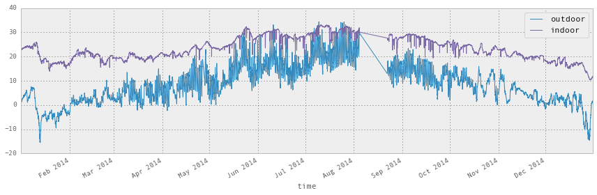


```python
# select january data
```


```python
df1.info()
```

    <class 'pandas.core.frame.DataFrame'>
    DatetimeIndex: 49548 entries, 2014-01-01 00:03:06+01:00 to 2014-12-30 23:56:35+01:00
    Data columns (total 1 columns):
    outdoor    49548 non-null float64
    dtypes: float64(1)
    memory usage: 774.2 KB


```python
df1_jan = df1[(df1.index > "2014-1-1") & (df1.index < "2014-2-1")]
```


```python
df1.index < "2014-2-1"
```


    array([ True,  True,  True, ..., False, False, False], dtype=bool)


```python
df1_jan.info()
```

    <class 'pandas.core.frame.DataFrame'>
    DatetimeIndex: 4452 entries, 2014-01-01 00:03:06+01:00 to 2014-01-31 23:56:58+01:00
    Data columns (total 1 columns):
    outdoor    4452 non-null float64
    dtypes: float64(1)
    memory usage: 69.6 KB


```python
df2_jan = df2["2014-1-1":"2014-1-31"]
```


```python
fig, ax = plt.subplots(1, 1, figsize=(12, 4))

df1_jan.plot(ax=ax)
df2_jan.plot(ax=ax)

fig.tight_layout()
fig.savefig("ch12-timeseries-selected-month.pdf")
```


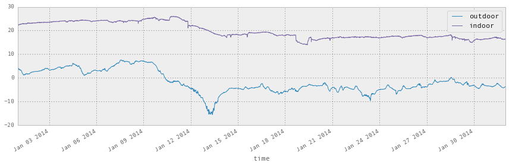


```python
# group by month
```


```python
df1_month = df1.reset_index()
```


```python
df1_month["month"] = df1_month.time.apply(lambda x: x.month)
```


```python
df1_month.head()
```


<div>
<table border="1" class="dataframe">
  <thead>
    <tr style="text-align: right;">
      <th></th>
      <th>time</th>
      <th>outdoor</th>
      <th>month</th>
    </tr>
  </thead>
  <tbody>
    <tr>
      <th>0</th>
      <td>2014-01-01 00:03:06+01:00</td>
      <td>4.38</td>
      <td>1</td>
    </tr>
    <tr>
      <th>1</th>
      <td>2014-01-01 00:13:06+01:00</td>
      <td>4.25</td>
      <td>1</td>
    </tr>
    <tr>
      <th>2</th>
      <td>2014-01-01 00:23:07+01:00</td>
      <td>4.19</td>
      <td>1</td>
    </tr>
    <tr>
      <th>3</th>
      <td>2014-01-01 00:33:07+01:00</td>
      <td>4.06</td>
      <td>1</td>
    </tr>
    <tr>
      <th>4</th>
      <td>2014-01-01 00:43:08+01:00</td>
      <td>4.06</td>
      <td>1</td>
    </tr>
  </tbody>
</table>
</div>


```python
df1_month = df1_month.groupby("month").aggregate(np.mean)
```


```python
df2_month = df2.reset_index()
```


```python
df2_month["month"] = df2_month.time.apply(lambda x: x.month)
```


```python
df2_month = df2_month.groupby("month").aggregate(np.mean)
```


```python
df_month = df1_month.join(df2_month)
```


```python
df_month.head(3)
```


<div>
<table border="1" class="dataframe">
  <thead>
    <tr style="text-align: right;">
      <th></th>
      <th>outdoor</th>
      <th>indoor</th>
    </tr>
    <tr>
      <th>month</th>
      <th></th>
      <th></th>
    </tr>
  </thead>
  <tbody>
    <tr>
      <th>1</th>
      <td>-1.776646</td>
      <td>19.862590</td>
    </tr>
    <tr>
      <th>2</th>
      <td>2.231613</td>
      <td>20.231507</td>
    </tr>
    <tr>
      <th>3</th>
      <td>4.615437</td>
      <td>19.597748</td>
    </tr>
  </tbody>
</table>
</div>


```python
df_month = pd.concat([df.to_period("M").groupby(level=0).mean() for df in [df1, df2]], axis=1)
```


```python
df_month.head(3)
```


<div>
<table border="1" class="dataframe">
  <thead>
    <tr style="text-align: right;">
      <th></th>
      <th>outdoor</th>
      <th>indoor</th>
    </tr>
    <tr>
      <th>time</th>
      <th></th>
      <th></th>
    </tr>
  </thead>
  <tbody>
    <tr>
      <th>2014-01</th>
      <td>-1.776646</td>
      <td>19.862590</td>
    </tr>
    <tr>
      <th>2014-02</th>
      <td>2.231613</td>
      <td>20.231507</td>
    </tr>
    <tr>
      <th>2014-03</th>
      <td>4.615437</td>
      <td>19.597748</td>
    </tr>
  </tbody>
</table>
</div>


```python
fig, axes = plt.subplots(1, 2, figsize=(12, 4))

df_month.plot(kind='bar', ax=axes[0])
df_month.plot(kind='box', ax=axes[1])

fig.tight_layout()
fig.savefig("ch12-grouped-by-month.pdf")
```


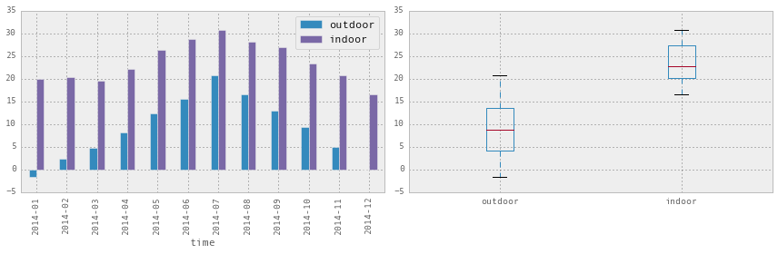


```python
df_month
```


<div>
<table border="1" class="dataframe">
  <thead>
    <tr style="text-align: right;">
      <th></th>
      <th>outdoor</th>
      <th>indoor</th>
    </tr>
    <tr>
      <th>time</th>
      <th></th>
      <th></th>
    </tr>
  </thead>
  <tbody>
    <tr>
      <th>2014-01</th>
      <td>-1.776646</td>
      <td>19.862590</td>
    </tr>
    <tr>
      <th>2014-02</th>
      <td>2.231613</td>
      <td>20.231507</td>
    </tr>
    <tr>
      <th>2014-03</th>
      <td>4.615437</td>
      <td>19.597748</td>
    </tr>
    <tr>
      <th>2014-04</th>
      <td>8.105193</td>
      <td>22.149754</td>
    </tr>
    <tr>
      <th>2014-05</th>
      <td>12.261396</td>
      <td>26.332160</td>
    </tr>
    <tr>
      <th>2014-06</th>
      <td>15.586955</td>
      <td>28.687491</td>
    </tr>
    <tr>
      <th>2014-07</th>
      <td>20.780314</td>
      <td>30.605333</td>
    </tr>
    <tr>
      <th>2014-08</th>
      <td>16.494823</td>
      <td>28.099068</td>
    </tr>
    <tr>
      <th>2014-09</th>
      <td>12.823905</td>
      <td>26.950366</td>
    </tr>
    <tr>
      <th>2014-10</th>
      <td>9.352000</td>
      <td>23.379460</td>
    </tr>
    <tr>
      <th>2014-11</th>
      <td>4.992142</td>
      <td>20.610365</td>
    </tr>
    <tr>
      <th>2014-12</th>
      <td>-0.058940</td>
      <td>16.465674</td>
    </tr>
  </tbody>
</table>
</div>


```python
# resampling
```


```python
df1_hour = df1.resample("H")
```


```python
df1_hour.columns = ["outdoor (hourly avg.)"]
```


```python
df1_day = df1.resample("D")
```


```python
df1_day.columns = ["outdoor (daily avg.)"]
```


```python
df1_week = df1.resample("7D")
```


```python
df1_week.columns = ["outdoor (weekly avg.)"]
```


```python
df1_month = df1.resample("M")
```


```python
df1_month.columns = ["outdoor (monthly avg.)"]
```


```python
df_diff = (df1.resample("D").outdoor - df2.resample("D").indoor)
```


```python
fig, (ax1, ax2) = plt.subplots(2, 1, figsize=(12, 6))

df1_hour.plot(ax=ax1, alpha=0.25)
df1_day.plot(ax=ax1)
df1_week.plot(ax=ax1)
df1_month.plot(ax=ax1)

df_diff.plot(ax=ax2)
ax2.set_title("temperature difference between outdoor and indoor")

fig.tight_layout()
fig.savefig("ch12-timeseries-resampled.pdf")
```


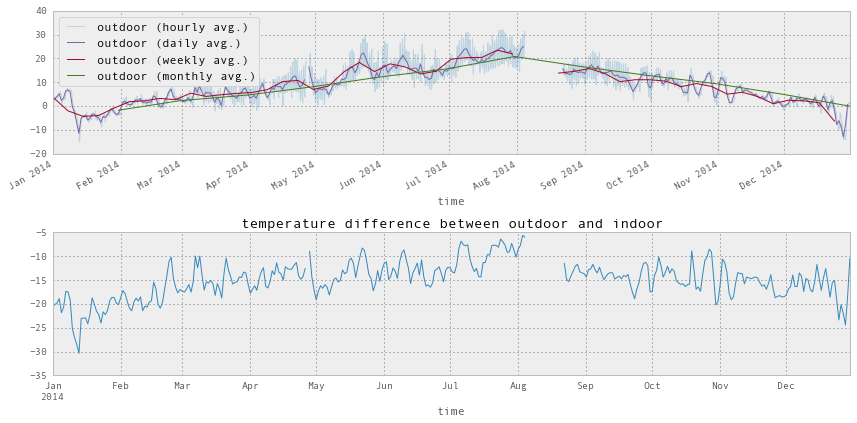


```python
fill_methods = [None, 'ffill', 'bfill']
```


```python
pd.concat([df1.resample("5min", fill_method=fm).rename(columns={"outdoor": fm})
           for fm in fill_methods], axis=1).head()
```


<div>
<table border="1" class="dataframe">
  <thead>
    <tr style="text-align: right;">
      <th></th>
      <th>None</th>
      <th>ffill</th>
      <th>bfill</th>
    </tr>
    <tr>
      <th>time</th>
      <th></th>
      <th></th>
      <th></th>
    </tr>
  </thead>
  <tbody>
    <tr>
      <th>2014-01-01 00:00:00+01:00</th>
      <td>4.38</td>
      <td>4.38</td>
      <td>4.38</td>
    </tr>
    <tr>
      <th>2014-01-01 00:05:00+01:00</th>
      <td>NaN</td>
      <td>4.38</td>
      <td>4.25</td>
    </tr>
    <tr>
      <th>2014-01-01 00:10:00+01:00</th>
      <td>4.25</td>
      <td>4.25</td>
      <td>4.25</td>
    </tr>
    <tr>
      <th>2014-01-01 00:15:00+01:00</th>
      <td>NaN</td>
      <td>4.25</td>
      <td>4.19</td>
    </tr>
    <tr>
      <th>2014-01-01 00:20:00+01:00</th>
      <td>4.19</td>
      <td>4.19</td>
      <td>4.19</td>
    </tr>
  </tbody>
</table>
</div>


## Selected day


```python
df1_dec25 = df1[(df1.index < "2014-9-1") & (df1.index >= "2014-8-1")].resample("D")
```


```python
df1_dec25 = df1.ix["2014-12-25"]
```


```python
df1_dec25.head(5)
```


<div>
<table border="1" class="dataframe">
  <thead>
    <tr style="text-align: right;">
      <th></th>
      <th>outdoor</th>
    </tr>
    <tr>
      <th>time</th>
      <th></th>
    </tr>
  </thead>
  <tbody>
    <tr>
      <th>2014-12-25 00:01:45+01:00</th>
      <td>-4.88</td>
    </tr>
    <tr>
      <th>2014-12-25 00:11:45+01:00</th>
      <td>-4.94</td>
    </tr>
    <tr>
      <th>2014-12-25 00:21:46+01:00</th>
      <td>-5.06</td>
    </tr>
    <tr>
      <th>2014-12-25 00:31:47+01:00</th>
      <td>-5.06</td>
    </tr>
    <tr>
      <th>2014-12-25 00:41:47+01:00</th>
      <td>-5.12</td>
    </tr>
  </tbody>
</table>
</div>


```python
df2_dec25 = df2.ix["2014-12-25"]
```


```python
df2_dec25.head(5)
```


<div>
<table border="1" class="dataframe">
  <thead>
    <tr style="text-align: right;">
      <th></th>
      <th>indoor</th>
    </tr>
    <tr>
      <th>time</th>
      <th></th>
    </tr>
  </thead>
  <tbody>
    <tr>
      <th>2014-12-25 00:01:45+01:00</th>
      <td>16.31</td>
    </tr>
    <tr>
      <th>2014-12-25 00:11:45+01:00</th>
      <td>16.25</td>
    </tr>
    <tr>
      <th>2014-12-25 00:21:46+01:00</th>
      <td>16.31</td>
    </tr>
    <tr>
      <th>2014-12-25 00:31:47+01:00</th>
      <td>16.31</td>
    </tr>
    <tr>
      <th>2014-12-25 00:41:47+01:00</th>
      <td>16.25</td>
    </tr>
  </tbody>
</table>
</div>


```python
df1_dec25.describe().T
```


<div>
<table border="1" class="dataframe">
  <thead>
    <tr style="text-align: right;">
      <th></th>
      <th>count</th>
      <th>mean</th>
      <th>std</th>
      <th>min</th>
      <th>25%</th>
      <th>50%</th>
      <th>75%</th>
      <th>max</th>
    </tr>
  </thead>
  <tbody>
    <tr>
      <th>outdoor</th>
      <td>144</td>
      <td>-7.788819</td>
      <td>1.456085</td>
      <td>-10.06</td>
      <td>-9.075</td>
      <td>-7.75</td>
      <td>-6.8625</td>
      <td>-4.88</td>
    </tr>
  </tbody>
</table>
</div>


```python
fig, ax = plt.subplots(1, 1, figsize=(12, 4))

df1_dec25.plot(ax=ax)

fig.savefig("ch12-timeseries-selected-month.pdf")
```


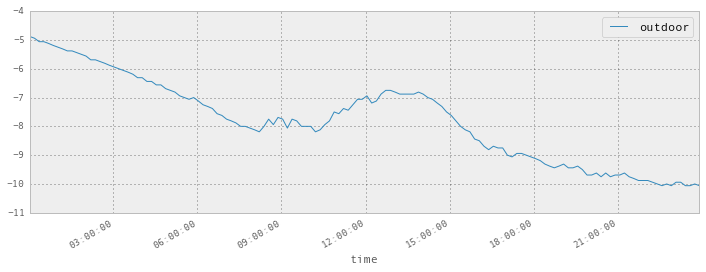


```python
df1.index
```


    DatetimeIndex(['2014-01-01 00:03:06+01:00', '2014-01-01 00:13:06+01:00',
                   '2014-01-01 00:23:07+01:00', '2014-01-01 00:33:07+01:00',
                   '2014-01-01 00:43:08+01:00', '2014-01-01 00:53:08+01:00',
                   '2014-01-01 01:03:09+01:00', '2014-01-01 01:13:09+01:00',
                   '2014-01-01 01:23:10+01:00', '2014-01-01 01:33:26+01:00',
                   ...
                   '2014-12-30 22:26:30+01:00', '2014-12-30 22:36:31+01:00',
                   '2014-12-30 22:46:31+01:00', '2014-12-30 22:56:32+01:00',
                   '2014-12-30 23:06:32+01:00', '2014-12-30 23:16:33+01:00',
                   '2014-12-30 23:26:33+01:00', '2014-12-30 23:36:34+01:00',
                   '2014-12-30 23:46:35+01:00', '2014-12-30 23:56:35+01:00'],
                  dtype='datetime64[ns]', name=u'time', length=49548, freq=None, tz='Europe/Stockholm')


# Seaborn statistical visualization library


```python
import seaborn as sns
```


```python
sns.set(style="darkgrid")
```


```python
#sns.set(style="whitegrid")
```


```python
df1 = pd.read_csv('temperature_outdoor_2014.tsv', delimiter="\t", names=["time", "outdoor"])
df1.time = pd.to_datetime(df1.time.values, unit="s").tz_localize('UTC').tz_convert('Europe/Stockholm')
df1 = df1.set_index("time").resample("10min")
df2 = pd.read_csv('temperature_indoor_2014.tsv', delimiter="\t", names=["time", "indoor"])
df2.time = pd.to_datetime(df2.time.values, unit="s").tz_localize('UTC').tz_convert('Europe/Stockholm')
df2 = df2.set_index("time").resample("10min")
df_temp = pd.concat([df1, df2], axis=1)
```


```python
fig, ax = plt.subplots(1, 1, figsize=(8, 4))
df_temp.resample("D").plot(y=["outdoor", "indoor"], ax=ax)
fig.tight_layout()
fig.savefig("ch12-seaborn-plot.pdf")
```


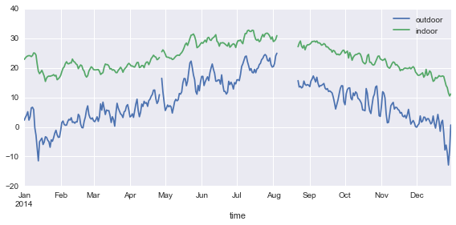


```python
#sns.kdeplot(df_temp["outdoor"].dropna().values, shade=True, cumulative=True);
```


```python
sns.distplot(df_temp.to_period("M")["outdoor"]["2014-04"].dropna().values, bins=50);
sns.distplot(df_temp.to_period("M")["indoor"]["2014-04"].dropna().values, bins=50);

plt.savefig("ch12-seaborn-distplot.pdf")
```


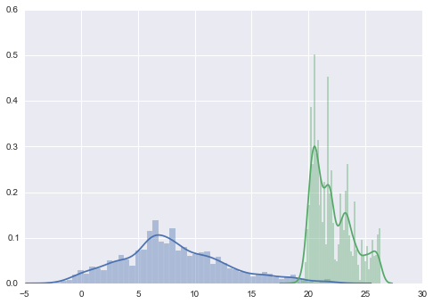


```python
with sns.axes_style("white"):
    sns.jointplot(df_temp.resample("H")["outdoor"].values,
                  df_temp.resample("H")["indoor"].values, kind="hex");

plt.savefig("ch12-seaborn-jointplot.pdf")
```


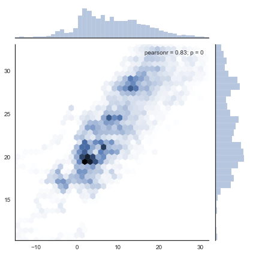


```python
sns.kdeplot(df_temp.resample("H")["outdoor"].dropna().values,
            df_temp.resample("H")["indoor"].dropna().values, shade=False);

plt.savefig("ch12-seaborn-kdeplot.pdf")
```


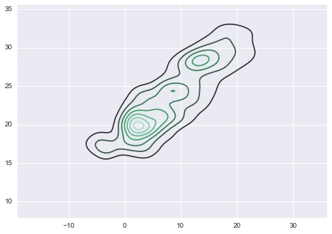


```python
fig, (ax1, ax2) = plt.subplots(1, 2, figsize=(8, 4))

sns.boxplot(df_temp.dropna(), ax=ax1, palette="pastel")
sns.violinplot(df_temp.dropna(), ax=ax2, palette="pastel")

fig.tight_layout()
fig.savefig("ch12-seaborn-boxplot-violinplot.pdf")
```


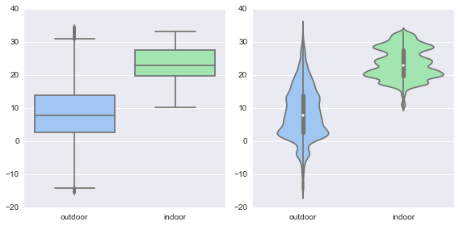


```python
sns.violinplot(x=df_temp.dropna().index.month, y=df_temp.dropna().outdoor, color="skyblue");

plt.savefig("ch12-seaborn-violinplot.pdf")
```


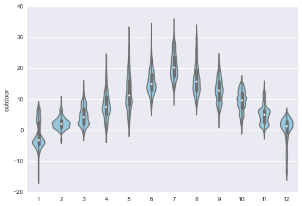


```python
df_temp["month"] = df_temp.index.month
df_temp["hour"] = df_temp.index.hour
```


```python
df_temp.head()
```


<div>
<table border="1" class="dataframe">
  <thead>
    <tr style="text-align: right;">
      <th></th>
      <th>outdoor</th>
      <th>indoor</th>
      <th>month</th>
      <th>hour</th>
    </tr>
    <tr>
      <th>time</th>
      <th></th>
      <th></th>
      <th></th>
      <th></th>
    </tr>
  </thead>
  <tbody>
    <tr>
      <th>2014-01-01 00:00:00+01:00</th>
      <td>4.38</td>
      <td>21.94</td>
      <td>1</td>
      <td>0</td>
    </tr>
    <tr>
      <th>2014-01-01 00:10:00+01:00</th>
      <td>4.25</td>
      <td>22.00</td>
      <td>1</td>
      <td>0</td>
    </tr>
    <tr>
      <th>2014-01-01 00:20:00+01:00</th>
      <td>4.19</td>
      <td>22.00</td>
      <td>1</td>
      <td>0</td>
    </tr>
    <tr>
      <th>2014-01-01 00:30:00+01:00</th>
      <td>4.06</td>
      <td>22.00</td>
      <td>1</td>
      <td>0</td>
    </tr>
    <tr>
      <th>2014-01-01 00:40:00+01:00</th>
      <td>4.06</td>
      <td>22.00</td>
      <td>1</td>
      <td>0</td>
    </tr>
  </tbody>
</table>
</div>


```python
table = pd.pivot_table(df_temp, values='outdoor', index=['month'], columns=['hour'], aggfunc=np.mean)
```


```python
table
```


<div>
<table border="1" class="dataframe">
  <thead>
    <tr style="text-align: right;">
      <th>hour</th>
      <th>0</th>
      <th>1</th>
      <th>2</th>
      <th>3</th>
      <th>4</th>
      <th>5</th>
      <th>6</th>
      <th>7</th>
      <th>8</th>
      <th>9</th>
      <th>...</th>
      <th>14</th>
      <th>15</th>
      <th>16</th>
      <th>17</th>
      <th>18</th>
      <th>19</th>
      <th>20</th>
      <th>21</th>
      <th>22</th>
      <th>23</th>
    </tr>
    <tr>
      <th>month</th>
      <th></th>
      <th></th>
      <th></th>
      <th></th>
      <th></th>
      <th></th>
      <th></th>
      <th></th>
      <th></th>
      <th></th>
      <th></th>
      <th></th>
      <th></th>
      <th></th>
      <th></th>
      <th></th>
      <th></th>
      <th></th>
      <th></th>
      <th></th>
      <th></th>
    </tr>
  </thead>
  <tbody>
    <tr>
      <th>1</th>
      <td>-1.692312</td>
      <td>-1.750162</td>
      <td>-1.826649</td>
      <td>-1.879086</td>
      <td>-1.922527</td>
      <td>-1.968065</td>
      <td>-2.020914</td>
      <td>-2.035806</td>
      <td>-2.101774</td>
      <td>-2.001022</td>
      <td>...</td>
      <td>-1.457849</td>
      <td>-1.696935</td>
      <td>-1.814194</td>
      <td>-1.812258</td>
      <td>-1.853297</td>
      <td>-1.898432</td>
      <td>-1.839730</td>
      <td>-1.806486</td>
      <td>-1.854462</td>
      <td>-1.890811</td>
    </tr>
    <tr>
      <th>2</th>
      <td>1.613690</td>
      <td>1.521190</td>
      <td>1.479405</td>
      <td>1.464371</td>
      <td>1.506407</td>
      <td>1.485595</td>
      <td>1.499167</td>
      <td>1.516946</td>
      <td>1.669226</td>
      <td>2.067725</td>
      <td>...</td>
      <td>3.573593</td>
      <td>3.360741</td>
      <td>2.939390</td>
      <td>2.501607</td>
      <td>2.357425</td>
      <td>2.236190</td>
      <td>2.204458</td>
      <td>2.137619</td>
      <td>2.024671</td>
      <td>1.896190</td>
    </tr>
    <tr>
      <th>3</th>
      <td>3.192366</td>
      <td>2.866774</td>
      <td>2.628000</td>
      <td>2.524140</td>
      <td>2.384140</td>
      <td>2.235538</td>
      <td>2.243387</td>
      <td>2.622258</td>
      <td>3.419301</td>
      <td>4.466290</td>
      <td>...</td>
      <td>7.790323</td>
      <td>7.930914</td>
      <td>7.595892</td>
      <td>6.770914</td>
      <td>5.731508</td>
      <td>4.983784</td>
      <td>4.437419</td>
      <td>4.022312</td>
      <td>3.657903</td>
      <td>3.407258</td>
    </tr>
    <tr>
      <th>4</th>
      <td>5.832738</td>
      <td>5.336012</td>
      <td>4.926667</td>
      <td>4.597059</td>
      <td>4.380000</td>
      <td>4.109769</td>
      <td>4.123699</td>
      <td>4.741437</td>
      <td>5.878035</td>
      <td>7.272299</td>
      <td>...</td>
      <td>12.175556</td>
      <td>12.500059</td>
      <td>12.494483</td>
      <td>12.361156</td>
      <td>11.989240</td>
      <td>10.454881</td>
      <td>8.857619</td>
      <td>7.712619</td>
      <td>6.974762</td>
      <td>6.293512</td>
    </tr>
    <tr>
      <th>5</th>
      <td>9.792204</td>
      <td>9.369351</td>
      <td>9.009839</td>
      <td>8.670914</td>
      <td>8.463387</td>
      <td>8.446919</td>
      <td>8.772324</td>
      <td>9.562742</td>
      <td>10.723622</td>
      <td>12.047717</td>
      <td>...</td>
      <td>15.542581</td>
      <td>15.744624</td>
      <td>15.784839</td>
      <td>15.799570</td>
      <td>17.009892</td>
      <td>15.685161</td>
      <td>13.632796</td>
      <td>12.216290</td>
      <td>11.291237</td>
      <td>10.622849</td>
    </tr>
    <tr>
      <th>6</th>
      <td>13.209556</td>
      <td>12.792889</td>
      <td>12.382889</td>
      <td>11.967889</td>
      <td>11.735778</td>
      <td>11.886667</td>
      <td>12.503778</td>
      <td>13.338167</td>
      <td>14.343444</td>
      <td>15.665475</td>
      <td>...</td>
      <td>18.630556</td>
      <td>18.866292</td>
      <td>18.680611</td>
      <td>18.529832</td>
      <td>20.057877</td>
      <td>18.853389</td>
      <td>16.969777</td>
      <td>15.675111</td>
      <td>14.658778</td>
      <td>13.898167</td>
    </tr>
    <tr>
      <th>7</th>
      <td>17.956344</td>
      <td>17.348641</td>
      <td>16.793152</td>
      <td>16.309892</td>
      <td>16.001559</td>
      <td>15.986774</td>
      <td>16.506613</td>
      <td>17.478226</td>
      <td>18.850054</td>
      <td>20.533763</td>
      <td>...</td>
      <td>24.598441</td>
      <td>25.030000</td>
      <td>24.869194</td>
      <td>24.764409</td>
      <td>26.155161</td>
      <td>24.896505</td>
      <td>22.550269</td>
      <td>20.882649</td>
      <td>19.699022</td>
      <td>18.822634</td>
    </tr>
    <tr>
      <th>8</th>
      <td>14.498205</td>
      <td>13.960128</td>
      <td>13.555128</td>
      <td>12.995641</td>
      <td>12.651410</td>
      <td>12.485974</td>
      <td>12.680130</td>
      <td>13.403506</td>
      <td>14.578780</td>
      <td>16.170833</td>
      <td>...</td>
      <td>20.473810</td>
      <td>20.292381</td>
      <td>20.328795</td>
      <td>19.642436</td>
      <td>19.373846</td>
      <td>18.713462</td>
      <td>17.034872</td>
      <td>15.843590</td>
      <td>15.146154</td>
      <td>14.596667</td>
    </tr>
    <tr>
      <th>9</th>
      <td>11.133000</td>
      <td>10.725667</td>
      <td>10.362444</td>
      <td>9.976833</td>
      <td>9.729333</td>
      <td>9.503944</td>
      <td>9.357500</td>
      <td>9.689778</td>
      <td>10.600778</td>
      <td>11.829106</td>
      <td>...</td>
      <td>16.336983</td>
      <td>16.828268</td>
      <td>17.031056</td>
      <td>16.786983</td>
      <td>15.853556</td>
      <td>14.534637</td>
      <td>13.350444</td>
      <td>12.545278</td>
      <td>11.954190</td>
      <td>11.399056</td>
    </tr>
    <tr>
      <th>10</th>
      <td>8.602011</td>
      <td>8.490598</td>
      <td>8.382486</td>
      <td>8.257097</td>
      <td>8.166774</td>
      <td>8.140054</td>
      <td>8.140161</td>
      <td>8.148333</td>
      <td>8.410914</td>
      <td>9.054946</td>
      <td>...</td>
      <td>11.330323</td>
      <td>11.189194</td>
      <td>10.836865</td>
      <td>10.361568</td>
      <td>9.781022</td>
      <td>9.373441</td>
      <td>9.134570</td>
      <td>8.956505</td>
      <td>8.820270</td>
      <td>8.623297</td>
    </tr>
    <tr>
      <th>11</th>
      <td>4.847111</td>
      <td>4.765922</td>
      <td>4.815642</td>
      <td>4.773240</td>
      <td>4.809611</td>
      <td>4.785833</td>
      <td>4.741222</td>
      <td>4.739778</td>
      <td>4.794500</td>
      <td>4.965389</td>
      <td>...</td>
      <td>5.526034</td>
      <td>5.342753</td>
      <td>5.081250</td>
      <td>5.056629</td>
      <td>4.959106</td>
      <td>4.868111</td>
      <td>4.833333</td>
      <td>4.774389</td>
      <td>4.720722</td>
      <td>4.699722</td>
    </tr>
    <tr>
      <th>12</th>
      <td>-0.366369</td>
      <td>-0.390556</td>
      <td>-0.447374</td>
      <td>-0.370111</td>
      <td>-0.353128</td>
      <td>-0.319832</td>
      <td>-0.358667</td>
      <td>-0.410278</td>
      <td>-0.483167</td>
      <td>-0.344667</td>
      <td>...</td>
      <td>0.738944</td>
      <td>0.367056</td>
      <td>0.152167</td>
      <td>-0.106111</td>
      <td>-0.182500</td>
      <td>-0.244167</td>
      <td>-0.290000</td>
      <td>-0.305333</td>
      <td>-0.302778</td>
      <td>-0.325642</td>
    </tr>
  </tbody>
</table>
<p>12 rows × 24 columns</p>
</div>


```python
fig, ax = plt.subplots(1, 1, figsize=(8, 4))
sns.heatmap(table, ax=ax);

fig.tight_layout()
fig.savefig("ch12-seaborn-heatmap.pdf")
```


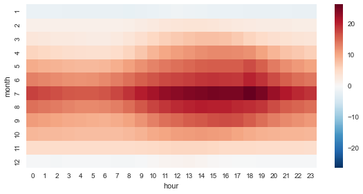


## Versions


```python
%reload_ext version_information
```


```python
%version_information numpy, matplotlib, pandas, seaborn
```


<table><tr><th>Software</th><th>Version</th></tr><tr><td>Python</td><td>2.7.10 64bit [GCC 4.2.1 (Apple Inc. build 5577)]</td></tr><tr><td>IPython</td><td>3.2.1</td></tr><tr><td>OS</td><td>Darwin 14.1.0 x86_64 i386 64bit</td></tr><tr><td>numpy</td><td>1.9.2</td></tr><tr><td>matplotlib</td><td>1.4.3</td></tr><tr><td>pandas</td><td>0.16.2</td></tr><tr><td>seaborn</td><td>0.6.0</td></tr></table>
