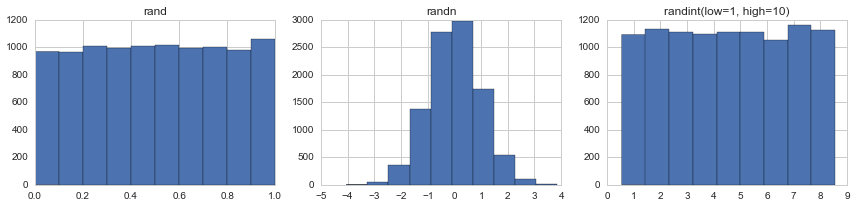
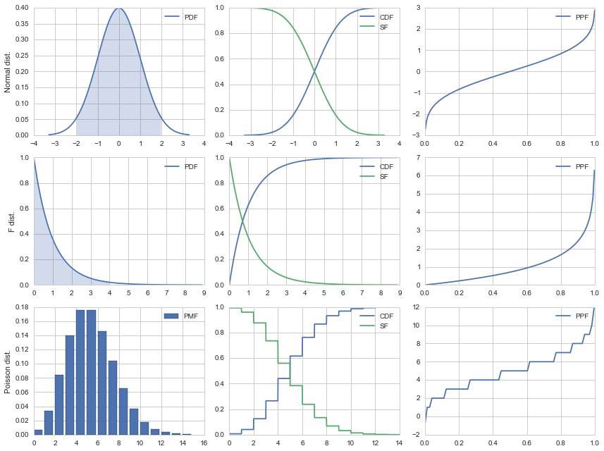
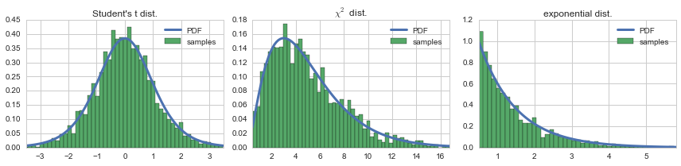
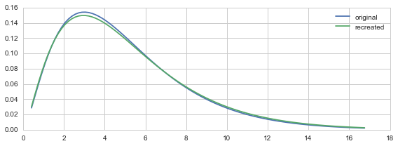
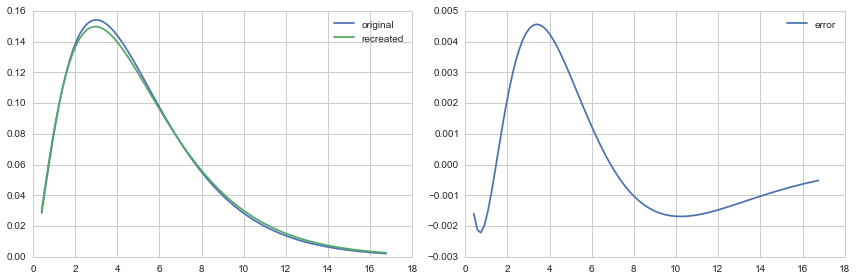
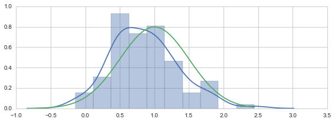
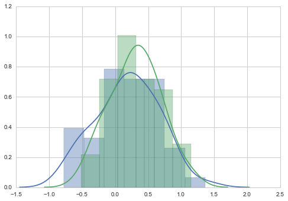
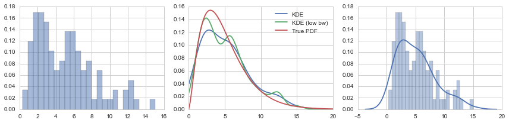
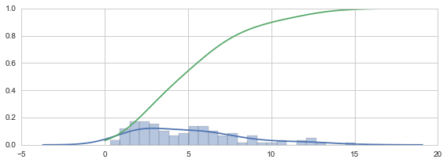

# Chapter 13: Statistics
<!-- toc orderedList:0 depthFrom:1 depthTo:6 -->

* [Chapter 13: Statistics](#chapter-13-statistics)
  * [Imports](#imports)
  * [Descriptive statistics](#descriptive-statistics)
  * [Random numbers](#random-numbers)
* [Probability distributions and random variables](#probability-distributions-and-random-variables)
* [Hypothesis testing](#hypothesis-testing)
* [Nonparameteric methods](#nonparameteric-methods)
* [Versions](#versions)

<!-- tocstop -->


---

Robert Johansson

Source code listings for [Numerical Python - A Practical Techniques Approach for Industry](http://www.apress.com/9781484205549) (ISBN 978-1-484205-54-9).

The source code listings can be downloaded from http://www.apress.com/9781484205549

## Imports


```python
from scipy import stats
```


```python
from scipy import optimize
```


```python
import numpy as np
import random
```


```python
%matplotlib inline
import matplotlib.pyplot as plt
```


```python
import seaborn as sns
```


```python
sns.set(style="whitegrid")
```

## Descriptive statistics


```python
x = np.array([3.5, 1.1, 3.2, 2.8, 6.7, 4.4, 0.9, 2.2])
```


```python
np.mean(x)
```


    3.1000000000000001


```python
np.median(x)
```


    3.0


```python
x.min(), x.max()
```


    (0.90000000000000002, 6.7000000000000002)


```python
x.var()
```


    3.0700000000000007


```python
x.std()
```


    1.7521415467935233


```python
x.var(ddof=1)
```


    3.5085714285714293


```python
x.std(ddof=1)
```


    1.8731181032095732


## Random numbers


```python
random.seed(123456789)
```


```python
random.random()
```


    0.6414006161858726


```python
random.randint(0, 10)  # 0 and 10 inclusive
```


    5


```python
np.random.seed(123456789)
```


```python
np.random.rand()
```


    0.532833024789759


```python
np.random.randn()
```


    0.8768342101492541


```python
np.random.rand(5)
```


    array([ 0.71356403,  0.25699895,  0.75269361,  0.88387918,  0.15489908])


```python
np.random.randn(2, 4)
```


    array([[ 3.13325952,  1.15727052,  1.37591514,  0.94302846],
           [ 0.8478706 ,  0.52969142, -0.56940469,  0.83180456]])


```python
np.random.randint(10, size=10)
```


    array([0, 3, 8, 3, 9, 0, 6, 9, 2, 7])


```python
np.random.randint(low=10, high=20, size=(2, 10))
```


    array([[12, 18, 18, 17, 14, 12, 14, 10, 16, 19],
           [15, 13, 15, 18, 11, 17, 17, 10, 13, 17]])


```python
fig, axes = plt.subplots(1, 3, figsize=(12, 3))

axes[0].hist(np.random.rand(10000))
axes[0].set_title("rand")
axes[1].hist(np.random.randn(10000))
axes[1].set_title("randn")
axes[2].hist(np.random.randint(low=1, high=10, size=10000), bins=9, align='left')
axes[2].set_title("randint(low=1, high=10)")

fig.tight_layout()
fig.savefig("ch13-random-hist.pdf")
```





```python
#random.sample(range(10), 5)
```


```python
np.random.choice(10, 5, replace=False)
```


    array([9, 0, 5, 8, 1])


```python
np.random.seed(123456789)
```


```python
np.random.rand()
```


    0.532833024789759


```python
np.random.seed(123456789); np.random.rand()
```


    0.532833024789759


```python
np.random.seed(123456789); np.random.rand()
```


    0.532833024789759


```python
prng = np.random.RandomState(123456789)
```


```python
prng.rand(2, 4)
```


    array([[ 0.53283302,  0.5341366 ,  0.50955304,  0.71356403],
           [ 0.25699895,  0.75269361,  0.88387918,  0.15489908]])


```python
prng.chisquare(1, size=(2, 2))
```


    array([[  1.00418922e+00,   1.26859720e+00],
           [  2.02731988e+00,   2.52605129e-05]])


```python
prng.standard_t(1, size=(2, 3))
```


    array([[ 0.59734384, -1.27669959,  0.09724793],
           [ 0.22451466,  0.39697518, -0.19469463]])


```python
prng.f(5, 2, size=(2, 4))
```


    array([[  0.77372119,   0.1213796 ,   1.64779052,   1.21399831],
           [  0.45471421,  17.64891848,   1.48620557,   2.55433261]])


```python
prng.binomial(10, 0.5, size=10)
```


    array([8, 3, 4, 2, 4, 5, 4, 4, 7, 5])


```python
prng.poisson(5, size=10)
```


    array([7, 1, 3, 4, 6, 4, 9, 7, 3, 6])


# Probability distributions and random variables


```python
np.random.seed(123456789)
```


```python
X = stats.norm(1, 0.5)
```


```python
X.mean()
```


    1.0


```python
X.median()
```


    1.0


```python
X.std()
```


    0.5


```python
X.var()
```


    0.25


```python
[X.moment(n) for n in range(5)]
```


    [1.0, 1.0, 1.25, 1.75, 2.6875]


```python
X.stats()
```


    (array(1.0), array(0.25))


```python
X.pdf([0, 1, 2])
```


    array([ 0.10798193,  0.79788456,  0.10798193])


```python
X.cdf([0, 1, 2])
```


    array([ 0.02275013,  0.5       ,  0.97724987])


```python
X.rvs(10)
```


    array([ 2.106451  ,  2.0641989 ,  1.9208557 ,  1.04119124,  1.42948184,
            0.58699179,  1.57863526,  1.68795757,  1.47151423,  1.4239353 ])


```python
stats.norm(1, 0.5).stats()
```


    (array(1.0), array(0.25))


```python
stats.norm.stats(loc=2, scale=0.5)
```


    (array(2.0), array(0.25))


```python
X.interval(0.95)
```


    (0.020018007729972975, 1.979981992270027)


```python
X.interval(0.99)
```


    (-0.28791465177445019, 2.2879146517744502)


```python
def plot_rv_distribution(X, axes=None):
    """Plot the PDF, CDF, SF and PPF of a given random variable"""
    if axes is None:
        fig, axes = plt.subplots(1, 3, figsize=(12, 3))

    x_min_999, x_max_999 = X.interval(0.999)
    x999 = np.linspace(x_min_999, x_max_999, 1000)

    x_min_95, x_max_95 = X.interval(0.95)
    x95 = np.linspace(x_min_95, x_max_95, 1000)

    if hasattr(X.dist, 'pdf'):
        axes[0].plot(x999, X.pdf(x999), label="PDF")
        axes[0].fill_between(x95, X.pdf(x95), alpha=0.25)
    else:
        x999_int = np.unique(x999.astype(int))
        axes[0].bar(x999_int, X.pmf(x999_int), label="PMF")
    axes[1].plot(x999, X.cdf(x999), label="CDF")
    axes[1].plot(x999, X.sf(x999), label="SF")
    axes[2].plot(x999, X.ppf(x999), label="PPF")

    for ax in axes:
        ax.legend()

    return axes
```


```python
fig, axes = plt.subplots(3, 3, figsize=(12, 9))

X = stats.norm()
plot_rv_distribution(X, axes=axes[0, :])
axes[0, 0].set_ylabel("Normal dist.")
X = stats.f(2, 50)
plot_rv_distribution(X, axes=axes[1, :])
axes[1, 0].set_ylabel("F dist.")
X = stats.poisson(5)
plot_rv_distribution(X, axes=axes[2, :])
axes[2, 0].set_ylabel("Poisson dist.")

fig.tight_layout()
fig.savefig("ch13-distributions.pdf")
```





```python
def plot_dist_samples(X, X_samples, title=None, ax=None):
    """ Plot the PDF and histogram of samples of a continuous random variable"""
    if ax is None:
        fig, ax = plt.subplots(1, 1, figsize=(8, 4))

    x_lim = X.interval(.99)
    x = np.linspace(*x_lim, num=100)

    ax.plot(x, X.pdf(x), label="PDF", lw=3)
    ax.hist(X_samples, label="samples", normed=1, bins=75)
    ax.set_xlim(*x_lim)
    ax.legend()

    if title:
        ax.set_title(title)
    return ax
```


```python
fig, axes = plt.subplots(1, 3, figsize=(12, 3))
X = stats.t(7.0)
plot_dist_samples(X, X.rvs(2000), "Student's t dist.", ax=axes[0])
X = stats.chi2(5.0)
plot_dist_samples(X, X.rvs(2000), r"$\chi^2$ dist.", ax=axes[1])
X = stats.expon(0.5)
plot_dist_samples(X, X.rvs(2000), "exponential dist.", ax=axes[2])
fig.tight_layout()
fig.savefig("ch13-dist-sample.pdf")
```





```python
X = stats.chi2(df=5)
```


```python
X_samples = X.rvs(500)
```


```python
df, loc, scale = stats.chi2.fit(X_samples)
```


```python
df, loc, scale
```


    (4.728645123391404, 0.032573302191333871, 1.0734482977974253)


```python
Y = stats.chi2(df=df, loc=loc, scale=scale)
```


```python
fig, ax = plt.subplots(1, 1, figsize=(8, 3))

x_lim = X.interval(.99)
x = np.linspace(*x_lim, num=100)

ax.plot(x, X.pdf(x), label="original")
ax.plot(x, Y.pdf(x), label="recreated")
ax.legend()

fig.tight_layout()
fig.savefig("ch13-max-likelihood-fit.pdf")
```





```python
fig, axes = plt.subplots(1, 2, figsize=(12, 4))

x_lim = X.interval(.99)
x = np.linspace(*x_lim, num=100)

axes[0].plot(x, X.pdf(x), label="original")
axes[0].plot(x, Y.pdf(x), label="recreated")
axes[0].legend()

axes[1].plot(x, X.pdf(x) - Y.pdf(x), label="error")
axes[1].legend()

fig.tight_layout()
fig.savefig("ch13-max-likelihood-fit.pdf")
```





# Hypothesis testing


```python
np.random.seed(123456789)
```


```python
mu, sigma = 1.0, 0.5
```


```python
X = stats.norm(mu-0.2, sigma)
```


```python
n = 100
```


```python
X_samples = X.rvs(n)
```


```python
z = (X_samples.mean() - mu)/(sigma/np.sqrt(n))
```


```python
z
```


    -2.8338979550098298


```python
t = (X_samples.mean() - mu)/(X_samples.std(ddof=1)/np.sqrt(n))
```


```python
t
```


    -2.9680338545657845


```python
stats.norm().ppf(0.025)
```


    -1.9599639845400545


```python
2 * stats.norm().cdf(-abs(z))
```


    0.0045984013290753566


```python
2 * stats.t(df=(n-1)).cdf(-abs(t))
```


    0.0037586479674227209


```python
t, p = stats.ttest_1samp(X_samples, mu)
```


```python
t
```


    -2.9680338545657841


```python
p
```


    0.0037586479674227209


```python
fig, ax = plt.subplots(figsize=(8, 3))

sns.distplot(X_samples, ax=ax)
x = np.linspace(*X.interval(0.999), num=100)
ax.plot(x, stats.norm(loc=mu, scale=sigma).pdf(x))

fig.tight_layout()
fig.savefig("ch13-hypothesis-test-dist-sample-mean.pdf")
```





```python
n = 50
```


```python
mu1, mu2 = np.random.rand(2)
```


```python
X1 = stats.norm(mu1, sigma)
```


```python
X1_sample = X1.rvs(n)
```


```python
X2 = stats.norm(mu2, sigma)
```


```python
X2_sample = X2.rvs(n)
```


```python
t, p = stats.ttest_ind(X1_sample, X2_sample)
```


```python
t
```


    -1.4283175246005888


```python
p
```


    0.15637981059673237


```python
mu1, mu2
```


    (0.24764580637159606, 0.42145435527527897)


```python
sns.distplot(X1_sample)
sns.distplot(X2_sample)
```


    <matplotlib.axes._subplots.AxesSubplot at 0x10e26fed0>





# Nonparameteric methods


```python
np.random.seed(0)
```


```python
X = stats.chi2(df=5)
```


```python
X_samples = X.rvs(100)
```


```python
kde = stats.kde.gaussian_kde(X_samples)
```


```python
kde_low_bw = stats.kde.gaussian_kde(X_samples, bw_method=0.25)
```


```python
x = np.linspace(0, 20, 100)
```


```python
fig, axes = plt.subplots(1, 3, figsize=(12, 3))

axes[0].hist(X_samples, normed=True, alpha=0.5, bins=25)
axes[1].plot(x, kde(x), label="KDE")
axes[1].plot(x, kde_low_bw(x), label="KDE (low bw)")
axes[1].plot(x, X.pdf(x), label="True PDF")
axes[1].legend()
sns.distplot(X_samples, bins=25, ax=axes[2])

fig.tight_layout()
fig.savefig("ch13-hist-kde.pdf")
```





```python
kde.resample(10)
```


    array([[ 1.75376869,  0.5812183 ,  8.19080268,  1.38539326,  7.56980335,
             1.16144715,  3.07747215,  5.69498716,  1.25685068,  9.55169736]])


```python
def _kde_cdf(x):
    return kde.integrate_box_1d(-np.inf, x)
```


```python
kde_cdf = np.vectorize(_kde_cdf)
```


```python
fig, ax = plt.subplots(1, 1, figsize=(8, 3))

sns.distplot(X_samples, bins=25, ax=ax)
x = np.linspace(0, 20, 100)
ax.plot(x, kde_cdf(x))

fig.tight_layout()
```





```python
def _kde_ppf(q):
    return optimize.fsolve(lambda x, q: kde_cdf(x) - q, kde.dataset.mean(), args=(q,))[0]
```


```python
kde_ppf = np.vectorize(_kde_ppf)
```


```python
kde_ppf([0.05, 0.95])
```


    array([  0.39074674,  11.94993578])


```python
X.ppf([0.05, 0.95])
```


    array([  1.14547623,  11.07049769])


# Versions


```python
%reload_ext version_information
```


```python
%version_information numpy, scipy, matplotlib, seaborn
```


<table><tr><th>Software</th><th>Version</th></tr><tr><td>Python</td><td>2.7.10 64bit [GCC 4.2.1 (Apple Inc. build 5577)]</td></tr><tr><td>IPython</td><td>3.2.1</td></tr><tr><td>OS</td><td>Darwin 14.1.0 x86_64 i386 64bit</td></tr><tr><td>numpy</td><td>1.9.2</td></tr><tr><td>scipy</td><td>0.16.0</td></tr><tr><td>matplotlib</td><td>1.4.3</td></tr><tr><td>seaborn</td><td>0.6.0</td></tr></table>
