# Chapter 14: Statistical modelling
<!-- toc orderedList:0 depthFrom:1 depthTo:6 -->

* [Chapter 14: Statistical modelling](#chapter-14-statistical-modelling)
  * [Statistical models and patsy formula](#statistical-models-and-patsy-formula)
    * [Categorical variables](#categorical-variables)
* [Linear regression](#linear-regression)
    * [Datasets from R](#datasets-from-r)
  * [Discrete regression, logistic regression](#discrete-regression-logistic-regression)
    * [Poisson distribution](#poisson-distribution)
  * [Time series](#time-series)
* [Versions](#versions)

<!-- tocstop -->


---

Robert Johansson

Source code listings for [Numerical Python - A Practical Techniques Approach for Industry](http://www.apress.com/9781484205549) (ISBN 978-1-484205-54-9).

The source code listings can be downloaded from http://www.apress.com/9781484205549


```python
import statsmodels.api as sm
```


```python
import statsmodels.formula.api as smf
```


```python
import statsmodels.graphics.api as smg
```


```python
import patsy
```


```python
%matplotlib inline
import matplotlib.pyplot as plt
```


```python
import numpy as np
```


```python
import pandas as pd
```


```python
from scipy import stats
```


```python
import seaborn as sns
```

## Statistical models and patsy formula


```python
np.random.seed(123456789)
```


```python
y = np.array([1, 2, 3, 4, 5])
```


```python
x1 = np.array([6, 7, 8, 9, 10])
```


```python
x2 = np.array([11, 12, 13, 14, 15])
```


```python
X = np.vstack([np.ones(5), x1, x2, x1*x2]).T
```


```python
X
```


    array([[   1.,    6.,   11.,   66.],
           [   1.,    7.,   12.,   84.],
           [   1.,    8.,   13.,  104.],
           [   1.,    9.,   14.,  126.],
           [   1.,   10.,   15.,  150.]])


```python
beta, res, rank, sval = np.linalg.lstsq(X, y)
```


```python
beta
```


    array([ -5.55555556e-01,   1.88888889e+00,  -8.88888889e-01,
            -1.46181577e-15])


```python
data = {"y": y, "x1": x1, "x2": x2}
```


```python
y, X = patsy.dmatrices("y ~ 1 + x1 + x2 + x1*x2", data)
```


```python
y
```


    DesignMatrix with shape (5L, 1L)
      y
      1
      2
      3
      4
      5
      Terms:
        'y' (column 0)


```python
X
```


    DesignMatrix with shape (5L, 4L)
      Intercept  x1  x2  x1:x2
              1   6  11     66
              1   7  12     84
              1   8  13    104
              1   9  14    126
              1  10  15    150
      Terms:
        'Intercept' (column 0)
        'x1' (column 1)
        'x2' (column 2)
        'x1:x2' (column 3)


```python
type(X)
```


    patsy.design_info.DesignMatrix


```python
np.array(X)
```


    array([[   1.,    6.,   11.,   66.],
           [   1.,    7.,   12.,   84.],
           [   1.,    8.,   13.,  104.],
           [   1.,    9.,   14.,  126.],
           [   1.,   10.,   15.,  150.]])


```python
df_data = pd.DataFrame(data)
```


```python
y, X = patsy.dmatrices("y ~ 1 + x1 + x2 + x1:x2", df_data, return_type="dataframe")
```


```python
X
```


<div>
<table border="1" class="dataframe">
  <thead>
    <tr style="text-align: right;">
      <th></th>
      <th>Intercept</th>
      <th>x1</th>
      <th>x2</th>
      <th>x1:x2</th>
    </tr>
  </thead>
  <tbody>
    <tr>
      <th>0</th>
      <td>1</td>
      <td>6</td>
      <td>11</td>
      <td>66</td>
    </tr>
    <tr>
      <th>1</th>
      <td>1</td>
      <td>7</td>
      <td>12</td>
      <td>84</td>
    </tr>
    <tr>
      <th>2</th>
      <td>1</td>
      <td>8</td>
      <td>13</td>
      <td>104</td>
    </tr>
    <tr>
      <th>3</th>
      <td>1</td>
      <td>9</td>
      <td>14</td>
      <td>126</td>
    </tr>
    <tr>
      <th>4</th>
      <td>1</td>
      <td>10</td>
      <td>15</td>
      <td>150</td>
    </tr>
  </tbody>
</table>
</div>


```python
model = sm.OLS(y, X)
```


```python
result = model.fit()
```


```python
result.params
```


    Intercept   -5.555556e-01
    x1           1.888889e+00
    x2          -8.888889e-01
    x1:x2       -8.881784e-16
    dtype: float64


```python
model = smf.ols("y ~ 1 + x1 + x2 + x1:x2", df_data)
```


```python
result = model.fit()
```


```python
result.params
```


    Intercept   -5.555556e-01
    x1           1.888889e+00
    x2          -8.888889e-01
    x1:x2       -8.881784e-16
    dtype: float64


```python
print(result.summary())
```

                                OLS Regression Results
    ==============================================================================
    Dep. Variable:                      y   R-squared:                       1.000
    Model:                            OLS   Adj. R-squared:                  1.000
    Method:                 Least Squares   F-statistic:                 8.072e+26
    Date:                Mon, 03 Aug 2015   Prob (F-statistic):           1.24e-27
    Time:                        23:35:43   Log-Likelihood:                 146.06
    No. Observations:                   5   AIC:                            -286.1
    Df Residuals:                       2   BIC:                            -287.3
    Df Model:                           2
    Covariance Type:            nonrobust
    ==============================================================================
                     coef    std err          t      P>|t|      [95.0% Conf. Int.]
    ------------------------------------------------------------------------------
    Intercept     -0.5556   1.79e-13   -3.1e+12      0.000        -0.556    -0.556
    x1             1.8889    6.7e-13   2.82e+12      0.000         1.889     1.889
    x2            -0.8889   2.28e-13   -3.9e+12      0.000        -0.889    -0.889
    x1:x2      -8.882e-16    2.1e-14     -0.042      0.970     -9.14e-14  8.96e-14
    ==============================================================================
    Omnibus:                          nan   Durbin-Watson:                   0.002
    Prob(Omnibus):                    nan   Jarque-Bera (JB):                0.747
    Skew:                           0.913   Prob(JB):                        0.688
    Kurtosis:                       2.500   Cond. No.                     6.86e+17
    ==============================================================================

    Warnings:
    [1] Standard Errors assume that the covariance matrix of the errors is correctly specified.
    [2] The smallest eigenvalue is 1.31e-31. This might indicate that there are
    strong multicollinearity problems or that the design matrix is singular.


    /Users/rob/miniconda/envs/py27-npm/lib/python2.7/site-packages/statsmodels/stats/stattools.py:72: UserWarning: omni_normtest is not valid with less than 8 observations; 5 samples were given.
      "samples were given." % int(n))


```python
beta
```


    array([ -5.55555556e-01,   1.88888889e+00,  -8.88888889e-01,
            -1.33226763e-15])


```python
from collections import defaultdict
```


```python
data = defaultdict(lambda: np.array([1,2,3]))
```


```python
patsy.dmatrices("y ~ a", data=data)[1].design_info.term_names
```


    ['Intercept', 'a']


```python
patsy.dmatrices("y ~ 1 + a + b", data=data)[1].design_info.term_names
```


    ['Intercept', 'a', 'b']


```python
patsy.dmatrices("y ~ -1 + a + b", data=data)[1].design_info.term_names
```


    ['a', 'b']


```python
patsy.dmatrices("y ~ a * b", data=data)[1].design_info.term_names
```


    ['Intercept', 'a', 'b', 'a:b']


```python
patsy.dmatrices("y ~ a * b * c", data=data)[1].design_info.term_names
```


    ['Intercept', 'a', 'b', 'a:b', 'c', 'a:c', 'b:c', 'a:b:c']


```python
patsy.dmatrices("y ~ a * b * c - a:b:c", data=data)[1].design_info.term_names
```


    ['Intercept', 'a', 'b', 'a:b', 'c', 'a:c', 'b:c']


```python
data = {k: np.array([]) for k in ["y", "a", "b", "c"]}
```


```python
patsy.dmatrices("y ~ a + b", data=data)[1].design_info.term_names
```


    ['Intercept', 'a', 'b']


```python
patsy.dmatrices("y ~ I(a + b)", data=data)[1].design_info.term_names
```


    ['Intercept', 'I(a + b)']


```python
patsy.dmatrices("y ~ a*a", data=data)[1].design_info.term_names
```


    ['Intercept', 'a']


```python
patsy.dmatrices("y ~ I(a**2)", data=data)[1].design_info.term_names
```


    ['Intercept', 'I(a ** 2)']


```python
patsy.dmatrices("y ~ np.log(a) + b", data=data)[1].design_info.term_names
```


    ['Intercept', 'np.log(a)', 'b']


```python
z = lambda x1, x2: x1+x2
```


```python
patsy.dmatrices("y ~ z(a, b)", data=data)[1].design_info.term_names
```


    ['Intercept', 'z(a, b)']


### Categorical variables


```python
data = {"y": [1, 2, 3], "a": [1, 2, 3]}
```


```python
patsy.dmatrices("y ~ - 1 + a", data=data, return_type="dataframe")[1]
```


<div>
<table border="1" class="dataframe">
  <thead>
    <tr style="text-align: right;">
      <th></th>
      <th>a</th>
    </tr>
  </thead>
  <tbody>
    <tr>
      <th>0</th>
      <td>1</td>
    </tr>
    <tr>
      <th>1</th>
      <td>2</td>
    </tr>
    <tr>
      <th>2</th>
      <td>3</td>
    </tr>
  </tbody>
</table>
</div>


```python
patsy.dmatrices("y ~ - 1 + C(a)", data=data, return_type="dataframe")[1]
```


<div>
<table border="1" class="dataframe">
  <thead>
    <tr style="text-align: right;">
      <th></th>
      <th>C(a)[1]</th>
      <th>C(a)[2]</th>
      <th>C(a)[3]</th>
    </tr>
  </thead>
  <tbody>
    <tr>
      <th>0</th>
      <td>1</td>
      <td>0</td>
      <td>0</td>
    </tr>
    <tr>
      <th>1</th>
      <td>0</td>
      <td>1</td>
      <td>0</td>
    </tr>
    <tr>
      <th>2</th>
      <td>0</td>
      <td>0</td>
      <td>1</td>
    </tr>
  </tbody>
</table>
</div>


```python
data = {"y": [1, 2, 3], "a": ["type A", "type B", "type C"]}
```


```python
patsy.dmatrices("y ~ - 1 + a", data=data, return_type="dataframe")[1]
```


<div>
<table border="1" class="dataframe">
  <thead>
    <tr style="text-align: right;">
      <th></th>
      <th>a[type A]</th>
      <th>a[type B]</th>
      <th>a[type C]</th>
    </tr>
  </thead>
  <tbody>
    <tr>
      <th>0</th>
      <td>1</td>
      <td>0</td>
      <td>0</td>
    </tr>
    <tr>
      <th>1</th>
      <td>0</td>
      <td>1</td>
      <td>0</td>
    </tr>
    <tr>
      <th>2</th>
      <td>0</td>
      <td>0</td>
      <td>1</td>
    </tr>
  </tbody>
</table>
</div>


```python
patsy.dmatrices("y ~ - 1 + C(a, Poly)", data=data, return_type="dataframe")[1]
```


<div>
<table border="1" class="dataframe">
  <thead>
    <tr style="text-align: right;">
      <th></th>
      <th>C(a, Poly).Constant</th>
      <th>C(a, Poly).Linear</th>
      <th>C(a, Poly).Quadratic</th>
    </tr>
  </thead>
  <tbody>
    <tr>
      <th>0</th>
      <td>1</td>
      <td>-7.071068e-01</td>
      <td>0.408248</td>
    </tr>
    <tr>
      <th>1</th>
      <td>1</td>
      <td>-5.551115e-17</td>
      <td>-0.816497</td>
    </tr>
    <tr>
      <th>2</th>
      <td>1</td>
      <td>7.071068e-01</td>
      <td>0.408248</td>
    </tr>
  </tbody>
</table>
</div>


# Linear regression


```python
np.random.seed(123456789)
```


```python
N = 100
```


```python
x1 = np.random.randn(N)
```


```python
x2 = np.random.randn(N)
```


```python
data = pd.DataFrame({"x1": x1, "x2": x2})
```


```python
def y_true(x1, x2):
    return 1  + 2 * x1 + 3 * x2 + 4 * x1 * x2
```


```python
data["y_true"] = y_true(x1, x2)
```


```python
e = np.random.randn(N)
```


```python
data["y"] = data["y_true"] + e
```


```python
data.head()
```


<div>
<table border="1" class="dataframe">
  <thead>
    <tr style="text-align: right;">
      <th></th>
      <th>x1</th>
      <th>x2</th>
      <th>y_true</th>
      <th>y</th>
    </tr>
  </thead>
  <tbody>
    <tr>
      <th>0</th>
      <td>2.212902</td>
      <td>-0.474588</td>
      <td>-0.198823</td>
      <td>-1.452775</td>
    </tr>
    <tr>
      <th>1</th>
      <td>2.128398</td>
      <td>-1.524772</td>
      <td>-12.298805</td>
      <td>-12.560965</td>
    </tr>
    <tr>
      <th>2</th>
      <td>1.841711</td>
      <td>-1.939271</td>
      <td>-15.420705</td>
      <td>-14.715090</td>
    </tr>
    <tr>
      <th>3</th>
      <td>0.082382</td>
      <td>0.345148</td>
      <td>2.313945</td>
      <td>1.190283</td>
    </tr>
    <tr>
      <th>4</th>
      <td>0.858964</td>
      <td>-0.621523</td>
      <td>-1.282107</td>
      <td>0.307772</td>
    </tr>
  </tbody>
</table>
</div>


```python
fig, axes = plt.subplots(1, 2, figsize=(8, 4))

axes[0].scatter(data["x1"], data["y"])
axes[1].scatter(data["x2"], data["y"])

fig.tight_layout()
```


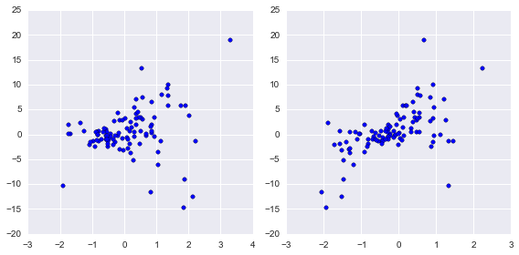


```python
data.shape
```


    (100, 4)


```python
model = smf.ols("y ~ x1 + x2", data)
```


```python
result = model.fit()
```


```python
print(result.summary())
```

                                OLS Regression Results
    ==============================================================================
    Dep. Variable:                      y   R-squared:                       0.380
    Model:                            OLS   Adj. R-squared:                  0.367
    Method:                 Least Squares   F-statistic:                     29.76
    Date:                Mon, 03 Aug 2015   Prob (F-statistic):           8.36e-11
    Time:                        23:35:43   Log-Likelihood:                -271.52
    No. Observations:                 100   AIC:                             549.0
    Df Residuals:                      97   BIC:                             556.9
    Df Model:                           2
    Covariance Type:            nonrobust
    ==============================================================================
                     coef    std err          t      P>|t|      [95.0% Conf. Int.]
    ------------------------------------------------------------------------------
    Intercept      0.9868      0.382      2.581      0.011         0.228     1.746
    x1             1.0810      0.391      2.766      0.007         0.305     1.857
    x2             3.0793      0.432      7.134      0.000         2.223     3.936
    ==============================================================================
    Omnibus:                       19.951   Durbin-Watson:                   1.682
    Prob(Omnibus):                  0.000   Jarque-Bera (JB):               49.964
    Skew:                          -0.660   Prob(JB):                     1.41e-11
    Kurtosis:                       6.201   Cond. No.                         1.32
    ==============================================================================

    Warnings:
    [1] Standard Errors assume that the covariance matrix of the errors is correctly specified.


```python
result.rsquared
```


    0.38025383255132539


```python
result.resid.head()
```


    0    -3.370455
    1   -11.153477
    2   -11.721319
    3    -0.948410
    4     0.306215
    dtype: float64


```python
z, p = stats.normaltest(result.resid.values)
```


```python
p
```


    4.6524990253009316e-05


```python
result.params
```


    Intercept    0.986826
    x1           1.081044
    x2           3.079284
    dtype: float64


```python
fig, ax = plt.subplots(figsize=(8, 4))
smg.qqplot(result.resid, ax=ax)

fig.tight_layout()
fig.savefig("ch14-qqplot-model-1.pdf")
```


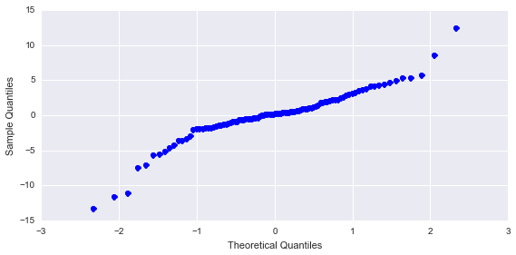


```python
model = smf.ols("y ~ x1 + x2 + x1*x2", data)
```


```python
result = model.fit()
```


```python
print(result.summary())
```

                                OLS Regression Results
    ==============================================================================
    Dep. Variable:                      y   R-squared:                       0.955
    Model:                            OLS   Adj. R-squared:                  0.954
    Method:                 Least Squares   F-statistic:                     684.5
    Date:                Mon, 03 Aug 2015   Prob (F-statistic):           1.21e-64
    Time:                        23:35:44   Log-Likelihood:                -140.01
    No. Observations:                 100   AIC:                             288.0
    Df Residuals:                      96   BIC:                             298.4
    Df Model:                           3
    Covariance Type:            nonrobust
    ==============================================================================
                     coef    std err          t      P>|t|      [95.0% Conf. Int.]
    ------------------------------------------------------------------------------
    Intercept      0.8706      0.103      8.433      0.000         0.666     1.076
    x1             1.9693      0.108     18.160      0.000         1.754     2.185
    x2             2.9670      0.117     25.466      0.000         2.736     3.198
    x1:x2          3.9440      0.112     35.159      0.000         3.721     4.167
    ==============================================================================
    Omnibus:                        2.950   Durbin-Watson:                   2.072
    Prob(Omnibus):                  0.229   Jarque-Bera (JB):                2.734
    Skew:                           0.327   Prob(JB):                        0.255
    Kurtosis:                       2.521   Cond. No.                         1.38
    ==============================================================================

    Warnings:
    [1] Standard Errors assume that the covariance matrix of the errors is correctly specified.


```python
result.params
```


    Intercept    0.870620
    x1           1.969345
    x2           2.967004
    x1:x2        3.943993
    dtype: float64


```python
result.rsquared
```


    0.95533937458843676


```python
z, p = stats.normaltest(result.resid.values)
```


```python
p
```


    0.22874710482505045


```python
fig, ax = plt.subplots(figsize=(8, 4))
smg.qqplot(result.resid, ax=ax)

fig.tight_layout()
fig.savefig("ch14-qqplot-model-2.pdf")
```


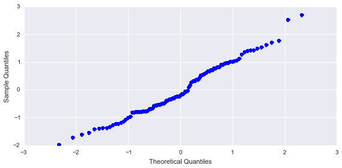


```python
x = np.linspace(-1, 1, 50)
```


```python
X1, X2 = np.meshgrid(x, x)
```


```python
new_data = pd.DataFrame({"x1": X1.ravel(), "x2": X2.ravel()})
```


```python
y_pred = result.predict(new_data)
```


```python
y_pred.shape
```


    (2500,)


```python
y_pred = y_pred.reshape(50, 50)
```


```python
fig, axes = plt.subplots(1, 2, figsize=(12, 5), sharey=True)

def plot_y_contour(ax, Y, title):
    c = ax.contourf(X1, X2, Y, 15, cmap=plt.cm.RdBu)
    ax.set_xlabel(r"$x_1$", fontsize=20)
    ax.set_ylabel(r"$x_2$", fontsize=20)
    ax.set_title(title)
    cb = fig.colorbar(c, ax=ax)
    cb.set_label(r"$y$", fontsize=20)

plot_y_contour(axes[0], y_true(X1, X2), "true relation")
plot_y_contour(axes[1], y_pred, "fitted model")

fig.tight_layout()
fig.savefig("ch14-comparison-model-true.pdf")
```


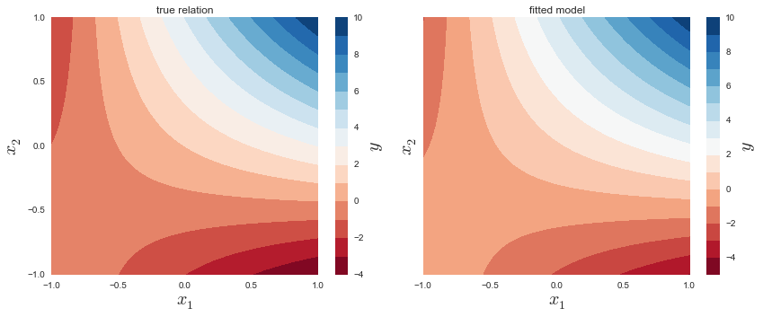


### Datasets from R


```python
dataset = sm.datasets.get_rdataset("Icecream", "Ecdat")
```


```python
dataset.title
```


    'Ice Cream Consumption'


```python
print(dataset.__doc__)
```

    +------------+-------------------+
    | Icecream   | R Documentation   |
    +------------+-------------------+

    Ice Cream Consumption
    ---------------------

    Description
    ~~~~~~~~~~~

    four–weekly observations from 1951–03–18 to 1953–07–11

    *number of observations* : 30

    *observation* : country

    *country* : United States

    Usage
    ~~~~~

    ::

        data(Icecream)

    Format
    ~~~~~~

    A time serie containing :

    cons
        consumption of ice cream per head (in pints);

    income
        average family income per week (in US Dollars);

    price
        price of ice cream (per pint);

    temp
        average temperature (in Fahrenheit);

    Source
    ~~~~~~

    Hildreth, C. and J. Lu (1960) *Demand relations with autocorrelated
    disturbances*, Technical Bulletin No 2765, Michigan State University.

    References
    ~~~~~~~~~~

    Verbeek, Marno (2004) *A guide to modern econometrics*, John Wiley and
    Sons,
    `http://www.econ.kuleuven.ac.be/GME <http://www.econ.kuleuven.ac.be/GME>`__,
    chapter 4.

    See Also
    ~~~~~~~~

    ``Index.Source``, ``Index.Economics``, ``Index.Econometrics``,
    ``Index.Observations``,

    ``Index.Time.Series``


```python
dataset.data.info()
```

    <class 'pandas.core.frame.DataFrame'>
    Int64Index: 30 entries, 0 to 29
    Data columns (total 4 columns):
    cons      30 non-null float64
    income    30 non-null int64
    price     30 non-null float64
    temp      30 non-null int64
    dtypes: float64(2), int64(2)
    memory usage: 1.2 KB


```python
model = smf.ols("cons ~ -1 + price + temp", data=dataset.data)
```


```python
result = model.fit()
```


```python
print(result.summary())
```

                                OLS Regression Results
    ==============================================================================
    Dep. Variable:                   cons   R-squared:                       0.986
    Model:                            OLS   Adj. R-squared:                  0.985
    Method:                 Least Squares   F-statistic:                     1001.
    Date:                Mon, 03 Aug 2015   Prob (F-statistic):           9.03e-27
    Time:                        23:35:49   Log-Likelihood:                 51.903
    No. Observations:                  30   AIC:                            -99.81
    Df Residuals:                      28   BIC:                            -97.00
    Df Model:                           2
    Covariance Type:            nonrobust
    ==============================================================================
                     coef    std err          t      P>|t|      [95.0% Conf. Int.]
    ------------------------------------------------------------------------------
    price          0.7254      0.093      7.805      0.000         0.535     0.916
    temp           0.0032      0.000      6.549      0.000         0.002     0.004
    ==============================================================================
    Omnibus:                        5.350   Durbin-Watson:                   0.637
    Prob(Omnibus):                  0.069   Jarque-Bera (JB):                3.675
    Skew:                           0.776   Prob(JB):                        0.159
    Kurtosis:                       3.729   Cond. No.                         593.
    ==============================================================================

    Warnings:
    [1] Standard Errors assume that the covariance matrix of the errors is correctly specified.


```python
fig, (ax1, ax2) = plt.subplots(1, 2, figsize=(12, 4))

smg.plot_fit(result, 0, ax=ax1)
smg.plot_fit(result, 1, ax=ax2)

fig.tight_layout()
fig.savefig("ch14-regressionplots.pdf")
```


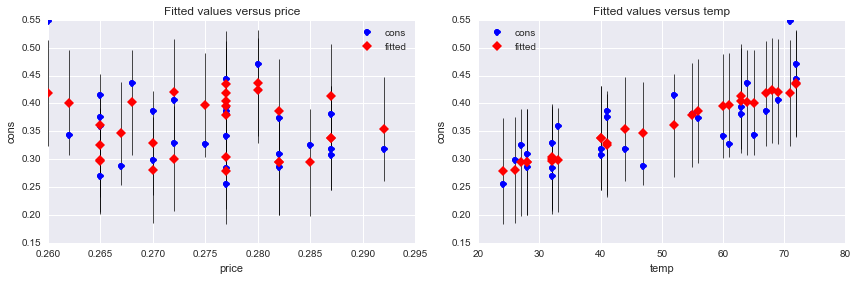


```python
fig, (ax1, ax2) = plt.subplots(1, 2, figsize=(12, 4))

sns.regplot("price", "cons", dataset.data, ax=ax1);
sns.regplot("temp", "cons", dataset.data, ax=ax2);

fig.tight_layout()
fig.savefig("ch14-regressionplots-seaborn.pdf")
```


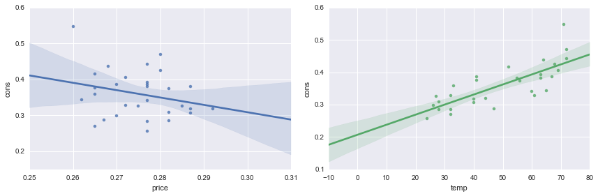


## Discrete regression, logistic regression


```python
df = sm.datasets.get_rdataset("iris").data
```


```python
df.info()
```

    <class 'pandas.core.frame.DataFrame'>
    Int64Index: 150 entries, 0 to 149
    Data columns (total 5 columns):
    Sepal.Length    150 non-null float64
    Sepal.Width     150 non-null float64
    Petal.Length    150 non-null float64
    Petal.Width     150 non-null float64
    Species         150 non-null object
    dtypes: float64(4), object(1)
    memory usage: 7.0+ KB


```python
df.Species.unique()
```


    array(['setosa', 'versicolor', 'virginica'], dtype=object)


```python
df_subset = df[(df.Species == "versicolor") | (df.Species == "virginica" )].copy()
```


```python
df_subset.Species = df_subset.Species.map({"versicolor": 1, "virginica": 0})
```


```python
df_subset.rename(columns={"Sepal.Length": "Sepal_Length", "Sepal.Width": "Sepal_Width",
                          "Petal.Length": "Petal_Length", "Petal.Width": "Petal_Width"}, inplace=True)
```


```python
df_subset.head(3)
```


<div>
<table border="1" class="dataframe">
  <thead>
    <tr style="text-align: right;">
      <th></th>
      <th>Sepal_Length</th>
      <th>Sepal_Width</th>
      <th>Petal_Length</th>
      <th>Petal_Width</th>
      <th>Species</th>
    </tr>
  </thead>
  <tbody>
    <tr>
      <th>50</th>
      <td>7.0</td>
      <td>3.2</td>
      <td>4.7</td>
      <td>1.4</td>
      <td>1</td>
    </tr>
    <tr>
      <th>51</th>
      <td>6.4</td>
      <td>3.2</td>
      <td>4.5</td>
      <td>1.5</td>
      <td>1</td>
    </tr>
    <tr>
      <th>52</th>
      <td>6.9</td>
      <td>3.1</td>
      <td>4.9</td>
      <td>1.5</td>
      <td>1</td>
    </tr>
  </tbody>
</table>
</div>


```python
model = smf.logit("Species ~ Sepal_Length + Sepal_Width + Petal_Length + Petal_Width", data=df_subset)
```


```python
result = model.fit()
```

    Optimization terminated successfully.
             Current function value: 0.059493
             Iterations 12


```python
print(result.summary())
```

                               Logit Regression Results
    ==============================================================================
    Dep. Variable:                Species   No. Observations:                  100
    Model:                          Logit   Df Residuals:                       95
    Method:                           MLE   Df Model:                            4
    Date:                Mon, 03 Aug 2015   Pseudo R-squ.:                  0.9142
    Time:                        23:35:53   Log-Likelihood:                -5.9493
    converged:                       True   LL-Null:                       -69.315
                                            LLR p-value:                 1.947e-26
    ================================================================================
                       coef    std err          z      P>|z|      [95.0% Conf. Int.]
    --------------------------------------------------------------------------------
    Intercept       42.6378     25.708      1.659      0.097        -7.748    93.024
    Sepal_Length     2.4652      2.394      1.030      0.303        -2.228     7.158
    Sepal_Width      6.6809      4.480      1.491      0.136        -2.099    15.461
    Petal_Length    -9.4294      4.737     -1.990      0.047       -18.714    -0.145
    Petal_Width    -18.2861      9.743     -1.877      0.061       -37.381     0.809
    ================================================================================


```python
print(result.get_margeff().summary())
```

            Logit Marginal Effects
    =====================================
    Dep. Variable:                Species
    Method:                          dydx
    At:                           overall
    ================================================================================
                      dy/dx    std err          z      P>|z|      [95.0% Conf. Int.]
    --------------------------------------------------------------------------------
    Sepal_Length     0.0445      0.038      1.163      0.245        -0.031     0.120
    Sepal_Width      0.1207      0.064      1.891      0.059        -0.004     0.246
    Petal_Length    -0.1703      0.057     -2.965      0.003        -0.283    -0.058
    Petal_Width     -0.3303      0.110     -2.998      0.003        -0.546    -0.114
    ================================================================================


**Note:** Sepal_Length and Sepal_Width do not seem to contribute much to predictiveness of the model.


```python
model = smf.logit("Species ~ Petal_Length + Petal_Width", data=df_subset)
```


```python
result = model.fit()
```

    Optimization terminated successfully.
             Current function value: 0.102818
             Iterations 10


```python
print(result.summary())
```

                               Logit Regression Results
    ==============================================================================
    Dep. Variable:                Species   No. Observations:                  100
    Model:                          Logit   Df Residuals:                       97
    Method:                           MLE   Df Model:                            2
    Date:                Mon, 03 Aug 2015   Pseudo R-squ.:                  0.8517
    Time:                        23:35:53   Log-Likelihood:                -10.282
    converged:                       True   LL-Null:                       -69.315
                                            LLR p-value:                 2.303e-26
    ================================================================================
                       coef    std err          z      P>|z|      [95.0% Conf. Int.]
    --------------------------------------------------------------------------------
    Intercept       45.2723     13.612      3.326      0.001        18.594    71.951
    Petal_Length    -5.7545      2.306     -2.496      0.013       -10.274    -1.235
    Petal_Width    -10.4467      3.756     -2.782      0.005       -17.808    -3.086
    ================================================================================


```python
print(result.get_margeff().summary())
```

            Logit Marginal Effects
    =====================================
    Dep. Variable:                Species
    Method:                          dydx
    At:                           overall
    ================================================================================
                      dy/dx    std err          z      P>|z|      [95.0% Conf. Int.]
    --------------------------------------------------------------------------------
    Petal_Length    -0.1736      0.052     -3.347      0.001        -0.275    -0.072
    Petal_Width     -0.3151      0.068     -4.608      0.000        -0.449    -0.181
    ================================================================================


```python
params = result.params
beta0 = -params['Intercept']/params['Petal_Width']
beta1 = -params['Petal_Length']/params['Petal_Width']
```


```python
df_new = pd.DataFrame({"Petal_Length": np.random.randn(20)*0.5 + 5,
                       "Petal_Width": np.random.randn(20)*0.5 + 1.7})
```


```python
df_new["P-Species"] = result.predict(df_new)
```


```python
df_new["P-Species"].head(3)
```


    0    0.995472
    1    0.799899
    2    0.000033
    Name: P-Species, dtype: float64


```python
df_new["Species"] = (df_new["P-Species"] > 0.5).astype(int)
```


```python
df_new.head()
```


<div>
<table border="1" class="dataframe">
  <thead>
    <tr style="text-align: right;">
      <th></th>
      <th>Petal_Length</th>
      <th>Petal_Width</th>
      <th>P-Species</th>
      <th>Species</th>
    </tr>
  </thead>
  <tbody>
    <tr>
      <th>0</th>
      <td>4.717684</td>
      <td>1.218695</td>
      <td>0.995472</td>
      <td>1</td>
    </tr>
    <tr>
      <th>1</th>
      <td>5.280952</td>
      <td>1.292013</td>
      <td>0.799899</td>
      <td>1</td>
    </tr>
    <tr>
      <th>2</th>
      <td>5.610778</td>
      <td>2.230056</td>
      <td>0.000033</td>
      <td>0</td>
    </tr>
    <tr>
      <th>3</th>
      <td>4.458715</td>
      <td>1.907844</td>
      <td>0.421614</td>
      <td>0</td>
    </tr>
    <tr>
      <th>4</th>
      <td>4.822227</td>
      <td>1.938929</td>
      <td>0.061070</td>
      <td>0</td>
    </tr>
  </tbody>
</table>
</div>


```python
fig, ax = plt.subplots(1, 1, figsize=(8, 4))

ax.plot(df_subset[df_subset.Species == 0].Petal_Length.values,
        df_subset[df_subset.Species == 0].Petal_Width.values, 's', label='virginica')
ax.plot(df_new[df_new.Species == 0].Petal_Length.values,
        df_new[df_new.Species == 0].Petal_Width.values,
        'o', markersize=10, color="steelblue", label='virginica (pred.)')

ax.plot(df_subset[df_subset.Species == 1].Petal_Length.values,
        df_subset[df_subset.Species == 1].Petal_Width.values, 's', label='versicolor')
ax.plot(df_new[df_new.Species == 1].Petal_Length.values,
        df_new[df_new.Species == 1].Petal_Width.values,
        'o', markersize=10, color="green", label='versicolor (pred.)')

_x = np.array([4.0, 6.1])
ax.plot(_x, beta0 + beta1 * _x, 'k')

ax.set_xlabel('Petal length')
ax.set_ylabel('Petal width')
ax.legend(loc=2)
fig.tight_layout()
fig.savefig("ch14-logit.pdf")
```


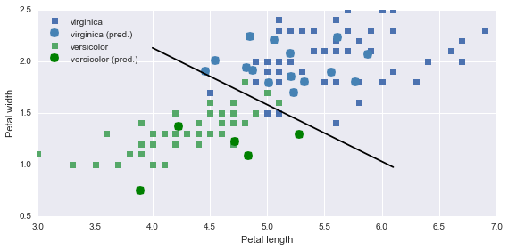


### Poisson distribution


```python
dataset = sm.datasets.get_rdataset("discoveries")
```


```python
df = dataset.data.set_index("time")
```


```python
df.head(10).T
```


<div>
<table border="1" class="dataframe">
  <thead>
    <tr style="text-align: right;">
      <th>time</th>
      <th>1860</th>
      <th>1861</th>
      <th>1862</th>
      <th>1863</th>
      <th>1864</th>
      <th>1865</th>
      <th>1866</th>
      <th>1867</th>
      <th>1868</th>
      <th>1869</th>
    </tr>
  </thead>
  <tbody>
    <tr>
      <th>discoveries</th>
      <td>5</td>
      <td>3</td>
      <td>0</td>
      <td>2</td>
      <td>0</td>
      <td>3</td>
      <td>2</td>
      <td>3</td>
      <td>6</td>
      <td>1</td>
    </tr>
  </tbody>
</table>
</div>


```python
fig, ax = plt.subplots(1, 1, figsize=(16, 4))
df.plot(kind='bar', ax=ax)
fig.tight_layout()
fig.savefig("ch14-discoveries.pdf")
```


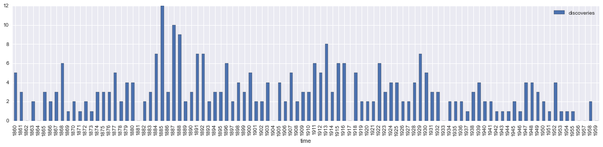


```python
model = smf.poisson("discoveries ~ 1", data=df)
```


```python
result = model.fit()
```

    Optimization terminated successfully.
             Current function value: 2.168457
             Iterations 7


```python
print(result.summary())
```

                              Poisson Regression Results
    ==============================================================================
    Dep. Variable:            discoveries   No. Observations:                  100
    Model:                        Poisson   Df Residuals:                       99
    Method:                           MLE   Df Model:                            0
    Date:                Mon, 03 Aug 2015   Pseudo R-squ.:                   0.000
    Time:                        23:35:59   Log-Likelihood:                -216.85
    converged:                       True   LL-Null:                       -216.85
                                            LLR p-value:                       nan
    ==============================================================================
                     coef    std err          z      P>|z|      [95.0% Conf. Int.]
    ------------------------------------------------------------------------------
    Intercept      1.1314      0.057     19.920      0.000         1.020     1.243
    ==============================================================================


```python
lmbda = np.exp(result.params)
```


```python
X = stats.poisson(lmbda)
```


```python
result.conf_int()
```


<div>
<table border="1" class="dataframe">
  <thead>
    <tr style="text-align: right;">
      <th></th>
      <th>0</th>
      <th>1</th>
    </tr>
  </thead>
  <tbody>
    <tr>
      <th>Intercept</th>
      <td>1.020084</td>
      <td>1.242721</td>
    </tr>
  </tbody>
</table>
</div>


```python
X_ci_l = stats.poisson(np.exp(result.conf_int().values)[0, 0])
```


```python
X_ci_u = stats.poisson(np.exp(result.conf_int().values)[0, 1])
```


```python
v, k = np.histogram(df.values, bins=12, range=(0, 12), normed=True)
```


```python
fig, ax = plt.subplots(1, 1, figsize=(12, 4))
ax.bar(k[:-1], v, color="steelblue",  align='center', label='Dicoveries per year')
ax.bar(k-0.125, X_ci_l.pmf(k), color="red", alpha=0.5, align='center', width=0.25, label='Poisson fit (CI, lower)')
ax.bar(k, X.pmf(k), color="green",  align='center', width=0.5, label='Poisson fit')
ax.bar(k+0.125, X_ci_u.pmf(k), color="red",  alpha=0.5, align='center', width=0.25, label='Poisson fit (CI, upper)')

ax.legend()
fig.tight_layout()
fig.savefig("ch14-discoveries-per-year.pdf")
```


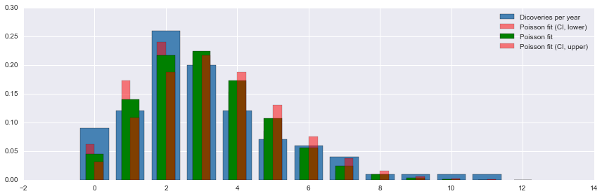


## Time series


```python
df = pd.read_csv("temperature_outdoor_2014.tsv", header=None, delimiter="\t", names=["time", "temp"])
df.time = pd.to_datetime(df.time, unit="s")
df = df.set_index("time").resample("H")
```


```python
df_march = df[df.index.month == 3]
```


```python
df_april = df[df.index.month == 4]
```


```python
df_march.plot(figsize=(12, 4));
```


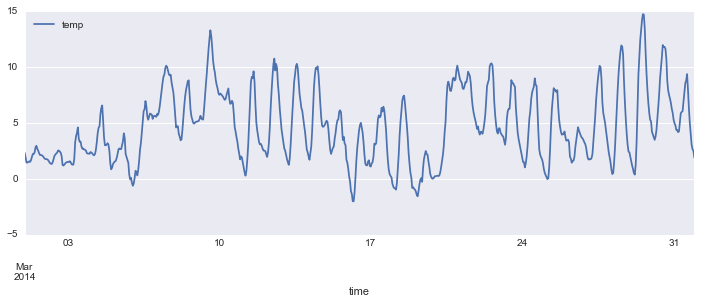


```python
fig, axes = plt.subplots(1, 4, figsize=(12, 3))
smg.tsa.plot_acf(df_march.temp, lags=72, ax=axes[0])
smg.tsa.plot_acf(df_march.temp.diff().dropna(), lags=72, ax=axes[1])
smg.tsa.plot_acf(df_march.temp.diff().diff().dropna(), lags=72, ax=axes[2])
smg.tsa.plot_acf(df_march.temp.diff().diff().diff().dropna(), lags=72, ax=axes[3])
fig.tight_layout()
fig.savefig("ch14-timeseries-autocorrelation.pdf")
```


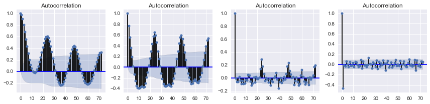


```python
model = sm.tsa.AR(df_march.temp)
```


```python
result = model.fit(72)
```


```python
sm.stats.durbin_watson(result.resid)
```


    1.9985623006352975


```python
fig, ax = plt.subplots(1, 1, figsize=(8, 3))
smg.tsa.plot_acf(result.resid, lags=72, ax=ax)
fig.tight_layout()
fig.savefig("ch14-timeseries-resid-acf.pdf")
```


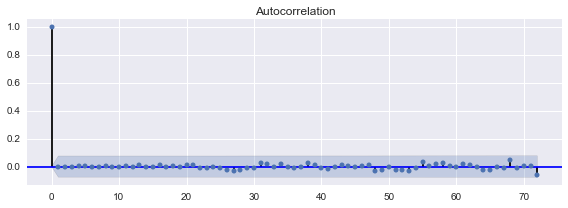


```python
fig, ax = plt.subplots(1, 1, figsize=(12, 4))
ax.plot(df_march.index.values[-72:], df_march.temp.values[-72:], label="train data")
ax.plot(df_april.index.values[:72], df_april.temp.values[:72], label="actual outcome")
ax.plot(pd.date_range("2014-04-01", "2014-04-4", freq="H").values,
        result.predict("2014-04-01", "2014-04-4"), label="predicted outcome")

ax.legend()
fig.tight_layout()
fig.savefig("ch14-timeseries-prediction.pdf")
```


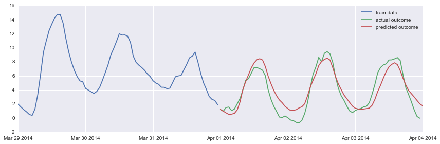


```python
# Using ARMA model on daily average temperatures
```


```python
df_march = df_march.resample("D")
```


```python
df_april = df_april.resample("D")
```


```python
model = sm.tsa.ARMA(df_march, (4, 1))
```


```python
result = model.fit()
```


```python
fig, ax = plt.subplots(1, 1, figsize=(12, 4))
ax.plot(df_march.index.values[-3:], df_march.temp.values[-3:], 's-', label="train data")
ax.plot(df_april.index.values[:3], df_april.temp.values[:3], 's-', label="actual outcome")
ax.plot(pd.date_range("2014-04-01", "2014-04-3").values,
        result.predict("2014-04-01", "2014-04-3"), 's-', label="predicted outcome")
ax.legend()
fig.tight_layout()
```


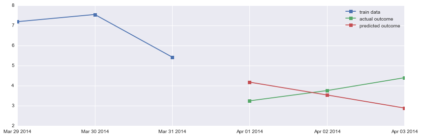


# Versions


```python
%reload_ext version_information
```


```python
%version_information numpy, matplotlib, pandas, scipy, statsmodels, patsy
```


<table><tr><th>Software</th><th>Version</th></tr><tr><td>Python</td><td>2.7.10 64bit [GCC 4.2.1 (Apple Inc. build 5577)]</td></tr><tr><td>IPython</td><td>3.2.1</td></tr><tr><td>OS</td><td>Darwin 14.1.0 x86_64 i386 64bit</td></tr><tr><td>numpy</td><td>1.9.2</td></tr><tr><td>matplotlib</td><td>1.4.3</td></tr><tr><td>pandas</td><td>0.16.2</td></tr><tr><td>scipy</td><td>0.16.0</td></tr><tr><td>statsmodels</td><td>0.6.1</td></tr><tr><td>patsy</td><td>0.4.0</td></tr></table>
