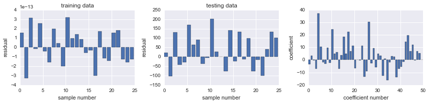
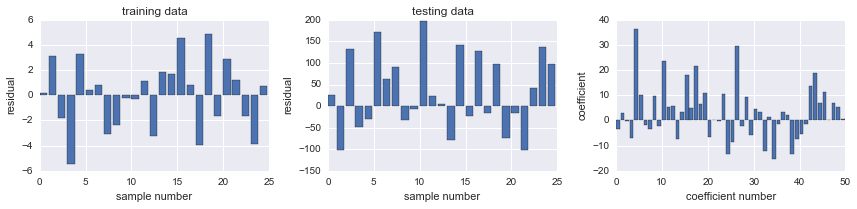
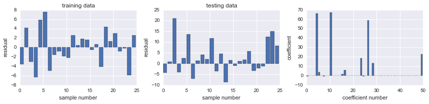
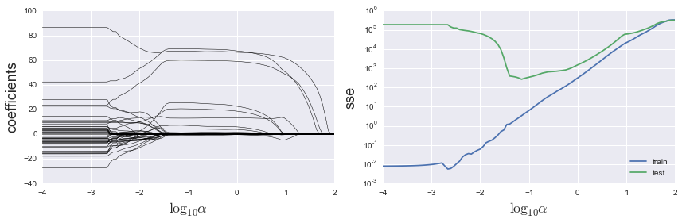
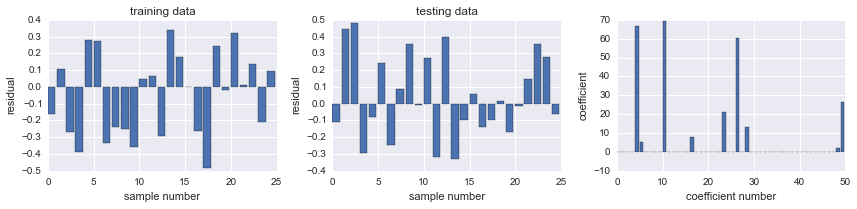
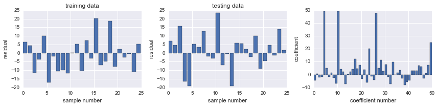
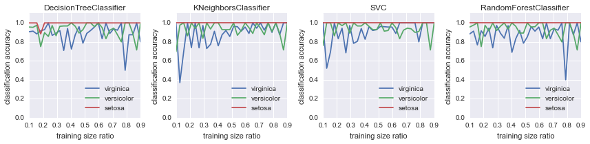
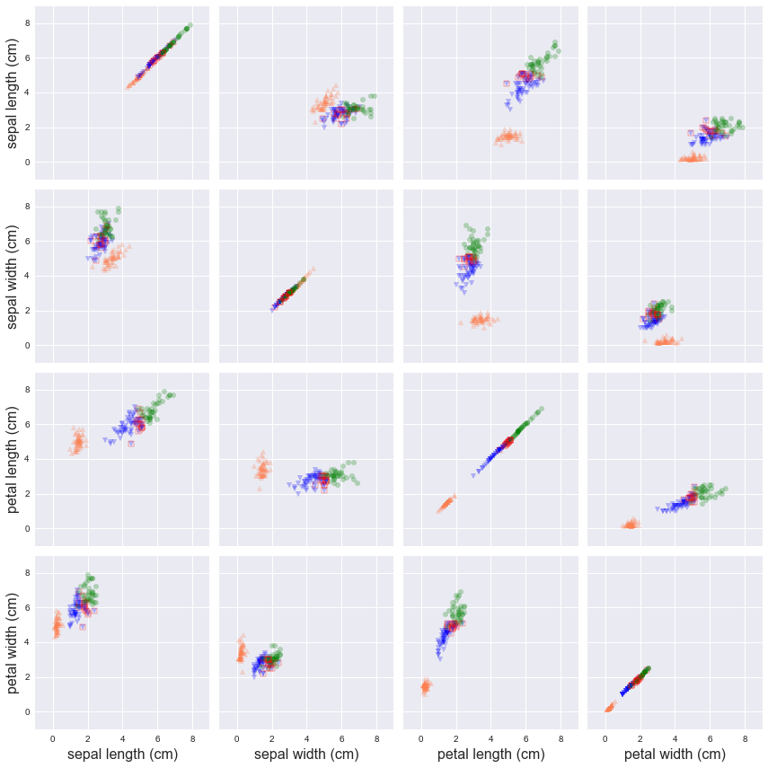

# Chapter 15: Machine learning
<!-- toc orderedList:0 depthFrom:1 depthTo:6 -->

* [Chapter 15: Machine learning](#chapter-15-machine-learning)
* [Built in datasets](#built-in-datasets)
* [Regression](#regression)
* [Classification](#classification)
* [Clustering](#clustering)
* [Versions](#versions)

<!-- tocstop -->


---

Robert Johansson

Source code listings for [Numerical Python - A Practical Techniques Approach for Industry](http://www.apress.com/9781484205549) (ISBN 978-1-484205-54-9).

The source code listings can be downloaded from http://www.apress.com/9781484205549


```python
from sklearn import datasets
from sklearn import cross_validation
from sklearn import linear_model
from sklearn import metrics
from sklearn import tree
from sklearn import neighbors
from sklearn import svm
from sklearn import ensemble
from sklearn import cluster
```


```python
%matplotlib inline
import matplotlib.pyplot as plt
```


```python
import numpy as np
```


```python
import seaborn as sns
```

# Built in datasets


```python
datasets.load_boston
```


    <function sklearn.datasets.base.load_boston>


```python
datasets.fetch_california_housing
```


    <function sklearn.datasets.california_housing.fetch_california_housing>


```python
datasets.make_regression
```


    <function sklearn.datasets.samples_generator.make_regression>


# Regression


```python
np.random.seed(123)
```


```python
X_all, y_all = datasets.make_regression(n_samples=50, n_features=50, n_informative=10) #, noise=2.5)
```


```python
X_train, X_test, y_train, y_test = cross_validation.train_test_split(X_all, y_all, train_size=0.5)
```


```python
X_train.shape, y_train.shape
```


    ((25, 50), (25,))


```python
X_test.shape, y_test.shape
```


    ((25, 50), (25,))


```python
model = linear_model.LinearRegression()
```


```python
model.fit(X_train, y_train)
```


    LinearRegression(copy_X=True, fit_intercept=True, n_jobs=1, normalize=False)


```python
def sse(resid):
    return sum(resid**2)
```


```python
resid_train = y_train - model.predict(X_train)
sse_train = sse(resid_train)
sse_train
```


    8.1332190417010494e-25


```python
resid_test = y_test - model.predict(X_test)
sse_test = sse(resid_train)
sse_test
```


    8.1332190417010494e-25


```python
model.score(X_train, y_train)
```


    1.0


```python
model.score(X_test, y_test)
```


    0.31407400675201746


```python
def plot_residuals_and_coeff(resid_train, resid_test, coeff):
    fig, axes = plt.subplots(1, 3, figsize=(12, 3))
    axes[0].bar(np.arange(len(resid_train)), resid_train)
    axes[0].set_xlabel("sample number")
    axes[0].set_ylabel("residual")
    axes[0].set_title("training data")
    axes[1].bar(np.arange(len(resid_test)), resid_test)
    axes[1].set_xlabel("sample number")
    axes[1].set_ylabel("residual")
    axes[1].set_title("testing data")
    axes[2].bar(np.arange(len(coeff)), coeff)
    axes[2].set_xlabel("coefficient number")
    axes[2].set_ylabel("coefficient")
    fig.tight_layout()
    return fig, axes
```


```python
fig, ax = plot_residuals_and_coeff(resid_train, resid_test, model.coef_)
fig.savefig("ch15-regression-ols.pdf")
```





```python
model = linear_model.Ridge() #alpha=2.5)
```


```python
model.fit(X_train, y_train)
```


    Ridge(alpha=1.0, copy_X=True, fit_intercept=True, max_iter=None,
       normalize=False, solver='auto', tol=0.001)


```python
resid_train = y_train - model.predict(X_train)
sse_train = sum(resid_train**2)
sse_train
```


    178.50695164950841


```python
resid_test = y_test - model.predict(X_test)
sse_test = sum(resid_test**2)
sse_test
```


    212737.00160105844


```python
model.score(X_train, y_train), model.score(X_test, y_test)
```


    (0.99945955150173349, 0.31670332736075468)


```python
fig, ax = plot_residuals_and_coeff(resid_train, resid_test, model.coef_)
fig.savefig("ch15-regression-ridge.pdf")
```





```python
model = linear_model.Lasso(alpha=1.0)
```


```python
model.fit(X_train, y_train)
```


    Lasso(alpha=1.0, copy_X=True, fit_intercept=True, max_iter=1000,
       normalize=False, positive=False, precompute=False, random_state=None,
       selection='cyclic', tol=0.0001, warm_start=False)


```python
resid_train = y_train - model.predict(X_train)
sse_train = sse(resid_train)
sse_train
```


    309.74971389531891


```python
resid_test = y_test - model.predict(X_test)
sse_test = sse(resid_test)
sse_test
```


    1489.1176065002333


```python
fig, ax = plot_residuals_and_coeff(resid_train, resid_test, model.coef_)
fig.savefig("ch15-regression-lasso.pdf")
```





```python
alphas = np.logspace(-4, 2, 100)
```


```python
coeffs = np.zeros((len(alphas), X_train.shape[1]))
sse_train = np.zeros_like(alphas)
sse_test = np.zeros_like(alphas)

for n, alpha in enumerate(alphas):
    model = linear_model.Lasso(alpha=alpha)
    model.fit(X_train, y_train)
    coeffs[n, :] = model.coef_
    resid = y_train - model.predict(X_train)
    sse_train[n] = sum(resid**2)
    resid = y_test - model.predict(X_test)
    sse_test[n] = sum(resid**2)
```

    /Users/rob/miniconda/envs/py27-npm/lib/python2.7/site-packages/sklearn/linear_model/coordinate_descent.py:444: ConvergenceWarning: Objective did not converge. You might want to increase the number of iterations
      ConvergenceWarning)


```python
fig, axes = plt.subplots(1, 2, figsize=(12, 4), sharex=True)

for n in range(coeffs.shape[1]):
    axes[0].plot(np.log10(alphas), coeffs[:, n], color='k', lw=0.5)

axes[1].semilogy(np.log10(alphas), sse_train, label="train")
axes[1].semilogy(np.log10(alphas), sse_test, label="test")
axes[1].legend(loc=0)

axes[0].set_xlabel(r"${\log_{10}}\alpha$", fontsize=18)
axes[0].set_ylabel(r"coefficients", fontsize=18)
axes[1].set_xlabel(r"${\log_{10}}\alpha$", fontsize=18)
axes[1].set_ylabel(r"sse", fontsize=18)
fig.tight_layout()
fig.savefig("ch15-regression-lasso-vs-alpha.pdf")
```





```python
model = linear_model.LassoCV()
```


```python
model.fit(X_all, y_all)
```


    LassoCV(alphas=None, copy_X=True, cv=None, eps=0.001, fit_intercept=True,
        max_iter=1000, n_alphas=100, n_jobs=1, normalize=False, positive=False,
        precompute='auto', random_state=None, selection='cyclic', tol=0.0001,
        verbose=False)


```python
model.alpha_
```


    0.06559238747534718


```python
resid_train = y_train - model.predict(X_train)
sse_train = sse(resid_train)
sse_train
```


    1.5450589323147632


```python
resid_test = y_test - model.predict(X_test)
sse_test = sse(resid_test)
sse_test
```


    1.5321417406216065


```python
model.score(X_train, y_train), model.score(X_test, y_test)
```


    (0.99999532217220677, 0.99999507886570982)


```python
fig, ax = plot_residuals_and_coeff(resid_train, resid_test, model.coef_)
fig.savefig("ch15-regression-lasso-cv.pdf")
```





```python
model = linear_model.ElasticNetCV()
```


```python
model.fit(X_all, y_all)
```


    ElasticNetCV(alphas=None, copy_X=True, cv=None, eps=0.001, fit_intercept=True,
           l1_ratio=0.5, max_iter=1000, n_alphas=100, n_jobs=1,
           normalize=False, positive=False, precompute='auto',
           random_state=None, selection='cyclic', tol=0.0001, verbose=0)


```python
model.alpha_
```


    0.13118477495069433


```python
model.l1_ratio
```


    0.5


```python
resid_train = y_train - model.predict(X_train)
sse_train = sum(resid_train**2)
sse_train
```


    2183.8391729391255


```python
resid_test = y_test - model.predict(X_test)
sse_test = sum(resid_test**2)
sse_test
```


    2650.0504463382508


```python
model.score(X_train, y_train), model.score(X_test, y_test)
```


    (0.99338819810341106, 0.99148821954487831)


```python
fig, ax = plot_residuals_and_coeff(resid_train, resid_test, model.coef_)
fig.savefig("ch15-regression-elastic-net-cv.pdf")
```





# Classification


```python
iris = datasets.load_iris()
```


```python
type(iris)
```


    sklearn.datasets.base.Bunch


```python
iris.target_names
```


    array(['setosa', 'versicolor', 'virginica'],
          dtype='|S10')


```python
iris.feature_names
```


    ['sepal length (cm)',
     'sepal width (cm)',
     'petal length (cm)',
     'petal width (cm)']


```python
iris.data.shape
```


    (150, 4)


```python
iris.target.shape
```


    (150,)


```python
# print(iris['DESCR'])
```


```python
X_train, X_test, y_train, y_test = cross_validation.train_test_split(iris.data, iris.target, train_size=0.7)
```


```python
classifier = linear_model.LogisticRegression()
```


```python
classifier.fit(X_train, y_train)
```


    LogisticRegression(C=1.0, class_weight=None, dual=False, fit_intercept=True,
              intercept_scaling=1, max_iter=100, multi_class='ovr',
              penalty='l2', random_state=None, solver='liblinear', tol=0.0001,
              verbose=0)


```python
y_test_pred = classifier.predict(X_test)
```


```python
print(metrics.classification_report(y_test, y_test_pred))
```

                 precision    recall  f1-score   support

              0       1.00      1.00      1.00        16
              1       1.00      0.76      0.87        17
              2       0.75      1.00      0.86        12

    avg / total       0.93      0.91      0.91        45


```python
np.bincount(y_test)
```


    array([16, 17, 12])


```python
metrics.confusion_matrix(y_test, y_test_pred)
```


    array([[16,  0,  0],
           [ 0, 13,  4],
           [ 0,  0, 12]])


```python
classifier = tree.DecisionTreeClassifier()
classifier.fit(X_train, y_train)
y_test_pred = classifier.predict(X_test)
metrics.confusion_matrix(y_test, y_test_pred)
```


    array([[16,  0,  0],
           [ 0, 12,  5],
           [ 0,  0, 12]])


```python
classifier = neighbors.KNeighborsClassifier()
classifier.fit(X_train, y_train)
y_test_pred = classifier.predict(X_test)
metrics.confusion_matrix(y_test, y_test_pred)
```


    array([[16,  0,  0],
           [ 0, 15,  2],
           [ 0,  0, 12]])


```python
classifier = svm.SVC()
classifier.fit(X_train, y_train)
y_test_pred = classifier.predict(X_test)
metrics.confusion_matrix(y_test, y_test_pred)
```


    array([[16,  0,  0],
           [ 0, 15,  2],
           [ 0,  0, 12]])


```python
classifier = ensemble.RandomForestClassifier()
classifier.fit(X_train, y_train)
y_test_pred = classifier.predict(X_test)
metrics.confusion_matrix(y_test, y_test_pred)
```


    array([[16,  0,  0],
           [ 0, 16,  1],
           [ 0,  0, 12]])


```python
train_size_vec = np.linspace(0.1, 0.9, 30)
```


```python
classifiers = [tree.DecisionTreeClassifier,
               neighbors.KNeighborsClassifier,
               svm.SVC,
               ensemble.RandomForestClassifier
              ]
```


```python
cm_diags = np.zeros((3, len(train_size_vec), len(classifiers)), dtype=float)
```


```python
for n, train_size in enumerate(train_size_vec):
    X_train, X_test, y_train, y_test = \
        cross_validation.train_test_split(iris.data, iris.target, train_size=train_size)

    for m, Classifier in enumerate(classifiers):
        classifier = Classifier()
        classifier.fit(X_train, y_train)
        y_test_pred = classifier.predict(X_test)
        cm_diags[:, n, m] = metrics.confusion_matrix(y_test, y_test_pred).diagonal()
        cm_diags[:, n, m] /= np.bincount(y_test)
```


```python
fig, axes = plt.subplots(1, len(classifiers), figsize=(12, 3))

for m, Classifier in enumerate(classifiers):
    axes[m].plot(train_size_vec, cm_diags[2, :, m], label=iris.target_names[2])
    axes[m].plot(train_size_vec, cm_diags[1, :, m], label=iris.target_names[1])
    axes[m].plot(train_size_vec, cm_diags[0, :, m], label=iris.target_names[0])
    axes[m].set_title(type(Classifier()).__name__)
    axes[m].set_ylim(0, 1.1)
    axes[m].set_xlim(0.1, 0.9)
    axes[m].set_ylabel("classification accuracy")
    axes[m].set_xlabel("training size ratio")
    axes[m].legend(loc=4)

fig.tight_layout()
fig.savefig("ch15-classification-comparison.pdf")
```





# Clustering


```python
X, y = iris.data, iris.target
```


```python
np.random.seed(123)
```


```python
n_clusters = 3
```


```python
c = cluster.KMeans(n_clusters=n_clusters)
```


```python
c.fit(X)
```


    KMeans(copy_x=True, init='k-means++', max_iter=300, n_clusters=3, n_init=10,
        n_jobs=1, precompute_distances='auto', random_state=None, tol=0.0001,
        verbose=0)


```python
y_pred = c.predict(X)
```


```python
y_pred[::8]
```


    array([1, 1, 1, 1, 1, 1, 1, 2, 2, 2, 2, 2, 2, 0, 0, 0, 0, 0, 0], dtype=int32)


```python
y[::8]
```


    array([0, 0, 0, 0, 0, 0, 0, 1, 1, 1, 1, 1, 1, 2, 2, 2, 2, 2, 2])


```python
idx_0, idx_1, idx_2 = (np.where(y_pred == n) for n in range(3))
```


```python
y_pred[idx_0], y_pred[idx_1], y_pred[idx_2] = 2, 0, 1
```


```python
y_pred[::8]
```


    array([0, 0, 0, 0, 0, 0, 0, 1, 1, 1, 1, 1, 1, 2, 2, 2, 2, 2, 2], dtype=int32)


```python
metrics.confusion_matrix(y, y_pred)
```


    array([[50,  0,  0],
           [ 0, 48,  2],
           [ 0, 14, 36]])


```python
N = X.shape[1]

fig, axes = plt.subplots(N, N, figsize=(12, 12), sharex=True, sharey=True)

colors = ["coral", "blue", "green"]
markers = ["^", "v", "o"]
for m in range(N):
    for n in range(N):
        for p in range(n_clusters):
            mask = y_pred == p
            axes[m, n].scatter(X[:, m][mask], X[:, n][mask],
                               marker=markers[p], s=30,
                               color=colors[p], alpha=0.25)

        for idx in np.where(y != y_pred):
            axes[m, n].scatter(X[idx, m], X[idx, n],
                               marker="s", s=30,
                               edgecolor="red",
                               facecolor=(1,1,1,0))


    axes[N-1, m].set_xlabel(iris.feature_names[m], fontsize=16)
    axes[m, 0].set_ylabel(iris.feature_names[m], fontsize=16)
fig.tight_layout()
fig.savefig("ch15-clustering.pdf")
```





# Versions


```python
%reload_ext version_information
```


```python
%version_information sklearn, numpy, matplotlib, seaborn
```


<table><tr><th>Software</th><th>Version</th></tr><tr><td>Python</td><td>2.7.10 64bit [GCC 4.2.1 (Apple Inc. build 5577)]</td></tr><tr><td>IPython</td><td>3.2.1</td></tr><tr><td>OS</td><td>Darwin 14.1.0 x86_64 i386 64bit</td></tr><tr><td>sklearn</td><td>0.16.1</td></tr><tr><td>numpy</td><td>1.9.2</td></tr><tr><td>matplotlib</td><td>1.4.3</td></tr><tr><td>seaborn</td><td>0.6.0</td></tr></table>
