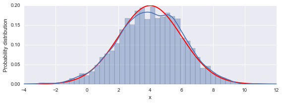

# Chapter 16: Bayesian statistics
<!-- toc orderedList:0 depthFrom:1 depthTo:6 -->

* [Chapter 16: Bayesian statistics](#chapter-16-bayesian-statistics)
* [Simple example: Normal distributed random variable](#simple-example-normal-distributed-random-variable)
  * [Dependent random variables](#dependent-random-variables)
  * [Posterior distributions](#posterior-distributions)
  * [Linear regression](#linear-regression)
  * [Multilevel model](#multilevel-model)
* [Version](#version)

<!-- tocstop -->


---

Robert Johansson

Source code listings for [Numerical Python - A Practical Techniques Approach for Industry](http://www.apress.com/9781484205549) (ISBN 978-1-484205-54-9).

The source code listings can be downloaded from http://www.apress.com/9781484205549


```python
import pymc3 as mc
```


```python
import numpy as np
```


```python
%matplotlib inline
import matplotlib.pyplot as plt
```


```python
import seaborn as sns
```


```python
from scipy import stats
```


```python
import statsmodels.api as sm
```


```python
import statsmodels.formula.api as smf
```


```python
import pandas as pd
```

# Simple example: Normal distributed random variable


```python
# try this
# dir(mc.distributions)
```


```python
np.random.seed(100)
```


```python
mu = 4.0
```


```python
sigma = 2.0
```


```python
model = mc.Model()
```


```python
with model:
    mc.Normal('X', mu, 1/sigma**2)
```


```python
model.vars
```


    [X]


```python
start = dict(X=2)
```


```python
with model:
    step = mc.Metropolis()
    trace = mc.sample(10000, step=step, start=start)
```

     [-----------------100%-----------------] 10000 of 10000 complete in 0.8 sec


```python
x = np.linspace(-4, 12, 1000)
```


```python
y = stats.norm(mu, sigma).pdf(x)
```


```python
X = trace.get_values("X")
```


```python
fig, ax = plt.subplots(figsize=(8, 3))

ax.plot(x, y, 'r', lw=2)
sns.distplot(X, ax=ax)
ax.set_xlim(-4, 12)
ax.set_xlabel("x")
ax.set_ylabel("Probability distribution")
fig.tight_layout()
fig.savefig("ch16-normal-distribution-sampled.pdf")
```





```python
fig, axes = plt.subplots(1, 2, figsize=(8, 2.5), squeeze=False)
mc.traceplot(trace, ax=axes)
axes[0,0].plot(x, y, 'r', lw=0.5)
fig.tight_layout()
fig.savefig("ch16-normal-sampling-trace.png")
fig.savefig("ch16-normal-sampling-trace.pdf")
```


## Dependent random variables


```python
model = mc.Model()
```


```python
with model:
    mean = mc.Normal('mean', 3.0)
    sigma = mc.HalfNormal('sigma', sd=1.0)
    X = mc.Normal('X', mean, sd=sigma)
```


```python
model.vars
```


    [mean, sigma_log, X]


```python
with model:
    start = mc.find_MAP()
```


```python
start
```


    {'X': array(3.0), 'mean': array(3.0), 'sigma_log': array(-5.990881458955034)}


```python
with model:
    step = mc.Metropolis()
    trace = mc.sample(100000, start=start, step=step)
```

     [-----------------100%-----------------] 100000 of 100000 complete in 20.0 sec


```python
trace.get_values('sigma').mean()
```


    0.80385254691184915


```python
X = trace.get_values('X')
```


```python
X.mean()
```


    2.990970734843061


```python
trace.get_values('X').std()
```


    1.4202559617353046


```python
fig, axes = plt.subplots(3, 2, figsize=(8, 6), squeeze=False)
mc.traceplot(trace, vars=['mean', 'sigma', 'X'], ax=axes)
fig.tight_layout()
fig.savefig("ch16-dependent-rv-sample-trace.png")
fig.savefig("ch16-dependent-rv-sample-trace.pdf")
```


## Posterior distributions


```python
mu = 2.5
```


```python
s = 1.5
```


```python
data = stats.norm(mu, s).rvs(100)
```


```python
with mc.Model() as model:

    mean = mc.Normal('mean', 4.0, 1.0) # true 2.5
    sigma = mc.HalfNormal('sigma', 3.0 * np.sqrt(np.pi/2)) # true 1.5

    X = mc.Normal('X', mean, 1/sigma**2, observed=data)
```


```python
model.vars
```


    [mean, sigma_log]


```python
with model:
    start = mc.find_MAP()
    step = mc.Metropolis()
    trace = mc.sample(100000, start=start, step=step)
    #step = mc.NUTS()
    #trace = mc.sample(10000, start=start, step=step)
```

     [-----------------100%-----------------] 100000 of 100000 complete in 16.4 sec


```python
start
```


    {'mean': array(2.4827034732418394), 'sigma_log': array(0.3908617275572003)}


```python
model.vars
```


    [mean, sigma_log]


```python
fig, axes = plt.subplots(2, 2, figsize=(8, 4), squeeze=False)
mc.traceplot(trace, vars=['mean', 'sigma'], ax=axes)
fig.tight_layout()
fig.savefig("ch16-posterior-sample-trace.png")
fig.savefig("ch16-posterior-sample-trace.pdf")
```


```python
mu, trace.get_values('mean').mean()
```


    (2.5, 2.484500044534081)


```python
s, trace.get_values('sigma').mean()
```


    (1.5, 1.4940032044697893)


```python
gs = mc.forestplot(trace, vars=['mean', 'sigma'])
plt.savefig("ch16-forestplot.pdf")
```


```python
help(mc.summary)
```

    Help on function summary in module pymc3.stats:

    summary(trace, vars=None, alpha=0.05, start=0, batches=100, roundto=3)
        Generate a pretty-printed summary of the node.

        :Parameters:
        trace : Trace object
          Trace containing MCMC sample

        vars : list of strings
          List of variables to summarize. Defaults to None, which results
          in all variables summarized.

        alpha : float
          The alpha level for generating posterior intervals. Defaults to
          0.05.

        start : int
          The starting index from which to summarize (each) chain. Defaults
          to zero.

        batches : int
          Batch size for calculating standard deviation for non-independent
          samples. Defaults to 100.

        roundto : int
          The number of digits to round posterior statistics.


```python
mc.summary(trace, vars=['mean', 'sigma'])
```


    mean:

      Mean             SD               MC Error         95% HPD interval
      -------------------------------------------------------------------

      2.485            0.150            0.001            [2.199, 2.786]

      Posterior quantiles:
      2.5            25             50             75             97.5
      |--------------|==============|==============|--------------|

      2.187          2.384          2.485          2.586          2.776


    sigma:

      Mean             SD               MC Error         95% HPD interval
      -------------------------------------------------------------------

      1.494            0.098            0.001            [1.301, 1.686]

      Posterior quantiles:
      2.5            25             50             75             97.5
      |--------------|==============|==============|--------------|

      1.312          1.426          1.490          1.557          1.700


## Linear regression


```python
dataset = sm.datasets.get_rdataset("Davis", "car")
```


```python
data = dataset.data[dataset.data.sex == 'M']
```


```python
data = data[data.weight < 110]
```


```python
data.head(3)
```


<div>
<table border="1" class="dataframe">
  <thead>
    <tr style="text-align: right;">
      <th></th>
      <th>sex</th>
      <th>weight</th>
      <th>height</th>
      <th>repwt</th>
      <th>repht</th>
    </tr>
  </thead>
  <tbody>
    <tr>
      <th>0</th>
      <td>M</td>
      <td>77</td>
      <td>182</td>
      <td>77</td>
      <td>180</td>
    </tr>
    <tr>
      <th>3</th>
      <td>M</td>
      <td>68</td>
      <td>177</td>
      <td>70</td>
      <td>175</td>
    </tr>
    <tr>
      <th>5</th>
      <td>M</td>
      <td>76</td>
      <td>170</td>
      <td>76</td>
      <td>165</td>
    </tr>
  </tbody>
</table>
</div>


```python
model = smf.ols("height ~ weight", data=data)
```


```python
result = model.fit()
```


```python
print(result.summary())
```

                                OLS Regression Results
    ==============================================================================
    Dep. Variable:                 height   R-squared:                       0.327
    Model:                            OLS   Adj. R-squared:                  0.319
    Method:                 Least Squares   F-statistic:                     41.35
    Date:                Mon, 03 Aug 2015   Prob (F-statistic):           7.11e-09
    Time:                        23:42:20   Log-Likelihood:                -268.20
    No. Observations:                  87   AIC:                             540.4
    Df Residuals:                      85   BIC:                             545.3
    Df Model:                           1
    Covariance Type:            nonrobust
    ==============================================================================
                     coef    std err          t      P>|t|      [95.0% Conf. Int.]
    ------------------------------------------------------------------------------
    Intercept    152.6173      3.987     38.281      0.000       144.691   160.544
    weight         0.3365      0.052      6.431      0.000         0.232     0.441
    ==============================================================================
    Omnibus:                        5.734   Durbin-Watson:                   2.039
    Prob(Omnibus):                  0.057   Jarque-Bera (JB):                5.660
    Skew:                           0.397   Prob(JB):                       0.0590
    Kurtosis:                       3.965   Cond. No.                         531.
    ==============================================================================

    Warnings:
    [1] Standard Errors assume that the covariance matrix of the errors is correctly specified.


```python
x = np.linspace(50, 110, 25)
```


```python
y = result.predict({"weight": x})
```


```python
fig, ax = plt.subplots(1, 1, figsize=(8, 3))
ax.plot(data.weight, data.height, 'o')
ax.plot(x, y, color="blue")
ax.set_xlabel("weight")
ax.set_ylabel("height")
fig.tight_layout()
fig.savefig("ch16-linear-ols-fit.pdf")
```


```python
with mc.Model() as model:
    sigma = mc.Uniform('sigma', 0, 10)
    intercept = mc.Normal('intercept', 125, sd=30)
    beta = mc.Normal('beta', 0, sd=5)

    height_mu = intercept + beta * data.weight

    # likelihood function
    mc.Normal('height', mu=height_mu, sd=sigma, observed=data.height)

    # predict
    predict_height = mc.Normal('predict_height', mu=intercept + beta * x, sd=sigma, shape=len(x))
```


```python
model.vars
```


    [sigma_interval, intercept, beta, predict_height]


```python
with model:
    start = mc.find_MAP()
    step = mc.NUTS(state=start)
    trace = mc.sample(10000, step, start=start)
```

     [-----------------100%-----------------] 10000 of 10000 complete in 17.2 sec

    /Users/rob/miniconda/envs/py27-npm/lib/python2.7/site-packages/theano/scan_module/scan_perform_ext.py:135: RuntimeWarning: numpy.ndarray size changed, may indicate binary incompatibility
      from scan_perform.scan_perform import *


```python
model.vars
```


    [sigma_interval, intercept, beta, predict_height]


```python
fig, axes = plt.subplots(2, 2, figsize=(8, 4), squeeze=False)
mc.traceplot(trace, vars=['intercept', 'beta'], ax=axes)
fig.savefig("ch16-linear-model-sample-trace.pdf")
fig.savefig("ch16-linear-model-sample-trace.png")
```


```python
intercept = trace.get_values("intercept").mean()
intercept
```


    152.14634594712379


```python
beta = trace.get_values("beta").mean()
beta
```


    0.34260233864208395


```python
result.params
```


    Intercept    152.617348
    weight         0.336477
    dtype: float64


```python
result.predict({"weight": 90})
```


    array([ 182.90030002])


```python
weight_index = np.where(x == 90)[0][0]
```


```python
trace.get_values("predict_height")[:, weight_index].mean()
```


    182.92528531389115


```python
fig, ax = plt.subplots(figsize=(8, 3))

sns.distplot(trace.get_values("predict_height")[:, weight_index], ax=ax)
ax.set_xlim(150, 210)
ax.set_xlabel("height")
ax.set_ylabel("Probability distribution")
fig.tight_layout()
fig.savefig("ch16-linear-model-predict-cut.pdf")
```


```python
fig, ax = plt.subplots(1, 1, figsize=(8, 3))

for n in range(500, 2000, 1):
    intercept = trace.get_values("intercept")[n]
    beta = trace.get_values("beta")[n]
    ax.plot(x, intercept + beta * x, color='red', lw=0.25, alpha=0.05)

intercept = trace.get_values("intercept").mean()
beta = trace.get_values("beta").mean()
ax.plot(x, intercept + beta * x, color='k', label="Mean Bayesian prediction")

ax.plot(data.weight, data.height, 'o')
ax.plot(x, y, '--', color="blue", label="OLS prediction")
ax.set_xlabel("weight")
ax.set_ylabel("height")
ax.legend(loc=0)
fig.tight_layout()
fig.savefig("ch16-linear-model-fit.pdf")
fig.savefig("ch16-linear-model-fit.png")
```


```python
with mc.Model() as model:
    mc.glm.glm('height ~ weight', data)
    step = mc.NUTS()
    trace = mc.sample(2000, step)
```

     [-----------------100%-----------------] 2000 of 2000 complete in 9.6 sec


```python
fig, axes = plt.subplots(3, 2, figsize=(8, 6), squeeze=False)
mc.traceplot(trace, vars=['Intercept', 'weight', 'sd'], ax=axes)
fig.tight_layout()
fig.savefig("ch16-glm-sample-trace.pdf")
fig.savefig("ch16-glm-sample-trace.png")
```


## Multilevel model


```python
dataset = sm.datasets.get_rdataset("Davis", "car")
```


```python
data = dataset.data.copy()
data = data[data.weight < 110]
```


```python
data["sex"] = data["sex"].apply(lambda x: 1 if x == "F" else 0)
```


```python
data.head()
```


<div>
<table border="1" class="dataframe">
  <thead>
    <tr style="text-align: right;">
      <th></th>
      <th>sex</th>
      <th>weight</th>
      <th>height</th>
      <th>repwt</th>
      <th>repht</th>
    </tr>
  </thead>
  <tbody>
    <tr>
      <th>0</th>
      <td>0</td>
      <td>77</td>
      <td>182</td>
      <td>77</td>
      <td>180</td>
    </tr>
    <tr>
      <th>1</th>
      <td>1</td>
      <td>58</td>
      <td>161</td>
      <td>51</td>
      <td>159</td>
    </tr>
    <tr>
      <th>2</th>
      <td>1</td>
      <td>53</td>
      <td>161</td>
      <td>54</td>
      <td>158</td>
    </tr>
    <tr>
      <th>3</th>
      <td>0</td>
      <td>68</td>
      <td>177</td>
      <td>70</td>
      <td>175</td>
    </tr>
    <tr>
      <th>4</th>
      <td>1</td>
      <td>59</td>
      <td>157</td>
      <td>59</td>
      <td>155</td>
    </tr>
  </tbody>
</table>
</div>


```python
with mc.Model() as model:

    # heirarchical model: hyper priors
    #intercept_mu = mc.Normal("intercept_mu", 125)
    #intercept_sigma = 30.0 #mc.Uniform('intercept_sigma', lower=0, upper=50)
    #beta_mu = mc.Normal("beta_mu", 0.0)
    #beta_sigma = 5.0 #mc.Uniform('beta_sigma', lower=0, upper=10)

    # multilevel model: prior parameters
    intercept_mu, intercept_sigma = 125, 30
    beta_mu, beta_sigma = 0.0, 5.0

    # priors
    intercept = mc.Normal('intercept', intercept_mu, sd=intercept_sigma, shape=2)
    beta = mc.Normal('beta', beta_mu, sd=beta_sigma, shape=2)
    error = mc.Uniform('error', 0, 10)

    # model equation
    sex_idx = data.sex.values
    height_mu = intercept[sex_idx] + beta[sex_idx] * data.weight

    mc.Normal('height', mu=height_mu, sd=error, observed=data.height)
```


```python
model.vars
```


    [intercept, beta, error_interval]


```python
with model:
    start = mc.find_MAP()
    step = mc.NUTS(state=start)
    hessian = mc.find_hessian(start)
    trace = mc.sample(5000, step, start=start)
```

     [-----------------100%-----------------] 5000 of 5000 complete in 24.6 sec


```python
fig, axes = plt.subplots(3, 2, figsize=(8, 6), squeeze=False)
mc.traceplot(trace, vars=['intercept', 'beta', 'error'], ax=axes)
fig.tight_layout()
fig.savefig("ch16-multilevel-sample-trace.pdf")
fig.savefig("ch16-multilevel-sample-trace.png")
```


```python
intercept_m, intercept_f = trace.get_values('intercept').mean(axis=0)
```


```python
intercept = trace.get_values('intercept').mean()
```


```python
beta_m, beta_f = trace.get_values('beta').mean(axis=0)
```


```python
beta = trace.get_values('beta').mean()
```


```python
fig, ax = plt.subplots(1, 1, figsize=(8, 3))

mask_m = data.sex == 0
mask_f = data.sex == 1

ax.plot(data.weight[mask_m], data.height[mask_m], 'o', color="steelblue", label="male", alpha=0.5)
ax.plot(data.weight[mask_f], data.height[mask_f], 'o', color="green", label="female", alpha=0.5)

x = np.linspace(35, 110, 50)
ax.plot(x, intercept_m + x * beta_m, color="steelblue", label="model male group")
ax.plot(x, intercept_f + x * beta_f, color="green", label="model female group")
ax.plot(x, intercept + x * beta, color="black", label="model both groups")

ax.set_xlabel("weight")
ax.set_ylabel("height")
ax.legend(loc=0)
fig.tight_layout()
fig.savefig("ch16-multilevel-linear-model-fit.pdf")
fig.savefig("ch16-multilevel-linear-model-fit.png")
```


```python
trace.get_values('error').mean()
```


    5.1493165824342695


# Version


```python
%reload_ext version_information
```


```python
%version_information numpy, pandas, matplotlib, statsmodels, pymc3
```


<table><tr><th>Software</th><th>Version</th></tr><tr><td>Python</td><td>2.7.10 64bit [GCC 4.2.1 (Apple Inc. build 5577)]</td></tr><tr><td>IPython</td><td>3.2.1</td></tr><tr><td>OS</td><td>Darwin 14.1.0 x86_64 i386 64bit</td></tr><tr><td>numpy</td><td>1.9.2</td></tr><tr><td>pandas</td><td>0.16.2</td></tr><tr><td>matplotlib</td><td>1.4.3</td></tr><tr><td>statsmodels</td><td>0.6.1</td></tr><tr><td>pymc3</td><td>3.0</td></tr></table>
