# Chapter 17: Signal processing
<!-- toc orderedList:0 depthFrom:1 depthTo:6 -->

* [Chapter 17: Signal processing](#chapter-17-signal-processing)
  * [Spectral analysis of simulated signal](#spectral-analysis-of-simulated-signal)
  * [Simple example of filtering](#simple-example-of-filtering)
  * [Windowing](#windowing)
  * [Spectrogram of Guitar sound](#spectrogram-of-guitar-sound)
  * [Signal filters](#signal-filters)
    * [Convolution filters](#convolution-filters)
    * [FIR filter](#fir-filter)
    * [IIR filter](#iir-filter)
    * [Filtering Audio](#filtering-audio)
* [Versions](#versions)

<!-- tocstop -->


---

Robert Johansson

Source code listings for [Numerical Python - A Practical Techniques Approach for Industry](http://www.apress.com/9781484205549) (ISBN 978-1-484205-54-9).

The source code listings can be downloaded from http://www.apress.com/9781484205549


```python
import numpy as np
```


```python
import pandas as pd
```


```python
%matplotlib inline
import matplotlib.pyplot as plt
```


```python
import matplotlib as mpl
```


```python
from scipy import fftpack
```


```python
# this also works:
# from numpy import fft as fftpack
```


```python
from scipy import signal
```


```python
import scipy.io.wavfile
```


```python
from scipy import io
```

## Spectral analysis of simulated signal


```python
def signal_samples(t):
    """ Simulated signal samples """
    return (2 * np.sin(1 * 2 * np.pi * t) +
            3 * np.sin(22 * 2 * np.pi * t) +
            2 * np.random.randn(*np.shape(t)))
```


```python
np.random.seed(0)
```


```python
B = 30.0
```


```python
f_s = 2 * B
f_s
```


    60.0


```python
delta_f = 0.01
```


```python
N = int(f_s / delta_f)
N
```


    6000


```python
T = N / f_s
T
```


    100.0


```python
f_s / N
```


    0.01


```python
t = np.linspace(0, T, N)
```


```python
f_t = signal_samples(t)
```


```python
fig, axes = plt.subplots(1, 2, figsize=(8, 3), sharey=True)
axes[0].plot(t, f_t)
axes[0].set_xlabel("time (s)")
axes[0].set_ylabel("signal")
axes[1].plot(t, f_t)
axes[1].set_xlim(0, 5)
axes[1].set_xlabel("time (s)")
fig.tight_layout()
fig.savefig("ch17-simulated-signal.pdf")
fig.savefig("ch17-simulated-signal.png")
```


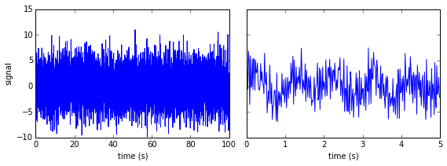


```python
F = fftpack.fft(f_t)
```


```python
f = fftpack.fftfreq(N, 1/f_s)
```


```python
mask = np.where(f >= 0)
```


```python
fig, axes = plt.subplots(3, 1, figsize=(8, 6))
axes[0].plot(f[mask], np.log(abs(F[mask])), label="real")
axes[0].plot(B, 0, 'r*', markersize=10)
axes[0].set_ylabel("$\log(|F|)$", fontsize=14)

axes[1].plot(f[mask], abs(F[mask])/N, label="real")
axes[1].set_xlim(0, 2)
axes[1].set_ylabel("$|F|$", fontsize=14)

axes[2].plot(f[mask], abs(F[mask])/N, label="real")
axes[2].set_xlim(19, 23)
axes[2].set_xlabel("frequency (Hz)", fontsize=14)
axes[2].set_ylabel("$|F|$", fontsize=14)

fig.tight_layout()
fig.savefig("ch17-simulated-signal-spectrum.pdf")
fig.savefig("ch17-simulated-signal-spectrum.png")
```


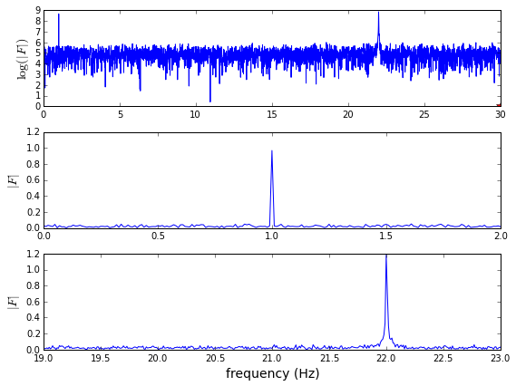


## Simple example of filtering


```python
F_filtered = F * (abs(f) < 2)
```


```python
f_t_filtered = fftpack.ifft(F_filtered)
```


```python
fig, ax = plt.subplots(figsize=(8, 3))
ax.plot(t, f_t, label='original', alpha=0.5)
ax.plot(t, f_t_filtered.real, color="red", lw=3, label='filtered')
ax.set_xlim(0, 10)
ax.set_xlabel("time (s)")
ax.set_ylabel("signal")
ax.legend()
fig.tight_layout()
fig.savefig("ch17-inverse-fft.pdf")
fig.savefig("ch17-inverse-fft.png")
```


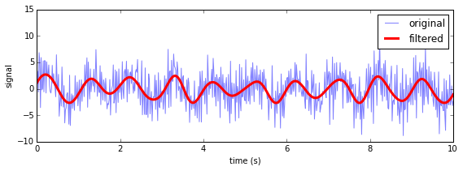


## Windowing


```python
fig, ax = plt.subplots(1, 1, figsize=(8, 3))
N = 100
ax.plot(signal.blackman(N), label="Blackman")
ax.plot(signal.hann(N), label="Hann")
ax.plot(signal.hamming(N), label="Hamming")
ax.plot(signal.gaussian(N, N/5), label="Gaussian (std=N/5)")
ax.plot(signal.kaiser(N, 7), label="Kaiser (beta=7)")
ax.set_xlabel("n")
ax.legend(loc=0)
fig.tight_layout()
fig.savefig("ch17-window-functions.pdf")
```


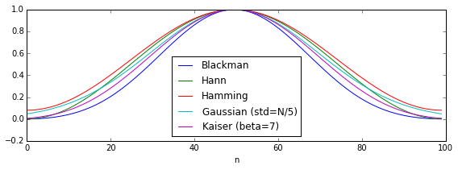


```python
df = pd.read_csv('temperature_outdoor_2014.tsv', delimiter="\t", names=["time", "temperature"])
```


```python
df.time = pd.to_datetime(df.time.values, unit="s").tz_localize('UTC').tz_convert('Europe/Stockholm')
```


```python
df = df.set_index("time")
```


```python
df = df.resample("1H")
```


```python
df = df[(df.index < "2014-06-01")]
```


```python
df = df.fillna(method='ffill')
```


```python
time = df.index.astype('int')/1e9
```


```python
temperature = df.temperature.values
```


```python
temperature_detrended = signal.detrend(temperature)
```


```python
window = signal.blackman(len(temperature_detrended))
```


```python
data_fft_window = fftpack.fft(temperature_detrended * window)
```


```python
data_fft = fftpack.fft(temperature_detrended)
```


```python
fig, ax = plt.subplots(figsize=(8, 3))
ax.plot(df.index, temperature_detrended, label="original")
ax.plot(df.index, temperature_detrended * window, label="windowed")
ax.set_ylabel("detrended temperature", fontsize=14)
ax.legend(loc=0)
fig.tight_layout()
fig.savefig("ch17-temperature-signal.pdf")
```


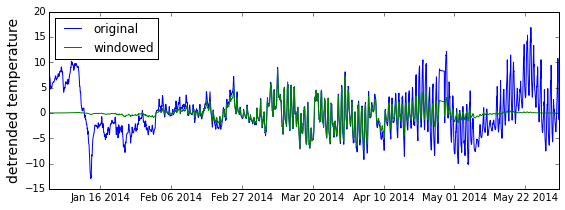


```python
f = fftpack.fftfreq(len(temperature_detrended), time[1]-time[0])
```


```python
mask = f > 0
```


```python
fig, ax = plt.subplots(figsize=(8, 3))
ax.set_xlim(0.000001, 0.000025)
ax.set_xlim(0.000005, 0.000018)
ax.axvline(1./86400, color='r', lw=0.5)
ax.plot(f[mask], np.log(abs(data_fft[mask])**2), lw=1, label="original")
ax.plot(f[mask], np.log(abs(data_fft_window[mask])**2), lw=2, label="windowed")
ax.set_ylabel("$\log|F|$", fontsize=14)
ax.set_xlabel("frequency (Hz)", fontsize=14)
ax.legend(loc=0)
fig.tight_layout()
fig.savefig("ch17-temperature-spectrum.pdf")
```


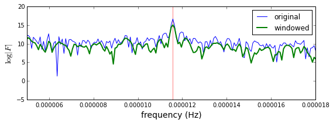


## Spectrogram of Guitar sound


```python
# https://www.freesound.org/people/guitarguy1985/sounds/52047/
```


```python
sample_rate, data = io.wavfile.read("guitar.wav")
```


```python
sample_rate
```


    44100


```python
data.shape
```


    (1181625, 2)


```python
data = data.mean(axis=1)
```


```python
data.shape[0] / sample_rate
```


    26


```python
N = int(sample_rate/2.0); N # half a second
```


    22050


```python
f = fftpack.fftfreq(N, 1.0/sample_rate)
```


```python
t = np.linspace(0, 0.5, N)
```


```python
mask = (f > 0) * (f < 1000)
```


```python
subdata = data[:N]
```


```python
F = fftpack.fft(subdata)
```


```python
fig, axes = plt.subplots(1, 2, figsize=(12, 3))
axes[0].plot(t, subdata)
axes[0].set_ylabel("signal", fontsize=14)
axes[0].set_xlabel("time (s)", fontsize=14)
axes[1].plot(f[mask], abs(F[mask]))
axes[1].set_xlim(0, 1000)
axes[1].set_ylabel("$|F|$", fontsize=14)
axes[1].set_xlabel("Frequency (Hz)", fontsize=14)
fig.tight_layout()
fig.savefig("ch17-guitar-spectrum.pdf")
```


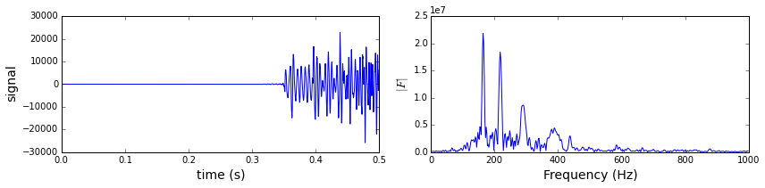


```python
N_max = int(data.shape[0] / N)
```


```python
f_values = np.sum(1 * mask)
```


```python
spect_data = np.zeros((N_max, f_values))
```


```python
window = signal.blackman(len(subdata))
```


```python
for n in range(0, N_max):
    subdata = data[(N * n):(N * (n + 1))]
    F = fftpack.fft(subdata * window)
    spect_data[n, :] = np.log(abs(F[mask]))
```


```python
fig, ax = plt.subplots(1, 1, figsize=(8, 6))
p = ax.imshow(spect_data, origin='lower',
              extent=(0, 1000, 0, data.shape[0] / sample_rate),
              aspect='auto',
              cmap=mpl.cm.RdBu_r)
cb = fig.colorbar(p, ax=ax)
cb.set_label("$\log|F|$", fontsize=16)
ax.set_ylabel("time (s)", fontsize=14)
ax.set_xlabel("Frequency (Hz)", fontsize=14)
fig.tight_layout()
fig.savefig("ch17-spectrogram.pdf")
fig.savefig("ch17-spectrogram.png")
```


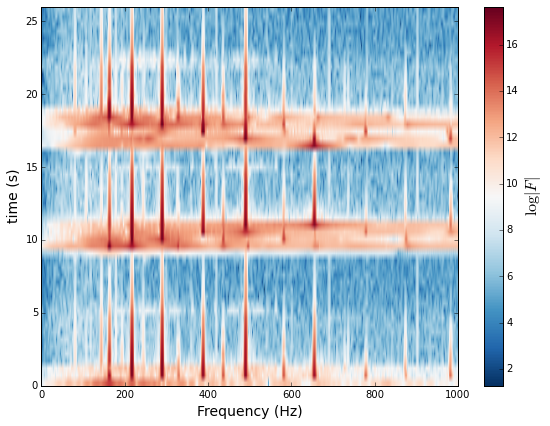


## Signal filters

### Convolution filters


```python
# restore variables from the first example
np.random.seed(0)
B = 30.0
f_s = 2 * B
delta_f = 0.01
N = int(f_s / delta_f)
T = N / f_s
t = np.linspace(0, T, N)
f_t = signal_samples(t)
f = fftpack.fftfreq(N, 1/f_s)
```


```python
H = (abs(f) < 2)
```


```python
h = fftpack.fftshift(fftpack.ifft(H))
```


```python
f_t_filtered_conv = signal.convolve(f_t, h, mode='same')
```


```python
fig = plt.figure(figsize=(8, 6))

ax = plt.subplot2grid((2,2), (0,0))
ax.plot(f, H)
ax.set_xlabel("frequency (Hz)")
ax.set_ylabel("Frequency filter")
ax.set_ylim(0, 1.5)

ax = plt.subplot2grid((2,2), (0,1))
ax.plot(t - 50, h.real)
ax.set_xlabel("time (s)")
ax.set_ylabel("convolution kernel")

ax = plt.subplot2grid((2,2), (1,0), colspan=2)
ax.plot(t, f_t, label='original', alpha=0.25)
ax.plot(t, f_t_filtered.real, "r", lw=2, label='filtered in frequency domain')
ax.plot(t, f_t_filtered_conv.real, 'b--', lw=2, label='filtered with convolution')
ax.set_xlim(0, 10)
ax.set_xlabel("time (s)")
ax.set_ylabel("signal")
ax.legend(loc=2)

fig.tight_layout()
fig.savefig("ch17-convolution-filter.pdf")
fig.savefig("ch17-convolution-filter.png")
```


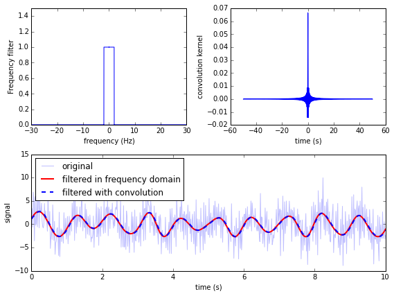


### FIR filter


```python
n = 101
```


```python
f_s = 1.0 / 3600
```


```python
nyq = f_s/2
```


```python
b = signal.firwin(n, cutoff=nyq/12, nyq=nyq, window="hamming")
```


```python
plt.plot(b);
```


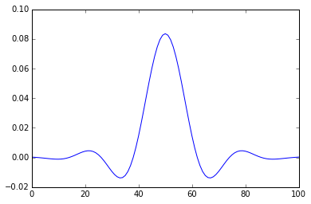


```python
f, h = signal.freqz(b)
```


```python
fig, ax = plt.subplots(1, 1, figsize=(8, 3))
h_ampl = 20 * np.log10(abs(h))
h_phase = np.unwrap(np.angle(h))
ax.plot(f/max(f), h_ampl, 'b')
ax.set_ylim(-150, 5)
ax.set_ylabel('frequency response (dB)', color="b")
ax.set_xlabel(r'normalized frequency')
ax = ax.twinx()
ax.plot(f/max(f), h_phase, 'r')
ax.set_ylabel('phase response', color="r")
ax.axvline(1.0/12, color="black")
fig.tight_layout()
fig.savefig("ch17-filter-frequency-response.pdf")
```


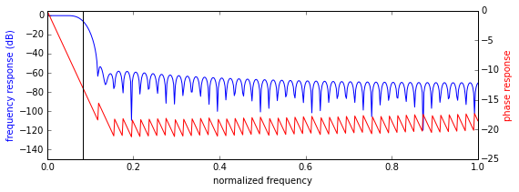


```python
temperature_filtered = signal.lfilter(b, 1, temperature)
```


```python
temperature_median_filtered = signal.medfilt(temperature, 25)
```


```python
fig, ax = plt.subplots(figsize=(8, 3))
ax.plot(df.index, temperature, label="original", alpha=0.5)
ax.plot(df.index, temperature_filtered, color="green", lw=2, label="FIR")
ax.plot(df.index, temperature_median_filtered, color="red", lw=2, label="median filer")
ax.set_ylabel("temperature", fontsize=14)
ax.legend(loc=0)
fig.tight_layout()
fig.savefig("ch17-temperature-signal-fir.pdf")
```


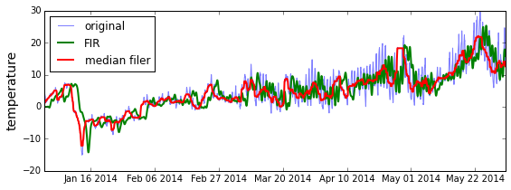


### IIR filter


```python
b, a = signal.butter(2, 14/365.0, btype='high')
```


```python
b
```


    array([ 0.91831745, -1.8366349 ,  0.91831745])


```python
a
```


    array([ 1.        , -1.82995169,  0.8433181 ])


```python
temperature_filtered_iir = signal.lfilter(b, a, temperature)
```


```python
temperature_filtered_filtfilt = signal.filtfilt(b, a, temperature)
```


```python
fig, ax = plt.subplots(figsize=(8, 3))
ax.plot(df.index, temperature, label="original", alpha=0.5)
ax.plot(df.index, temperature_filtered_iir, color="red", label="IIR filter")
ax.plot(df.index, temperature_filtered_filtfilt, color="green", label="filtfilt filtered")
ax.set_ylabel("temperature", fontsize=14)
ax.legend(loc=0)
fig.tight_layout()
fig.savefig("ch17-temperature-signal-iir.pdf")
```


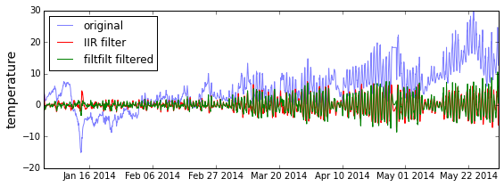


```python
# f, h = signal.freqz(b, a)
```


```python
fig, ax = plt.subplots(1, 1, figsize=(8, 3))
h_ampl = 20 * np.log10(abs(h))
h_phase = np.unwrap(np.angle(h))
ax.plot(f/max(f)/100, h_ampl, 'b')
ax.set_ylabel('frequency response (dB)', color="b")
ax.set_xlabel(r'normalized frequency')
ax = ax.twinx()
ax.plot(f/max(f)/100, h_phase, 'r')
ax.set_ylabel('phase response', color="r")
fig.tight_layout()
```


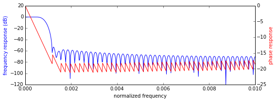


### Filtering Audio


```python
b = np.zeros(5000)
b[0] = b[-1] = 1
b /= b.sum()
```


```python
data_filt = signal.lfilter(b, 1, data)
```


```python
io.wavfile.write("guitar-echo.wav",
                 sample_rate,
                 np.vstack([data_filt, data_filt]).T.astype(np.int16))
```


```python
# based on: http://nbviewer.ipython.org/gist/Carreau/5507501/the%20sound%20of%20hydrogen.ipynb
from IPython.core.display import display
from IPython.core.display import HTML
def wav_player(filepath):
    src = """
    <audio controls="controls" style="width:600px" >
      <source src="files/%s" type="audio/wav" />
    </audio>
    """%(filepath)
    display(HTML(src))
```


```python
wav_player("guitar.wav")
```


    <audio controls="controls" style="width:600px" >
      <source src="files/guitar.wav" type="audio/wav" />
    </audio>


```python
wav_player("guitar-echo.wav")
```


    <audio controls="controls" style="width:600px" >
      <source src="files/guitar-echo.wav" type="audio/wav" />
    </audio>


# Versions


```python
%reload_ext version_information
```


```python
%version_information numpy, matplotlib, scipy
```


<table><tr><th>Software</th><th>Version</th></tr><tr><td>Python</td><td>2.7.10 64bit [GCC 4.2.1 (Apple Inc. build 5577)]</td></tr><tr><td>IPython</td><td>3.2.1</td></tr><tr><td>OS</td><td>Darwin 14.1.0 x86_64 i386 64bit</td></tr><tr><td>numpy</td><td>1.9.2</td></tr><tr><td>matplotlib</td><td>1.4.3</td></tr><tr><td>scipy</td><td>0.16.0</td></tr></table>
