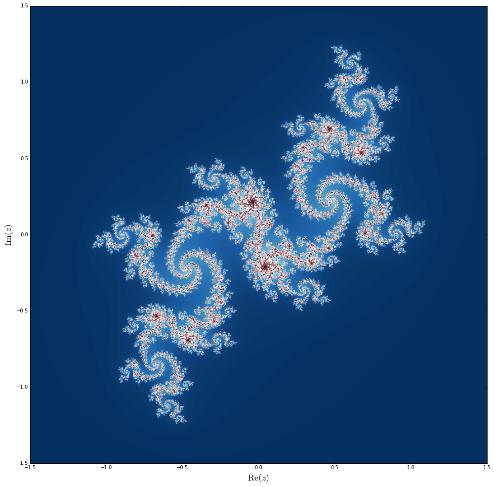

# Chapter 19: Code optimization
<!-- toc orderedList:0 depthFrom:1 depthTo:6 -->

* [Chapter 19: Code optimization](#chapter-19-code-optimization)
* [Numba](#numba)
  * [Julia fractal](#julia-fractal)
  * [Vectorize](#vectorize)
* [Cython](#cython)
  * [Using IPython cython command](#using-ipython-cython-command)
  * [Cummulative sum](#cummulative-sum)
  * [Fused types](#fused-types)
  * [Julia fractal](#julia-fractal-1)
  * [Calling C function](#calling-c-function)
* [Versions](#versions)

<!-- tocstop -->


---

Robert Johansson

Source code listings for [Numerical Python - A Practical Techniques Approach for Industry](http://www.apress.com/9781484205549) (ISBN 978-1-484205-54-9).

The source code listings can be downloaded from http://www.apress.com/9781484205549


```python
import numba
```


```python
import pyximport
```


```python
import cython
```


```python
import numpy as np
```


```python
%matplotlib inline
import matplotlib.pyplot as plt
```

# Numba


```python
np.random.seed(0)
```


```python
data = np.random.randn(50000)
```


```python
def py_sum(data):
    s = 0
    for d in data:
        s += d
    return s
```


```python
def py_cumsum(data):
    out = np.zeros(len(data), dtype=np.float64)
    s = 0
    for n in range(len(data)):
        s += data[n]
        out[n] = s

    return out
```


```python
%timeit py_sum(data)
```

    100 loops, best of 3: 7.99 ms per loop


```python
assert abs(py_sum(data) - np.sum(data)) < 1e-10
```


```python
%timeit np.sum(data)
```

    10000 loops, best of 3: 28.8 µs per loop


```python
%timeit py_cumsum(data)
```

    100 loops, best of 3: 13.1 ms per loop


```python
assert np.allclose(np.cumsum(data), py_cumsum(data))
```


```python
%timeit np.cumsum(data)
```

    10000 loops, best of 3: 146 µs per loop


```python
@numba.jit
def jit_sum(data):
    s = 0
    for d in data:
        s += d

    return s
```


```python
assert abs(jit_sum(data) - np.sum(data)) < 1e-10
```


```python
%timeit jit_sum(data)
```

    10000 loops, best of 3: 47.4 µs per loop


```python
jit_cumsum = numba.jit()(py_cumsum)
```


```python
assert np.allclose(np.cumsum(data), jit_cumsum(data))
```


```python
%timeit jit_cumsum(data)
```

    10000 loops, best of 3: 78.9 µs per loop


## Julia fractal


```python
def py_julia_fractal(z_re, z_im, j):
    for m in range(len(z_re)):
        for n in range(len(z_im)):
            z = z_re[m] + 1j * z_im[n]
            for t in range(256):
                z = z ** 2 - 0.05 + 0.68j
                if np.abs(z) > 2.0:
                #if (z.real * z.real + z.imag * z.imag) > 4.0:  # a bit faster
                    j[m, n] = t
                    break
```


```python
jit_julia_fractal = numba.jit(nopython=True)(py_julia_fractal)
```


```python
N = 1024
j = np.zeros((N, N), np.int64)
z_real = np.linspace(-1.5, 1.5, N)
z_imag = np.linspace(-1.5, 1.5, N)
```


```python
jit_julia_fractal(z_real, z_imag, j)
```


```python
fig, ax = plt.subplots(figsize=(14, 14))
ax.imshow(j, cmap=plt.cm.RdBu_r,
          extent=[-1.5, 1.5, -1.5, 1.5])
ax.set_xlabel("$\mathrm{Re}(z)$", fontsize=18)
ax.set_ylabel("$\mathrm{Im}(z)$", fontsize=18)
fig.tight_layout()
fig.savefig("ch19-numba-julia-fractal.pdf")
```





```python
%timeit py_julia_fractal(z_real, z_imag, j)
```

    1 loops, best of 3: 59.6 s per loop


```python
%timeit jit_julia_fractal(z_real, z_imag, j)
```

    10 loops, best of 3: 126 ms per loop


## Vectorize


```python
def py_Heaviside(x):
    if x == 0.0:
        return 0.5

    if x < 0.0:
        return 0.0
    else:
        return 1.0
```


```python
x = np.linspace(-2, 2, 50001)
```


```python
%timeit [py_Heaviside(xx) for xx in x]
```

    10 loops, best of 3: 20 ms per loop


```python
np_vec_Heaviside = np.vectorize(py_Heaviside)
```


```python
np_vec_Heaviside(x)
```


    array([ 0.,  0.,  0., ...,  1.,  1.,  1.])


```python
%timeit np_vec_Heaviside(x)
```

    100 loops, best of 3: 12 ms per loop


```python
def np_Heaviside(x):
    return (x > 0.0) + (x == 0.0)/2.0
```


```python
%timeit np_Heaviside(x)
```

    1000 loops, best of 3: 255 µs per loop


```python
@numba.vectorize([numba.float32(numba.float32),
                  numba.float64(numba.float64)])
def jit_Heaviside(x):
    if x == 0.0:
        return 0.5

    if x < 0:
        return 0.0
    else:
        return 1.0
```


```python
%timeit jit_Heaviside(x)
```

    10000 loops, best of 3: 43.6 µs per loop


```python
jit_Heaviside([-1, -0.5, 0.0, 0.5, 1.0])
```


    array([ 0. ,  0. ,  0.5,  1. ,  1. ])


# Cython


```python
!rm cy_sum.*
```


```python
%%writefile cy_sum.pyx

def cy_sum(data):
    s = 0.0
    for d in data:
        s += d
    return s
```

    Writing cy_sum.pyx


```python
!cython cy_sum.pyx
```


```python
# 5 lines of python code -> 1470 lines of C code ...
!wc cy_sum.c
```

        1519    5191   57293 cy_sum.c


```python
%%writefile setup.py

from distutils.core import setup
from Cython.Build import cythonize

import numpy as np
setup(ext_modules=cythonize('cy_sum.pyx'),
      include_dirs=[np.get_include()],
      requires=['Cython', 'numpy'] )
```

    Overwriting setup.py


```python
!python setup.py build_ext --inplace > /dev/null
```

    cy_sum.c:1377:28: warning: unused function '__Pyx_PyObject_AsString' [-Wunused-function]
    static CYTHON_INLINE char* __Pyx_PyObject_AsString(PyObject* o) {
                               ^
    cy_sum.c:1374:32: warning: unused function '__Pyx_PyUnicode_FromString' [-Wunused-function]
    static CYTHON_INLINE PyObject* __Pyx_PyUnicode_FromString(const char* c_str) {
                                   ^
    cy_sum.c:322:29: warning: unused function '__Pyx_Py_UNICODE_strlen' [-Wunused-function]
    static CYTHON_INLINE size_t __Pyx_Py_UNICODE_strlen(const Py_UNICODE *u)
                                ^
    cy_sum.c:1439:26: warning: unused function '__Pyx_PyObject_IsTrue' [-Wunused-function]
    static CYTHON_INLINE int __Pyx_PyObject_IsTrue(PyObject* x) {
                             ^
    cy_sum.c:1489:33: warning: unused function '__Pyx_PyIndex_AsSsize_t' [-Wunused-function]
    static CYTHON_INLINE Py_ssize_t __Pyx_PyIndex_AsSsize_t(PyObject* b) {
                                    ^
    cy_sum.c:1514:33: warning: unused function '__Pyx_PyInt_FromSize_t' [-Wunused-function]
    static CYTHON_INLINE PyObject * __Pyx_PyInt_FromSize_t(size_t ival) {
                                    ^
    cy_sum.c:1072:32: warning: unused function '__Pyx_PyInt_From_long' [-Wunused-function]
    static CYTHON_INLINE PyObject* __Pyx_PyInt_From_long(long value) {
                                   ^
    cy_sum.c:1119:27: warning: function '__Pyx_PyInt_As_long' is not needed and will not be emitted [-Wunneeded-internal-declaration]
    static CYTHON_INLINE long __Pyx_PyInt_As_long(PyObject *x) {
                              ^
    cy_sum.c:1224:26: warning: function '__Pyx_PyInt_As_int' is not needed and will not be emitted [-Wunneeded-internal-declaration]
    static CYTHON_INLINE int __Pyx_PyInt_As_int(PyObject *x) {
                             ^
    9 warnings generated.


```python
from cy_sum import cy_sum
```


```python
cy_sum(data)
```


    -189.70046227549025


```python
%timeit cy_sum(data)
```

    100 loops, best of 3: 4.96 ms per loop


```python
%timeit py_sum(data)
```

    100 loops, best of 3: 8.09 ms per loop


```python
%%writefile cy_cumsum.pyx

cimport numpy
import numpy

def cy_cumsum(data):
    out = numpy.zeros_like(data)
    s = 0
    for n in range(len(data)):
        s += data[n]
        out[n] = s

    return out
```

    Overwriting cy_cumsum.pyx


```python
pyximport.install(setup_args={'include_dirs': np.get_include()});
```


```python
pyximport.install(setup_args=dict(include_dirs=np.get_include()));
```


```python
from cy_cumsum import cy_cumsum
```


```python
%timeit cy_cumsum(data)
```

    100 loops, best of 3: 6.32 ms per loop


```python
%timeit py_cumsum(data)
```

    100 loops, best of 3: 13.4 ms per loop


## Using IPython cython command


```python
%load_ext cython
```


```python
%%cython -a
def cy_sum(data):
    s = 0.0
    for d in data:
        s += d
    return s
```


<!DOCTYPE html>
<!-- Generated by Cython 0.22.1 -->
<html>
<head>
    <meta http-equiv="Content-Type" content="text/html; charset=utf-8" />
    <title>Cython: _cython_magic_c879406be9ebc78f7d3a9c5050513ba5.pyx</title>
    <style type="text/css">

body.cython { font-family: courier; font-size: 12; }

.cython.tag  {  }
.cython.line { margin: 0em }
.cython.code  { font-size: 9; color: #444444; display: none; margin: 0px 0px 0px 20px;  }

.cython.code .py_c_api  { color: red; }
.cython.code .py_macro_api  { color: #FF7000; }
.cython.code .pyx_c_api  { color: #FF3000; }
.cython.code .pyx_macro_api  { color: #FF7000; }
.cython.code .refnanny  { color: #FFA000; }
.cython.code .error_goto  { color: #FFA000; }

.cython.code .coerce  { color: #008000; border: 1px dotted #008000 }
.cython.code .py_attr { color: #FF0000; font-weight: bold; }
.cython.code .c_attr  { color: #0000FF; }
.cython.code .py_call { color: #FF0000; font-weight: bold; }
.cython.code .c_call  { color: #0000FF; }

.cython.score-0 {background-color: #FFFFff;}
.cython.score-1 {background-color: #FFFFe7;}
.cython.score-2 {background-color: #FFFFd4;}
.cython.score-3 {background-color: #FFFFc4;}
.cython.score-4 {background-color: #FFFFb6;}
.cython.score-5 {background-color: #FFFFaa;}
.cython.score-6 {background-color: #FFFF9f;}
.cython.score-7 {background-color: #FFFF96;}
.cython.score-8 {background-color: #FFFF8d;}
.cython.score-9 {background-color: #FFFF86;}
.cython.score-10 {background-color: #FFFF7f;}
.cython.score-11 {background-color: #FFFF79;}
.cython.score-12 {background-color: #FFFF73;}
.cython.score-13 {background-color: #FFFF6e;}
.cython.score-14 {background-color: #FFFF6a;}
.cython.score-15 {background-color: #FFFF66;}
.cython.score-16 {background-color: #FFFF62;}
.cython.score-17 {background-color: #FFFF5e;}
.cython.score-18 {background-color: #FFFF5b;}
.cython.score-19 {background-color: #FFFF57;}
.cython.score-20 {background-color: #FFFF55;}
.cython.score-21 {background-color: #FFFF52;}
.cython.score-22 {background-color: #FFFF4f;}
.cython.score-23 {background-color: #FFFF4d;}
.cython.score-24 {background-color: #FFFF4b;}
.cython.score-25 {background-color: #FFFF48;}
.cython.score-26 {background-color: #FFFF46;}
.cython.score-27 {background-color: #FFFF44;}
.cython.score-28 {background-color: #FFFF43;}
.cython.score-29 {background-color: #FFFF41;}
.cython.score-30 {background-color: #FFFF3f;}
.cython.score-31 {background-color: #FFFF3e;}
.cython.score-32 {background-color: #FFFF3c;}
.cython.score-33 {background-color: #FFFF3b;}
.cython.score-34 {background-color: #FFFF39;}
.cython.score-35 {background-color: #FFFF38;}
.cython.score-36 {background-color: #FFFF37;}
.cython.score-37 {background-color: #FFFF36;}
.cython.score-38 {background-color: #FFFF35;}
.cython.score-39 {background-color: #FFFF34;}
.cython.score-40 {background-color: #FFFF33;}
.cython.score-41 {background-color: #FFFF32;}
.cython.score-42 {background-color: #FFFF31;}
.cython.score-43 {background-color: #FFFF30;}
.cython.score-44 {background-color: #FFFF2f;}
.cython.score-45 {background-color: #FFFF2e;}
.cython.score-46 {background-color: #FFFF2d;}
.cython.score-47 {background-color: #FFFF2c;}
.cython.score-48 {background-color: #FFFF2b;}
.cython.score-49 {background-color: #FFFF2b;}
.cython.score-50 {background-color: #FFFF2a;}
.cython.score-51 {background-color: #FFFF29;}
.cython.score-52 {background-color: #FFFF29;}
.cython.score-53 {background-color: #FFFF28;}
.cython.score-54 {background-color: #FFFF27;}
.cython.score-55 {background-color: #FFFF27;}
.cython.score-56 {background-color: #FFFF26;}
.cython.score-57 {background-color: #FFFF26;}
.cython.score-58 {background-color: #FFFF25;}
.cython.score-59 {background-color: #FFFF24;}
.cython.score-60 {background-color: #FFFF24;}
.cython.score-61 {background-color: #FFFF23;}
.cython.score-62 {background-color: #FFFF23;}
.cython.score-63 {background-color: #FFFF22;}
.cython.score-64 {background-color: #FFFF22;}
.cython.score-65 {background-color: #FFFF22;}
.cython.score-66 {background-color: #FFFF21;}
.cython.score-67 {background-color: #FFFF21;}
.cython.score-68 {background-color: #FFFF20;}
.cython.score-69 {background-color: #FFFF20;}
.cython.score-70 {background-color: #FFFF1f;}
.cython.score-71 {background-color: #FFFF1f;}
.cython.score-72 {background-color: #FFFF1f;}
.cython.score-73 {background-color: #FFFF1e;}
.cython.score-74 {background-color: #FFFF1e;}
.cython.score-75 {background-color: #FFFF1e;}
.cython.score-76 {background-color: #FFFF1d;}
.cython.score-77 {background-color: #FFFF1d;}
.cython.score-78 {background-color: #FFFF1c;}
.cython.score-79 {background-color: #FFFF1c;}
.cython.score-80 {background-color: #FFFF1c;}
.cython.score-81 {background-color: #FFFF1c;}
.cython.score-82 {background-color: #FFFF1b;}
.cython.score-83 {background-color: #FFFF1b;}
.cython.score-84 {background-color: #FFFF1b;}
.cython.score-85 {background-color: #FFFF1a;}
.cython.score-86 {background-color: #FFFF1a;}
.cython.score-87 {background-color: #FFFF1a;}
.cython.score-88 {background-color: #FFFF1a;}
.cython.score-89 {background-color: #FFFF19;}
.cython.score-90 {background-color: #FFFF19;}
.cython.score-91 {background-color: #FFFF19;}
.cython.score-92 {background-color: #FFFF19;}
.cython.score-93 {background-color: #FFFF18;}
.cython.score-94 {background-color: #FFFF18;}
.cython.score-95 {background-color: #FFFF18;}
.cython.score-96 {background-color: #FFFF18;}
.cython.score-97 {background-color: #FFFF17;}
.cython.score-98 {background-color: #FFFF17;}
.cython.score-99 {background-color: #FFFF17;}
.cython.score-100 {background-color: #FFFF17;}
.cython.score-101 {background-color: #FFFF16;}
.cython.score-102 {background-color: #FFFF16;}
.cython.score-103 {background-color: #FFFF16;}
.cython.score-104 {background-color: #FFFF16;}
.cython.score-105 {background-color: #FFFF16;}
.cython.score-106 {background-color: #FFFF15;}
.cython.score-107 {background-color: #FFFF15;}
.cython.score-108 {background-color: #FFFF15;}
.cython.score-109 {background-color: #FFFF15;}
.cython.score-110 {background-color: #FFFF15;}
.cython.score-111 {background-color: #FFFF15;}
.cython.score-112 {background-color: #FFFF14;}
.cython.score-113 {background-color: #FFFF14;}
.cython.score-114 {background-color: #FFFF14;}
.cython.score-115 {background-color: #FFFF14;}
.cython.score-116 {background-color: #FFFF14;}
.cython.score-117 {background-color: #FFFF14;}
.cython.score-118 {background-color: #FFFF13;}
.cython.score-119 {background-color: #FFFF13;}
.cython.score-120 {background-color: #FFFF13;}
.cython.score-121 {background-color: #FFFF13;}
.cython.score-122 {background-color: #FFFF13;}
.cython.score-123 {background-color: #FFFF13;}
.cython.score-124 {background-color: #FFFF13;}
.cython.score-125 {background-color: #FFFF12;}
.cython.score-126 {background-color: #FFFF12;}
.cython.score-127 {background-color: #FFFF12;}
.cython.score-128 {background-color: #FFFF12;}
.cython.score-129 {background-color: #FFFF12;}
.cython.score-130 {background-color: #FFFF12;}
.cython.score-131 {background-color: #FFFF12;}
.cython.score-132 {background-color: #FFFF11;}
.cython.score-133 {background-color: #FFFF11;}
.cython.score-134 {background-color: #FFFF11;}
.cython.score-135 {background-color: #FFFF11;}
.cython.score-136 {background-color: #FFFF11;}
.cython.score-137 {background-color: #FFFF11;}
.cython.score-138 {background-color: #FFFF11;}
.cython.score-139 {background-color: #FFFF11;}
.cython.score-140 {background-color: #FFFF11;}
.cython.score-141 {background-color: #FFFF10;}
.cython.score-142 {background-color: #FFFF10;}
.cython.score-143 {background-color: #FFFF10;}
.cython.score-144 {background-color: #FFFF10;}
.cython.score-145 {background-color: #FFFF10;}
.cython.score-146 {background-color: #FFFF10;}
.cython.score-147 {background-color: #FFFF10;}
.cython.score-148 {background-color: #FFFF10;}
.cython.score-149 {background-color: #FFFF10;}
.cython.score-150 {background-color: #FFFF0f;}
.cython.score-151 {background-color: #FFFF0f;}
.cython.score-152 {background-color: #FFFF0f;}
.cython.score-153 {background-color: #FFFF0f;}
.cython.score-154 {background-color: #FFFF0f;}
.cython.score-155 {background-color: #FFFF0f;}
.cython.score-156 {background-color: #FFFF0f;}
.cython.score-157 {background-color: #FFFF0f;}
.cython.score-158 {background-color: #FFFF0f;}
.cython.score-159 {background-color: #FFFF0f;}
.cython.score-160 {background-color: #FFFF0f;}
.cython.score-161 {background-color: #FFFF0e;}
.cython.score-162 {background-color: #FFFF0e;}
.cython.score-163 {background-color: #FFFF0e;}
.cython.score-164 {background-color: #FFFF0e;}
.cython.score-165 {background-color: #FFFF0e;}
.cython.score-166 {background-color: #FFFF0e;}
.cython.score-167 {background-color: #FFFF0e;}
.cython.score-168 {background-color: #FFFF0e;}
.cython.score-169 {background-color: #FFFF0e;}
.cython.score-170 {background-color: #FFFF0e;}
.cython.score-171 {background-color: #FFFF0e;}
.cython.score-172 {background-color: #FFFF0e;}
.cython.score-173 {background-color: #FFFF0d;}
.cython.score-174 {background-color: #FFFF0d;}
.cython.score-175 {background-color: #FFFF0d;}
.cython.score-176 {background-color: #FFFF0d;}
.cython.score-177 {background-color: #FFFF0d;}
.cython.score-178 {background-color: #FFFF0d;}
.cython.score-179 {background-color: #FFFF0d;}
.cython.score-180 {background-color: #FFFF0d;}
.cython.score-181 {background-color: #FFFF0d;}
.cython.score-182 {background-color: #FFFF0d;}
.cython.score-183 {background-color: #FFFF0d;}
.cython.score-184 {background-color: #FFFF0d;}
.cython.score-185 {background-color: #FFFF0d;}
.cython.score-186 {background-color: #FFFF0d;}
.cython.score-187 {background-color: #FFFF0c;}
.cython.score-188 {background-color: #FFFF0c;}
.cython.score-189 {background-color: #FFFF0c;}
.cython.score-190 {background-color: #FFFF0c;}
.cython.score-191 {background-color: #FFFF0c;}
.cython.score-192 {background-color: #FFFF0c;}
.cython.score-193 {background-color: #FFFF0c;}
.cython.score-194 {background-color: #FFFF0c;}
.cython.score-195 {background-color: #FFFF0c;}
.cython.score-196 {background-color: #FFFF0c;}
.cython.score-197 {background-color: #FFFF0c;}
.cython.score-198 {background-color: #FFFF0c;}
.cython.score-199 {background-color: #FFFF0c;}
.cython.score-200 {background-color: #FFFF0c;}
.cython.score-201 {background-color: #FFFF0c;}
.cython.score-202 {background-color: #FFFF0c;}
.cython.score-203 {background-color: #FFFF0b;}
.cython.score-204 {background-color: #FFFF0b;}
.cython.score-205 {background-color: #FFFF0b;}
.cython.score-206 {background-color: #FFFF0b;}
.cython.score-207 {background-color: #FFFF0b;}
.cython.score-208 {background-color: #FFFF0b;}
.cython.score-209 {background-color: #FFFF0b;}
.cython.score-210 {background-color: #FFFF0b;}
.cython.score-211 {background-color: #FFFF0b;}
.cython.score-212 {background-color: #FFFF0b;}
.cython.score-213 {background-color: #FFFF0b;}
.cython.score-214 {background-color: #FFFF0b;}
.cython.score-215 {background-color: #FFFF0b;}
.cython.score-216 {background-color: #FFFF0b;}
.cython.score-217 {background-color: #FFFF0b;}
.cython.score-218 {background-color: #FFFF0b;}
.cython.score-219 {background-color: #FFFF0b;}
.cython.score-220 {background-color: #FFFF0b;}
.cython.score-221 {background-color: #FFFF0b;}
.cython.score-222 {background-color: #FFFF0a;}
.cython.score-223 {background-color: #FFFF0a;}
.cython.score-224 {background-color: #FFFF0a;}
.cython.score-225 {background-color: #FFFF0a;}
.cython.score-226 {background-color: #FFFF0a;}
.cython.score-227 {background-color: #FFFF0a;}
.cython.score-228 {background-color: #FFFF0a;}
.cython.score-229 {background-color: #FFFF0a;}
.cython.score-230 {background-color: #FFFF0a;}
.cython.score-231 {background-color: #FFFF0a;}
.cython.score-232 {background-color: #FFFF0a;}
.cython.score-233 {background-color: #FFFF0a;}
.cython.score-234 {background-color: #FFFF0a;}
.cython.score-235 {background-color: #FFFF0a;}
.cython.score-236 {background-color: #FFFF0a;}
.cython.score-237 {background-color: #FFFF0a;}
.cython.score-238 {background-color: #FFFF0a;}
.cython.score-239 {background-color: #FFFF0a;}
.cython.score-240 {background-color: #FFFF0a;}
.cython.score-241 {background-color: #FFFF0a;}
.cython.score-242 {background-color: #FFFF0a;}
.cython.score-243 {background-color: #FFFF0a;}
.cython.score-244 {background-color: #FFFF0a;}
.cython.score-245 {background-color: #FFFF0a;}
.cython.score-246 {background-color: #FFFF09;}
.cython.score-247 {background-color: #FFFF09;}
.cython.score-248 {background-color: #FFFF09;}
.cython.score-249 {background-color: #FFFF09;}
.cython.score-250 {background-color: #FFFF09;}
.cython.score-251 {background-color: #FFFF09;}
.cython.score-252 {background-color: #FFFF09;}
.cython.score-253 {background-color: #FFFF09;}
.cython.score-254 {background-color: #FFFF09;}
    </style>
    <script>
    function toggleDiv(id) {
        theDiv = id.nextElementSibling
        if (theDiv.style.display != 'block') theDiv.style.display = 'block';
        else theDiv.style.display = 'none';
    }
    </script>
</head>
<body class="cython">
<p><span style="border-bottom: solid 1px grey;">Generated by Cython 0.22.1</span></p>
<p>
    <span style="background-color: #FFFF00">Yellow lines</span> hint at Python interaction.<br />
    Click on a line that starts with a "<code>+</code>" to see the C code that Cython generated for it.
</p>
<div class="cython"><pre class='cython line score-17' onclick='toggleDiv(this)'>+1: def cy_sum(data):</pre>
<pre class='cython code score-17'>/* Python wrapper */
static PyObject *__pyx_pw_46_cython_magic_c879406be9ebc78f7d3a9c5050513ba5_1cy_sum(PyObject *__pyx_self, PyObject *__pyx_v_data); /*proto*/
static PyMethodDef __pyx_mdef_46_cython_magic_c879406be9ebc78f7d3a9c5050513ba5_1cy_sum = {"cy_sum", (PyCFunction)__pyx_pw_46_cython_magic_c879406be9ebc78f7d3a9c5050513ba5_1cy_sum, METH_O, 0};
static PyObject *__pyx_pw_46_cython_magic_c879406be9ebc78f7d3a9c5050513ba5_1cy_sum(PyObject *__pyx_self, PyObject *__pyx_v_data) {
  PyObject *__pyx_r = 0;
  <span class='refnanny'>__Pyx_RefNannyDeclarations</span>
  <span class='refnanny'>__Pyx_RefNannySetupContext</span>("cy_sum (wrapper)", 0);
  __pyx_r = __pyx_pf_46_cython_magic_c879406be9ebc78f7d3a9c5050513ba5_cy_sum(__pyx_self, ((PyObject *)__pyx_v_data));

  /* function exit code */
  <span class='refnanny'>__Pyx_RefNannyFinishContext</span>();
  return __pyx_r;
}

static PyObject *__pyx_pf_46_cython_magic_c879406be9ebc78f7d3a9c5050513ba5_cy_sum(CYTHON_UNUSED PyObject *__pyx_self, PyObject *__pyx_v_data) {
  PyObject *__pyx_v_s = NULL;
  PyObject *__pyx_v_d = NULL;
  PyObject *__pyx_r = NULL;
  <span class='refnanny'>__Pyx_RefNannyDeclarations</span>
  <span class='refnanny'>__Pyx_RefNannySetupContext</span>("cy_sum", 0);
/* … */
  /* function exit code */
  __pyx_L1_error:;
  <span class='pyx_macro_api'>__Pyx_XDECREF</span>(__pyx_t_1);
  <span class='pyx_macro_api'>__Pyx_XDECREF</span>(__pyx_t_4);
  <span class='pyx_c_api'>__Pyx_AddTraceback</span>("_cython_magic_c879406be9ebc78f7d3a9c5050513ba5.cy_sum", __pyx_clineno, __pyx_lineno, __pyx_filename);
  __pyx_r = NULL;
  __pyx_L0:;
  <span class='pyx_macro_api'>__Pyx_XDECREF</span>(__pyx_v_s);
  <span class='pyx_macro_api'>__Pyx_XDECREF</span>(__pyx_v_d);
  <span class='refnanny'>__Pyx_XGIVEREF</span>(__pyx_r);
  <span class='refnanny'>__Pyx_RefNannyFinishContext</span>();
  return __pyx_r;
}
/* … */
  __pyx_tuple_ = <span class='py_c_api'>PyTuple_Pack</span>(3, __pyx_n_s_data, __pyx_n_s_s, __pyx_n_s_d);<span class='error_goto'> if (unlikely(!__pyx_tuple_)) {__pyx_filename = __pyx_f[0]; __pyx_lineno = 1; __pyx_clineno = __LINE__; goto __pyx_L1_error;}</span>
  <span class='refnanny'>__Pyx_GOTREF</span>(__pyx_tuple_);
  <span class='refnanny'>__Pyx_GIVEREF</span>(__pyx_tuple_);
/* … */
  __pyx_t_1 = PyCFunction_NewEx(&amp;__pyx_mdef_46_cython_magic_c879406be9ebc78f7d3a9c5050513ba5_1cy_sum, NULL, __pyx_n_s_cython_magic_c879406be9ebc78f7d);<span class='error_goto'> if (unlikely(!__pyx_t_1)) {__pyx_filename = __pyx_f[0]; __pyx_lineno = 1; __pyx_clineno = __LINE__; goto __pyx_L1_error;}</span>
  <span class='refnanny'>__Pyx_GOTREF</span>(__pyx_t_1);
  if (<span class='py_c_api'>PyDict_SetItem</span>(__pyx_d, __pyx_n_s_cy_sum, __pyx_t_1) &lt; 0) <span class='error_goto'>{__pyx_filename = __pyx_f[0]; __pyx_lineno = 1; __pyx_clineno = __LINE__; goto __pyx_L1_error;}</span>
  <span class='pyx_macro_api'>__Pyx_DECREF</span>(__pyx_t_1); __pyx_t_1 = 0;
</pre><pre class='cython line score-1' onclick='toggleDiv(this)'>+2:     s = 0.0</pre>
<pre class='cython code score-1'>  <span class='pyx_macro_api'>__Pyx_INCREF</span>(__pyx_float_0_0);
  __pyx_v_s = __pyx_float_0_0;
</pre><pre class='cython line score-46' onclick='toggleDiv(this)'>+3:     for d in data:</pre>
<pre class='cython code score-46'>  if (likely(<span class='py_c_api'>PyList_CheckExact</span>(__pyx_v_data)) || <span class='py_c_api'>PyTuple_CheckExact</span>(__pyx_v_data)) {
    __pyx_t_1 = __pyx_v_data; <span class='pyx_macro_api'>__Pyx_INCREF</span>(__pyx_t_1); __pyx_t_2 = 0;
    __pyx_t_3 = NULL;
  } else {
    __pyx_t_2 = -1; __pyx_t_1 = <span class='py_c_api'>PyObject_GetIter</span>(__pyx_v_data);<span class='error_goto'> if (unlikely(!__pyx_t_1)) {__pyx_filename = __pyx_f[0]; __pyx_lineno = 3; __pyx_clineno = __LINE__; goto __pyx_L1_error;}</span>
    <span class='refnanny'>__Pyx_GOTREF</span>(__pyx_t_1);
    __pyx_t_3 = Py_TYPE(__pyx_t_1)-&gt;tp_iternext;<span class='error_goto'> if (unlikely(!__pyx_t_3)) {__pyx_filename = __pyx_f[0]; __pyx_lineno = 3; __pyx_clineno = __LINE__; goto __pyx_L1_error;}</span>
  }
  for (;;) {
    if (likely(!__pyx_t_3)) {
      if (likely(<span class='py_c_api'>PyList_CheckExact</span>(__pyx_t_1))) {
        if (__pyx_t_2 &gt;= <span class='py_macro_api'>PyList_GET_SIZE</span>(__pyx_t_1)) break;
        #if CYTHON_COMPILING_IN_CPYTHON
        __pyx_t_4 = <span class='py_macro_api'>PyList_GET_ITEM</span>(__pyx_t_1, __pyx_t_2); <span class='pyx_macro_api'>__Pyx_INCREF</span>(__pyx_t_4); __pyx_t_2++;<span class='error_goto'> if (unlikely(0 &lt; 0)) {__pyx_filename = __pyx_f[0]; __pyx_lineno = 3; __pyx_clineno = __LINE__; goto __pyx_L1_error;}</span>
        #else
        __pyx_t_4 = <span class='py_macro_api'>PySequence_ITEM</span>(__pyx_t_1, __pyx_t_2); __pyx_t_2++;<span class='error_goto'> if (unlikely(!__pyx_t_4)) {__pyx_filename = __pyx_f[0]; __pyx_lineno = 3; __pyx_clineno = __LINE__; goto __pyx_L1_error;}</span>
        <span class='refnanny'>__Pyx_GOTREF</span>(__pyx_t_4);
        #endif
      } else {
        if (__pyx_t_2 &gt;= <span class='py_macro_api'>PyTuple_GET_SIZE</span>(__pyx_t_1)) break;
        #if CYTHON_COMPILING_IN_CPYTHON
        __pyx_t_4 = <span class='py_macro_api'>PyTuple_GET_ITEM</span>(__pyx_t_1, __pyx_t_2); <span class='pyx_macro_api'>__Pyx_INCREF</span>(__pyx_t_4); __pyx_t_2++;<span class='error_goto'> if (unlikely(0 &lt; 0)) {__pyx_filename = __pyx_f[0]; __pyx_lineno = 3; __pyx_clineno = __LINE__; goto __pyx_L1_error;}</span>
        #else
        __pyx_t_4 = <span class='py_macro_api'>PySequence_ITEM</span>(__pyx_t_1, __pyx_t_2); __pyx_t_2++;<span class='error_goto'> if (unlikely(!__pyx_t_4)) {__pyx_filename = __pyx_f[0]; __pyx_lineno = 3; __pyx_clineno = __LINE__; goto __pyx_L1_error;}</span>
        <span class='refnanny'>__Pyx_GOTREF</span>(__pyx_t_4);
        #endif
      }
    } else {
      __pyx_t_4 = __pyx_t_3(__pyx_t_1);
      if (unlikely(!__pyx_t_4)) {
        PyObject* exc_type = <span class='py_c_api'>PyErr_Occurred</span>();
        if (exc_type) {
          if (likely(exc_type == PyExc_StopIteration || <span class='py_c_api'>PyErr_GivenExceptionMatches</span>(exc_type, PyExc_StopIteration))) <span class='py_c_api'>PyErr_Clear</span>();
          else <span class='error_goto'>{__pyx_filename = __pyx_f[0]; __pyx_lineno = 3; __pyx_clineno = __LINE__; goto __pyx_L1_error;}</span>
        }
        break;
      }
      <span class='refnanny'>__Pyx_GOTREF</span>(__pyx_t_4);
    }
    <span class='pyx_macro_api'>__Pyx_XDECREF_SET</span>(__pyx_v_d, __pyx_t_4);
    __pyx_t_4 = 0;
/* … */
  }
  <span class='pyx_macro_api'>__Pyx_DECREF</span>(__pyx_t_1); __pyx_t_1 = 0;
</pre><pre class='cython line score-6' onclick='toggleDiv(this)'>+4:         s += d</pre>
<pre class='cython code score-6'>    __pyx_t_4 = <span class='py_c_api'>PyNumber_InPlaceAdd</span>(__pyx_v_s, __pyx_v_d);<span class='error_goto'> if (unlikely(!__pyx_t_4)) {__pyx_filename = __pyx_f[0]; __pyx_lineno = 4; __pyx_clineno = __LINE__; goto __pyx_L1_error;}</span>
    <span class='refnanny'>__Pyx_GOTREF</span>(__pyx_t_4);
    <span class='pyx_macro_api'>__Pyx_DECREF_SET</span>(__pyx_v_s, __pyx_t_4);
    __pyx_t_4 = 0;
</pre><pre class='cython line score-2' onclick='toggleDiv(this)'>+5:     return s</pre>
<pre class='cython code score-2'>  <span class='pyx_macro_api'>__Pyx_XDECREF</span>(__pyx_r);
  <span class='pyx_macro_api'>__Pyx_INCREF</span>(__pyx_v_s);
  __pyx_r = __pyx_v_s;
  goto __pyx_L0;
</pre></div></body></html>


```python
%timeit cy_sum(data)
```

    100 loops, best of 3: 4.97 ms per loop


```python
%timeit py_sum(data)
```

    100 loops, best of 3: 7.82 ms per loop


```python
assert np.allclose(np.sum(data), cy_sum(data))
```


```python
%%cython -a
cimport numpy
cimport cython

@cython.boundscheck(False)
@cython.wraparound(False)
def cy_sum(numpy.ndarray[numpy.float64_t, ndim=1] data):
    cdef numpy.float64_t s = 0.0
    cdef int n, N = len(data)
    for n in range(N):
        s += data[n]
    return s
```


<!DOCTYPE html>
<!-- Generated by Cython 0.22.1 -->
<html>
<head>
    <meta http-equiv="Content-Type" content="text/html; charset=utf-8" />
    <title>Cython: _cython_magic_5634d0627d9a45c8eb4964708c73457e.pyx</title>
    <style type="text/css">

body.cython { font-family: courier; font-size: 12; }

.cython.tag  {  }
.cython.line { margin: 0em }
.cython.code  { font-size: 9; color: #444444; display: none; margin: 0px 0px 0px 20px;  }

.cython.code .py_c_api  { color: red; }
.cython.code .py_macro_api  { color: #FF7000; }
.cython.code .pyx_c_api  { color: #FF3000; }
.cython.code .pyx_macro_api  { color: #FF7000; }
.cython.code .refnanny  { color: #FFA000; }
.cython.code .error_goto  { color: #FFA000; }

.cython.code .coerce  { color: #008000; border: 1px dotted #008000 }
.cython.code .py_attr { color: #FF0000; font-weight: bold; }
.cython.code .c_attr  { color: #0000FF; }
.cython.code .py_call { color: #FF0000; font-weight: bold; }
.cython.code .c_call  { color: #0000FF; }

.cython.score-0 {background-color: #FFFFff;}
.cython.score-1 {background-color: #FFFFe7;}
.cython.score-2 {background-color: #FFFFd4;}
.cython.score-3 {background-color: #FFFFc4;}
.cython.score-4 {background-color: #FFFFb6;}
.cython.score-5 {background-color: #FFFFaa;}
.cython.score-6 {background-color: #FFFF9f;}
.cython.score-7 {background-color: #FFFF96;}
.cython.score-8 {background-color: #FFFF8d;}
.cython.score-9 {background-color: #FFFF86;}
.cython.score-10 {background-color: #FFFF7f;}
.cython.score-11 {background-color: #FFFF79;}
.cython.score-12 {background-color: #FFFF73;}
.cython.score-13 {background-color: #FFFF6e;}
.cython.score-14 {background-color: #FFFF6a;}
.cython.score-15 {background-color: #FFFF66;}
.cython.score-16 {background-color: #FFFF62;}
.cython.score-17 {background-color: #FFFF5e;}
.cython.score-18 {background-color: #FFFF5b;}
.cython.score-19 {background-color: #FFFF57;}
.cython.score-20 {background-color: #FFFF55;}
.cython.score-21 {background-color: #FFFF52;}
.cython.score-22 {background-color: #FFFF4f;}
.cython.score-23 {background-color: #FFFF4d;}
.cython.score-24 {background-color: #FFFF4b;}
.cython.score-25 {background-color: #FFFF48;}
.cython.score-26 {background-color: #FFFF46;}
.cython.score-27 {background-color: #FFFF44;}
.cython.score-28 {background-color: #FFFF43;}
.cython.score-29 {background-color: #FFFF41;}
.cython.score-30 {background-color: #FFFF3f;}
.cython.score-31 {background-color: #FFFF3e;}
.cython.score-32 {background-color: #FFFF3c;}
.cython.score-33 {background-color: #FFFF3b;}
.cython.score-34 {background-color: #FFFF39;}
.cython.score-35 {background-color: #FFFF38;}
.cython.score-36 {background-color: #FFFF37;}
.cython.score-37 {background-color: #FFFF36;}
.cython.score-38 {background-color: #FFFF35;}
.cython.score-39 {background-color: #FFFF34;}
.cython.score-40 {background-color: #FFFF33;}
.cython.score-41 {background-color: #FFFF32;}
.cython.score-42 {background-color: #FFFF31;}
.cython.score-43 {background-color: #FFFF30;}
.cython.score-44 {background-color: #FFFF2f;}
.cython.score-45 {background-color: #FFFF2e;}
.cython.score-46 {background-color: #FFFF2d;}
.cython.score-47 {background-color: #FFFF2c;}
.cython.score-48 {background-color: #FFFF2b;}
.cython.score-49 {background-color: #FFFF2b;}
.cython.score-50 {background-color: #FFFF2a;}
.cython.score-51 {background-color: #FFFF29;}
.cython.score-52 {background-color: #FFFF29;}
.cython.score-53 {background-color: #FFFF28;}
.cython.score-54 {background-color: #FFFF27;}
.cython.score-55 {background-color: #FFFF27;}
.cython.score-56 {background-color: #FFFF26;}
.cython.score-57 {background-color: #FFFF26;}
.cython.score-58 {background-color: #FFFF25;}
.cython.score-59 {background-color: #FFFF24;}
.cython.score-60 {background-color: #FFFF24;}
.cython.score-61 {background-color: #FFFF23;}
.cython.score-62 {background-color: #FFFF23;}
.cython.score-63 {background-color: #FFFF22;}
.cython.score-64 {background-color: #FFFF22;}
.cython.score-65 {background-color: #FFFF22;}
.cython.score-66 {background-color: #FFFF21;}
.cython.score-67 {background-color: #FFFF21;}
.cython.score-68 {background-color: #FFFF20;}
.cython.score-69 {background-color: #FFFF20;}
.cython.score-70 {background-color: #FFFF1f;}
.cython.score-71 {background-color: #FFFF1f;}
.cython.score-72 {background-color: #FFFF1f;}
.cython.score-73 {background-color: #FFFF1e;}
.cython.score-74 {background-color: #FFFF1e;}
.cython.score-75 {background-color: #FFFF1e;}
.cython.score-76 {background-color: #FFFF1d;}
.cython.score-77 {background-color: #FFFF1d;}
.cython.score-78 {background-color: #FFFF1c;}
.cython.score-79 {background-color: #FFFF1c;}
.cython.score-80 {background-color: #FFFF1c;}
.cython.score-81 {background-color: #FFFF1c;}
.cython.score-82 {background-color: #FFFF1b;}
.cython.score-83 {background-color: #FFFF1b;}
.cython.score-84 {background-color: #FFFF1b;}
.cython.score-85 {background-color: #FFFF1a;}
.cython.score-86 {background-color: #FFFF1a;}
.cython.score-87 {background-color: #FFFF1a;}
.cython.score-88 {background-color: #FFFF1a;}
.cython.score-89 {background-color: #FFFF19;}
.cython.score-90 {background-color: #FFFF19;}
.cython.score-91 {background-color: #FFFF19;}
.cython.score-92 {background-color: #FFFF19;}
.cython.score-93 {background-color: #FFFF18;}
.cython.score-94 {background-color: #FFFF18;}
.cython.score-95 {background-color: #FFFF18;}
.cython.score-96 {background-color: #FFFF18;}
.cython.score-97 {background-color: #FFFF17;}
.cython.score-98 {background-color: #FFFF17;}
.cython.score-99 {background-color: #FFFF17;}
.cython.score-100 {background-color: #FFFF17;}
.cython.score-101 {background-color: #FFFF16;}
.cython.score-102 {background-color: #FFFF16;}
.cython.score-103 {background-color: #FFFF16;}
.cython.score-104 {background-color: #FFFF16;}
.cython.score-105 {background-color: #FFFF16;}
.cython.score-106 {background-color: #FFFF15;}
.cython.score-107 {background-color: #FFFF15;}
.cython.score-108 {background-color: #FFFF15;}
.cython.score-109 {background-color: #FFFF15;}
.cython.score-110 {background-color: #FFFF15;}
.cython.score-111 {background-color: #FFFF15;}
.cython.score-112 {background-color: #FFFF14;}
.cython.score-113 {background-color: #FFFF14;}
.cython.score-114 {background-color: #FFFF14;}
.cython.score-115 {background-color: #FFFF14;}
.cython.score-116 {background-color: #FFFF14;}
.cython.score-117 {background-color: #FFFF14;}
.cython.score-118 {background-color: #FFFF13;}
.cython.score-119 {background-color: #FFFF13;}
.cython.score-120 {background-color: #FFFF13;}
.cython.score-121 {background-color: #FFFF13;}
.cython.score-122 {background-color: #FFFF13;}
.cython.score-123 {background-color: #FFFF13;}
.cython.score-124 {background-color: #FFFF13;}
.cython.score-125 {background-color: #FFFF12;}
.cython.score-126 {background-color: #FFFF12;}
.cython.score-127 {background-color: #FFFF12;}
.cython.score-128 {background-color: #FFFF12;}
.cython.score-129 {background-color: #FFFF12;}
.cython.score-130 {background-color: #FFFF12;}
.cython.score-131 {background-color: #FFFF12;}
.cython.score-132 {background-color: #FFFF11;}
.cython.score-133 {background-color: #FFFF11;}
.cython.score-134 {background-color: #FFFF11;}
.cython.score-135 {background-color: #FFFF11;}
.cython.score-136 {background-color: #FFFF11;}
.cython.score-137 {background-color: #FFFF11;}
.cython.score-138 {background-color: #FFFF11;}
.cython.score-139 {background-color: #FFFF11;}
.cython.score-140 {background-color: #FFFF11;}
.cython.score-141 {background-color: #FFFF10;}
.cython.score-142 {background-color: #FFFF10;}
.cython.score-143 {background-color: #FFFF10;}
.cython.score-144 {background-color: #FFFF10;}
.cython.score-145 {background-color: #FFFF10;}
.cython.score-146 {background-color: #FFFF10;}
.cython.score-147 {background-color: #FFFF10;}
.cython.score-148 {background-color: #FFFF10;}
.cython.score-149 {background-color: #FFFF10;}
.cython.score-150 {background-color: #FFFF0f;}
.cython.score-151 {background-color: #FFFF0f;}
.cython.score-152 {background-color: #FFFF0f;}
.cython.score-153 {background-color: #FFFF0f;}
.cython.score-154 {background-color: #FFFF0f;}
.cython.score-155 {background-color: #FFFF0f;}
.cython.score-156 {background-color: #FFFF0f;}
.cython.score-157 {background-color: #FFFF0f;}
.cython.score-158 {background-color: #FFFF0f;}
.cython.score-159 {background-color: #FFFF0f;}
.cython.score-160 {background-color: #FFFF0f;}
.cython.score-161 {background-color: #FFFF0e;}
.cython.score-162 {background-color: #FFFF0e;}
.cython.score-163 {background-color: #FFFF0e;}
.cython.score-164 {background-color: #FFFF0e;}
.cython.score-165 {background-color: #FFFF0e;}
.cython.score-166 {background-color: #FFFF0e;}
.cython.score-167 {background-color: #FFFF0e;}
.cython.score-168 {background-color: #FFFF0e;}
.cython.score-169 {background-color: #FFFF0e;}
.cython.score-170 {background-color: #FFFF0e;}
.cython.score-171 {background-color: #FFFF0e;}
.cython.score-172 {background-color: #FFFF0e;}
.cython.score-173 {background-color: #FFFF0d;}
.cython.score-174 {background-color: #FFFF0d;}
.cython.score-175 {background-color: #FFFF0d;}
.cython.score-176 {background-color: #FFFF0d;}
.cython.score-177 {background-color: #FFFF0d;}
.cython.score-178 {background-color: #FFFF0d;}
.cython.score-179 {background-color: #FFFF0d;}
.cython.score-180 {background-color: #FFFF0d;}
.cython.score-181 {background-color: #FFFF0d;}
.cython.score-182 {background-color: #FFFF0d;}
.cython.score-183 {background-color: #FFFF0d;}
.cython.score-184 {background-color: #FFFF0d;}
.cython.score-185 {background-color: #FFFF0d;}
.cython.score-186 {background-color: #FFFF0d;}
.cython.score-187 {background-color: #FFFF0c;}
.cython.score-188 {background-color: #FFFF0c;}
.cython.score-189 {background-color: #FFFF0c;}
.cython.score-190 {background-color: #FFFF0c;}
.cython.score-191 {background-color: #FFFF0c;}
.cython.score-192 {background-color: #FFFF0c;}
.cython.score-193 {background-color: #FFFF0c;}
.cython.score-194 {background-color: #FFFF0c;}
.cython.score-195 {background-color: #FFFF0c;}
.cython.score-196 {background-color: #FFFF0c;}
.cython.score-197 {background-color: #FFFF0c;}
.cython.score-198 {background-color: #FFFF0c;}
.cython.score-199 {background-color: #FFFF0c;}
.cython.score-200 {background-color: #FFFF0c;}
.cython.score-201 {background-color: #FFFF0c;}
.cython.score-202 {background-color: #FFFF0c;}
.cython.score-203 {background-color: #FFFF0b;}
.cython.score-204 {background-color: #FFFF0b;}
.cython.score-205 {background-color: #FFFF0b;}
.cython.score-206 {background-color: #FFFF0b;}
.cython.score-207 {background-color: #FFFF0b;}
.cython.score-208 {background-color: #FFFF0b;}
.cython.score-209 {background-color: #FFFF0b;}
.cython.score-210 {background-color: #FFFF0b;}
.cython.score-211 {background-color: #FFFF0b;}
.cython.score-212 {background-color: #FFFF0b;}
.cython.score-213 {background-color: #FFFF0b;}
.cython.score-214 {background-color: #FFFF0b;}
.cython.score-215 {background-color: #FFFF0b;}
.cython.score-216 {background-color: #FFFF0b;}
.cython.score-217 {background-color: #FFFF0b;}
.cython.score-218 {background-color: #FFFF0b;}
.cython.score-219 {background-color: #FFFF0b;}
.cython.score-220 {background-color: #FFFF0b;}
.cython.score-221 {background-color: #FFFF0b;}
.cython.score-222 {background-color: #FFFF0a;}
.cython.score-223 {background-color: #FFFF0a;}
.cython.score-224 {background-color: #FFFF0a;}
.cython.score-225 {background-color: #FFFF0a;}
.cython.score-226 {background-color: #FFFF0a;}
.cython.score-227 {background-color: #FFFF0a;}
.cython.score-228 {background-color: #FFFF0a;}
.cython.score-229 {background-color: #FFFF0a;}
.cython.score-230 {background-color: #FFFF0a;}
.cython.score-231 {background-color: #FFFF0a;}
.cython.score-232 {background-color: #FFFF0a;}
.cython.score-233 {background-color: #FFFF0a;}
.cython.score-234 {background-color: #FFFF0a;}
.cython.score-235 {background-color: #FFFF0a;}
.cython.score-236 {background-color: #FFFF0a;}
.cython.score-237 {background-color: #FFFF0a;}
.cython.score-238 {background-color: #FFFF0a;}
.cython.score-239 {background-color: #FFFF0a;}
.cython.score-240 {background-color: #FFFF0a;}
.cython.score-241 {background-color: #FFFF0a;}
.cython.score-242 {background-color: #FFFF0a;}
.cython.score-243 {background-color: #FFFF0a;}
.cython.score-244 {background-color: #FFFF0a;}
.cython.score-245 {background-color: #FFFF0a;}
.cython.score-246 {background-color: #FFFF09;}
.cython.score-247 {background-color: #FFFF09;}
.cython.score-248 {background-color: #FFFF09;}
.cython.score-249 {background-color: #FFFF09;}
.cython.score-250 {background-color: #FFFF09;}
.cython.score-251 {background-color: #FFFF09;}
.cython.score-252 {background-color: #FFFF09;}
.cython.score-253 {background-color: #FFFF09;}
.cython.score-254 {background-color: #FFFF09;}
    </style>
    <script>
    function toggleDiv(id) {
        theDiv = id.nextElementSibling
        if (theDiv.style.display != 'block') theDiv.style.display = 'block';
        else theDiv.style.display = 'none';
    }
    </script>
</head>
<body class="cython">
<p><span style="border-bottom: solid 1px grey;">Generated by Cython 0.22.1</span></p>
<p>
    <span style="background-color: #FFFF00">Yellow lines</span> hint at Python interaction.<br />
    Click on a line that starts with a "<code>+</code>" to see the C code that Cython generated for it.
</p>
<div class="cython"><pre class='cython line score-11' onclick='toggleDiv(this)'>+01: cimport numpy</pre>
<pre class='cython code score-11'>  __pyx_t_1 = <span class='py_c_api'>PyDict_New</span>();<span class='error_goto'> if (unlikely(!__pyx_t_1)) {__pyx_filename = __pyx_f[0]; __pyx_lineno = 1; __pyx_clineno = __LINE__; goto __pyx_L1_error;}</span>
  <span class='refnanny'>__Pyx_GOTREF</span>(__pyx_t_1);
  if (<span class='py_c_api'>PyDict_SetItem</span>(__pyx_d, __pyx_n_s_test, __pyx_t_1) &lt; 0) <span class='error_goto'>{__pyx_filename = __pyx_f[0]; __pyx_lineno = 1; __pyx_clineno = __LINE__; goto __pyx_L1_error;}</span>
  <span class='pyx_macro_api'>__Pyx_DECREF</span>(__pyx_t_1); __pyx_t_1 = 0;
</pre><pre class='cython line score-0'>&#xA0;02: cimport cython</pre>
<pre class='cython line score-0'>&#xA0;03: </pre>
<pre class='cython line score-0'>&#xA0;04: @cython.boundscheck(False)</pre>
<pre class='cython line score-0'>&#xA0;05: @cython.wraparound(False)</pre>
<pre class='cython line score-26' onclick='toggleDiv(this)'>+06: def cy_sum(numpy.ndarray[numpy.float64_t, ndim=1] data):</pre>
<pre class='cython code score-26'>/* Python wrapper */
static PyObject *__pyx_pw_46_cython_magic_5634d0627d9a45c8eb4964708c73457e_1cy_sum(PyObject *__pyx_self, PyObject *__pyx_v_data); /*proto*/
static PyMethodDef __pyx_mdef_46_cython_magic_5634d0627d9a45c8eb4964708c73457e_1cy_sum = {"cy_sum", (PyCFunction)__pyx_pw_46_cython_magic_5634d0627d9a45c8eb4964708c73457e_1cy_sum, METH_O, 0};
static PyObject *__pyx_pw_46_cython_magic_5634d0627d9a45c8eb4964708c73457e_1cy_sum(PyObject *__pyx_self, PyObject *__pyx_v_data) {
  PyObject *__pyx_r = 0;
  <span class='refnanny'>__Pyx_RefNannyDeclarations</span>
  <span class='refnanny'>__Pyx_RefNannySetupContext</span>("cy_sum (wrapper)", 0);
  if (unlikely(!<span class='pyx_c_api'>__Pyx_ArgTypeTest</span>(((PyObject *)__pyx_v_data), __pyx_ptype_5numpy_ndarray, 1, "data", 0))) <span class='error_goto'>{__pyx_filename = __pyx_f[0]; __pyx_lineno = 6; __pyx_clineno = __LINE__; goto __pyx_L1_error;}</span>
  __pyx_r = __pyx_pf_46_cython_magic_5634d0627d9a45c8eb4964708c73457e_cy_sum(__pyx_self, ((PyArrayObject *)__pyx_v_data));
  CYTHON_UNUSED int __pyx_lineno = 0;
  CYTHON_UNUSED const char *__pyx_filename = NULL;
  CYTHON_UNUSED int __pyx_clineno = 0;

  /* function exit code */
  goto __pyx_L0;
  __pyx_L1_error:;
  __pyx_r = NULL;
  __pyx_L0:;
  <span class='refnanny'>__Pyx_RefNannyFinishContext</span>();
  return __pyx_r;
}

static PyObject *__pyx_pf_46_cython_magic_5634d0627d9a45c8eb4964708c73457e_cy_sum(CYTHON_UNUSED PyObject *__pyx_self, PyArrayObject *__pyx_v_data) {
  __pyx_t_5numpy_float64_t __pyx_v_s;
  int __pyx_v_n;
  int __pyx_v_N;
  __Pyx_LocalBuf_ND __pyx_pybuffernd_data;
  __Pyx_Buffer __pyx_pybuffer_data;
  PyObject *__pyx_r = NULL;
  <span class='refnanny'>__Pyx_RefNannyDeclarations</span>
  <span class='refnanny'>__Pyx_RefNannySetupContext</span>("cy_sum", 0);
  __pyx_pybuffer_data.pybuffer.buf = NULL;
  __pyx_pybuffer_data.refcount = 0;
  __pyx_pybuffernd_data.data = NULL;
  __pyx_pybuffernd_data.rcbuffer = &amp;__pyx_pybuffer_data;
  {
    __Pyx_BufFmt_StackElem __pyx_stack[1];
    if (unlikely(<span class='pyx_c_api'>__Pyx_GetBufferAndValidate</span>(&amp;__pyx_pybuffernd_data.rcbuffer-&gt;pybuffer, (PyObject*)__pyx_v_data, &amp;__Pyx_TypeInfo_nn___pyx_t_5numpy_float64_t, PyBUF_FORMAT| PyBUF_STRIDES, 1, 0, __pyx_stack) == -1)) <span class='error_goto'>{__pyx_filename = __pyx_f[0]; __pyx_lineno = 6; __pyx_clineno = __LINE__; goto __pyx_L1_error;}</span>
  }
  __pyx_pybuffernd_data.diminfo[0].strides = __pyx_pybuffernd_data.rcbuffer-&gt;pybuffer.strides[0]; __pyx_pybuffernd_data.diminfo[0].shape = __pyx_pybuffernd_data.rcbuffer-&gt;pybuffer.shape[0];
/* … */
  /* function exit code */
  __pyx_L1_error:;
  <span class='pyx_macro_api'>__Pyx_XDECREF</span>(__pyx_t_5);
  { PyObject *__pyx_type, *__pyx_value, *__pyx_tb;
    <span class='pyx_c_api'>__Pyx_ErrFetch</span>(&amp;__pyx_type, &amp;__pyx_value, &amp;__pyx_tb);
    <span class='pyx_c_api'>__Pyx_SafeReleaseBuffer</span>(&amp;__pyx_pybuffernd_data.rcbuffer-&gt;pybuffer);
  <span class='pyx_c_api'>__Pyx_ErrRestore</span>(__pyx_type, __pyx_value, __pyx_tb);}
  <span class='pyx_c_api'>__Pyx_AddTraceback</span>("_cython_magic_5634d0627d9a45c8eb4964708c73457e.cy_sum", __pyx_clineno, __pyx_lineno, __pyx_filename);
  __pyx_r = NULL;
  goto __pyx_L2;
  __pyx_L0:;
  <span class='pyx_c_api'>__Pyx_SafeReleaseBuffer</span>(&amp;__pyx_pybuffernd_data.rcbuffer-&gt;pybuffer);
  __pyx_L2:;
  <span class='refnanny'>__Pyx_XGIVEREF</span>(__pyx_r);
  <span class='refnanny'>__Pyx_RefNannyFinishContext</span>();
  return __pyx_r;
}
/* … */
  __pyx_tuple__7 = <span class='py_c_api'>PyTuple_Pack</span>(4, __pyx_n_s_data, __pyx_n_s_s, __pyx_n_s_n, __pyx_n_s_N);<span class='error_goto'> if (unlikely(!__pyx_tuple__7)) {__pyx_filename = __pyx_f[0]; __pyx_lineno = 6; __pyx_clineno = __LINE__; goto __pyx_L1_error;}</span>
  <span class='refnanny'>__Pyx_GOTREF</span>(__pyx_tuple__7);
  <span class='refnanny'>__Pyx_GIVEREF</span>(__pyx_tuple__7);
/* … */
  __pyx_t_1 = PyCFunction_NewEx(&amp;__pyx_mdef_46_cython_magic_5634d0627d9a45c8eb4964708c73457e_1cy_sum, NULL, __pyx_n_s_cython_magic_5634d0627d9a45c8eb);<span class='error_goto'> if (unlikely(!__pyx_t_1)) {__pyx_filename = __pyx_f[0]; __pyx_lineno = 6; __pyx_clineno = __LINE__; goto __pyx_L1_error;}</span>
  <span class='refnanny'>__Pyx_GOTREF</span>(__pyx_t_1);
  if (<span class='py_c_api'>PyDict_SetItem</span>(__pyx_d, __pyx_n_s_cy_sum, __pyx_t_1) &lt; 0) <span class='error_goto'>{__pyx_filename = __pyx_f[0]; __pyx_lineno = 6; __pyx_clineno = __LINE__; goto __pyx_L1_error;}</span>
  <span class='pyx_macro_api'>__Pyx_DECREF</span>(__pyx_t_1); __pyx_t_1 = 0;
</pre><pre class='cython line score-0' onclick='toggleDiv(this)'>+07:     cdef numpy.float64_t s = 0.0</pre>
<pre class='cython code score-0'>  __pyx_v_s = 0.0;
</pre><pre class='cython line score-5' onclick='toggleDiv(this)'>+08:     cdef int n, N = len(data)</pre>
<pre class='cython code score-5'>  __pyx_t_1 = <span class='py_c_api'>PyObject_Length</span>(((PyObject *)__pyx_v_data));<span class='error_goto'> if (unlikely(__pyx_t_1 == -1)) {__pyx_filename = __pyx_f[0]; __pyx_lineno = 8; __pyx_clineno = __LINE__; goto __pyx_L1_error;}</span>
  __pyx_v_N = __pyx_t_1;
</pre><pre class='cython line score-0' onclick='toggleDiv(this)'>+09:     for n in range(N):</pre>
<pre class='cython code score-0'>  __pyx_t_2 = __pyx_v_N;
  for (__pyx_t_3 = 0; __pyx_t_3 &lt; __pyx_t_2; __pyx_t_3+=1) {
    __pyx_v_n = __pyx_t_3;
</pre><pre class='cython line score-0' onclick='toggleDiv(this)'>+10:         s += data[n]</pre>
<pre class='cython code score-0'>    __pyx_t_4 = __pyx_v_n;
    __pyx_v_s = (__pyx_v_s + (*__Pyx_BufPtrStrided1d(__pyx_t_5numpy_float64_t *, __pyx_pybuffernd_data.rcbuffer-&gt;pybuffer.buf, __pyx_t_4, __pyx_pybuffernd_data.diminfo[0].strides)));
  }
</pre><pre class='cython line score-6' onclick='toggleDiv(this)'>+11:     return s</pre>
<pre class='cython code score-6'>  <span class='pyx_macro_api'>__Pyx_XDECREF</span>(__pyx_r);
  __pyx_t_5 = <span class='py_c_api'>PyFloat_FromDouble</span>(__pyx_v_s);<span class='error_goto'> if (unlikely(!__pyx_t_5)) {__pyx_filename = __pyx_f[0]; __pyx_lineno = 11; __pyx_clineno = __LINE__; goto __pyx_L1_error;}</span>
  <span class='refnanny'>__Pyx_GOTREF</span>(__pyx_t_5);
  __pyx_r = __pyx_t_5;
  __pyx_t_5 = 0;
  goto __pyx_L0;
</pre></div></body></html>


```python
%timeit cy_sum(data)
```

    10000 loops, best of 3: 47.5 µs per loop


```python
%timeit jit_sum(data)
```

    10000 loops, best of 3: 47.3 µs per loop


```python
%timeit np.sum(data)
```

    10000 loops, best of 3: 28.4 µs per loop


## Cummulative sum


```python
%%cython -a
cimport numpy
import numpy
cimport cython

ctypedef numpy.float64_t FTYPE_t

@cython.boundscheck(False)
@cython.wraparound(False)
def cy_cumsum(numpy.ndarray[FTYPE_t, ndim=1] data):
    cdef int N = data.size
    cdef numpy.ndarray[FTYPE_t, ndim=1] out = numpy.zeros(N, dtype=data.dtype)
    cdef numpy.float64_t s = 0.0
    for n in range(N):
        s += data[n]
        out[n] = s
    return out
```


<!DOCTYPE html>
<!-- Generated by Cython 0.22.1 -->
<html>
<head>
    <meta http-equiv="Content-Type" content="text/html; charset=utf-8" />
    <title>Cython: _cython_magic_8f49b2e306583689516129454767dc6c.pyx</title>
    <style type="text/css">

body.cython { font-family: courier; font-size: 12; }

.cython.tag  {  }
.cython.line { margin: 0em }
.cython.code  { font-size: 9; color: #444444; display: none; margin: 0px 0px 0px 20px;  }

.cython.code .py_c_api  { color: red; }
.cython.code .py_macro_api  { color: #FF7000; }
.cython.code .pyx_c_api  { color: #FF3000; }
.cython.code .pyx_macro_api  { color: #FF7000; }
.cython.code .refnanny  { color: #FFA000; }
.cython.code .error_goto  { color: #FFA000; }

.cython.code .coerce  { color: #008000; border: 1px dotted #008000 }
.cython.code .py_attr { color: #FF0000; font-weight: bold; }
.cython.code .c_attr  { color: #0000FF; }
.cython.code .py_call { color: #FF0000; font-weight: bold; }
.cython.code .c_call  { color: #0000FF; }

.cython.score-0 {background-color: #FFFFff;}
.cython.score-1 {background-color: #FFFFe7;}
.cython.score-2 {background-color: #FFFFd4;}
.cython.score-3 {background-color: #FFFFc4;}
.cython.score-4 {background-color: #FFFFb6;}
.cython.score-5 {background-color: #FFFFaa;}
.cython.score-6 {background-color: #FFFF9f;}
.cython.score-7 {background-color: #FFFF96;}
.cython.score-8 {background-color: #FFFF8d;}
.cython.score-9 {background-color: #FFFF86;}
.cython.score-10 {background-color: #FFFF7f;}
.cython.score-11 {background-color: #FFFF79;}
.cython.score-12 {background-color: #FFFF73;}
.cython.score-13 {background-color: #FFFF6e;}
.cython.score-14 {background-color: #FFFF6a;}
.cython.score-15 {background-color: #FFFF66;}
.cython.score-16 {background-color: #FFFF62;}
.cython.score-17 {background-color: #FFFF5e;}
.cython.score-18 {background-color: #FFFF5b;}
.cython.score-19 {background-color: #FFFF57;}
.cython.score-20 {background-color: #FFFF55;}
.cython.score-21 {background-color: #FFFF52;}
.cython.score-22 {background-color: #FFFF4f;}
.cython.score-23 {background-color: #FFFF4d;}
.cython.score-24 {background-color: #FFFF4b;}
.cython.score-25 {background-color: #FFFF48;}
.cython.score-26 {background-color: #FFFF46;}
.cython.score-27 {background-color: #FFFF44;}
.cython.score-28 {background-color: #FFFF43;}
.cython.score-29 {background-color: #FFFF41;}
.cython.score-30 {background-color: #FFFF3f;}
.cython.score-31 {background-color: #FFFF3e;}
.cython.score-32 {background-color: #FFFF3c;}
.cython.score-33 {background-color: #FFFF3b;}
.cython.score-34 {background-color: #FFFF39;}
.cython.score-35 {background-color: #FFFF38;}
.cython.score-36 {background-color: #FFFF37;}
.cython.score-37 {background-color: #FFFF36;}
.cython.score-38 {background-color: #FFFF35;}
.cython.score-39 {background-color: #FFFF34;}
.cython.score-40 {background-color: #FFFF33;}
.cython.score-41 {background-color: #FFFF32;}
.cython.score-42 {background-color: #FFFF31;}
.cython.score-43 {background-color: #FFFF30;}
.cython.score-44 {background-color: #FFFF2f;}
.cython.score-45 {background-color: #FFFF2e;}
.cython.score-46 {background-color: #FFFF2d;}
.cython.score-47 {background-color: #FFFF2c;}
.cython.score-48 {background-color: #FFFF2b;}
.cython.score-49 {background-color: #FFFF2b;}
.cython.score-50 {background-color: #FFFF2a;}
.cython.score-51 {background-color: #FFFF29;}
.cython.score-52 {background-color: #FFFF29;}
.cython.score-53 {background-color: #FFFF28;}
.cython.score-54 {background-color: #FFFF27;}
.cython.score-55 {background-color: #FFFF27;}
.cython.score-56 {background-color: #FFFF26;}
.cython.score-57 {background-color: #FFFF26;}
.cython.score-58 {background-color: #FFFF25;}
.cython.score-59 {background-color: #FFFF24;}
.cython.score-60 {background-color: #FFFF24;}
.cython.score-61 {background-color: #FFFF23;}
.cython.score-62 {background-color: #FFFF23;}
.cython.score-63 {background-color: #FFFF22;}
.cython.score-64 {background-color: #FFFF22;}
.cython.score-65 {background-color: #FFFF22;}
.cython.score-66 {background-color: #FFFF21;}
.cython.score-67 {background-color: #FFFF21;}
.cython.score-68 {background-color: #FFFF20;}
.cython.score-69 {background-color: #FFFF20;}
.cython.score-70 {background-color: #FFFF1f;}
.cython.score-71 {background-color: #FFFF1f;}
.cython.score-72 {background-color: #FFFF1f;}
.cython.score-73 {background-color: #FFFF1e;}
.cython.score-74 {background-color: #FFFF1e;}
.cython.score-75 {background-color: #FFFF1e;}
.cython.score-76 {background-color: #FFFF1d;}
.cython.score-77 {background-color: #FFFF1d;}
.cython.score-78 {background-color: #FFFF1c;}
.cython.score-79 {background-color: #FFFF1c;}
.cython.score-80 {background-color: #FFFF1c;}
.cython.score-81 {background-color: #FFFF1c;}
.cython.score-82 {background-color: #FFFF1b;}
.cython.score-83 {background-color: #FFFF1b;}
.cython.score-84 {background-color: #FFFF1b;}
.cython.score-85 {background-color: #FFFF1a;}
.cython.score-86 {background-color: #FFFF1a;}
.cython.score-87 {background-color: #FFFF1a;}
.cython.score-88 {background-color: #FFFF1a;}
.cython.score-89 {background-color: #FFFF19;}
.cython.score-90 {background-color: #FFFF19;}
.cython.score-91 {background-color: #FFFF19;}
.cython.score-92 {background-color: #FFFF19;}
.cython.score-93 {background-color: #FFFF18;}
.cython.score-94 {background-color: #FFFF18;}
.cython.score-95 {background-color: #FFFF18;}
.cython.score-96 {background-color: #FFFF18;}
.cython.score-97 {background-color: #FFFF17;}
.cython.score-98 {background-color: #FFFF17;}
.cython.score-99 {background-color: #FFFF17;}
.cython.score-100 {background-color: #FFFF17;}
.cython.score-101 {background-color: #FFFF16;}
.cython.score-102 {background-color: #FFFF16;}
.cython.score-103 {background-color: #FFFF16;}
.cython.score-104 {background-color: #FFFF16;}
.cython.score-105 {background-color: #FFFF16;}
.cython.score-106 {background-color: #FFFF15;}
.cython.score-107 {background-color: #FFFF15;}
.cython.score-108 {background-color: #FFFF15;}
.cython.score-109 {background-color: #FFFF15;}
.cython.score-110 {background-color: #FFFF15;}
.cython.score-111 {background-color: #FFFF15;}
.cython.score-112 {background-color: #FFFF14;}
.cython.score-113 {background-color: #FFFF14;}
.cython.score-114 {background-color: #FFFF14;}
.cython.score-115 {background-color: #FFFF14;}
.cython.score-116 {background-color: #FFFF14;}
.cython.score-117 {background-color: #FFFF14;}
.cython.score-118 {background-color: #FFFF13;}
.cython.score-119 {background-color: #FFFF13;}
.cython.score-120 {background-color: #FFFF13;}
.cython.score-121 {background-color: #FFFF13;}
.cython.score-122 {background-color: #FFFF13;}
.cython.score-123 {background-color: #FFFF13;}
.cython.score-124 {background-color: #FFFF13;}
.cython.score-125 {background-color: #FFFF12;}
.cython.score-126 {background-color: #FFFF12;}
.cython.score-127 {background-color: #FFFF12;}
.cython.score-128 {background-color: #FFFF12;}
.cython.score-129 {background-color: #FFFF12;}
.cython.score-130 {background-color: #FFFF12;}
.cython.score-131 {background-color: #FFFF12;}
.cython.score-132 {background-color: #FFFF11;}
.cython.score-133 {background-color: #FFFF11;}
.cython.score-134 {background-color: #FFFF11;}
.cython.score-135 {background-color: #FFFF11;}
.cython.score-136 {background-color: #FFFF11;}
.cython.score-137 {background-color: #FFFF11;}
.cython.score-138 {background-color: #FFFF11;}
.cython.score-139 {background-color: #FFFF11;}
.cython.score-140 {background-color: #FFFF11;}
.cython.score-141 {background-color: #FFFF10;}
.cython.score-142 {background-color: #FFFF10;}
.cython.score-143 {background-color: #FFFF10;}
.cython.score-144 {background-color: #FFFF10;}
.cython.score-145 {background-color: #FFFF10;}
.cython.score-146 {background-color: #FFFF10;}
.cython.score-147 {background-color: #FFFF10;}
.cython.score-148 {background-color: #FFFF10;}
.cython.score-149 {background-color: #FFFF10;}
.cython.score-150 {background-color: #FFFF0f;}
.cython.score-151 {background-color: #FFFF0f;}
.cython.score-152 {background-color: #FFFF0f;}
.cython.score-153 {background-color: #FFFF0f;}
.cython.score-154 {background-color: #FFFF0f;}
.cython.score-155 {background-color: #FFFF0f;}
.cython.score-156 {background-color: #FFFF0f;}
.cython.score-157 {background-color: #FFFF0f;}
.cython.score-158 {background-color: #FFFF0f;}
.cython.score-159 {background-color: #FFFF0f;}
.cython.score-160 {background-color: #FFFF0f;}
.cython.score-161 {background-color: #FFFF0e;}
.cython.score-162 {background-color: #FFFF0e;}
.cython.score-163 {background-color: #FFFF0e;}
.cython.score-164 {background-color: #FFFF0e;}
.cython.score-165 {background-color: #FFFF0e;}
.cython.score-166 {background-color: #FFFF0e;}
.cython.score-167 {background-color: #FFFF0e;}
.cython.score-168 {background-color: #FFFF0e;}
.cython.score-169 {background-color: #FFFF0e;}
.cython.score-170 {background-color: #FFFF0e;}
.cython.score-171 {background-color: #FFFF0e;}
.cython.score-172 {background-color: #FFFF0e;}
.cython.score-173 {background-color: #FFFF0d;}
.cython.score-174 {background-color: #FFFF0d;}
.cython.score-175 {background-color: #FFFF0d;}
.cython.score-176 {background-color: #FFFF0d;}
.cython.score-177 {background-color: #FFFF0d;}
.cython.score-178 {background-color: #FFFF0d;}
.cython.score-179 {background-color: #FFFF0d;}
.cython.score-180 {background-color: #FFFF0d;}
.cython.score-181 {background-color: #FFFF0d;}
.cython.score-182 {background-color: #FFFF0d;}
.cython.score-183 {background-color: #FFFF0d;}
.cython.score-184 {background-color: #FFFF0d;}
.cython.score-185 {background-color: #FFFF0d;}
.cython.score-186 {background-color: #FFFF0d;}
.cython.score-187 {background-color: #FFFF0c;}
.cython.score-188 {background-color: #FFFF0c;}
.cython.score-189 {background-color: #FFFF0c;}
.cython.score-190 {background-color: #FFFF0c;}
.cython.score-191 {background-color: #FFFF0c;}
.cython.score-192 {background-color: #FFFF0c;}
.cython.score-193 {background-color: #FFFF0c;}
.cython.score-194 {background-color: #FFFF0c;}
.cython.score-195 {background-color: #FFFF0c;}
.cython.score-196 {background-color: #FFFF0c;}
.cython.score-197 {background-color: #FFFF0c;}
.cython.score-198 {background-color: #FFFF0c;}
.cython.score-199 {background-color: #FFFF0c;}
.cython.score-200 {background-color: #FFFF0c;}
.cython.score-201 {background-color: #FFFF0c;}
.cython.score-202 {background-color: #FFFF0c;}
.cython.score-203 {background-color: #FFFF0b;}
.cython.score-204 {background-color: #FFFF0b;}
.cython.score-205 {background-color: #FFFF0b;}
.cython.score-206 {background-color: #FFFF0b;}
.cython.score-207 {background-color: #FFFF0b;}
.cython.score-208 {background-color: #FFFF0b;}
.cython.score-209 {background-color: #FFFF0b;}
.cython.score-210 {background-color: #FFFF0b;}
.cython.score-211 {background-color: #FFFF0b;}
.cython.score-212 {background-color: #FFFF0b;}
.cython.score-213 {background-color: #FFFF0b;}
.cython.score-214 {background-color: #FFFF0b;}
.cython.score-215 {background-color: #FFFF0b;}
.cython.score-216 {background-color: #FFFF0b;}
.cython.score-217 {background-color: #FFFF0b;}
.cython.score-218 {background-color: #FFFF0b;}
.cython.score-219 {background-color: #FFFF0b;}
.cython.score-220 {background-color: #FFFF0b;}
.cython.score-221 {background-color: #FFFF0b;}
.cython.score-222 {background-color: #FFFF0a;}
.cython.score-223 {background-color: #FFFF0a;}
.cython.score-224 {background-color: #FFFF0a;}
.cython.score-225 {background-color: #FFFF0a;}
.cython.score-226 {background-color: #FFFF0a;}
.cython.score-227 {background-color: #FFFF0a;}
.cython.score-228 {background-color: #FFFF0a;}
.cython.score-229 {background-color: #FFFF0a;}
.cython.score-230 {background-color: #FFFF0a;}
.cython.score-231 {background-color: #FFFF0a;}
.cython.score-232 {background-color: #FFFF0a;}
.cython.score-233 {background-color: #FFFF0a;}
.cython.score-234 {background-color: #FFFF0a;}
.cython.score-235 {background-color: #FFFF0a;}
.cython.score-236 {background-color: #FFFF0a;}
.cython.score-237 {background-color: #FFFF0a;}
.cython.score-238 {background-color: #FFFF0a;}
.cython.score-239 {background-color: #FFFF0a;}
.cython.score-240 {background-color: #FFFF0a;}
.cython.score-241 {background-color: #FFFF0a;}
.cython.score-242 {background-color: #FFFF0a;}
.cython.score-243 {background-color: #FFFF0a;}
.cython.score-244 {background-color: #FFFF0a;}
.cython.score-245 {background-color: #FFFF0a;}
.cython.score-246 {background-color: #FFFF09;}
.cython.score-247 {background-color: #FFFF09;}
.cython.score-248 {background-color: #FFFF09;}
.cython.score-249 {background-color: #FFFF09;}
.cython.score-250 {background-color: #FFFF09;}
.cython.score-251 {background-color: #FFFF09;}
.cython.score-252 {background-color: #FFFF09;}
.cython.score-253 {background-color: #FFFF09;}
.cython.score-254 {background-color: #FFFF09;}
    </style>
    <script>
    function toggleDiv(id) {
        theDiv = id.nextElementSibling
        if (theDiv.style.display != 'block') theDiv.style.display = 'block';
        else theDiv.style.display = 'none';
    }
    </script>
</head>
<body class="cython">
<p><span style="border-bottom: solid 1px grey;">Generated by Cython 0.22.1</span></p>
<p>
    <span style="background-color: #FFFF00">Yellow lines</span> hint at Python interaction.<br />
    Click on a line that starts with a "<code>+</code>" to see the C code that Cython generated for it.
</p>
<div class="cython"><pre class='cython line score-11' onclick='toggleDiv(this)'>+01: cimport numpy</pre>
<pre class='cython code score-11'>  __pyx_t_1 = <span class='py_c_api'>PyDict_New</span>();<span class='error_goto'> if (unlikely(!__pyx_t_1)) {__pyx_filename = __pyx_f[0]; __pyx_lineno = 1; __pyx_clineno = __LINE__; goto __pyx_L1_error;}</span>
  <span class='refnanny'>__Pyx_GOTREF</span>(__pyx_t_1);
  if (<span class='py_c_api'>PyDict_SetItem</span>(__pyx_d, __pyx_n_s_test, __pyx_t_1) &lt; 0) <span class='error_goto'>{__pyx_filename = __pyx_f[0]; __pyx_lineno = 1; __pyx_clineno = __LINE__; goto __pyx_L1_error;}</span>
  <span class='pyx_macro_api'>__Pyx_DECREF</span>(__pyx_t_1); __pyx_t_1 = 0;
</pre><pre class='cython line score-8' onclick='toggleDiv(this)'>+02: import numpy</pre>
<pre class='cython code score-8'>  __pyx_t_1 = <span class='pyx_c_api'>__Pyx_Import</span>(__pyx_n_s_numpy, 0, -1);<span class='error_goto'> if (unlikely(!__pyx_t_1)) {__pyx_filename = __pyx_f[0]; __pyx_lineno = 2; __pyx_clineno = __LINE__; goto __pyx_L1_error;}</span>
  <span class='refnanny'>__Pyx_GOTREF</span>(__pyx_t_1);
  if (<span class='py_c_api'>PyDict_SetItem</span>(__pyx_d, __pyx_n_s_numpy, __pyx_t_1) &lt; 0) <span class='error_goto'>{__pyx_filename = __pyx_f[0]; __pyx_lineno = 2; __pyx_clineno = __LINE__; goto __pyx_L1_error;}</span>
  <span class='pyx_macro_api'>__Pyx_DECREF</span>(__pyx_t_1); __pyx_t_1 = 0;
</pre><pre class='cython line score-0'>&#xA0;03: cimport cython</pre>
<pre class='cython line score-0'>&#xA0;04: </pre>
<pre class='cython line score-0'>&#xA0;05: ctypedef numpy.float64_t FTYPE_t</pre>
<pre class='cython line score-0'>&#xA0;06: </pre>
<pre class='cython line score-0'>&#xA0;07: @cython.boundscheck(False)</pre>
<pre class='cython line score-0'>&#xA0;08: @cython.wraparound(False)</pre>
<pre class='cython line score-34' onclick='toggleDiv(this)'>+09: def cy_cumsum(numpy.ndarray[FTYPE_t, ndim=1] data):</pre>
<pre class='cython code score-34'>/* Python wrapper */
static PyObject *__pyx_pw_46_cython_magic_8f49b2e306583689516129454767dc6c_1cy_cumsum(PyObject *__pyx_self, PyObject *__pyx_v_data); /*proto*/
static PyMethodDef __pyx_mdef_46_cython_magic_8f49b2e306583689516129454767dc6c_1cy_cumsum = {"cy_cumsum", (PyCFunction)__pyx_pw_46_cython_magic_8f49b2e306583689516129454767dc6c_1cy_cumsum, METH_O, 0};
static PyObject *__pyx_pw_46_cython_magic_8f49b2e306583689516129454767dc6c_1cy_cumsum(PyObject *__pyx_self, PyObject *__pyx_v_data) {
  PyObject *__pyx_r = 0;
  <span class='refnanny'>__Pyx_RefNannyDeclarations</span>
  <span class='refnanny'>__Pyx_RefNannySetupContext</span>("cy_cumsum (wrapper)", 0);
  if (unlikely(!<span class='pyx_c_api'>__Pyx_ArgTypeTest</span>(((PyObject *)__pyx_v_data), __pyx_ptype_5numpy_ndarray, 1, "data", 0))) <span class='error_goto'>{__pyx_filename = __pyx_f[0]; __pyx_lineno = 9; __pyx_clineno = __LINE__; goto __pyx_L1_error;}</span>
  __pyx_r = __pyx_pf_46_cython_magic_8f49b2e306583689516129454767dc6c_cy_cumsum(__pyx_self, ((PyArrayObject *)__pyx_v_data));
  CYTHON_UNUSED int __pyx_lineno = 0;
  CYTHON_UNUSED const char *__pyx_filename = NULL;
  CYTHON_UNUSED int __pyx_clineno = 0;

  /* function exit code */
  goto __pyx_L0;
  __pyx_L1_error:;
  __pyx_r = NULL;
  __pyx_L0:;
  <span class='refnanny'>__Pyx_RefNannyFinishContext</span>();
  return __pyx_r;
}

static PyObject *__pyx_pf_46_cython_magic_8f49b2e306583689516129454767dc6c_cy_cumsum(CYTHON_UNUSED PyObject *__pyx_self, PyArrayObject *__pyx_v_data) {
  int __pyx_v_N;
  PyArrayObject *__pyx_v_out = 0;
  __pyx_t_5numpy_float64_t __pyx_v_s;
  int __pyx_v_n;
  __Pyx_LocalBuf_ND __pyx_pybuffernd_data;
  __Pyx_Buffer __pyx_pybuffer_data;
  __Pyx_LocalBuf_ND __pyx_pybuffernd_out;
  __Pyx_Buffer __pyx_pybuffer_out;
  PyObject *__pyx_r = NULL;
  <span class='refnanny'>__Pyx_RefNannyDeclarations</span>
  <span class='refnanny'>__Pyx_RefNannySetupContext</span>("cy_cumsum", 0);
  __pyx_pybuffer_out.pybuffer.buf = NULL;
  __pyx_pybuffer_out.refcount = 0;
  __pyx_pybuffernd_out.data = NULL;
  __pyx_pybuffernd_out.rcbuffer = &amp;__pyx_pybuffer_out;
  __pyx_pybuffer_data.pybuffer.buf = NULL;
  __pyx_pybuffer_data.refcount = 0;
  __pyx_pybuffernd_data.data = NULL;
  __pyx_pybuffernd_data.rcbuffer = &amp;__pyx_pybuffer_data;
  {
    __Pyx_BufFmt_StackElem __pyx_stack[1];
    if (unlikely(<span class='pyx_c_api'>__Pyx_GetBufferAndValidate</span>(&amp;__pyx_pybuffernd_data.rcbuffer-&gt;pybuffer, (PyObject*)__pyx_v_data, &amp;__Pyx_TypeInfo_nn___pyx_t_46_cython_magic_8f49b2e306583689516129454767dc6c_FTYPE_t, PyBUF_FORMAT| PyBUF_STRIDES, 1, 0, __pyx_stack) == -1)) <span class='error_goto'>{__pyx_filename = __pyx_f[0]; __pyx_lineno = 9; __pyx_clineno = __LINE__; goto __pyx_L1_error;}</span>
  }
  __pyx_pybuffernd_data.diminfo[0].strides = __pyx_pybuffernd_data.rcbuffer-&gt;pybuffer.strides[0]; __pyx_pybuffernd_data.diminfo[0].shape = __pyx_pybuffernd_data.rcbuffer-&gt;pybuffer.shape[0];
/* … */
  /* function exit code */
  __pyx_L1_error:;
  <span class='pyx_macro_api'>__Pyx_XDECREF</span>(__pyx_t_1);
  <span class='pyx_macro_api'>__Pyx_XDECREF</span>(__pyx_t_3);
  <span class='pyx_macro_api'>__Pyx_XDECREF</span>(__pyx_t_4);
  <span class='pyx_macro_api'>__Pyx_XDECREF</span>(__pyx_t_5);
  { PyObject *__pyx_type, *__pyx_value, *__pyx_tb;
    <span class='pyx_c_api'>__Pyx_ErrFetch</span>(&amp;__pyx_type, &amp;__pyx_value, &amp;__pyx_tb);
    <span class='pyx_c_api'>__Pyx_SafeReleaseBuffer</span>(&amp;__pyx_pybuffernd_data.rcbuffer-&gt;pybuffer);
    <span class='pyx_c_api'>__Pyx_SafeReleaseBuffer</span>(&amp;__pyx_pybuffernd_out.rcbuffer-&gt;pybuffer);
  <span class='pyx_c_api'>__Pyx_ErrRestore</span>(__pyx_type, __pyx_value, __pyx_tb);}
  <span class='pyx_c_api'>__Pyx_AddTraceback</span>("_cython_magic_8f49b2e306583689516129454767dc6c.cy_cumsum", __pyx_clineno, __pyx_lineno, __pyx_filename);
  __pyx_r = NULL;
  goto __pyx_L2;
  __pyx_L0:;
  <span class='pyx_c_api'>__Pyx_SafeReleaseBuffer</span>(&amp;__pyx_pybuffernd_data.rcbuffer-&gt;pybuffer);
  <span class='pyx_c_api'>__Pyx_SafeReleaseBuffer</span>(&amp;__pyx_pybuffernd_out.rcbuffer-&gt;pybuffer);
  __pyx_L2:;
  <span class='pyx_macro_api'>__Pyx_XDECREF</span>((PyObject *)__pyx_v_out);
  <span class='refnanny'>__Pyx_XGIVEREF</span>(__pyx_r);
  <span class='refnanny'>__Pyx_RefNannyFinishContext</span>();
  return __pyx_r;
}
/* … */
  __pyx_tuple__7 = <span class='py_c_api'>PyTuple_Pack</span>(5, __pyx_n_s_data, __pyx_n_s_N, __pyx_n_s_out, __pyx_n_s_s, __pyx_n_s_n);<span class='error_goto'> if (unlikely(!__pyx_tuple__7)) {__pyx_filename = __pyx_f[0]; __pyx_lineno = 9; __pyx_clineno = __LINE__; goto __pyx_L1_error;}</span>
  <span class='refnanny'>__Pyx_GOTREF</span>(__pyx_tuple__7);
  <span class='refnanny'>__Pyx_GIVEREF</span>(__pyx_tuple__7);
/* … */
  __pyx_t_1 = PyCFunction_NewEx(&amp;__pyx_mdef_46_cython_magic_8f49b2e306583689516129454767dc6c_1cy_cumsum, NULL, __pyx_n_s_cython_magic_8f49b2e30658368951);<span class='error_goto'> if (unlikely(!__pyx_t_1)) {__pyx_filename = __pyx_f[0]; __pyx_lineno = 9; __pyx_clineno = __LINE__; goto __pyx_L1_error;}</span>
  <span class='refnanny'>__Pyx_GOTREF</span>(__pyx_t_1);
  if (<span class='py_c_api'>PyDict_SetItem</span>(__pyx_d, __pyx_n_s_cy_cumsum, __pyx_t_1) &lt; 0) <span class='error_goto'>{__pyx_filename = __pyx_f[0]; __pyx_lineno = 9; __pyx_clineno = __LINE__; goto __pyx_L1_error;}</span>
  <span class='pyx_macro_api'>__Pyx_DECREF</span>(__pyx_t_1); __pyx_t_1 = 0;
</pre><pre class='cython line score-5' onclick='toggleDiv(this)'>+10:     cdef int N = data.size</pre>
<pre class='cython code score-5'>  __pyx_t_1 = <span class='pyx_c_api'>__Pyx_PyObject_GetAttrStr</span>(((PyObject *)__pyx_v_data), __pyx_n_s_size);<span class='error_goto'> if (unlikely(!__pyx_t_1)) {__pyx_filename = __pyx_f[0]; __pyx_lineno = 10; __pyx_clineno = __LINE__; goto __pyx_L1_error;}</span>
  <span class='refnanny'>__Pyx_GOTREF</span>(__pyx_t_1);
  __pyx_t_2 = <span class='pyx_c_api'>__Pyx_PyInt_As_int</span>(__pyx_t_1);<span class='error_goto'> if (unlikely((__pyx_t_2 == (int)-1) &amp;&amp; PyErr_Occurred())) {__pyx_filename = __pyx_f[0]; __pyx_lineno = 10; __pyx_clineno = __LINE__; goto __pyx_L1_error;}</span>
  <span class='pyx_macro_api'>__Pyx_DECREF</span>(__pyx_t_1); __pyx_t_1 = 0;
  __pyx_v_N = __pyx_t_2;
</pre><pre class='cython line score-36' onclick='toggleDiv(this)'>+11:     cdef numpy.ndarray[FTYPE_t, ndim=1] out = numpy.zeros(N, dtype=data.dtype)</pre>
<pre class='cython code score-36'>  __pyx_t_1 = <span class='pyx_c_api'>__Pyx_GetModuleGlobalName</span>(__pyx_n_s_numpy);<span class='error_goto'> if (unlikely(!__pyx_t_1)) {__pyx_filename = __pyx_f[0]; __pyx_lineno = 11; __pyx_clineno = __LINE__; goto __pyx_L1_error;}</span>
  <span class='refnanny'>__Pyx_GOTREF</span>(__pyx_t_1);
  __pyx_t_3 = <span class='pyx_c_api'>__Pyx_PyObject_GetAttrStr</span>(__pyx_t_1, __pyx_n_s_zeros);<span class='error_goto'> if (unlikely(!__pyx_t_3)) {__pyx_filename = __pyx_f[0]; __pyx_lineno = 11; __pyx_clineno = __LINE__; goto __pyx_L1_error;}</span>
  <span class='refnanny'>__Pyx_GOTREF</span>(__pyx_t_3);
  <span class='pyx_macro_api'>__Pyx_DECREF</span>(__pyx_t_1); __pyx_t_1 = 0;
  __pyx_t_1 = <span class='pyx_c_api'>__Pyx_PyInt_From_int</span>(__pyx_v_N);<span class='error_goto'> if (unlikely(!__pyx_t_1)) {__pyx_filename = __pyx_f[0]; __pyx_lineno = 11; __pyx_clineno = __LINE__; goto __pyx_L1_error;}</span>
  <span class='refnanny'>__Pyx_GOTREF</span>(__pyx_t_1);
  __pyx_t_4 = <span class='py_c_api'>PyTuple_New</span>(1);<span class='error_goto'> if (unlikely(!__pyx_t_4)) {__pyx_filename = __pyx_f[0]; __pyx_lineno = 11; __pyx_clineno = __LINE__; goto __pyx_L1_error;}</span>
  <span class='refnanny'>__Pyx_GOTREF</span>(__pyx_t_4);
  <span class='refnanny'>__Pyx_GIVEREF</span>(__pyx_t_1);
  <span class='py_macro_api'>PyTuple_SET_ITEM</span>(__pyx_t_4, 0, __pyx_t_1);
  __pyx_t_1 = 0;
  __pyx_t_1 = <span class='py_c_api'>PyDict_New</span>();<span class='error_goto'> if (unlikely(!__pyx_t_1)) {__pyx_filename = __pyx_f[0]; __pyx_lineno = 11; __pyx_clineno = __LINE__; goto __pyx_L1_error;}</span>
  <span class='refnanny'>__Pyx_GOTREF</span>(__pyx_t_1);
  __pyx_t_5 = <span class='pyx_c_api'>__Pyx_PyObject_GetAttrStr</span>(((PyObject *)__pyx_v_data), __pyx_n_s_dtype);<span class='error_goto'> if (unlikely(!__pyx_t_5)) {__pyx_filename = __pyx_f[0]; __pyx_lineno = 11; __pyx_clineno = __LINE__; goto __pyx_L1_error;}</span>
  <span class='refnanny'>__Pyx_GOTREF</span>(__pyx_t_5);
  if (<span class='py_c_api'>PyDict_SetItem</span>(__pyx_t_1, __pyx_n_s_dtype, __pyx_t_5) &lt; 0) <span class='error_goto'>{__pyx_filename = __pyx_f[0]; __pyx_lineno = 11; __pyx_clineno = __LINE__; goto __pyx_L1_error;}</span>
  <span class='pyx_macro_api'>__Pyx_DECREF</span>(__pyx_t_5); __pyx_t_5 = 0;
  __pyx_t_5 = <span class='pyx_c_api'>__Pyx_PyObject_Call</span>(__pyx_t_3, __pyx_t_4, __pyx_t_1);<span class='error_goto'> if (unlikely(!__pyx_t_5)) {__pyx_filename = __pyx_f[0]; __pyx_lineno = 11; __pyx_clineno = __LINE__; goto __pyx_L1_error;}</span>
  <span class='refnanny'>__Pyx_GOTREF</span>(__pyx_t_5);
  <span class='pyx_macro_api'>__Pyx_DECREF</span>(__pyx_t_3); __pyx_t_3 = 0;
  <span class='pyx_macro_api'>__Pyx_DECREF</span>(__pyx_t_4); __pyx_t_4 = 0;
  <span class='pyx_macro_api'>__Pyx_DECREF</span>(__pyx_t_1); __pyx_t_1 = 0;
  if (!(likely(((__pyx_t_5) == Py_None) || likely(<span class='pyx_c_api'>__Pyx_TypeTest</span>(__pyx_t_5, __pyx_ptype_5numpy_ndarray))))) <span class='error_goto'>{__pyx_filename = __pyx_f[0]; __pyx_lineno = 11; __pyx_clineno = __LINE__; goto __pyx_L1_error;}</span>
  __pyx_t_6 = ((PyArrayObject *)__pyx_t_5);
  {
    __Pyx_BufFmt_StackElem __pyx_stack[1];
    if (unlikely(<span class='pyx_c_api'>__Pyx_GetBufferAndValidate</span>(&amp;__pyx_pybuffernd_out.rcbuffer-&gt;pybuffer, (PyObject*)__pyx_t_6, &amp;__Pyx_TypeInfo_nn___pyx_t_46_cython_magic_8f49b2e306583689516129454767dc6c_FTYPE_t, PyBUF_FORMAT| PyBUF_STRIDES| PyBUF_WRITABLE, 1, 0, __pyx_stack) == -1)) {
      __pyx_v_out = ((PyArrayObject *)Py_None); <span class='pyx_macro_api'>__Pyx_INCREF</span>(Py_None); __pyx_pybuffernd_out.rcbuffer-&gt;pybuffer.buf = NULL;
      <span class='error_goto'>{__pyx_filename = __pyx_f[0]; __pyx_lineno = 11; __pyx_clineno = __LINE__; goto __pyx_L1_error;}</span>
    } else {__pyx_pybuffernd_out.diminfo[0].strides = __pyx_pybuffernd_out.rcbuffer-&gt;pybuffer.strides[0]; __pyx_pybuffernd_out.diminfo[0].shape = __pyx_pybuffernd_out.rcbuffer-&gt;pybuffer.shape[0];
    }
  }
  __pyx_t_6 = 0;
  __pyx_v_out = ((PyArrayObject *)__pyx_t_5);
  __pyx_t_5 = 0;
</pre><pre class='cython line score-0' onclick='toggleDiv(this)'>+12:     cdef numpy.float64_t s = 0.0</pre>
<pre class='cython code score-0'>  __pyx_v_s = 0.0;
</pre><pre class='cython line score-0' onclick='toggleDiv(this)'>+13:     for n in range(N):</pre>
<pre class='cython code score-0'>  __pyx_t_2 = __pyx_v_N;
  for (__pyx_t_7 = 0; __pyx_t_7 &lt; __pyx_t_2; __pyx_t_7+=1) {
    __pyx_v_n = __pyx_t_7;
</pre><pre class='cython line score-0' onclick='toggleDiv(this)'>+14:         s += data[n]</pre>
<pre class='cython code score-0'>    __pyx_t_8 = __pyx_v_n;
    __pyx_v_s = (__pyx_v_s + (*__Pyx_BufPtrStrided1d(__pyx_t_46_cython_magic_8f49b2e306583689516129454767dc6c_FTYPE_t *, __pyx_pybuffernd_data.rcbuffer-&gt;pybuffer.buf, __pyx_t_8, __pyx_pybuffernd_data.diminfo[0].strides)));
</pre><pre class='cython line score-0' onclick='toggleDiv(this)'>+15:         out[n] = s</pre>
<pre class='cython code score-0'>    __pyx_t_9 = __pyx_v_n;
    *__Pyx_BufPtrStrided1d(__pyx_t_46_cython_magic_8f49b2e306583689516129454767dc6c_FTYPE_t *, __pyx_pybuffernd_out.rcbuffer-&gt;pybuffer.buf, __pyx_t_9, __pyx_pybuffernd_out.diminfo[0].strides) = __pyx_v_s;
  }
</pre><pre class='cython line score-2' onclick='toggleDiv(this)'>+16:     return out</pre>
<pre class='cython code score-2'>  <span class='pyx_macro_api'>__Pyx_XDECREF</span>(__pyx_r);
  <span class='pyx_macro_api'>__Pyx_INCREF</span>(((PyObject *)__pyx_v_out));
  __pyx_r = ((PyObject *)__pyx_v_out);
  goto __pyx_L0;
</pre></div></body></html>


```python
%timeit py_cumsum(data)
```

    100 loops, best of 3: 13.6 ms per loop


```python
%timeit cy_cumsum(data)
```

    The slowest run took 23.50 times longer than the fastest. This could mean that an intermediate result is being cached
    10000 loops, best of 3: 69.7 µs per loop


```python
%timeit jit_cumsum(data)
```

    10000 loops, best of 3: 76.6 µs per loop


```python
%timeit np.cumsum(data)
```

    10000 loops, best of 3: 155 µs per loop


```python
assert np.allclose(cy_cumsum(data), np.cumsum(data))
```

## Fused types


```python
py_sum([1.0, 2.0, 3.0, 4.0, 5.0])
```


    15.0


```python
py_sum([1, 2, 3, 4, 5])
```


    15


```python
cy_sum(np.array([1.0, 2.0, 3.0, 4.0, 5.0]))
```


    15.0


```python
cy_sum(np.array([1, 2, 3, 4, 5]))
```


    ---------------------------------------------------------------------------

    ValueError                                Traceback (most recent call last)

    <ipython-input-74-ce555589c7fc> in <module>()
    ----> 1 cy_sum(np.array([1, 2, 3, 4, 5]))


    _cython_magic_5634d0627d9a45c8eb4964708c73457e.pyx in _cython_magic_5634d0627d9a45c8eb4964708c73457e.cy_sum (/Users/rob/.ipython/cython/_cython_magic_5634d0627d9a45c8eb4964708c73457e.c:1219)()


    ValueError: Buffer dtype mismatch, expected 'float64_t' but got 'long'


```python
%%cython -a
cimport numpy
cimport cython

ctypedef fused I_OR_F_t:
    numpy.int64_t
    numpy.float64_t

@cython.boundscheck(False)
@cython.wraparound(False)
def cy_fused_sum(numpy.ndarray[I_OR_F_t, ndim=1] data):
    cdef I_OR_F_t s = 0
    cdef int n, N = data.size
    for n in range(N):
        s += data[n]
    return s
```


<!DOCTYPE html>
<!-- Generated by Cython 0.22.1 -->
<html>
<head>
    <meta http-equiv="Content-Type" content="text/html; charset=utf-8" />
    <title>Cython: _cython_magic_dc04e60ae319cefa604a507986656ec7.pyx</title>
    <style type="text/css">

body.cython { font-family: courier; font-size: 12; }

.cython.tag  {  }
.cython.line { margin: 0em }
.cython.code  { font-size: 9; color: #444444; display: none; margin: 0px 0px 0px 20px;  }

.cython.code .py_c_api  { color: red; }
.cython.code .py_macro_api  { color: #FF7000; }
.cython.code .pyx_c_api  { color: #FF3000; }
.cython.code .pyx_macro_api  { color: #FF7000; }
.cython.code .refnanny  { color: #FFA000; }
.cython.code .error_goto  { color: #FFA000; }

.cython.code .coerce  { color: #008000; border: 1px dotted #008000 }
.cython.code .py_attr { color: #FF0000; font-weight: bold; }
.cython.code .c_attr  { color: #0000FF; }
.cython.code .py_call { color: #FF0000; font-weight: bold; }
.cython.code .c_call  { color: #0000FF; }

.cython.score-0 {background-color: #FFFFff;}
.cython.score-1 {background-color: #FFFFe7;}
.cython.score-2 {background-color: #FFFFd4;}
.cython.score-3 {background-color: #FFFFc4;}
.cython.score-4 {background-color: #FFFFb6;}
.cython.score-5 {background-color: #FFFFaa;}
.cython.score-6 {background-color: #FFFF9f;}
.cython.score-7 {background-color: #FFFF96;}
.cython.score-8 {background-color: #FFFF8d;}
.cython.score-9 {background-color: #FFFF86;}
.cython.score-10 {background-color: #FFFF7f;}
.cython.score-11 {background-color: #FFFF79;}
.cython.score-12 {background-color: #FFFF73;}
.cython.score-13 {background-color: #FFFF6e;}
.cython.score-14 {background-color: #FFFF6a;}
.cython.score-15 {background-color: #FFFF66;}
.cython.score-16 {background-color: #FFFF62;}
.cython.score-17 {background-color: #FFFF5e;}
.cython.score-18 {background-color: #FFFF5b;}
.cython.score-19 {background-color: #FFFF57;}
.cython.score-20 {background-color: #FFFF55;}
.cython.score-21 {background-color: #FFFF52;}
.cython.score-22 {background-color: #FFFF4f;}
.cython.score-23 {background-color: #FFFF4d;}
.cython.score-24 {background-color: #FFFF4b;}
.cython.score-25 {background-color: #FFFF48;}
.cython.score-26 {background-color: #FFFF46;}
.cython.score-27 {background-color: #FFFF44;}
.cython.score-28 {background-color: #FFFF43;}
.cython.score-29 {background-color: #FFFF41;}
.cython.score-30 {background-color: #FFFF3f;}
.cython.score-31 {background-color: #FFFF3e;}
.cython.score-32 {background-color: #FFFF3c;}
.cython.score-33 {background-color: #FFFF3b;}
.cython.score-34 {background-color: #FFFF39;}
.cython.score-35 {background-color: #FFFF38;}
.cython.score-36 {background-color: #FFFF37;}
.cython.score-37 {background-color: #FFFF36;}
.cython.score-38 {background-color: #FFFF35;}
.cython.score-39 {background-color: #FFFF34;}
.cython.score-40 {background-color: #FFFF33;}
.cython.score-41 {background-color: #FFFF32;}
.cython.score-42 {background-color: #FFFF31;}
.cython.score-43 {background-color: #FFFF30;}
.cython.score-44 {background-color: #FFFF2f;}
.cython.score-45 {background-color: #FFFF2e;}
.cython.score-46 {background-color: #FFFF2d;}
.cython.score-47 {background-color: #FFFF2c;}
.cython.score-48 {background-color: #FFFF2b;}
.cython.score-49 {background-color: #FFFF2b;}
.cython.score-50 {background-color: #FFFF2a;}
.cython.score-51 {background-color: #FFFF29;}
.cython.score-52 {background-color: #FFFF29;}
.cython.score-53 {background-color: #FFFF28;}
.cython.score-54 {background-color: #FFFF27;}
.cython.score-55 {background-color: #FFFF27;}
.cython.score-56 {background-color: #FFFF26;}
.cython.score-57 {background-color: #FFFF26;}
.cython.score-58 {background-color: #FFFF25;}
.cython.score-59 {background-color: #FFFF24;}
.cython.score-60 {background-color: #FFFF24;}
.cython.score-61 {background-color: #FFFF23;}
.cython.score-62 {background-color: #FFFF23;}
.cython.score-63 {background-color: #FFFF22;}
.cython.score-64 {background-color: #FFFF22;}
.cython.score-65 {background-color: #FFFF22;}
.cython.score-66 {background-color: #FFFF21;}
.cython.score-67 {background-color: #FFFF21;}
.cython.score-68 {background-color: #FFFF20;}
.cython.score-69 {background-color: #FFFF20;}
.cython.score-70 {background-color: #FFFF1f;}
.cython.score-71 {background-color: #FFFF1f;}
.cython.score-72 {background-color: #FFFF1f;}
.cython.score-73 {background-color: #FFFF1e;}
.cython.score-74 {background-color: #FFFF1e;}
.cython.score-75 {background-color: #FFFF1e;}
.cython.score-76 {background-color: #FFFF1d;}
.cython.score-77 {background-color: #FFFF1d;}
.cython.score-78 {background-color: #FFFF1c;}
.cython.score-79 {background-color: #FFFF1c;}
.cython.score-80 {background-color: #FFFF1c;}
.cython.score-81 {background-color: #FFFF1c;}
.cython.score-82 {background-color: #FFFF1b;}
.cython.score-83 {background-color: #FFFF1b;}
.cython.score-84 {background-color: #FFFF1b;}
.cython.score-85 {background-color: #FFFF1a;}
.cython.score-86 {background-color: #FFFF1a;}
.cython.score-87 {background-color: #FFFF1a;}
.cython.score-88 {background-color: #FFFF1a;}
.cython.score-89 {background-color: #FFFF19;}
.cython.score-90 {background-color: #FFFF19;}
.cython.score-91 {background-color: #FFFF19;}
.cython.score-92 {background-color: #FFFF19;}
.cython.score-93 {background-color: #FFFF18;}
.cython.score-94 {background-color: #FFFF18;}
.cython.score-95 {background-color: #FFFF18;}
.cython.score-96 {background-color: #FFFF18;}
.cython.score-97 {background-color: #FFFF17;}
.cython.score-98 {background-color: #FFFF17;}
.cython.score-99 {background-color: #FFFF17;}
.cython.score-100 {background-color: #FFFF17;}
.cython.score-101 {background-color: #FFFF16;}
.cython.score-102 {background-color: #FFFF16;}
.cython.score-103 {background-color: #FFFF16;}
.cython.score-104 {background-color: #FFFF16;}
.cython.score-105 {background-color: #FFFF16;}
.cython.score-106 {background-color: #FFFF15;}
.cython.score-107 {background-color: #FFFF15;}
.cython.score-108 {background-color: #FFFF15;}
.cython.score-109 {background-color: #FFFF15;}
.cython.score-110 {background-color: #FFFF15;}
.cython.score-111 {background-color: #FFFF15;}
.cython.score-112 {background-color: #FFFF14;}
.cython.score-113 {background-color: #FFFF14;}
.cython.score-114 {background-color: #FFFF14;}
.cython.score-115 {background-color: #FFFF14;}
.cython.score-116 {background-color: #FFFF14;}
.cython.score-117 {background-color: #FFFF14;}
.cython.score-118 {background-color: #FFFF13;}
.cython.score-119 {background-color: #FFFF13;}
.cython.score-120 {background-color: #FFFF13;}
.cython.score-121 {background-color: #FFFF13;}
.cython.score-122 {background-color: #FFFF13;}
.cython.score-123 {background-color: #FFFF13;}
.cython.score-124 {background-color: #FFFF13;}
.cython.score-125 {background-color: #FFFF12;}
.cython.score-126 {background-color: #FFFF12;}
.cython.score-127 {background-color: #FFFF12;}
.cython.score-128 {background-color: #FFFF12;}
.cython.score-129 {background-color: #FFFF12;}
.cython.score-130 {background-color: #FFFF12;}
.cython.score-131 {background-color: #FFFF12;}
.cython.score-132 {background-color: #FFFF11;}
.cython.score-133 {background-color: #FFFF11;}
.cython.score-134 {background-color: #FFFF11;}
.cython.score-135 {background-color: #FFFF11;}
.cython.score-136 {background-color: #FFFF11;}
.cython.score-137 {background-color: #FFFF11;}
.cython.score-138 {background-color: #FFFF11;}
.cython.score-139 {background-color: #FFFF11;}
.cython.score-140 {background-color: #FFFF11;}
.cython.score-141 {background-color: #FFFF10;}
.cython.score-142 {background-color: #FFFF10;}
.cython.score-143 {background-color: #FFFF10;}
.cython.score-144 {background-color: #FFFF10;}
.cython.score-145 {background-color: #FFFF10;}
.cython.score-146 {background-color: #FFFF10;}
.cython.score-147 {background-color: #FFFF10;}
.cython.score-148 {background-color: #FFFF10;}
.cython.score-149 {background-color: #FFFF10;}
.cython.score-150 {background-color: #FFFF0f;}
.cython.score-151 {background-color: #FFFF0f;}
.cython.score-152 {background-color: #FFFF0f;}
.cython.score-153 {background-color: #FFFF0f;}
.cython.score-154 {background-color: #FFFF0f;}
.cython.score-155 {background-color: #FFFF0f;}
.cython.score-156 {background-color: #FFFF0f;}
.cython.score-157 {background-color: #FFFF0f;}
.cython.score-158 {background-color: #FFFF0f;}
.cython.score-159 {background-color: #FFFF0f;}
.cython.score-160 {background-color: #FFFF0f;}
.cython.score-161 {background-color: #FFFF0e;}
.cython.score-162 {background-color: #FFFF0e;}
.cython.score-163 {background-color: #FFFF0e;}
.cython.score-164 {background-color: #FFFF0e;}
.cython.score-165 {background-color: #FFFF0e;}
.cython.score-166 {background-color: #FFFF0e;}
.cython.score-167 {background-color: #FFFF0e;}
.cython.score-168 {background-color: #FFFF0e;}
.cython.score-169 {background-color: #FFFF0e;}
.cython.score-170 {background-color: #FFFF0e;}
.cython.score-171 {background-color: #FFFF0e;}
.cython.score-172 {background-color: #FFFF0e;}
.cython.score-173 {background-color: #FFFF0d;}
.cython.score-174 {background-color: #FFFF0d;}
.cython.score-175 {background-color: #FFFF0d;}
.cython.score-176 {background-color: #FFFF0d;}
.cython.score-177 {background-color: #FFFF0d;}
.cython.score-178 {background-color: #FFFF0d;}
.cython.score-179 {background-color: #FFFF0d;}
.cython.score-180 {background-color: #FFFF0d;}
.cython.score-181 {background-color: #FFFF0d;}
.cython.score-182 {background-color: #FFFF0d;}
.cython.score-183 {background-color: #FFFF0d;}
.cython.score-184 {background-color: #FFFF0d;}
.cython.score-185 {background-color: #FFFF0d;}
.cython.score-186 {background-color: #FFFF0d;}
.cython.score-187 {background-color: #FFFF0c;}
.cython.score-188 {background-color: #FFFF0c;}
.cython.score-189 {background-color: #FFFF0c;}
.cython.score-190 {background-color: #FFFF0c;}
.cython.score-191 {background-color: #FFFF0c;}
.cython.score-192 {background-color: #FFFF0c;}
.cython.score-193 {background-color: #FFFF0c;}
.cython.score-194 {background-color: #FFFF0c;}
.cython.score-195 {background-color: #FFFF0c;}
.cython.score-196 {background-color: #FFFF0c;}
.cython.score-197 {background-color: #FFFF0c;}
.cython.score-198 {background-color: #FFFF0c;}
.cython.score-199 {background-color: #FFFF0c;}
.cython.score-200 {background-color: #FFFF0c;}
.cython.score-201 {background-color: #FFFF0c;}
.cython.score-202 {background-color: #FFFF0c;}
.cython.score-203 {background-color: #FFFF0b;}
.cython.score-204 {background-color: #FFFF0b;}
.cython.score-205 {background-color: #FFFF0b;}
.cython.score-206 {background-color: #FFFF0b;}
.cython.score-207 {background-color: #FFFF0b;}
.cython.score-208 {background-color: #FFFF0b;}
.cython.score-209 {background-color: #FFFF0b;}
.cython.score-210 {background-color: #FFFF0b;}
.cython.score-211 {background-color: #FFFF0b;}
.cython.score-212 {background-color: #FFFF0b;}
.cython.score-213 {background-color: #FFFF0b;}
.cython.score-214 {background-color: #FFFF0b;}
.cython.score-215 {background-color: #FFFF0b;}
.cython.score-216 {background-color: #FFFF0b;}
.cython.score-217 {background-color: #FFFF0b;}
.cython.score-218 {background-color: #FFFF0b;}
.cython.score-219 {background-color: #FFFF0b;}
.cython.score-220 {background-color: #FFFF0b;}
.cython.score-221 {background-color: #FFFF0b;}
.cython.score-222 {background-color: #FFFF0a;}
.cython.score-223 {background-color: #FFFF0a;}
.cython.score-224 {background-color: #FFFF0a;}
.cython.score-225 {background-color: #FFFF0a;}
.cython.score-226 {background-color: #FFFF0a;}
.cython.score-227 {background-color: #FFFF0a;}
.cython.score-228 {background-color: #FFFF0a;}
.cython.score-229 {background-color: #FFFF0a;}
.cython.score-230 {background-color: #FFFF0a;}
.cython.score-231 {background-color: #FFFF0a;}
.cython.score-232 {background-color: #FFFF0a;}
.cython.score-233 {background-color: #FFFF0a;}
.cython.score-234 {background-color: #FFFF0a;}
.cython.score-235 {background-color: #FFFF0a;}
.cython.score-236 {background-color: #FFFF0a;}
.cython.score-237 {background-color: #FFFF0a;}
.cython.score-238 {background-color: #FFFF0a;}
.cython.score-239 {background-color: #FFFF0a;}
.cython.score-240 {background-color: #FFFF0a;}
.cython.score-241 {background-color: #FFFF0a;}
.cython.score-242 {background-color: #FFFF0a;}
.cython.score-243 {background-color: #FFFF0a;}
.cython.score-244 {background-color: #FFFF0a;}
.cython.score-245 {background-color: #FFFF0a;}
.cython.score-246 {background-color: #FFFF09;}
.cython.score-247 {background-color: #FFFF09;}
.cython.score-248 {background-color: #FFFF09;}
.cython.score-249 {background-color: #FFFF09;}
.cython.score-250 {background-color: #FFFF09;}
.cython.score-251 {background-color: #FFFF09;}
.cython.score-252 {background-color: #FFFF09;}
.cython.score-253 {background-color: #FFFF09;}
.cython.score-254 {background-color: #FFFF09;}
    </style>
    <script>
    function toggleDiv(id) {
        theDiv = id.nextElementSibling
        if (theDiv.style.display != 'block') theDiv.style.display = 'block';
        else theDiv.style.display = 'none';
    }
    </script>
</head>
<body class="cython">
<p><span style="border-bottom: solid 1px grey;">Generated by Cython 0.22.1</span></p>
<p>
    <span style="background-color: #FFFF00">Yellow lines</span> hint at Python interaction.<br />
    Click on a line that starts with a "<code>+</code>" to see the C code that Cython generated for it.
</p>
<div class="cython"><pre class='cython line score-11' onclick='toggleDiv(this)'>+01: cimport numpy</pre>
<pre class='cython code score-11'>  __pyx_t_3 = <span class='py_c_api'>PyDict_New</span>();<span class='error_goto'> if (unlikely(!__pyx_t_3)) {__pyx_filename = __pyx_f[0]; __pyx_lineno = 1; __pyx_clineno = __LINE__; goto __pyx_L1_error;}</span>
  <span class='refnanny'>__Pyx_GOTREF</span>(__pyx_t_3);
  if (<span class='py_c_api'>PyDict_SetItem</span>(__pyx_d, __pyx_n_s_test, __pyx_t_3) &lt; 0) <span class='error_goto'>{__pyx_filename = __pyx_f[0]; __pyx_lineno = 1; __pyx_clineno = __LINE__; goto __pyx_L1_error;}</span>
  <span class='pyx_macro_api'>__Pyx_DECREF</span>(__pyx_t_3); __pyx_t_3 = 0;
</pre><pre class='cython line score-0'>&#xA0;02: cimport cython</pre>
<pre class='cython line score-0'>&#xA0;03: </pre>
<pre class='cython line score-0'>&#xA0;04: ctypedef fused I_OR_F_t:</pre>
<pre class='cython line score-0'>&#xA0;05:     numpy.int64_t</pre>
<pre class='cython line score-0'>&#xA0;06:     numpy.float64_t</pre>
<pre class='cython line score-0'>&#xA0;07: </pre>
<pre class='cython line score-0'>&#xA0;08: @cython.boundscheck(False)</pre>
<pre class='cython line score-0'>&#xA0;09: @cython.wraparound(False)</pre>
<pre class='cython line score-488' onclick='toggleDiv(this)'>+10: def cy_fused_sum(numpy.ndarray[I_OR_F_t, ndim=1] data):</pre>
<pre class='cython code score-488'>/* Python wrapper */
static PyObject *__pyx_pw_46_cython_magic_dc04e60ae319cefa604a507986656ec7_1cy_fused_sum(PyObject *__pyx_self, PyObject *__pyx_args, PyObject *__pyx_kwds); /*proto*/
static PyMethodDef __pyx_mdef_46_cython_magic_dc04e60ae319cefa604a507986656ec7_1cy_fused_sum = {"cy_fused_sum", (PyCFunction)__pyx_pw_46_cython_magic_dc04e60ae319cefa604a507986656ec7_1cy_fused_sum, METH_VARARGS|METH_KEYWORDS, 0};
static PyObject *__pyx_pw_46_cython_magic_dc04e60ae319cefa604a507986656ec7_1cy_fused_sum(PyObject *__pyx_self, PyObject *__pyx_args, PyObject *__pyx_kwds) {
  PyObject *__pyx_v_signatures = 0;
  PyObject *__pyx_v_args = 0;
  PyObject *__pyx_v_kwargs = 0;
  CYTHON_UNUSED PyObject *__pyx_v_defaults = 0;
  PyObject *__pyx_r = 0;
  <span class='refnanny'>__Pyx_RefNannyDeclarations</span>
  <span class='refnanny'>__Pyx_RefNannySetupContext</span>("__pyx_fused_cpdef (wrapper)", 0);
  {
    static PyObject **__pyx_pyargnames[] = {&amp;__pyx_n_s_signatures,&amp;__pyx_n_s_args,&amp;__pyx_n_s_kwargs,&amp;__pyx_n_s_defaults,0};
    PyObject* values[4] = {0,0,0,0};
    if (unlikely(__pyx_kwds)) {
      Py_ssize_t kw_args;
      const Py_ssize_t pos_args = <span class='py_macro_api'>PyTuple_GET_SIZE</span>(__pyx_args);
      switch (pos_args) {
        case  4: values[3] = <span class='py_macro_api'>PyTuple_GET_ITEM</span>(__pyx_args, 3);
        case  3: values[2] = <span class='py_macro_api'>PyTuple_GET_ITEM</span>(__pyx_args, 2);
        case  2: values[1] = <span class='py_macro_api'>PyTuple_GET_ITEM</span>(__pyx_args, 1);
        case  1: values[0] = <span class='py_macro_api'>PyTuple_GET_ITEM</span>(__pyx_args, 0);
        case  0: break;
        default: goto __pyx_L5_argtuple_error;
      }
      kw_args = <span class='py_c_api'>PyDict_Size</span>(__pyx_kwds);
      switch (pos_args) {
        case  0:
        if (likely((values[0] = <span class='py_c_api'>PyDict_GetItem</span>(__pyx_kwds, __pyx_n_s_signatures)) != 0)) kw_args--;
        else goto __pyx_L5_argtuple_error;
        case  1:
        if (likely((values[1] = <span class='py_c_api'>PyDict_GetItem</span>(__pyx_kwds, __pyx_n_s_args)) != 0)) kw_args--;
        else {
          <span class='pyx_c_api'>__Pyx_RaiseArgtupleInvalid</span>("__pyx_fused_cpdef", 1, 4, 4, 1); <span class='error_goto'>{__pyx_filename = __pyx_f[0]; __pyx_lineno = 10; __pyx_clineno = __LINE__; goto __pyx_L3_error;}</span>
        }
        case  2:
        if (likely((values[2] = <span class='py_c_api'>PyDict_GetItem</span>(__pyx_kwds, __pyx_n_s_kwargs)) != 0)) kw_args--;
        else {
          <span class='pyx_c_api'>__Pyx_RaiseArgtupleInvalid</span>("__pyx_fused_cpdef", 1, 4, 4, 2); <span class='error_goto'>{__pyx_filename = __pyx_f[0]; __pyx_lineno = 10; __pyx_clineno = __LINE__; goto __pyx_L3_error;}</span>
        }
        case  3:
        if (likely((values[3] = <span class='py_c_api'>PyDict_GetItem</span>(__pyx_kwds, __pyx_n_s_defaults)) != 0)) kw_args--;
        else {
          <span class='pyx_c_api'>__Pyx_RaiseArgtupleInvalid</span>("__pyx_fused_cpdef", 1, 4, 4, 3); <span class='error_goto'>{__pyx_filename = __pyx_f[0]; __pyx_lineno = 10; __pyx_clineno = __LINE__; goto __pyx_L3_error;}</span>
        }
      }
      if (unlikely(kw_args &gt; 0)) {
        if (unlikely(<span class='pyx_c_api'>__Pyx_ParseOptionalKeywords</span>(__pyx_kwds, __pyx_pyargnames, 0, values, pos_args, "__pyx_fused_cpdef") &lt; 0)) <span class='error_goto'>{__pyx_filename = __pyx_f[0]; __pyx_lineno = 10; __pyx_clineno = __LINE__; goto __pyx_L3_error;}</span>
      }
    } else if (<span class='py_macro_api'>PyTuple_GET_SIZE</span>(__pyx_args) != 4) {
      goto __pyx_L5_argtuple_error;
    } else {
      values[0] = <span class='py_macro_api'>PyTuple_GET_ITEM</span>(__pyx_args, 0);
      values[1] = <span class='py_macro_api'>PyTuple_GET_ITEM</span>(__pyx_args, 1);
      values[2] = <span class='py_macro_api'>PyTuple_GET_ITEM</span>(__pyx_args, 2);
      values[3] = <span class='py_macro_api'>PyTuple_GET_ITEM</span>(__pyx_args, 3);
    }
    __pyx_v_signatures = values[0];
    __pyx_v_args = values[1];
    __pyx_v_kwargs = values[2];
    __pyx_v_defaults = values[3];
  }
  goto __pyx_L4_argument_unpacking_done;
  __pyx_L5_argtuple_error:;
  <span class='pyx_c_api'>__Pyx_RaiseArgtupleInvalid</span>("__pyx_fused_cpdef", 1, 4, 4, <span class='py_macro_api'>PyTuple_GET_SIZE</span>(__pyx_args)); <span class='error_goto'>{__pyx_filename = __pyx_f[0]; __pyx_lineno = 10; __pyx_clineno = __LINE__; goto __pyx_L3_error;}</span>
  __pyx_L3_error:;
  <span class='pyx_c_api'>__Pyx_AddTraceback</span>("_cython_magic_dc04e60ae319cefa604a507986656ec7.__pyx_fused_cpdef", __pyx_clineno, __pyx_lineno, __pyx_filename);
  <span class='refnanny'>__Pyx_RefNannyFinishContext</span>();
  return NULL;
  __pyx_L4_argument_unpacking_done:;
  __pyx_r = __pyx_pf_46_cython_magic_dc04e60ae319cefa604a507986656ec7_cy_fused_sum(__pyx_self, __pyx_v_signatures, __pyx_v_args, __pyx_v_kwargs, __pyx_v_defaults);
  int __pyx_lineno = 0;
  const char *__pyx_filename = NULL;
  int __pyx_clineno = 0;

  /* function exit code */
  <span class='refnanny'>__Pyx_RefNannyFinishContext</span>();
  return __pyx_r;
}

static PyObject *__pyx_pf_46_cython_magic_dc04e60ae319cefa604a507986656ec7_cy_fused_sum(CYTHON_UNUSED PyObject *__pyx_self, PyObject *__pyx_v_signatures, PyObject *__pyx_v_args, PyObject *__pyx_v_kwargs, CYTHON_UNUSED PyObject *__pyx_v_defaults) {
  PyObject *__pyx_v_dest_sig = NULL;
  PyObject *__pyx_v_ndarray = 0;
  PyObject *__pyx_v_numpy = NULL;
  __Pyx_memviewslice __pyx_v_memslice;
  Py_ssize_t __pyx_v_itemsize;
  int __pyx_v_dtype_signed;
  char __pyx_v_kind;
  int __pyx_v____pyx_int64_t_is_signed;
  PyObject *__pyx_v_arg = NULL;
  PyObject *__pyx_v_dtype = NULL;
  PyObject *__pyx_v_arg_base = NULL;
  PyObject *__pyx_v_candidates = NULL;
  PyObject *__pyx_v_sig = NULL;
  int __pyx_v_match_found;
  PyObject *__pyx_v_src_type = NULL;
  PyObject *__pyx_v_dst_type = NULL;
  PyObject *__pyx_r = NULL;
  <span class='refnanny'>__Pyx_RefNannyDeclarations</span>
  <span class='refnanny'>__Pyx_RefNannySetupContext</span>("cy_fused_sum", 0);
  <span class='pyx_macro_api'>__Pyx_INCREF</span>(__pyx_v_kwargs);
  __pyx_t_1 = <span class='py_c_api'>PyList_New</span>(1);<span class='error_goto'> if (unlikely(!__pyx_t_1)) {__pyx_filename = __pyx_f[0]; __pyx_lineno = 10; __pyx_clineno = __LINE__; goto __pyx_L1_error;}</span>
  <span class='refnanny'>__Pyx_GOTREF</span>(__pyx_t_1);
  <span class='pyx_macro_api'>__Pyx_INCREF</span>(Py_None);
  <span class='refnanny'>__Pyx_GIVEREF</span>(Py_None);
  <span class='py_macro_api'>PyList_SET_ITEM</span>(__pyx_t_1, 0, Py_None);
  __pyx_v_dest_sig = ((PyObject*)__pyx_t_1);
  __pyx_t_1 = 0;
  __pyx_t_2 = (__pyx_v_kwargs == Py_None);
  __pyx_t_3 = (__pyx_t_2 != 0);
  if (__pyx_t_3) {
    __pyx_t_1 = <span class='py_c_api'>PyDict_New</span>();<span class='error_goto'> if (unlikely(!__pyx_t_1)) {__pyx_filename = __pyx_f[0]; __pyx_lineno = 10; __pyx_clineno = __LINE__; goto __pyx_L1_error;}</span>
    <span class='refnanny'>__Pyx_GOTREF</span>(__pyx_t_1);
    <span class='pyx_macro_api'>__Pyx_DECREF_SET</span>(__pyx_v_kwargs, __pyx_t_1);
    __pyx_t_1 = 0;
    goto __pyx_L3;
  }
  __pyx_L3:;
  {
    /*try:*/ {
      __pyx_t_1 = <span class='pyx_c_api'>__Pyx_Import</span>(__pyx_n_s_numpy, 0, -1);<span class='error_goto'> if (unlikely(!__pyx_t_1)) {__pyx_filename = __pyx_f[0]; __pyx_lineno = 10; __pyx_clineno = __LINE__; goto __pyx_L4_error;}</span>
      <span class='refnanny'>__Pyx_GOTREF</span>(__pyx_t_1);
      __pyx_v_numpy = __pyx_t_1;
      __pyx_t_1 = 0;
      __pyx_t_1 = <span class='pyx_c_api'>__Pyx_PyObject_GetAttrStr</span>(__pyx_v_numpy, __pyx_n_s_ndarray);<span class='error_goto'> if (unlikely(!__pyx_t_1)) {__pyx_filename = __pyx_f[0]; __pyx_lineno = 10; __pyx_clineno = __LINE__; goto __pyx_L4_error;}</span>
      <span class='refnanny'>__Pyx_GOTREF</span>(__pyx_t_1);
      if (!(likely(<span class='py_c_api'>PyType_CheckExact</span>(__pyx_t_1))||((__pyx_t_1) == Py_None)||(<span class='py_c_api'>PyErr_Format</span>(PyExc_TypeError, "Expected %.16s, got %.200s", "type", Py_TYPE(__pyx_t_1)-&gt;tp_name), 0))) <span class='error_goto'>{__pyx_filename = __pyx_f[0]; __pyx_lineno = 10; __pyx_clineno = __LINE__; goto __pyx_L4_error;}</span>
      __pyx_v_ndarray = ((PyObject*)__pyx_t_1);
      __pyx_t_1 = 0;
    }
    <span class='pyx_macro_api'>__Pyx_XDECREF</span>(__pyx_t_4); __pyx_t_4 = 0;
    <span class='pyx_macro_api'>__Pyx_XDECREF</span>(__pyx_t_5); __pyx_t_5 = 0;
    <span class='pyx_macro_api'>__Pyx_XDECREF</span>(__pyx_t_6); __pyx_t_6 = 0;
    goto __pyx_L11_try_end;
    __pyx_L4_error:;
    <span class='pyx_macro_api'>__Pyx_XDECREF</span>(__pyx_t_1); __pyx_t_1 = 0;
    __pyx_t_7 = <span class='py_c_api'>PyErr_ExceptionMatches</span>(__pyx_builtin_ImportError) || <span class='py_c_api'>PyErr_ExceptionMatches</span>(__pyx_builtin_AttributeError) || <span class='py_c_api'>PyErr_ExceptionMatches</span>(__pyx_builtin_TypeError);
    if (__pyx_t_7) {
      <span class='pyx_c_api'>__Pyx_AddTraceback</span>("_cython_magic_dc04e60ae319cefa604a507986656ec7.__pyx_fused_cpdef", __pyx_clineno, __pyx_lineno, __pyx_filename);
      if (<span class='pyx_c_api'>__Pyx_GetException</span>(&amp;__pyx_t_1, &amp;__pyx_t_8, &amp;__pyx_t_9) &lt; 0) <span class='error_goto'>{__pyx_filename = __pyx_f[0]; __pyx_lineno = 10; __pyx_clineno = __LINE__; goto __pyx_L6_except_error;}</span>
      <span class='refnanny'>__Pyx_GOTREF</span>(__pyx_t_1);
      <span class='refnanny'>__Pyx_GOTREF</span>(__pyx_t_8);
      <span class='refnanny'>__Pyx_GOTREF</span>(__pyx_t_9);
      <span class='pyx_macro_api'>__Pyx_INCREF</span>(Py_None);
      <span class='pyx_macro_api'>__Pyx_XDECREF_SET</span>(__pyx_v_ndarray, ((PyObject*)Py_None));
      <span class='pyx_macro_api'>__Pyx_DECREF</span>(__pyx_t_1); __pyx_t_1 = 0;
      <span class='pyx_macro_api'>__Pyx_DECREF</span>(__pyx_t_8); __pyx_t_8 = 0;
      <span class='pyx_macro_api'>__Pyx_DECREF</span>(__pyx_t_9); __pyx_t_9 = 0;
      goto __pyx_L5_exception_handled;
    }
    goto __pyx_L6_except_error;
    __pyx_L6_except_error:;
    <span class='refnanny'>__Pyx_XGIVEREF</span>(__pyx_t_4);
    <span class='refnanny'>__Pyx_XGIVEREF</span>(__pyx_t_5);
    <span class='refnanny'>__Pyx_XGIVEREF</span>(__pyx_t_6);
    <span class='pyx_c_api'>__Pyx_ExceptionReset</span>(__pyx_t_4, __pyx_t_5, __pyx_t_6);
    goto __pyx_L1_error;
    __pyx_L5_exception_handled:;
    <span class='refnanny'>__Pyx_XGIVEREF</span>(__pyx_t_4);
    <span class='refnanny'>__Pyx_XGIVEREF</span>(__pyx_t_5);
    <span class='refnanny'>__Pyx_XGIVEREF</span>(__pyx_t_6);
    <span class='pyx_c_api'>__Pyx_ExceptionReset</span>(__pyx_t_4, __pyx_t_5, __pyx_t_6);
    __pyx_L11_try_end:;
  }
  __pyx_v_itemsize = -1;
  __pyx_v____pyx_int64_t_is_signed = (((__pyx_t_5numpy_int64_t)-1) &lt; 0);
  if (unlikely(__pyx_v_args == Py_None)) {
    <span class='py_c_api'>PyErr_SetString</span>(PyExc_TypeError, "object of type 'NoneType' has no len()");
    <span class='error_goto'>{__pyx_filename = __pyx_f[0]; __pyx_lineno = 10; __pyx_clineno = __LINE__; goto __pyx_L1_error;}</span>
  }
  __pyx_t_10 = <span class='py_macro_api'>PyTuple_GET_SIZE</span>(((PyObject*)__pyx_v_args));<span class='error_goto'> if (unlikely(__pyx_t_10 == -1)) {__pyx_filename = __pyx_f[0]; __pyx_lineno = 10; __pyx_clineno = __LINE__; goto __pyx_L1_error;}</span>
  __pyx_t_3 = ((0 &lt; __pyx_t_10) != 0);
  if (__pyx_t_3) {
    if (unlikely(__pyx_v_args == Py_None)) {
      <span class='py_c_api'>PyErr_SetString</span>(PyExc_TypeError, "'NoneType' object is not subscriptable");
      <span class='error_goto'>{__pyx_filename = __pyx_f[0]; __pyx_lineno = 10; __pyx_clineno = __LINE__; goto __pyx_L1_error;}</span>
    }
    __pyx_t_9 = <span class='py_macro_api'>PyTuple_GET_ITEM</span>(((PyObject*)__pyx_v_args), 0);
    <span class='pyx_macro_api'>__Pyx_INCREF</span>(__pyx_t_9);
    __pyx_v_arg = __pyx_t_9;
    __pyx_t_9 = 0;
    goto __pyx_L14;
  }
  if (unlikely(__pyx_v_kwargs == Py_None)) {
    <span class='py_c_api'>PyErr_SetString</span>(PyExc_TypeError, "'NoneType' object is not iterable");
    <span class='error_goto'>{__pyx_filename = __pyx_f[0]; __pyx_lineno = 10; __pyx_clineno = __LINE__; goto __pyx_L1_error;}</span>
  }
  __pyx_t_3 = (<span class='pyx_c_api'>__Pyx_PyDict_Contains</span>(__pyx_n_s_data, ((PyObject*)__pyx_v_kwargs), Py_EQ));<span class='error_goto'> if (unlikely(__pyx_t_3 &lt; 0)) {__pyx_filename = __pyx_f[0]; __pyx_lineno = 10; __pyx_clineno = __LINE__; goto __pyx_L1_error;}</span>
  __pyx_t_2 = (__pyx_t_3 != 0);
  if (__pyx_t_2) {
    if (unlikely(__pyx_v_kwargs == Py_None)) {
      <span class='py_c_api'>PyErr_SetString</span>(PyExc_TypeError, "'NoneType' object is not subscriptable");
      <span class='error_goto'>{__pyx_filename = __pyx_f[0]; __pyx_lineno = 10; __pyx_clineno = __LINE__; goto __pyx_L1_error;}</span>
    }
    __pyx_t_9 = <span class='pyx_c_api'>__Pyx_PyDict_GetItem</span>(((PyObject*)__pyx_v_kwargs), __pyx_n_s_data);<span class='error_goto'> if (unlikely(__pyx_t_9 == NULL)) {__pyx_filename = __pyx_f[0]; __pyx_lineno = 10; __pyx_clineno = __LINE__; goto __pyx_L1_error;}</span>;
    <span class='refnanny'>__Pyx_GOTREF</span>(__pyx_t_9);
    __pyx_v_arg = __pyx_t_9;
    __pyx_t_9 = 0;
    goto __pyx_L14;
  }
  /*else*/ {
    if (unlikely(__pyx_v_args == Py_None)) {
      <span class='py_c_api'>PyErr_SetString</span>(PyExc_TypeError, "object of type 'NoneType' has no len()");
      <span class='error_goto'>{__pyx_filename = __pyx_f[0]; __pyx_lineno = 10; __pyx_clineno = __LINE__; goto __pyx_L1_error;}</span>
    }
    __pyx_t_10 = <span class='py_macro_api'>PyTuple_GET_SIZE</span>(((PyObject*)__pyx_v_args));<span class='error_goto'> if (unlikely(__pyx_t_10 == -1)) {__pyx_filename = __pyx_f[0]; __pyx_lineno = 10; __pyx_clineno = __LINE__; goto __pyx_L1_error;}</span>
    __pyx_t_9 = <span class='py_c_api'>PyInt_FromSsize_t</span>(__pyx_t_10);<span class='error_goto'> if (unlikely(!__pyx_t_9)) {__pyx_filename = __pyx_f[0]; __pyx_lineno = 10; __pyx_clineno = __LINE__; goto __pyx_L1_error;}</span>
    <span class='refnanny'>__Pyx_GOTREF</span>(__pyx_t_9);
    __pyx_t_8 = <span class='pyx_c_api'>__Pyx_PyString_Format</span>(__pyx_kp_s_Expected_at_least_d_arguments, __pyx_t_9);<span class='error_goto'> if (unlikely(!__pyx_t_8)) {__pyx_filename = __pyx_f[0]; __pyx_lineno = 10; __pyx_clineno = __LINE__; goto __pyx_L1_error;}</span>
    <span class='refnanny'>__Pyx_GOTREF</span>(__pyx_t_8);
    <span class='pyx_macro_api'>__Pyx_DECREF</span>(__pyx_t_9); __pyx_t_9 = 0;
    __pyx_t_9 = <span class='py_c_api'>PyTuple_New</span>(1);<span class='error_goto'> if (unlikely(!__pyx_t_9)) {__pyx_filename = __pyx_f[0]; __pyx_lineno = 10; __pyx_clineno = __LINE__; goto __pyx_L1_error;}</span>
    <span class='refnanny'>__Pyx_GOTREF</span>(__pyx_t_9);
    <span class='refnanny'>__Pyx_GIVEREF</span>(__pyx_t_8);
    <span class='py_macro_api'>PyTuple_SET_ITEM</span>(__pyx_t_9, 0, __pyx_t_8);
    __pyx_t_8 = 0;
    __pyx_t_8 = <span class='pyx_c_api'>__Pyx_PyObject_Call</span>(__pyx_builtin_TypeError, __pyx_t_9, NULL);<span class='error_goto'> if (unlikely(!__pyx_t_8)) {__pyx_filename = __pyx_f[0]; __pyx_lineno = 10; __pyx_clineno = __LINE__; goto __pyx_L1_error;}</span>
    <span class='refnanny'>__Pyx_GOTREF</span>(__pyx_t_8);
    <span class='pyx_macro_api'>__Pyx_DECREF</span>(__pyx_t_9); __pyx_t_9 = 0;
    <span class='pyx_c_api'>__Pyx_Raise</span>(__pyx_t_8, 0, 0, 0);
    <span class='pyx_macro_api'>__Pyx_DECREF</span>(__pyx_t_8); __pyx_t_8 = 0;
    <span class='error_goto'>{__pyx_filename = __pyx_f[0]; __pyx_lineno = 10; __pyx_clineno = __LINE__; goto __pyx_L1_error;}</span>
  }
  __pyx_L14:;
  if (0) {
    goto __pyx_L15;
  }
  /*else*/ {
    while (1) {
      if (!1) break;
      __pyx_t_2 = (__pyx_v_ndarray != ((PyObject*)Py_None));
      __pyx_t_3 = (__pyx_t_2 != 0);
      if (__pyx_t_3) {
        __pyx_t_3 = <span class='pyx_c_api'>__Pyx_TypeCheck</span>(__pyx_v_arg, __pyx_v_ndarray);
        __pyx_t_2 = (__pyx_t_3 != 0);
        if (__pyx_t_2) {
          __pyx_t_8 = <span class='pyx_c_api'>__Pyx_PyObject_GetAttrStr</span>(__pyx_v_arg, __pyx_n_s_dtype);<span class='error_goto'> if (unlikely(!__pyx_t_8)) {__pyx_filename = __pyx_f[0]; __pyx_lineno = 10; __pyx_clineno = __LINE__; goto __pyx_L1_error;}</span>
          <span class='refnanny'>__Pyx_GOTREF</span>(__pyx_t_8);
          __pyx_v_dtype = __pyx_t_8;
          __pyx_t_8 = 0;
          goto __pyx_L19;
        }
        __pyx_t_2 = (__pyx_memoryview_check(__pyx_v_arg) != 0);
        if (__pyx_t_2) {
          __pyx_t_8 = <span class='pyx_c_api'>__Pyx_PyObject_GetAttrStr</span>(__pyx_v_arg, __pyx_n_s_base);<span class='error_goto'> if (unlikely(!__pyx_t_8)) {__pyx_filename = __pyx_f[0]; __pyx_lineno = 10; __pyx_clineno = __LINE__; goto __pyx_L1_error;}</span>
          <span class='refnanny'>__Pyx_GOTREF</span>(__pyx_t_8);
          __pyx_v_arg_base = __pyx_t_8;
          __pyx_t_8 = 0;
          __pyx_t_2 = <span class='pyx_c_api'>__Pyx_TypeCheck</span>(__pyx_v_arg_base, __pyx_v_ndarray);
          __pyx_t_3 = (__pyx_t_2 != 0);
          if (__pyx_t_3) {
            __pyx_t_8 = <span class='pyx_c_api'>__Pyx_PyObject_GetAttrStr</span>(__pyx_v_arg_base, __pyx_n_s_dtype);<span class='error_goto'> if (unlikely(!__pyx_t_8)) {__pyx_filename = __pyx_f[0]; __pyx_lineno = 10; __pyx_clineno = __LINE__; goto __pyx_L1_error;}</span>
            <span class='refnanny'>__Pyx_GOTREF</span>(__pyx_t_8);
            __pyx_v_dtype = __pyx_t_8;
            __pyx_t_8 = 0;
            goto __pyx_L20;
          }
          /*else*/ {
            <span class='pyx_macro_api'>__Pyx_INCREF</span>(Py_None);
            __pyx_v_dtype = Py_None;
          }
          __pyx_L20:;
          goto __pyx_L19;
        }
        /*else*/ {
          <span class='pyx_macro_api'>__Pyx_INCREF</span>(Py_None);
          __pyx_v_dtype = Py_None;
        }
        __pyx_L19:;
        __pyx_v_itemsize = -1;
        __pyx_t_3 = (__pyx_v_dtype != Py_None);
        __pyx_t_2 = (__pyx_t_3 != 0);
        if (__pyx_t_2) {
          __pyx_t_8 = <span class='pyx_c_api'>__Pyx_PyObject_GetAttrStr</span>(__pyx_v_dtype, __pyx_n_s_itemsize);<span class='error_goto'> if (unlikely(!__pyx_t_8)) {__pyx_filename = __pyx_f[0]; __pyx_lineno = 10; __pyx_clineno = __LINE__; goto __pyx_L1_error;}</span>
          <span class='refnanny'>__Pyx_GOTREF</span>(__pyx_t_8);
          __pyx_t_10 = <span class='pyx_c_api'>__Pyx_PyIndex_AsSsize_t</span>(__pyx_t_8);<span class='error_goto'> if (unlikely((__pyx_t_10 == (Py_ssize_t)-1) &amp;&amp; PyErr_Occurred())) {__pyx_filename = __pyx_f[0]; __pyx_lineno = 10; __pyx_clineno = __LINE__; goto __pyx_L1_error;}</span>
          <span class='pyx_macro_api'>__Pyx_DECREF</span>(__pyx_t_8); __pyx_t_8 = 0;
          __pyx_v_itemsize = __pyx_t_10;
          __pyx_t_8 = <span class='pyx_c_api'>__Pyx_PyObject_GetAttrStr</span>(__pyx_v_dtype, __pyx_n_s_kind);<span class='error_goto'> if (unlikely(!__pyx_t_8)) {__pyx_filename = __pyx_f[0]; __pyx_lineno = 10; __pyx_clineno = __LINE__; goto __pyx_L1_error;}</span>
          <span class='refnanny'>__Pyx_GOTREF</span>(__pyx_t_8);
          __pyx_t_9 = <span class='py_c_api'>PyTuple_New</span>(1);<span class='error_goto'> if (unlikely(!__pyx_t_9)) {__pyx_filename = __pyx_f[0]; __pyx_lineno = 10; __pyx_clineno = __LINE__; goto __pyx_L1_error;}</span>
          <span class='refnanny'>__Pyx_GOTREF</span>(__pyx_t_9);
          <span class='refnanny'>__Pyx_GIVEREF</span>(__pyx_t_8);
          <span class='py_macro_api'>PyTuple_SET_ITEM</span>(__pyx_t_9, 0, __pyx_t_8);
          __pyx_t_8 = 0;
          __pyx_t_8 = <span class='pyx_c_api'>__Pyx_PyObject_Call</span>(__pyx_builtin_ord, __pyx_t_9, NULL);<span class='error_goto'> if (unlikely(!__pyx_t_8)) {__pyx_filename = __pyx_f[0]; __pyx_lineno = 10; __pyx_clineno = __LINE__; goto __pyx_L1_error;}</span>
          <span class='refnanny'>__Pyx_GOTREF</span>(__pyx_t_8);
          <span class='pyx_macro_api'>__Pyx_DECREF</span>(__pyx_t_9); __pyx_t_9 = 0;
          __pyx_t_11 = <span class='pyx_c_api'>__Pyx_PyInt_As_char</span>(__pyx_t_8);<span class='error_goto'> if (unlikely((__pyx_t_11 == (char)-1) &amp;&amp; PyErr_Occurred())) {__pyx_filename = __pyx_f[0]; __pyx_lineno = 10; __pyx_clineno = __LINE__; goto __pyx_L1_error;}</span>
          <span class='pyx_macro_api'>__Pyx_DECREF</span>(__pyx_t_8); __pyx_t_8 = 0;
          __pyx_v_kind = __pyx_t_11;
          __pyx_v_dtype_signed = (__pyx_v_kind == 'i');
          switch (__pyx_v_kind) {
            case 'i':
            case 'u':
            __pyx_t_3 = (((sizeof(__pyx_t_5numpy_int64_t)) == __pyx_v_itemsize) != 0);
            if (__pyx_t_3) {
            } else {
              __pyx_t_2 = __pyx_t_3;
              goto __pyx_L23_bool_binop_done;
            }
            __pyx_t_8 = <span class='pyx_c_api'>__Pyx_PyObject_GetAttrStr</span>(__pyx_v_arg, __pyx_n_s_ndim);<span class='error_goto'> if (unlikely(!__pyx_t_8)) {__pyx_filename = __pyx_f[0]; __pyx_lineno = 10; __pyx_clineno = __LINE__; goto __pyx_L1_error;}</span>
            <span class='refnanny'>__Pyx_GOTREF</span>(__pyx_t_8);
            __pyx_t_10 = <span class='pyx_c_api'>__Pyx_PyIndex_AsSsize_t</span>(__pyx_t_8);<span class='error_goto'> if (unlikely((__pyx_t_10 == (Py_ssize_t)-1) &amp;&amp; PyErr_Occurred())) {__pyx_filename = __pyx_f[0]; __pyx_lineno = 10; __pyx_clineno = __LINE__; goto __pyx_L1_error;}</span>
            <span class='pyx_macro_api'>__Pyx_DECREF</span>(__pyx_t_8); __pyx_t_8 = 0;
            __pyx_t_3 = ((((Py_ssize_t)__pyx_t_10) == 1) != 0);
            if (__pyx_t_3) {
            } else {
              __pyx_t_2 = __pyx_t_3;
              goto __pyx_L23_bool_binop_done;
            }
            __pyx_t_3 = ((!((__pyx_v____pyx_int64_t_is_signed ^ __pyx_v_dtype_signed) != 0)) != 0);
            __pyx_t_2 = __pyx_t_3;
            __pyx_L23_bool_binop_done:;
            if (__pyx_t_2) {
              if (unlikely(<span class='pyx_c_api'>__Pyx_SetItemInt</span>(__pyx_v_dest_sig, 0, __pyx_n_s_int64_t, long, 1, __Pyx_PyInt_From_long, 1, 0, 0) &lt; 0)) <span class='error_goto'>{__pyx_filename = __pyx_f[0]; __pyx_lineno = 10; __pyx_clineno = __LINE__; goto __pyx_L1_error;}</span>
              goto __pyx_L17_break;
            }
            break;
            case 'f':
            __pyx_t_3 = (((sizeof(__pyx_t_5numpy_float64_t)) == __pyx_v_itemsize) != 0);
            if (__pyx_t_3) {
            } else {
              __pyx_t_2 = __pyx_t_3;
              goto __pyx_L27_bool_binop_done;
            }
            __pyx_t_8 = <span class='pyx_c_api'>__Pyx_PyObject_GetAttrStr</span>(__pyx_v_arg, __pyx_n_s_ndim);<span class='error_goto'> if (unlikely(!__pyx_t_8)) {__pyx_filename = __pyx_f[0]; __pyx_lineno = 10; __pyx_clineno = __LINE__; goto __pyx_L1_error;}</span>
            <span class='refnanny'>__Pyx_GOTREF</span>(__pyx_t_8);
            __pyx_t_10 = <span class='pyx_c_api'>__Pyx_PyIndex_AsSsize_t</span>(__pyx_t_8);<span class='error_goto'> if (unlikely((__pyx_t_10 == (Py_ssize_t)-1) &amp;&amp; PyErr_Occurred())) {__pyx_filename = __pyx_f[0]; __pyx_lineno = 10; __pyx_clineno = __LINE__; goto __pyx_L1_error;}</span>
            <span class='pyx_macro_api'>__Pyx_DECREF</span>(__pyx_t_8); __pyx_t_8 = 0;
            __pyx_t_3 = ((((Py_ssize_t)__pyx_t_10) == 1) != 0);
            __pyx_t_2 = __pyx_t_3;
            __pyx_L27_bool_binop_done:;
            if (__pyx_t_2) {
              if (unlikely(<span class='pyx_c_api'>__Pyx_SetItemInt</span>(__pyx_v_dest_sig, 0, __pyx_n_s_float64_t, long, 1, __Pyx_PyInt_From_long, 1, 0, 0) &lt; 0)) <span class='error_goto'>{__pyx_filename = __pyx_f[0]; __pyx_lineno = 10; __pyx_clineno = __LINE__; goto __pyx_L1_error;}</span>
              goto __pyx_L17_break;
            }
            break;
            case 'c':
            break;
            case 'O':
            break;
            default: break;
          }
          goto __pyx_L21;
        }
        __pyx_L21:;
        goto __pyx_L18;
      }
      __pyx_L18:;
      __pyx_t_3 = ((__pyx_v_itemsize == -1) != 0);
      if (!__pyx_t_3) {
      } else {
        __pyx_t_2 = __pyx_t_3;
        goto __pyx_L30_bool_binop_done;
      }
      __pyx_t_3 = ((__pyx_v_itemsize == (sizeof(__pyx_t_5numpy_int64_t))) != 0);
      __pyx_t_2 = __pyx_t_3;
      __pyx_L30_bool_binop_done:;
      if (__pyx_t_2) {
        __pyx_v_memslice = __Pyx_PyObject_to_MemoryviewSlice_ds_nn___pyx_t_5numpy_int64_t(__pyx_v_arg);
        __pyx_t_2 = (__pyx_v_memslice.memview != 0);
        if (__pyx_t_2) {
          __PYX_XDEC_MEMVIEW((&amp;__pyx_v_memslice), 1);
          if (unlikely(<span class='pyx_c_api'>__Pyx_SetItemInt</span>(__pyx_v_dest_sig, 0, __pyx_n_s_int64_t, long, 1, __Pyx_PyInt_From_long, 1, 0, 0) &lt; 0)) <span class='error_goto'>{__pyx_filename = __pyx_f[0]; __pyx_lineno = 10; __pyx_clineno = __LINE__; goto __pyx_L1_error;}</span>
          goto __pyx_L17_break;
        }
        /*else*/ {
          <span class='py_c_api'>PyErr_Clear</span>();
        }
        goto __pyx_L29;
      }
      __pyx_L29:;
      __pyx_t_3 = ((__pyx_v_itemsize == -1) != 0);
      if (!__pyx_t_3) {
      } else {
        __pyx_t_2 = __pyx_t_3;
        goto __pyx_L34_bool_binop_done;
      }
      __pyx_t_3 = ((__pyx_v_itemsize == (sizeof(__pyx_t_5numpy_float64_t))) != 0);
      __pyx_t_2 = __pyx_t_3;
      __pyx_L34_bool_binop_done:;
      if (__pyx_t_2) {
        __pyx_v_memslice = __Pyx_PyObject_to_MemoryviewSlice_ds_nn___pyx_t_5numpy_float64_t(__pyx_v_arg);
        __pyx_t_2 = (__pyx_v_memslice.memview != 0);
        if (__pyx_t_2) {
          __PYX_XDEC_MEMVIEW((&amp;__pyx_v_memslice), 1);
          if (unlikely(<span class='pyx_c_api'>__Pyx_SetItemInt</span>(__pyx_v_dest_sig, 0, __pyx_n_s_float64_t, long, 1, __Pyx_PyInt_From_long, 1, 0, 0) &lt; 0)) <span class='error_goto'>{__pyx_filename = __pyx_f[0]; __pyx_lineno = 10; __pyx_clineno = __LINE__; goto __pyx_L1_error;}</span>
          goto __pyx_L17_break;
        }
        /*else*/ {
          <span class='py_c_api'>PyErr_Clear</span>();
        }
        goto __pyx_L33;
      }
      __pyx_L33:;
      if (unlikely(<span class='pyx_c_api'>__Pyx_SetItemInt</span>(__pyx_v_dest_sig, 0, Py_None, long, 1, __Pyx_PyInt_From_long, 1, 0, 0) &lt; 0)) <span class='error_goto'>{__pyx_filename = __pyx_f[0]; __pyx_lineno = 10; __pyx_clineno = __LINE__; goto __pyx_L1_error;}</span>
      goto __pyx_L17_break;
    }
    __pyx_L17_break:;
  }
  __pyx_L15:;
  __pyx_t_8 = <span class='py_c_api'>PyList_New</span>(0);<span class='error_goto'> if (unlikely(!__pyx_t_8)) {__pyx_filename = __pyx_f[0]; __pyx_lineno = 10; __pyx_clineno = __LINE__; goto __pyx_L1_error;}</span>
  <span class='refnanny'>__Pyx_GOTREF</span>(__pyx_t_8);
  __pyx_v_candidates = ((PyObject*)__pyx_t_8);
  __pyx_t_8 = 0;
  __pyx_t_10 = 0;
  if (unlikely(__pyx_v_signatures == Py_None)) {
    <span class='py_c_api'>PyErr_SetString</span>(PyExc_TypeError, "'NoneType' object is not iterable");
    <span class='error_goto'>{__pyx_filename = __pyx_f[0]; __pyx_lineno = 10; __pyx_clineno = __LINE__; goto __pyx_L1_error;}</span>
  }
  __pyx_t_9 = __Pyx_dict_iterator(((PyObject*)__pyx_v_signatures), 1, ((PyObject *)NULL), (&amp;__pyx_t_12), (&amp;__pyx_t_7));<span class='error_goto'> if (unlikely(!__pyx_t_9)) {__pyx_filename = __pyx_f[0]; __pyx_lineno = 10; __pyx_clineno = __LINE__; goto __pyx_L1_error;}</span>
  <span class='refnanny'>__Pyx_GOTREF</span>(__pyx_t_9);
  <span class='pyx_macro_api'>__Pyx_XDECREF</span>(__pyx_t_8);
  __pyx_t_8 = __pyx_t_9;
  __pyx_t_9 = 0;
  while (1) {
    __pyx_t_13 = __Pyx_dict_iter_next(__pyx_t_8, __pyx_t_12, &amp;__pyx_t_10, &amp;__pyx_t_9, NULL, NULL, __pyx_t_7);
    if (unlikely(__pyx_t_13 == 0)) break;
    if (unlikely(__pyx_t_13 == -1)) <span class='error_goto'>{__pyx_filename = __pyx_f[0]; __pyx_lineno = 10; __pyx_clineno = __LINE__; goto __pyx_L1_error;}</span>
    <span class='refnanny'>__Pyx_GOTREF</span>(__pyx_t_9);
    <span class='pyx_macro_api'>__Pyx_XDECREF_SET</span>(__pyx_v_sig, __pyx_t_9);
    __pyx_t_9 = 0;
    __pyx_v_match_found = 0;
    __pyx_t_9 = <span class='pyx_c_api'>__Pyx_PyObject_GetAttrStr</span>(__pyx_v_sig, __pyx_n_s_strip);<span class='error_goto'> if (unlikely(!__pyx_t_9)) {__pyx_filename = __pyx_f[0]; __pyx_lineno = 10; __pyx_clineno = __LINE__; goto __pyx_L1_error;}</span>
    <span class='refnanny'>__Pyx_GOTREF</span>(__pyx_t_9);
    __pyx_t_1 = <span class='pyx_c_api'>__Pyx_PyObject_Call</span>(__pyx_t_9, __pyx_tuple__2, NULL);<span class='error_goto'> if (unlikely(!__pyx_t_1)) {__pyx_filename = __pyx_f[0]; __pyx_lineno = 10; __pyx_clineno = __LINE__; goto __pyx_L1_error;}</span>
    <span class='refnanny'>__Pyx_GOTREF</span>(__pyx_t_1);
    <span class='pyx_macro_api'>__Pyx_DECREF</span>(__pyx_t_9); __pyx_t_9 = 0;
    __pyx_t_9 = <span class='pyx_c_api'>__Pyx_PyObject_GetAttrStr</span>(__pyx_t_1, __pyx_n_s_split);<span class='error_goto'> if (unlikely(!__pyx_t_9)) {__pyx_filename = __pyx_f[0]; __pyx_lineno = 10; __pyx_clineno = __LINE__; goto __pyx_L1_error;}</span>
    <span class='refnanny'>__Pyx_GOTREF</span>(__pyx_t_9);
    <span class='pyx_macro_api'>__Pyx_DECREF</span>(__pyx_t_1); __pyx_t_1 = 0;
/* … */
  __pyx_tuple__2 = <span class='py_c_api'>PyTuple_Pack</span>(1, __pyx_kp_s_);<span class='error_goto'> if (unlikely(!__pyx_tuple__2)) {__pyx_filename = __pyx_f[0]; __pyx_lineno = 10; __pyx_clineno = __LINE__; goto __pyx_L1_error;}</span>
  <span class='refnanny'>__Pyx_GOTREF</span>(__pyx_tuple__2);
  <span class='refnanny'>__Pyx_GIVEREF</span>(__pyx_tuple__2);
    __pyx_t_1 = <span class='pyx_c_api'>__Pyx_PyObject_Call</span>(__pyx_t_9, __pyx_tuple__4, NULL);<span class='error_goto'> if (unlikely(!__pyx_t_1)) {__pyx_filename = __pyx_f[0]; __pyx_lineno = 10; __pyx_clineno = __LINE__; goto __pyx_L1_error;}</span>
    <span class='refnanny'>__Pyx_GOTREF</span>(__pyx_t_1);
    <span class='pyx_macro_api'>__Pyx_DECREF</span>(__pyx_t_9); __pyx_t_9 = 0;
    __pyx_t_9 = <span class='py_c_api'>PyTuple_New</span>(2);<span class='error_goto'> if (unlikely(!__pyx_t_9)) {__pyx_filename = __pyx_f[0]; __pyx_lineno = 10; __pyx_clineno = __LINE__; goto __pyx_L1_error;}</span>
    <span class='refnanny'>__Pyx_GOTREF</span>(__pyx_t_9);
    <span class='refnanny'>__Pyx_GIVEREF</span>(__pyx_t_1);
    <span class='py_macro_api'>PyTuple_SET_ITEM</span>(__pyx_t_9, 0, __pyx_t_1);
    <span class='pyx_macro_api'>__Pyx_INCREF</span>(__pyx_v_dest_sig);
    <span class='refnanny'>__Pyx_GIVEREF</span>(__pyx_v_dest_sig);
    <span class='py_macro_api'>PyTuple_SET_ITEM</span>(__pyx_t_9, 1, __pyx_v_dest_sig);
    __pyx_t_1 = 0;
    __pyx_t_1 = <span class='pyx_c_api'>__Pyx_PyObject_Call</span>(__pyx_builtin_zip, __pyx_t_9, NULL);<span class='error_goto'> if (unlikely(!__pyx_t_1)) {__pyx_filename = __pyx_f[0]; __pyx_lineno = 10; __pyx_clineno = __LINE__; goto __pyx_L1_error;}</span>
    <span class='refnanny'>__Pyx_GOTREF</span>(__pyx_t_1);
    <span class='pyx_macro_api'>__Pyx_DECREF</span>(__pyx_t_9); __pyx_t_9 = 0;
    if (likely(<span class='py_c_api'>PyList_CheckExact</span>(__pyx_t_1)) || <span class='py_c_api'>PyTuple_CheckExact</span>(__pyx_t_1)) {
      __pyx_t_9 = __pyx_t_1; <span class='pyx_macro_api'>__Pyx_INCREF</span>(__pyx_t_9); __pyx_t_14 = 0;
      __pyx_t_15 = NULL;
    } else {
      __pyx_t_14 = -1; __pyx_t_9 = <span class='py_c_api'>PyObject_GetIter</span>(__pyx_t_1);<span class='error_goto'> if (unlikely(!__pyx_t_9)) {__pyx_filename = __pyx_f[0]; __pyx_lineno = 10; __pyx_clineno = __LINE__; goto __pyx_L1_error;}</span>
      <span class='refnanny'>__Pyx_GOTREF</span>(__pyx_t_9);
      __pyx_t_15 = Py_TYPE(__pyx_t_9)-&gt;tp_iternext;<span class='error_goto'> if (unlikely(!__pyx_t_15)) {__pyx_filename = __pyx_f[0]; __pyx_lineno = 10; __pyx_clineno = __LINE__; goto __pyx_L1_error;}</span>
    }
    <span class='pyx_macro_api'>__Pyx_DECREF</span>(__pyx_t_1); __pyx_t_1 = 0;
    for (;;) {
      if (likely(!__pyx_t_15)) {
        if (likely(<span class='py_c_api'>PyList_CheckExact</span>(__pyx_t_9))) {
          if (__pyx_t_14 &gt;= <span class='py_macro_api'>PyList_GET_SIZE</span>(__pyx_t_9)) break;
          #if CYTHON_COMPILING_IN_CPYTHON
          __pyx_t_1 = <span class='py_macro_api'>PyList_GET_ITEM</span>(__pyx_t_9, __pyx_t_14); <span class='pyx_macro_api'>__Pyx_INCREF</span>(__pyx_t_1); __pyx_t_14++;<span class='error_goto'> if (unlikely(0 &lt; 0)) {__pyx_filename = __pyx_f[0]; __pyx_lineno = 10; __pyx_clineno = __LINE__; goto __pyx_L1_error;}</span>
          #else
          __pyx_t_1 = <span class='py_macro_api'>PySequence_ITEM</span>(__pyx_t_9, __pyx_t_14); __pyx_t_14++;<span class='error_goto'> if (unlikely(!__pyx_t_1)) {__pyx_filename = __pyx_f[0]; __pyx_lineno = 10; __pyx_clineno = __LINE__; goto __pyx_L1_error;}</span>
          <span class='refnanny'>__Pyx_GOTREF</span>(__pyx_t_1);
          #endif
        } else {
          if (__pyx_t_14 &gt;= <span class='py_macro_api'>PyTuple_GET_SIZE</span>(__pyx_t_9)) break;
          #if CYTHON_COMPILING_IN_CPYTHON
          __pyx_t_1 = <span class='py_macro_api'>PyTuple_GET_ITEM</span>(__pyx_t_9, __pyx_t_14); <span class='pyx_macro_api'>__Pyx_INCREF</span>(__pyx_t_1); __pyx_t_14++;<span class='error_goto'> if (unlikely(0 &lt; 0)) {__pyx_filename = __pyx_f[0]; __pyx_lineno = 10; __pyx_clineno = __LINE__; goto __pyx_L1_error;}</span>
          #else
          __pyx_t_1 = <span class='py_macro_api'>PySequence_ITEM</span>(__pyx_t_9, __pyx_t_14); __pyx_t_14++;<span class='error_goto'> if (unlikely(!__pyx_t_1)) {__pyx_filename = __pyx_f[0]; __pyx_lineno = 10; __pyx_clineno = __LINE__; goto __pyx_L1_error;}</span>
          <span class='refnanny'>__Pyx_GOTREF</span>(__pyx_t_1);
          #endif
        }
      } else {
        __pyx_t_1 = __pyx_t_15(__pyx_t_9);
        if (unlikely(!__pyx_t_1)) {
          PyObject* exc_type = <span class='py_c_api'>PyErr_Occurred</span>();
          if (exc_type) {
            if (likely(exc_type == PyExc_StopIteration || <span class='py_c_api'>PyErr_GivenExceptionMatches</span>(exc_type, PyExc_StopIteration))) <span class='py_c_api'>PyErr_Clear</span>();
            else <span class='error_goto'>{__pyx_filename = __pyx_f[0]; __pyx_lineno = 10; __pyx_clineno = __LINE__; goto __pyx_L1_error;}</span>
          }
          break;
        }
        <span class='refnanny'>__Pyx_GOTREF</span>(__pyx_t_1);
      }
      if ((likely(<span class='py_c_api'>PyTuple_CheckExact</span>(__pyx_t_1))) || (<span class='py_c_api'>PyList_CheckExact</span>(__pyx_t_1))) {
        PyObject* sequence = __pyx_t_1;
        #if CYTHON_COMPILING_IN_CPYTHON
        Py_ssize_t size = Py_SIZE(sequence);
        #else
        Py_ssize_t size = <span class='py_c_api'>PySequence_Size</span>(sequence);
        #endif
        if (unlikely(size != 2)) {
          if (size &gt; 2) <span class='pyx_c_api'>__Pyx_RaiseTooManyValuesError</span>(2);
          else if (size &gt;= 0) <span class='pyx_c_api'>__Pyx_RaiseNeedMoreValuesError</span>(size);
          <span class='error_goto'>{__pyx_filename = __pyx_f[0]; __pyx_lineno = 10; __pyx_clineno = __LINE__; goto __pyx_L1_error;}</span>
        }
        #if CYTHON_COMPILING_IN_CPYTHON
        if (likely(<span class='py_c_api'>PyTuple_CheckExact</span>(sequence))) {
          __pyx_t_16 = <span class='py_macro_api'>PyTuple_GET_ITEM</span>(sequence, 0);
          __pyx_t_17 = <span class='py_macro_api'>PyTuple_GET_ITEM</span>(sequence, 1);
        } else {
          __pyx_t_16 = <span class='py_macro_api'>PyList_GET_ITEM</span>(sequence, 0);
          __pyx_t_17 = <span class='py_macro_api'>PyList_GET_ITEM</span>(sequence, 1);
        }
        <span class='pyx_macro_api'>__Pyx_INCREF</span>(__pyx_t_16);
        <span class='pyx_macro_api'>__Pyx_INCREF</span>(__pyx_t_17);
        #else
        __pyx_t_16 = <span class='py_macro_api'>PySequence_ITEM</span>(sequence, 0);<span class='error_goto'> if (unlikely(!__pyx_t_16)) {__pyx_filename = __pyx_f[0]; __pyx_lineno = 10; __pyx_clineno = __LINE__; goto __pyx_L1_error;}</span>
        <span class='refnanny'>__Pyx_GOTREF</span>(__pyx_t_16);
        __pyx_t_17 = <span class='py_macro_api'>PySequence_ITEM</span>(sequence, 1);<span class='error_goto'> if (unlikely(!__pyx_t_17)) {__pyx_filename = __pyx_f[0]; __pyx_lineno = 10; __pyx_clineno = __LINE__; goto __pyx_L1_error;}</span>
        <span class='refnanny'>__Pyx_GOTREF</span>(__pyx_t_17);
        #endif
        <span class='pyx_macro_api'>__Pyx_DECREF</span>(__pyx_t_1); __pyx_t_1 = 0;
      } else {
        Py_ssize_t index = -1;
        __pyx_t_18 = <span class='py_c_api'>PyObject_GetIter</span>(__pyx_t_1);<span class='error_goto'> if (unlikely(!__pyx_t_18)) {__pyx_filename = __pyx_f[0]; __pyx_lineno = 10; __pyx_clineno = __LINE__; goto __pyx_L1_error;}</span>
        <span class='refnanny'>__Pyx_GOTREF</span>(__pyx_t_18);
        <span class='pyx_macro_api'>__Pyx_DECREF</span>(__pyx_t_1); __pyx_t_1 = 0;
        __pyx_t_19 = Py_TYPE(__pyx_t_18)-&gt;tp_iternext;
        index = 0; __pyx_t_16 = __pyx_t_19(__pyx_t_18); if (unlikely(!__pyx_t_16)) goto __pyx_L41_unpacking_failed;
        <span class='refnanny'>__Pyx_GOTREF</span>(__pyx_t_16);
        index = 1; __pyx_t_17 = __pyx_t_19(__pyx_t_18); if (unlikely(!__pyx_t_17)) goto __pyx_L41_unpacking_failed;
        <span class='refnanny'>__Pyx_GOTREF</span>(__pyx_t_17);
        if (<span class='pyx_c_api'>__Pyx_IternextUnpackEndCheck</span>(__pyx_t_19(__pyx_t_18), 2) &lt; 0) <span class='error_goto'>{__pyx_filename = __pyx_f[0]; __pyx_lineno = 10; __pyx_clineno = __LINE__; goto __pyx_L1_error;}</span>
        __pyx_t_19 = NULL;
        <span class='pyx_macro_api'>__Pyx_DECREF</span>(__pyx_t_18); __pyx_t_18 = 0;
        goto __pyx_L42_unpacking_done;
        __pyx_L41_unpacking_failed:;
        <span class='pyx_macro_api'>__Pyx_DECREF</span>(__pyx_t_18); __pyx_t_18 = 0;
        __pyx_t_19 = NULL;
        if (<span class='pyx_c_api'>__Pyx_IterFinish</span>() == 0) <span class='pyx_c_api'>__Pyx_RaiseNeedMoreValuesError</span>(index);
        <span class='error_goto'>{__pyx_filename = __pyx_f[0]; __pyx_lineno = 10; __pyx_clineno = __LINE__; goto __pyx_L1_error;}</span>
        __pyx_L42_unpacking_done:;
      }
      <span class='pyx_macro_api'>__Pyx_XDECREF_SET</span>(__pyx_v_src_type, __pyx_t_16);
      __pyx_t_16 = 0;
      <span class='pyx_macro_api'>__Pyx_XDECREF_SET</span>(__pyx_v_dst_type, __pyx_t_17);
      __pyx_t_17 = 0;
      __pyx_t_2 = (__pyx_v_dst_type != Py_None);
      __pyx_t_3 = (__pyx_t_2 != 0);
      if (__pyx_t_3) {
        __pyx_t_1 = <span class='py_c_api'>PyObject_RichCompare</span>(__pyx_v_src_type, __pyx_v_dst_type, Py_EQ); <span class='refnanny'>__Pyx_XGOTREF</span>(__pyx_t_1);<span class='error_goto'> if (unlikely(!__pyx_t_1)) {__pyx_filename = __pyx_f[0]; __pyx_lineno = 10; __pyx_clineno = __LINE__; goto __pyx_L1_error;}</span>
        __pyx_t_3 = <span class='pyx_c_api'>__Pyx_PyObject_IsTrue</span>(__pyx_t_1);<span class='error_goto'> if (unlikely(__pyx_t_3 &lt; 0)) {__pyx_filename = __pyx_f[0]; __pyx_lineno = 10; __pyx_clineno = __LINE__; goto __pyx_L1_error;}</span>
        <span class='pyx_macro_api'>__Pyx_DECREF</span>(__pyx_t_1); __pyx_t_1 = 0;
        if (__pyx_t_3) {
          __pyx_v_match_found = 1;
          goto __pyx_L44;
        }
        /*else*/ {
          __pyx_v_match_found = 0;
          goto __pyx_L40_break;
        }
        __pyx_L44:;
        goto __pyx_L43;
      }
      __pyx_L43:;
    }
    __pyx_L40_break:;
    <span class='pyx_macro_api'>__Pyx_DECREF</span>(__pyx_t_9); __pyx_t_9 = 0;
    __pyx_t_3 = (__pyx_v_match_found != 0);
    if (__pyx_t_3) {
      __pyx_t_20 = <span class='pyx_c_api'>__Pyx_PyList_Append</span>(__pyx_v_candidates, __pyx_v_sig);<span class='error_goto'> if (unlikely(__pyx_t_20 == -1)) {__pyx_filename = __pyx_f[0]; __pyx_lineno = 10; __pyx_clineno = __LINE__; goto __pyx_L1_error;}</span>
      goto __pyx_L45;
    }
    __pyx_L45:;
  }
  <span class='pyx_macro_api'>__Pyx_DECREF</span>(__pyx_t_8); __pyx_t_8 = 0;
  __pyx_t_3 = (__pyx_v_candidates != Py_None) &amp;&amp; (<span class='py_macro_api'>PyList_GET_SIZE</span>(__pyx_v_candidates) != 0);
  __pyx_t_2 = ((!__pyx_t_3) != 0);
  if (__pyx_t_2) {
  __pyx_tuple__4 = <span class='py_c_api'>PyTuple_Pack</span>(1, __pyx_kp_s__3);<span class='error_goto'> if (unlikely(!__pyx_tuple__4)) {__pyx_filename = __pyx_f[0]; __pyx_lineno = 10; __pyx_clineno = __LINE__; goto __pyx_L1_error;}</span>
  <span class='refnanny'>__Pyx_GOTREF</span>(__pyx_tuple__4);
  <span class='refnanny'>__Pyx_GIVEREF</span>(__pyx_tuple__4);
    __pyx_t_8 = <span class='pyx_c_api'>__Pyx_PyObject_Call</span>(__pyx_builtin_TypeError, __pyx_tuple__5, NULL);<span class='error_goto'> if (unlikely(!__pyx_t_8)) {__pyx_filename = __pyx_f[0]; __pyx_lineno = 10; __pyx_clineno = __LINE__; goto __pyx_L1_error;}</span>
    <span class='refnanny'>__Pyx_GOTREF</span>(__pyx_t_8);
    <span class='pyx_c_api'>__Pyx_Raise</span>(__pyx_t_8, 0, 0, 0);
    <span class='pyx_macro_api'>__Pyx_DECREF</span>(__pyx_t_8); __pyx_t_8 = 0;
    <span class='error_goto'>{__pyx_filename = __pyx_f[0]; __pyx_lineno = 10; __pyx_clineno = __LINE__; goto __pyx_L1_error;}</span>
  }
  __pyx_t_12 = <span class='py_macro_api'>PyList_GET_SIZE</span>(__pyx_v_candidates);<span class='error_goto'> if (unlikely(__pyx_t_12 == -1)) {__pyx_filename = __pyx_f[0]; __pyx_lineno = 10; __pyx_clineno = __LINE__; goto __pyx_L1_error;}</span>
  __pyx_t_2 = ((__pyx_t_12 &gt; 1) != 0);
  if (__pyx_t_2) {
  __pyx_tuple__5 = <span class='py_c_api'>PyTuple_Pack</span>(1, __pyx_kp_s_No_matching_signature_found);<span class='error_goto'> if (unlikely(!__pyx_tuple__5)) {__pyx_filename = __pyx_f[0]; __pyx_lineno = 10; __pyx_clineno = __LINE__; goto __pyx_L1_error;}</span>
  <span class='refnanny'>__Pyx_GOTREF</span>(__pyx_tuple__5);
  <span class='refnanny'>__Pyx_GIVEREF</span>(__pyx_tuple__5);
    __pyx_t_8 = <span class='pyx_c_api'>__Pyx_PyObject_Call</span>(__pyx_builtin_TypeError, __pyx_tuple__6, NULL);<span class='error_goto'> if (unlikely(!__pyx_t_8)) {__pyx_filename = __pyx_f[0]; __pyx_lineno = 10; __pyx_clineno = __LINE__; goto __pyx_L1_error;}</span>
    <span class='refnanny'>__Pyx_GOTREF</span>(__pyx_t_8);
    <span class='pyx_c_api'>__Pyx_Raise</span>(__pyx_t_8, 0, 0, 0);
    <span class='pyx_macro_api'>__Pyx_DECREF</span>(__pyx_t_8); __pyx_t_8 = 0;
    <span class='error_goto'>{__pyx_filename = __pyx_f[0]; __pyx_lineno = 10; __pyx_clineno = __LINE__; goto __pyx_L1_error;}</span>
  }
  /*else*/ {
    <span class='pyx_macro_api'>__Pyx_XDECREF</span>(__pyx_r);
    if (unlikely(__pyx_v_signatures == Py_None)) {
      <span class='py_c_api'>PyErr_SetString</span>(PyExc_TypeError, "'NoneType' object is not subscriptable");
      <span class='error_goto'>{__pyx_filename = __pyx_f[0]; __pyx_lineno = 10; __pyx_clineno = __LINE__; goto __pyx_L1_error;}</span>
    }
    __pyx_t_8 = <span class='pyx_c_api'>__Pyx_PyDict_GetItem</span>(((PyObject*)__pyx_v_signatures), <span class='py_macro_api'>PyList_GET_ITEM</span>(__pyx_v_candidates, 0));<span class='error_goto'> if (unlikely(__pyx_t_8 == NULL)) {__pyx_filename = __pyx_f[0]; __pyx_lineno = 10; __pyx_clineno = __LINE__; goto __pyx_L1_error;}</span>;
    <span class='refnanny'>__Pyx_GOTREF</span>(__pyx_t_8);
    __pyx_r = __pyx_t_8;
    __pyx_t_8 = 0;
    goto __pyx_L0;
  }

  /* function exit code */
  __pyx_L1_error:;
  <span class='pyx_macro_api'>__Pyx_XDECREF</span>(__pyx_t_1);
  <span class='pyx_macro_api'>__Pyx_XDECREF</span>(__pyx_t_8);
  <span class='pyx_macro_api'>__Pyx_XDECREF</span>(__pyx_t_9);
  <span class='pyx_macro_api'>__Pyx_XDECREF</span>(__pyx_t_16);
  <span class='pyx_macro_api'>__Pyx_XDECREF</span>(__pyx_t_17);
  <span class='pyx_macro_api'>__Pyx_XDECREF</span>(__pyx_t_18);
  <span class='pyx_c_api'>__Pyx_AddTraceback</span>("_cython_magic_dc04e60ae319cefa604a507986656ec7.__pyx_fused_cpdef", __pyx_clineno, __pyx_lineno, __pyx_filename);
  __pyx_r = NULL;
  __pyx_L0:;
  <span class='pyx_macro_api'>__Pyx_XDECREF</span>(__pyx_v_dest_sig);
  <span class='pyx_macro_api'>__Pyx_XDECREF</span>(__pyx_v_ndarray);
  <span class='pyx_macro_api'>__Pyx_XDECREF</span>(__pyx_v_numpy);
  <span class='pyx_macro_api'>__Pyx_XDECREF</span>(__pyx_v_arg);
  <span class='pyx_macro_api'>__Pyx_XDECREF</span>(__pyx_v_dtype);
  <span class='pyx_macro_api'>__Pyx_XDECREF</span>(__pyx_v_arg_base);
  <span class='pyx_macro_api'>__Pyx_XDECREF</span>(__pyx_v_candidates);
  <span class='pyx_macro_api'>__Pyx_XDECREF</span>(__pyx_v_sig);
  <span class='pyx_macro_api'>__Pyx_XDECREF</span>(__pyx_v_src_type);
  <span class='pyx_macro_api'>__Pyx_XDECREF</span>(__pyx_v_dst_type);
  <span class='pyx_macro_api'>__Pyx_XDECREF</span>(__pyx_v_kwargs);
  <span class='refnanny'>__Pyx_XGIVEREF</span>(__pyx_r);
  <span class='refnanny'>__Pyx_RefNannyFinishContext</span>();
  return __pyx_r;
}

/* Python wrapper */
static PyObject *__pyx_fuse_0__pyx_pw_46_cython_magic_dc04e60ae319cefa604a507986656ec7_3cy_fused_sum(PyObject *__pyx_self, PyObject *__pyx_v_data); /*proto*/
static PyMethodDef __pyx_fuse_0__pyx_mdef_46_cython_magic_dc04e60ae319cefa604a507986656ec7_3cy_fused_sum = {"__pyx_fuse_0cy_fused_sum", (PyCFunction)__pyx_fuse_0__pyx_pw_46_cython_magic_dc04e60ae319cefa604a507986656ec7_3cy_fused_sum, METH_O, 0};
static PyObject *__pyx_fuse_0__pyx_pw_46_cython_magic_dc04e60ae319cefa604a507986656ec7_3cy_fused_sum(PyObject *__pyx_self, PyObject *__pyx_v_data) {
  PyObject *__pyx_r = 0;
  <span class='refnanny'>__Pyx_RefNannyDeclarations</span>
  <span class='refnanny'>__Pyx_RefNannySetupContext</span>("cy_fused_sum (wrapper)", 0);
  if (unlikely(!<span class='pyx_c_api'>__Pyx_ArgTypeTest</span>(((PyObject *)__pyx_v_data), __pyx_ptype_5numpy_ndarray, 1, "data", 0))) <span class='error_goto'>{__pyx_filename = __pyx_f[0]; __pyx_lineno = 10; __pyx_clineno = __LINE__; goto __pyx_L1_error;}</span>
  __pyx_r = __pyx_pf_46_cython_magic_dc04e60ae319cefa604a507986656ec7_2cy_fused_sum(__pyx_self, ((PyArrayObject *)__pyx_v_data));
  CYTHON_UNUSED int __pyx_lineno = 0;
  CYTHON_UNUSED const char *__pyx_filename = NULL;
  CYTHON_UNUSED int __pyx_clineno = 0;

  /* function exit code */
  goto __pyx_L0;
  __pyx_L1_error:;
  __pyx_r = NULL;
  __pyx_L0:;
  <span class='refnanny'>__Pyx_RefNannyFinishContext</span>();
  return __pyx_r;
}

static PyObject *__pyx_pf_46_cython_magic_dc04e60ae319cefa604a507986656ec7_2cy_fused_sum(CYTHON_UNUSED PyObject *__pyx_self, PyArrayObject *__pyx_v_data) {
  __pyx_t_5numpy_int64_t __pyx_v_s;
  int __pyx_v_n;
  int __pyx_v_N;
  __Pyx_LocalBuf_ND __pyx_pybuffernd_data;
  __Pyx_Buffer __pyx_pybuffer_data;
  PyObject *__pyx_r = NULL;
  <span class='refnanny'>__Pyx_RefNannyDeclarations</span>
  <span class='refnanny'>__Pyx_RefNannySetupContext</span>("__pyx_fuse_0cy_fused_sum", 0);
  __pyx_pybuffer_data.pybuffer.buf = NULL;
  __pyx_pybuffer_data.refcount = 0;
  __pyx_pybuffernd_data.data = NULL;
  __pyx_pybuffernd_data.rcbuffer = &amp;__pyx_pybuffer_data;
  {
    __Pyx_BufFmt_StackElem __pyx_stack[1];
    if (unlikely(<span class='pyx_c_api'>__Pyx_GetBufferAndValidate</span>(&amp;__pyx_pybuffernd_data.rcbuffer-&gt;pybuffer, (PyObject*)__pyx_v_data, &amp;__Pyx_TypeInfo_nn___pyx_t_5numpy_int64_t, PyBUF_FORMAT| PyBUF_STRIDES, 1, 0, __pyx_stack) == -1)) <span class='error_goto'>{__pyx_filename = __pyx_f[0]; __pyx_lineno = 10; __pyx_clineno = __LINE__; goto __pyx_L1_error;}</span>
  }
  __pyx_pybuffernd_data.diminfo[0].strides = __pyx_pybuffernd_data.rcbuffer-&gt;pybuffer.strides[0]; __pyx_pybuffernd_data.diminfo[0].shape = __pyx_pybuffernd_data.rcbuffer-&gt;pybuffer.shape[0];
/* … */
  /* function exit code */
  __pyx_L1_error:;
  <span class='pyx_macro_api'>__Pyx_XDECREF</span>(__pyx_t_1);
  { PyObject *__pyx_type, *__pyx_value, *__pyx_tb;
    <span class='pyx_c_api'>__Pyx_ErrFetch</span>(&amp;__pyx_type, &amp;__pyx_value, &amp;__pyx_tb);
    <span class='pyx_c_api'>__Pyx_SafeReleaseBuffer</span>(&amp;__pyx_pybuffernd_data.rcbuffer-&gt;pybuffer);
  <span class='pyx_c_api'>__Pyx_ErrRestore</span>(__pyx_type, __pyx_value, __pyx_tb);}
  <span class='pyx_c_api'>__Pyx_AddTraceback</span>("_cython_magic_dc04e60ae319cefa604a507986656ec7.cy_fused_sum", __pyx_clineno, __pyx_lineno, __pyx_filename);
  __pyx_r = NULL;
  goto __pyx_L2;
  __pyx_L0:;
  <span class='pyx_c_api'>__Pyx_SafeReleaseBuffer</span>(&amp;__pyx_pybuffernd_data.rcbuffer-&gt;pybuffer);
  __pyx_L2:;
  <span class='refnanny'>__Pyx_XGIVEREF</span>(__pyx_r);
  <span class='refnanny'>__Pyx_RefNannyFinishContext</span>();
  return __pyx_r;
}

/* Python wrapper */
static PyObject *__pyx_fuse_1__pyx_pw_46_cython_magic_dc04e60ae319cefa604a507986656ec7_5cy_fused_sum(PyObject *__pyx_self, PyObject *__pyx_v_data); /*proto*/
static PyMethodDef __pyx_fuse_1__pyx_mdef_46_cython_magic_dc04e60ae319cefa604a507986656ec7_5cy_fused_sum = {"__pyx_fuse_1cy_fused_sum", (PyCFunction)__pyx_fuse_1__pyx_pw_46_cython_magic_dc04e60ae319cefa604a507986656ec7_5cy_fused_sum, METH_O, 0};
static PyObject *__pyx_fuse_1__pyx_pw_46_cython_magic_dc04e60ae319cefa604a507986656ec7_5cy_fused_sum(PyObject *__pyx_self, PyObject *__pyx_v_data) {
  PyObject *__pyx_r = 0;
  <span class='refnanny'>__Pyx_RefNannyDeclarations</span>
  <span class='refnanny'>__Pyx_RefNannySetupContext</span>("cy_fused_sum (wrapper)", 0);
  if (unlikely(!<span class='pyx_c_api'>__Pyx_ArgTypeTest</span>(((PyObject *)__pyx_v_data), __pyx_ptype_5numpy_ndarray, 1, "data", 0))) <span class='error_goto'>{__pyx_filename = __pyx_f[0]; __pyx_lineno = 10; __pyx_clineno = __LINE__; goto __pyx_L1_error;}</span>
  __pyx_r = __pyx_pf_46_cython_magic_dc04e60ae319cefa604a507986656ec7_4cy_fused_sum(__pyx_self, ((PyArrayObject *)__pyx_v_data));
  CYTHON_UNUSED int __pyx_lineno = 0;
  CYTHON_UNUSED const char *__pyx_filename = NULL;
  CYTHON_UNUSED int __pyx_clineno = 0;

  /* function exit code */
  goto __pyx_L0;
  __pyx_L1_error:;
  __pyx_r = NULL;
  __pyx_L0:;
  <span class='refnanny'>__Pyx_RefNannyFinishContext</span>();
  return __pyx_r;
}

static PyObject *__pyx_pf_46_cython_magic_dc04e60ae319cefa604a507986656ec7_4cy_fused_sum(CYTHON_UNUSED PyObject *__pyx_self, PyArrayObject *__pyx_v_data) {
  __pyx_t_5numpy_float64_t __pyx_v_s;
  int __pyx_v_n;
  int __pyx_v_N;
  __Pyx_LocalBuf_ND __pyx_pybuffernd_data;
  __Pyx_Buffer __pyx_pybuffer_data;
  PyObject *__pyx_r = NULL;
  <span class='refnanny'>__Pyx_RefNannyDeclarations</span>
  <span class='refnanny'>__Pyx_RefNannySetupContext</span>("__pyx_fuse_1cy_fused_sum", 0);
  __pyx_pybuffer_data.pybuffer.buf = NULL;
  __pyx_pybuffer_data.refcount = 0;
  __pyx_pybuffernd_data.data = NULL;
  __pyx_pybuffernd_data.rcbuffer = &amp;__pyx_pybuffer_data;
  {
    __Pyx_BufFmt_StackElem __pyx_stack[1];
    if (unlikely(<span class='pyx_c_api'>__Pyx_GetBufferAndValidate</span>(&amp;__pyx_pybuffernd_data.rcbuffer-&gt;pybuffer, (PyObject*)__pyx_v_data, &amp;__Pyx_TypeInfo_nn___pyx_t_5numpy_float64_t, PyBUF_FORMAT| PyBUF_STRIDES, 1, 0, __pyx_stack) == -1)) <span class='error_goto'>{__pyx_filename = __pyx_f[0]; __pyx_lineno = 10; __pyx_clineno = __LINE__; goto __pyx_L1_error;}</span>
  }
  __pyx_pybuffernd_data.diminfo[0].strides = __pyx_pybuffernd_data.rcbuffer-&gt;pybuffer.strides[0]; __pyx_pybuffernd_data.diminfo[0].shape = __pyx_pybuffernd_data.rcbuffer-&gt;pybuffer.shape[0];
/* … */
  /* function exit code */
  __pyx_L1_error:;
  <span class='pyx_macro_api'>__Pyx_XDECREF</span>(__pyx_t_1);
  { PyObject *__pyx_type, *__pyx_value, *__pyx_tb;
    <span class='pyx_c_api'>__Pyx_ErrFetch</span>(&amp;__pyx_type, &amp;__pyx_value, &amp;__pyx_tb);
    <span class='pyx_c_api'>__Pyx_SafeReleaseBuffer</span>(&amp;__pyx_pybuffernd_data.rcbuffer-&gt;pybuffer);
  <span class='pyx_c_api'>__Pyx_ErrRestore</span>(__pyx_type, __pyx_value, __pyx_tb);}
  <span class='pyx_c_api'>__Pyx_AddTraceback</span>("_cython_magic_dc04e60ae319cefa604a507986656ec7.cy_fused_sum", __pyx_clineno, __pyx_lineno, __pyx_filename);
  __pyx_r = NULL;
  goto __pyx_L2;
  __pyx_L0:;
  <span class='pyx_c_api'>__Pyx_SafeReleaseBuffer</span>(&amp;__pyx_pybuffernd_data.rcbuffer-&gt;pybuffer);
  __pyx_L2:;
  <span class='refnanny'>__Pyx_XGIVEREF</span>(__pyx_r);
  <span class='refnanny'>__Pyx_RefNannyFinishContext</span>();
  return __pyx_r;
}
  __pyx_tuple__6 = <span class='py_c_api'>PyTuple_Pack</span>(1, __pyx_kp_s_Function_call_with_ambiguous_arg);<span class='error_goto'> if (unlikely(!__pyx_tuple__6)) {__pyx_filename = __pyx_f[0]; __pyx_lineno = 10; __pyx_clineno = __LINE__; goto __pyx_L1_error;}</span>
  <span class='refnanny'>__Pyx_GOTREF</span>(__pyx_tuple__6);
  <span class='refnanny'>__Pyx_GIVEREF</span>(__pyx_tuple__6);
/* … */
  __pyx_tuple__25 = <span class='py_c_api'>PyTuple_Pack</span>(4, __pyx_n_s_data, __pyx_n_s_s, __pyx_n_s_n, __pyx_n_s_N);<span class='error_goto'> if (unlikely(!__pyx_tuple__25)) {__pyx_filename = __pyx_f[0]; __pyx_lineno = 10; __pyx_clineno = __LINE__; goto __pyx_L1_error;}</span>
  <span class='refnanny'>__Pyx_GOTREF</span>(__pyx_tuple__25);
  <span class='refnanny'>__Pyx_GIVEREF</span>(__pyx_tuple__25);
/* … */
  __pyx_t_1 = <span class='py_c_api'>PyDict_New</span>();<span class='error_goto'> if (unlikely(!__pyx_t_1)) {__pyx_filename = __pyx_f[0]; __pyx_lineno = 10; __pyx_clineno = __LINE__; goto __pyx_L1_error;}</span>
  <span class='refnanny'>__Pyx_GOTREF</span>(__pyx_t_1);
  __pyx_t_2 = __pyx_FusedFunction_NewEx(&amp;__pyx_fuse_0__pyx_mdef_46_cython_magic_dc04e60ae319cefa604a507986656ec7_3cy_fused_sum, 0, __pyx_n_s_cy_fused_sum, NULL, __pyx_n_s_cython_magic_dc04e60ae319cefa60, __pyx_d, ((PyObject *)__pyx_codeobj__26));<span class='error_goto'> if (unlikely(!__pyx_t_2)) {__pyx_filename = __pyx_f[0]; __pyx_lineno = 10; __pyx_clineno = __LINE__; goto __pyx_L1_error;}</span>
  <span class='refnanny'>__Pyx_GOTREF</span>(__pyx_t_2);
  <span class='pyx_c_api'>__Pyx_CyFunction_SetDefaultsTuple</span>(__pyx_t_2, __pyx_empty_tuple);
  if (<span class='py_c_api'>PyDict_SetItem</span>(__pyx_t_1, __pyx_n_s_int64_t, __pyx_t_2) &lt; 0) <span class='error_goto'>{__pyx_filename = __pyx_f[0]; __pyx_lineno = 10; __pyx_clineno = __LINE__; goto __pyx_L1_error;}</span>
  <span class='pyx_macro_api'>__Pyx_DECREF</span>(__pyx_t_2); __pyx_t_2 = 0;
  __pyx_t_2 = __pyx_FusedFunction_NewEx(&amp;__pyx_fuse_1__pyx_mdef_46_cython_magic_dc04e60ae319cefa604a507986656ec7_5cy_fused_sum, 0, __pyx_n_s_cy_fused_sum, NULL, __pyx_n_s_cython_magic_dc04e60ae319cefa60, __pyx_d, ((PyObject *)__pyx_codeobj__26));<span class='error_goto'> if (unlikely(!__pyx_t_2)) {__pyx_filename = __pyx_f[0]; __pyx_lineno = 10; __pyx_clineno = __LINE__; goto __pyx_L1_error;}</span>
  <span class='refnanny'>__Pyx_GOTREF</span>(__pyx_t_2);
  <span class='pyx_c_api'>__Pyx_CyFunction_SetDefaultsTuple</span>(__pyx_t_2, __pyx_empty_tuple);
  if (<span class='py_c_api'>PyDict_SetItem</span>(__pyx_t_1, __pyx_n_s_float64_t, __pyx_t_2) &lt; 0) <span class='error_goto'>{__pyx_filename = __pyx_f[0]; __pyx_lineno = 10; __pyx_clineno = __LINE__; goto __pyx_L1_error;}</span>
  <span class='pyx_macro_api'>__Pyx_DECREF</span>(__pyx_t_2); __pyx_t_2 = 0;
  __pyx_t_2 = __pyx_FusedFunction_NewEx(&amp;__pyx_mdef_46_cython_magic_dc04e60ae319cefa604a507986656ec7_1cy_fused_sum, 0, __pyx_n_s_cy_fused_sum, NULL, __pyx_n_s_cython_magic_dc04e60ae319cefa60, __pyx_d, ((PyObject *)__pyx_codeobj__26));<span class='error_goto'> if (unlikely(!__pyx_t_2)) {__pyx_filename = __pyx_f[0]; __pyx_lineno = 10; __pyx_clineno = __LINE__; goto __pyx_L1_error;}</span>
  <span class='refnanny'>__Pyx_GOTREF</span>(__pyx_t_2);
  <span class='pyx_c_api'>__Pyx_CyFunction_SetDefaultsTuple</span>(__pyx_t_2, __pyx_empty_tuple);
  ((__pyx_FusedFunctionObject *) __pyx_t_2)-&gt;__signatures__ = __pyx_t_1;
  <span class='refnanny'>__Pyx_GIVEREF</span>(__pyx_t_1);
  if (<span class='py_c_api'>PyDict_SetItem</span>(__pyx_d, __pyx_n_s_cy_fused_sum, __pyx_t_2) &lt; 0) <span class='error_goto'>{__pyx_filename = __pyx_f[0]; __pyx_lineno = 10; __pyx_clineno = __LINE__; goto __pyx_L1_error;}</span>
  <span class='pyx_macro_api'>__Pyx_DECREF</span>(__pyx_t_2); __pyx_t_2 = 0;
  __pyx_codeobj__26 = (PyObject*)<span class='pyx_c_api'>__Pyx_PyCode_New</span>(1, 0, 4, 0, 0, __pyx_empty_bytes, __pyx_empty_tuple, __pyx_empty_tuple, __pyx_tuple__25, __pyx_empty_tuple, __pyx_empty_tuple, __pyx_kp_s_Users_rob_ipython_cython__cytho, __pyx_n_s_cy_fused_sum, 10, __pyx_empty_bytes);<span class='error_goto'> if (unlikely(!__pyx_codeobj__26)) {__pyx_filename = __pyx_f[0]; __pyx_lineno = 10; __pyx_clineno = __LINE__; goto __pyx_L1_error;}</span>
</pre><pre class='cython line score-0' onclick='toggleDiv(this)'>+11:     cdef I_OR_F_t s = 0</pre>
<pre class='cython code score-0'>  __pyx_v_s = 0;
/* … */
  __pyx_v_s = 0.0;
</pre><pre class='cython line score-10' onclick='toggleDiv(this)'>+12:     cdef int n, N = data.size</pre>
<pre class='cython code score-10'>  __pyx_t_1 = <span class='pyx_c_api'>__Pyx_PyObject_GetAttrStr</span>(((PyObject *)__pyx_v_data), __pyx_n_s_size);<span class='error_goto'> if (unlikely(!__pyx_t_1)) {__pyx_filename = __pyx_f[0]; __pyx_lineno = 12; __pyx_clineno = __LINE__; goto __pyx_L1_error;}</span>
  <span class='refnanny'>__Pyx_GOTREF</span>(__pyx_t_1);
  __pyx_t_2 = <span class='pyx_c_api'>__Pyx_PyInt_As_int</span>(__pyx_t_1);<span class='error_goto'> if (unlikely((__pyx_t_2 == (int)-1) &amp;&amp; PyErr_Occurred())) {__pyx_filename = __pyx_f[0]; __pyx_lineno = 12; __pyx_clineno = __LINE__; goto __pyx_L1_error;}</span>
  <span class='pyx_macro_api'>__Pyx_DECREF</span>(__pyx_t_1); __pyx_t_1 = 0;
  __pyx_v_N = __pyx_t_2;
/* … */
  __pyx_t_1 = <span class='pyx_c_api'>__Pyx_PyObject_GetAttrStr</span>(((PyObject *)__pyx_v_data), __pyx_n_s_size);<span class='error_goto'> if (unlikely(!__pyx_t_1)) {__pyx_filename = __pyx_f[0]; __pyx_lineno = 12; __pyx_clineno = __LINE__; goto __pyx_L1_error;}</span>
  <span class='refnanny'>__Pyx_GOTREF</span>(__pyx_t_1);
  __pyx_t_2 = <span class='pyx_c_api'>__Pyx_PyInt_As_int</span>(__pyx_t_1);<span class='error_goto'> if (unlikely((__pyx_t_2 == (int)-1) &amp;&amp; PyErr_Occurred())) {__pyx_filename = __pyx_f[0]; __pyx_lineno = 12; __pyx_clineno = __LINE__; goto __pyx_L1_error;}</span>
  <span class='pyx_macro_api'>__Pyx_DECREF</span>(__pyx_t_1); __pyx_t_1 = 0;
  __pyx_v_N = __pyx_t_2;
</pre><pre class='cython line score-0' onclick='toggleDiv(this)'>+13:     for n in range(N):</pre>
<pre class='cython code score-0'>  __pyx_t_2 = __pyx_v_N;
  for (__pyx_t_3 = 0; __pyx_t_3 &lt; __pyx_t_2; __pyx_t_3+=1) {
    __pyx_v_n = __pyx_t_3;
/* … */
  __pyx_t_2 = __pyx_v_N;
  for (__pyx_t_3 = 0; __pyx_t_3 &lt; __pyx_t_2; __pyx_t_3+=1) {
    __pyx_v_n = __pyx_t_3;
</pre><pre class='cython line score-0' onclick='toggleDiv(this)'>+14:         s += data[n]</pre>
<pre class='cython code score-0'>    __pyx_t_4 = __pyx_v_n;
    __pyx_v_s = (__pyx_v_s + (*__Pyx_BufPtrStrided1d(__pyx_t_5numpy_int64_t *, __pyx_pybuffernd_data.rcbuffer-&gt;pybuffer.buf, __pyx_t_4, __pyx_pybuffernd_data.diminfo[0].strides)));
  }
/* … */
    __pyx_t_4 = __pyx_v_n;
    __pyx_v_s = (__pyx_v_s + (*__Pyx_BufPtrStrided1d(__pyx_t_5numpy_float64_t *, __pyx_pybuffernd_data.rcbuffer-&gt;pybuffer.buf, __pyx_t_4, __pyx_pybuffernd_data.diminfo[0].strides)));
  }
</pre><pre class='cython line score-7' onclick='toggleDiv(this)'>+15:     return s</pre>
<pre class='cython code score-7'>  <span class='pyx_macro_api'>__Pyx_XDECREF</span>(__pyx_r);
  __pyx_t_1 = __Pyx_PyInt_From_npy_int64(__pyx_v_s);<span class='error_goto'> if (unlikely(!__pyx_t_1)) {__pyx_filename = __pyx_f[0]; __pyx_lineno = 15; __pyx_clineno = __LINE__; goto __pyx_L1_error;}</span>
  <span class='refnanny'>__Pyx_GOTREF</span>(__pyx_t_1);
  __pyx_r = __pyx_t_1;
  __pyx_t_1 = 0;
  goto __pyx_L0;
/* … */
  <span class='pyx_macro_api'>__Pyx_XDECREF</span>(__pyx_r);
  __pyx_t_1 = <span class='py_c_api'>PyFloat_FromDouble</span>(__pyx_v_s);<span class='error_goto'> if (unlikely(!__pyx_t_1)) {__pyx_filename = __pyx_f[0]; __pyx_lineno = 15; __pyx_clineno = __LINE__; goto __pyx_L1_error;}</span>
  <span class='refnanny'>__Pyx_GOTREF</span>(__pyx_t_1);
  __pyx_r = __pyx_t_1;
  __pyx_t_1 = 0;
  goto __pyx_L0;
</pre></div></body></html>


```python
cy_fused_sum(np.array([1.0, 2.0, 3.0, 4.0, 5.0]))
```


    15.0


```python
cy_fused_sum(np.array([1, 2, 3, 4, 5]))
```


    15


## Julia fractal


```python
%%cython -a
cimport numpy
cimport cython

ctypedef numpy.int64_t ITYPE_t
ctypedef numpy.float64_t FTYPE_t

cpdef inline double abs2(double complex z):
    return z.real * z.real + z.imag * z.imag

@cython.boundscheck(False)
@cython.wraparound(False)
def cy_julia_fractal(numpy.ndarray[FTYPE_t, ndim=1] z_re,
                     numpy.ndarray[FTYPE_t, ndim=1] z_im,
                     numpy.ndarray[ITYPE_t, ndim=2] j):
    cdef int m, n, t, M = z_re.size, N = z_im.size
    cdef double complex z
    for m in range(M):
        for n in range(N):
            z = z_re[m] + 1.0j * z_im[n]
            for t in range(256):
                z = z ** 2 - 0.05 + 0.68j
                if abs2(z) > 4.0:
                    j[m, n] = t
                    break
```


<!DOCTYPE html>
<!-- Generated by Cython 0.22.1 -->
<html>
<head>
    <meta http-equiv="Content-Type" content="text/html; charset=utf-8" />
    <title>Cython: _cython_magic_5a0a1cf19007e43958539590969e7f52.pyx</title>
    <style type="text/css">

body.cython { font-family: courier; font-size: 12; }

.cython.tag  {  }
.cython.line { margin: 0em }
.cython.code  { font-size: 9; color: #444444; display: none; margin: 0px 0px 0px 20px;  }

.cython.code .py_c_api  { color: red; }
.cython.code .py_macro_api  { color: #FF7000; }
.cython.code .pyx_c_api  { color: #FF3000; }
.cython.code .pyx_macro_api  { color: #FF7000; }
.cython.code .refnanny  { color: #FFA000; }
.cython.code .error_goto  { color: #FFA000; }

.cython.code .coerce  { color: #008000; border: 1px dotted #008000 }
.cython.code .py_attr { color: #FF0000; font-weight: bold; }
.cython.code .c_attr  { color: #0000FF; }
.cython.code .py_call { color: #FF0000; font-weight: bold; }
.cython.code .c_call  { color: #0000FF; }

.cython.score-0 {background-color: #FFFFff;}
.cython.score-1 {background-color: #FFFFe7;}
.cython.score-2 {background-color: #FFFFd4;}
.cython.score-3 {background-color: #FFFFc4;}
.cython.score-4 {background-color: #FFFFb6;}
.cython.score-5 {background-color: #FFFFaa;}
.cython.score-6 {background-color: #FFFF9f;}
.cython.score-7 {background-color: #FFFF96;}
.cython.score-8 {background-color: #FFFF8d;}
.cython.score-9 {background-color: #FFFF86;}
.cython.score-10 {background-color: #FFFF7f;}
.cython.score-11 {background-color: #FFFF79;}
.cython.score-12 {background-color: #FFFF73;}
.cython.score-13 {background-color: #FFFF6e;}
.cython.score-14 {background-color: #FFFF6a;}
.cython.score-15 {background-color: #FFFF66;}
.cython.score-16 {background-color: #FFFF62;}
.cython.score-17 {background-color: #FFFF5e;}
.cython.score-18 {background-color: #FFFF5b;}
.cython.score-19 {background-color: #FFFF57;}
.cython.score-20 {background-color: #FFFF55;}
.cython.score-21 {background-color: #FFFF52;}
.cython.score-22 {background-color: #FFFF4f;}
.cython.score-23 {background-color: #FFFF4d;}
.cython.score-24 {background-color: #FFFF4b;}
.cython.score-25 {background-color: #FFFF48;}
.cython.score-26 {background-color: #FFFF46;}
.cython.score-27 {background-color: #FFFF44;}
.cython.score-28 {background-color: #FFFF43;}
.cython.score-29 {background-color: #FFFF41;}
.cython.score-30 {background-color: #FFFF3f;}
.cython.score-31 {background-color: #FFFF3e;}
.cython.score-32 {background-color: #FFFF3c;}
.cython.score-33 {background-color: #FFFF3b;}
.cython.score-34 {background-color: #FFFF39;}
.cython.score-35 {background-color: #FFFF38;}
.cython.score-36 {background-color: #FFFF37;}
.cython.score-37 {background-color: #FFFF36;}
.cython.score-38 {background-color: #FFFF35;}
.cython.score-39 {background-color: #FFFF34;}
.cython.score-40 {background-color: #FFFF33;}
.cython.score-41 {background-color: #FFFF32;}
.cython.score-42 {background-color: #FFFF31;}
.cython.score-43 {background-color: #FFFF30;}
.cython.score-44 {background-color: #FFFF2f;}
.cython.score-45 {background-color: #FFFF2e;}
.cython.score-46 {background-color: #FFFF2d;}
.cython.score-47 {background-color: #FFFF2c;}
.cython.score-48 {background-color: #FFFF2b;}
.cython.score-49 {background-color: #FFFF2b;}
.cython.score-50 {background-color: #FFFF2a;}
.cython.score-51 {background-color: #FFFF29;}
.cython.score-52 {background-color: #FFFF29;}
.cython.score-53 {background-color: #FFFF28;}
.cython.score-54 {background-color: #FFFF27;}
.cython.score-55 {background-color: #FFFF27;}
.cython.score-56 {background-color: #FFFF26;}
.cython.score-57 {background-color: #FFFF26;}
.cython.score-58 {background-color: #FFFF25;}
.cython.score-59 {background-color: #FFFF24;}
.cython.score-60 {background-color: #FFFF24;}
.cython.score-61 {background-color: #FFFF23;}
.cython.score-62 {background-color: #FFFF23;}
.cython.score-63 {background-color: #FFFF22;}
.cython.score-64 {background-color: #FFFF22;}
.cython.score-65 {background-color: #FFFF22;}
.cython.score-66 {background-color: #FFFF21;}
.cython.score-67 {background-color: #FFFF21;}
.cython.score-68 {background-color: #FFFF20;}
.cython.score-69 {background-color: #FFFF20;}
.cython.score-70 {background-color: #FFFF1f;}
.cython.score-71 {background-color: #FFFF1f;}
.cython.score-72 {background-color: #FFFF1f;}
.cython.score-73 {background-color: #FFFF1e;}
.cython.score-74 {background-color: #FFFF1e;}
.cython.score-75 {background-color: #FFFF1e;}
.cython.score-76 {background-color: #FFFF1d;}
.cython.score-77 {background-color: #FFFF1d;}
.cython.score-78 {background-color: #FFFF1c;}
.cython.score-79 {background-color: #FFFF1c;}
.cython.score-80 {background-color: #FFFF1c;}
.cython.score-81 {background-color: #FFFF1c;}
.cython.score-82 {background-color: #FFFF1b;}
.cython.score-83 {background-color: #FFFF1b;}
.cython.score-84 {background-color: #FFFF1b;}
.cython.score-85 {background-color: #FFFF1a;}
.cython.score-86 {background-color: #FFFF1a;}
.cython.score-87 {background-color: #FFFF1a;}
.cython.score-88 {background-color: #FFFF1a;}
.cython.score-89 {background-color: #FFFF19;}
.cython.score-90 {background-color: #FFFF19;}
.cython.score-91 {background-color: #FFFF19;}
.cython.score-92 {background-color: #FFFF19;}
.cython.score-93 {background-color: #FFFF18;}
.cython.score-94 {background-color: #FFFF18;}
.cython.score-95 {background-color: #FFFF18;}
.cython.score-96 {background-color: #FFFF18;}
.cython.score-97 {background-color: #FFFF17;}
.cython.score-98 {background-color: #FFFF17;}
.cython.score-99 {background-color: #FFFF17;}
.cython.score-100 {background-color: #FFFF17;}
.cython.score-101 {background-color: #FFFF16;}
.cython.score-102 {background-color: #FFFF16;}
.cython.score-103 {background-color: #FFFF16;}
.cython.score-104 {background-color: #FFFF16;}
.cython.score-105 {background-color: #FFFF16;}
.cython.score-106 {background-color: #FFFF15;}
.cython.score-107 {background-color: #FFFF15;}
.cython.score-108 {background-color: #FFFF15;}
.cython.score-109 {background-color: #FFFF15;}
.cython.score-110 {background-color: #FFFF15;}
.cython.score-111 {background-color: #FFFF15;}
.cython.score-112 {background-color: #FFFF14;}
.cython.score-113 {background-color: #FFFF14;}
.cython.score-114 {background-color: #FFFF14;}
.cython.score-115 {background-color: #FFFF14;}
.cython.score-116 {background-color: #FFFF14;}
.cython.score-117 {background-color: #FFFF14;}
.cython.score-118 {background-color: #FFFF13;}
.cython.score-119 {background-color: #FFFF13;}
.cython.score-120 {background-color: #FFFF13;}
.cython.score-121 {background-color: #FFFF13;}
.cython.score-122 {background-color: #FFFF13;}
.cython.score-123 {background-color: #FFFF13;}
.cython.score-124 {background-color: #FFFF13;}
.cython.score-125 {background-color: #FFFF12;}
.cython.score-126 {background-color: #FFFF12;}
.cython.score-127 {background-color: #FFFF12;}
.cython.score-128 {background-color: #FFFF12;}
.cython.score-129 {background-color: #FFFF12;}
.cython.score-130 {background-color: #FFFF12;}
.cython.score-131 {background-color: #FFFF12;}
.cython.score-132 {background-color: #FFFF11;}
.cython.score-133 {background-color: #FFFF11;}
.cython.score-134 {background-color: #FFFF11;}
.cython.score-135 {background-color: #FFFF11;}
.cython.score-136 {background-color: #FFFF11;}
.cython.score-137 {background-color: #FFFF11;}
.cython.score-138 {background-color: #FFFF11;}
.cython.score-139 {background-color: #FFFF11;}
.cython.score-140 {background-color: #FFFF11;}
.cython.score-141 {background-color: #FFFF10;}
.cython.score-142 {background-color: #FFFF10;}
.cython.score-143 {background-color: #FFFF10;}
.cython.score-144 {background-color: #FFFF10;}
.cython.score-145 {background-color: #FFFF10;}
.cython.score-146 {background-color: #FFFF10;}
.cython.score-147 {background-color: #FFFF10;}
.cython.score-148 {background-color: #FFFF10;}
.cython.score-149 {background-color: #FFFF10;}
.cython.score-150 {background-color: #FFFF0f;}
.cython.score-151 {background-color: #FFFF0f;}
.cython.score-152 {background-color: #FFFF0f;}
.cython.score-153 {background-color: #FFFF0f;}
.cython.score-154 {background-color: #FFFF0f;}
.cython.score-155 {background-color: #FFFF0f;}
.cython.score-156 {background-color: #FFFF0f;}
.cython.score-157 {background-color: #FFFF0f;}
.cython.score-158 {background-color: #FFFF0f;}
.cython.score-159 {background-color: #FFFF0f;}
.cython.score-160 {background-color: #FFFF0f;}
.cython.score-161 {background-color: #FFFF0e;}
.cython.score-162 {background-color: #FFFF0e;}
.cython.score-163 {background-color: #FFFF0e;}
.cython.score-164 {background-color: #FFFF0e;}
.cython.score-165 {background-color: #FFFF0e;}
.cython.score-166 {background-color: #FFFF0e;}
.cython.score-167 {background-color: #FFFF0e;}
.cython.score-168 {background-color: #FFFF0e;}
.cython.score-169 {background-color: #FFFF0e;}
.cython.score-170 {background-color: #FFFF0e;}
.cython.score-171 {background-color: #FFFF0e;}
.cython.score-172 {background-color: #FFFF0e;}
.cython.score-173 {background-color: #FFFF0d;}
.cython.score-174 {background-color: #FFFF0d;}
.cython.score-175 {background-color: #FFFF0d;}
.cython.score-176 {background-color: #FFFF0d;}
.cython.score-177 {background-color: #FFFF0d;}
.cython.score-178 {background-color: #FFFF0d;}
.cython.score-179 {background-color: #FFFF0d;}
.cython.score-180 {background-color: #FFFF0d;}
.cython.score-181 {background-color: #FFFF0d;}
.cython.score-182 {background-color: #FFFF0d;}
.cython.score-183 {background-color: #FFFF0d;}
.cython.score-184 {background-color: #FFFF0d;}
.cython.score-185 {background-color: #FFFF0d;}
.cython.score-186 {background-color: #FFFF0d;}
.cython.score-187 {background-color: #FFFF0c;}
.cython.score-188 {background-color: #FFFF0c;}
.cython.score-189 {background-color: #FFFF0c;}
.cython.score-190 {background-color: #FFFF0c;}
.cython.score-191 {background-color: #FFFF0c;}
.cython.score-192 {background-color: #FFFF0c;}
.cython.score-193 {background-color: #FFFF0c;}
.cython.score-194 {background-color: #FFFF0c;}
.cython.score-195 {background-color: #FFFF0c;}
.cython.score-196 {background-color: #FFFF0c;}
.cython.score-197 {background-color: #FFFF0c;}
.cython.score-198 {background-color: #FFFF0c;}
.cython.score-199 {background-color: #FFFF0c;}
.cython.score-200 {background-color: #FFFF0c;}
.cython.score-201 {background-color: #FFFF0c;}
.cython.score-202 {background-color: #FFFF0c;}
.cython.score-203 {background-color: #FFFF0b;}
.cython.score-204 {background-color: #FFFF0b;}
.cython.score-205 {background-color: #FFFF0b;}
.cython.score-206 {background-color: #FFFF0b;}
.cython.score-207 {background-color: #FFFF0b;}
.cython.score-208 {background-color: #FFFF0b;}
.cython.score-209 {background-color: #FFFF0b;}
.cython.score-210 {background-color: #FFFF0b;}
.cython.score-211 {background-color: #FFFF0b;}
.cython.score-212 {background-color: #FFFF0b;}
.cython.score-213 {background-color: #FFFF0b;}
.cython.score-214 {background-color: #FFFF0b;}
.cython.score-215 {background-color: #FFFF0b;}
.cython.score-216 {background-color: #FFFF0b;}
.cython.score-217 {background-color: #FFFF0b;}
.cython.score-218 {background-color: #FFFF0b;}
.cython.score-219 {background-color: #FFFF0b;}
.cython.score-220 {background-color: #FFFF0b;}
.cython.score-221 {background-color: #FFFF0b;}
.cython.score-222 {background-color: #FFFF0a;}
.cython.score-223 {background-color: #FFFF0a;}
.cython.score-224 {background-color: #FFFF0a;}
.cython.score-225 {background-color: #FFFF0a;}
.cython.score-226 {background-color: #FFFF0a;}
.cython.score-227 {background-color: #FFFF0a;}
.cython.score-228 {background-color: #FFFF0a;}
.cython.score-229 {background-color: #FFFF0a;}
.cython.score-230 {background-color: #FFFF0a;}
.cython.score-231 {background-color: #FFFF0a;}
.cython.score-232 {background-color: #FFFF0a;}
.cython.score-233 {background-color: #FFFF0a;}
.cython.score-234 {background-color: #FFFF0a;}
.cython.score-235 {background-color: #FFFF0a;}
.cython.score-236 {background-color: #FFFF0a;}
.cython.score-237 {background-color: #FFFF0a;}
.cython.score-238 {background-color: #FFFF0a;}
.cython.score-239 {background-color: #FFFF0a;}
.cython.score-240 {background-color: #FFFF0a;}
.cython.score-241 {background-color: #FFFF0a;}
.cython.score-242 {background-color: #FFFF0a;}
.cython.score-243 {background-color: #FFFF0a;}
.cython.score-244 {background-color: #FFFF0a;}
.cython.score-245 {background-color: #FFFF0a;}
.cython.score-246 {background-color: #FFFF09;}
.cython.score-247 {background-color: #FFFF09;}
.cython.score-248 {background-color: #FFFF09;}
.cython.score-249 {background-color: #FFFF09;}
.cython.score-250 {background-color: #FFFF09;}
.cython.score-251 {background-color: #FFFF09;}
.cython.score-252 {background-color: #FFFF09;}
.cython.score-253 {background-color: #FFFF09;}
.cython.score-254 {background-color: #FFFF09;}
    </style>
    <script>
    function toggleDiv(id) {
        theDiv = id.nextElementSibling
        if (theDiv.style.display != 'block') theDiv.style.display = 'block';
        else theDiv.style.display = 'none';
    }
    </script>
</head>
<body class="cython">
<p><span style="border-bottom: solid 1px grey;">Generated by Cython 0.22.1</span></p>
<p>
    <span style="background-color: #FFFF00">Yellow lines</span> hint at Python interaction.<br />
    Click on a line that starts with a "<code>+</code>" to see the C code that Cython generated for it.
</p>
<div class="cython"><pre class='cython line score-11' onclick='toggleDiv(this)'>+01: cimport numpy</pre>
<pre class='cython code score-11'>  __pyx_t_1 = <span class='py_c_api'>PyDict_New</span>();<span class='error_goto'> if (unlikely(!__pyx_t_1)) {__pyx_filename = __pyx_f[0]; __pyx_lineno = 1; __pyx_clineno = __LINE__; goto __pyx_L1_error;}</span>
  <span class='refnanny'>__Pyx_GOTREF</span>(__pyx_t_1);
  if (<span class='py_c_api'>PyDict_SetItem</span>(__pyx_d, __pyx_n_s_test, __pyx_t_1) &lt; 0) <span class='error_goto'>{__pyx_filename = __pyx_f[0]; __pyx_lineno = 1; __pyx_clineno = __LINE__; goto __pyx_L1_error;}</span>
  <span class='pyx_macro_api'>__Pyx_DECREF</span>(__pyx_t_1); __pyx_t_1 = 0;
</pre><pre class='cython line score-0'>&#xA0;02: cimport cython</pre>
<pre class='cython line score-0'>&#xA0;03: </pre>
<pre class='cython line score-0' onclick='toggleDiv(this)'>+04: ctypedef numpy.int64_t ITYPE_t</pre>
<pre class='cython code score-0'>typedef __pyx_t_5numpy_int64_t __pyx_t_46_cython_magic_5a0a1cf19007e43958539590969e7f52_ITYPE_t;
</pre><pre class='cython line score-0'>&#xA0;05: ctypedef numpy.float64_t FTYPE_t</pre>
<pre class='cython line score-0'>&#xA0;06: </pre>
<pre class='cython line score-13' onclick='toggleDiv(this)'>+07: cpdef inline double abs2(double complex z):</pre>
<pre class='cython code score-13'>static PyObject *__pyx_pw_46_cython_magic_5a0a1cf19007e43958539590969e7f52_1abs2(PyObject *__pyx_self, PyObject *__pyx_arg_z); /*proto*/
static CYTHON_INLINE double __pyx_f_46_cython_magic_5a0a1cf19007e43958539590969e7f52_abs2(__pyx_t_double_complex __pyx_v_z, CYTHON_UNUSED int __pyx_skip_dispatch) {
  double __pyx_r;
  <span class='refnanny'>__Pyx_RefNannyDeclarations</span>
  <span class='refnanny'>__Pyx_RefNannySetupContext</span>("abs2", 0);
/* … */
  /* function exit code */
  __pyx_L0:;
  <span class='refnanny'>__Pyx_RefNannyFinishContext</span>();
  return __pyx_r;
}

/* Python wrapper */
static PyObject *__pyx_pw_46_cython_magic_5a0a1cf19007e43958539590969e7f52_1abs2(PyObject *__pyx_self, PyObject *__pyx_arg_z); /*proto*/
static PyObject *__pyx_pw_46_cython_magic_5a0a1cf19007e43958539590969e7f52_1abs2(PyObject *__pyx_self, PyObject *__pyx_arg_z) {
  __pyx_t_double_complex __pyx_v_z;
  PyObject *__pyx_r = 0;
  <span class='refnanny'>__Pyx_RefNannyDeclarations</span>
  <span class='refnanny'>__Pyx_RefNannySetupContext</span>("abs2 (wrapper)", 0);
  assert(__pyx_arg_z); {
    __pyx_v_z = <span class='pyx_c_api'>__Pyx_PyComplex_As___pyx_t_double_complex</span>(__pyx_arg_z);<span class='error_goto'> if (unlikely(PyErr_Occurred())) {__pyx_filename = __pyx_f[0]; __pyx_lineno = 7; __pyx_clineno = __LINE__; goto __pyx_L3_error;}</span>
  }
  goto __pyx_L4_argument_unpacking_done;
  __pyx_L3_error:;
  <span class='pyx_c_api'>__Pyx_AddTraceback</span>("_cython_magic_5a0a1cf19007e43958539590969e7f52.abs2", __pyx_clineno, __pyx_lineno, __pyx_filename);
  <span class='refnanny'>__Pyx_RefNannyFinishContext</span>();
  return NULL;
  __pyx_L4_argument_unpacking_done:;
  __pyx_r = __pyx_pf_46_cython_magic_5a0a1cf19007e43958539590969e7f52_abs2(__pyx_self, __pyx_v_z);
  int __pyx_lineno = 0;
  const char *__pyx_filename = NULL;
  int __pyx_clineno = 0;

  /* function exit code */
  <span class='refnanny'>__Pyx_RefNannyFinishContext</span>();
  return __pyx_r;
}

static PyObject *__pyx_pf_46_cython_magic_5a0a1cf19007e43958539590969e7f52_abs2(CYTHON_UNUSED PyObject *__pyx_self, __pyx_t_double_complex __pyx_v_z) {
  PyObject *__pyx_r = NULL;
  <span class='refnanny'>__Pyx_RefNannyDeclarations</span>
  <span class='refnanny'>__Pyx_RefNannySetupContext</span>("abs2", 0);
  <span class='pyx_macro_api'>__Pyx_XDECREF</span>(__pyx_r);
  __pyx_t_1 = <span class='py_c_api'>PyFloat_FromDouble</span>(__pyx_f_46_cython_magic_5a0a1cf19007e43958539590969e7f52_abs2(__pyx_v_z, 0));<span class='error_goto'> if (unlikely(!__pyx_t_1)) {__pyx_filename = __pyx_f[0]; __pyx_lineno = 7; __pyx_clineno = __LINE__; goto __pyx_L1_error;}</span>
  <span class='refnanny'>__Pyx_GOTREF</span>(__pyx_t_1);
  __pyx_r = __pyx_t_1;
  __pyx_t_1 = 0;
  goto __pyx_L0;

  /* function exit code */
  __pyx_L1_error:;
  <span class='pyx_macro_api'>__Pyx_XDECREF</span>(__pyx_t_1);
  <span class='pyx_c_api'>__Pyx_AddTraceback</span>("_cython_magic_5a0a1cf19007e43958539590969e7f52.abs2", __pyx_clineno, __pyx_lineno, __pyx_filename);
  __pyx_r = NULL;
  __pyx_L0:;
  <span class='refnanny'>__Pyx_XGIVEREF</span>(__pyx_r);
  <span class='refnanny'>__Pyx_RefNannyFinishContext</span>();
  return __pyx_r;
}
</pre><pre class='cython line score-4' onclick='toggleDiv(this)'>+08:     return z.real * z.real + z.imag * z.imag</pre>
<pre class='cython code score-4'>  __pyx_r = ((<span class='pyx_macro_api'>__Pyx_CREAL</span>(__pyx_v_z) * <span class='pyx_macro_api'>__Pyx_CREAL</span>(__pyx_v_z)) + (<span class='pyx_macro_api'>__Pyx_CIMAG</span>(__pyx_v_z) * <span class='pyx_macro_api'>__Pyx_CIMAG</span>(__pyx_v_z)));
  goto __pyx_L0;
</pre><pre class='cython line score-0'>&#xA0;09: </pre>
<pre class='cython line score-0'>&#xA0;10: @cython.boundscheck(False)</pre>
<pre class='cython line score-0'>&#xA0;11: @cython.wraparound(False)</pre>
<pre class='cython line score-82' onclick='toggleDiv(this)'>+12: def cy_julia_fractal(numpy.ndarray[FTYPE_t, ndim=1] z_re,</pre>
<pre class='cython code score-82'>/* Python wrapper */
static PyObject *__pyx_pw_46_cython_magic_5a0a1cf19007e43958539590969e7f52_3cy_julia_fractal(PyObject *__pyx_self, PyObject *__pyx_args, PyObject *__pyx_kwds); /*proto*/
static PyMethodDef __pyx_mdef_46_cython_magic_5a0a1cf19007e43958539590969e7f52_3cy_julia_fractal = {"cy_julia_fractal", (PyCFunction)__pyx_pw_46_cython_magic_5a0a1cf19007e43958539590969e7f52_3cy_julia_fractal, METH_VARARGS|METH_KEYWORDS, 0};
static PyObject *__pyx_pw_46_cython_magic_5a0a1cf19007e43958539590969e7f52_3cy_julia_fractal(PyObject *__pyx_self, PyObject *__pyx_args, PyObject *__pyx_kwds) {
  PyArrayObject *__pyx_v_z_re = 0;
  PyArrayObject *__pyx_v_z_im = 0;
  PyArrayObject *__pyx_v_j = 0;
  PyObject *__pyx_r = 0;
  <span class='refnanny'>__Pyx_RefNannyDeclarations</span>
  <span class='refnanny'>__Pyx_RefNannySetupContext</span>("cy_julia_fractal (wrapper)", 0);
  {
    static PyObject **__pyx_pyargnames[] = {&amp;__pyx_n_s_z_re,&amp;__pyx_n_s_z_im,&amp;__pyx_n_s_j,0};
    PyObject* values[3] = {0,0,0};
    if (unlikely(__pyx_kwds)) {
      Py_ssize_t kw_args;
      const Py_ssize_t pos_args = <span class='py_macro_api'>PyTuple_GET_SIZE</span>(__pyx_args);
      switch (pos_args) {
        case  3: values[2] = <span class='py_macro_api'>PyTuple_GET_ITEM</span>(__pyx_args, 2);
        case  2: values[1] = <span class='py_macro_api'>PyTuple_GET_ITEM</span>(__pyx_args, 1);
        case  1: values[0] = <span class='py_macro_api'>PyTuple_GET_ITEM</span>(__pyx_args, 0);
        case  0: break;
        default: goto __pyx_L5_argtuple_error;
      }
      kw_args = <span class='py_c_api'>PyDict_Size</span>(__pyx_kwds);
      switch (pos_args) {
        case  0:
        if (likely((values[0] = <span class='py_c_api'>PyDict_GetItem</span>(__pyx_kwds, __pyx_n_s_z_re)) != 0)) kw_args--;
        else goto __pyx_L5_argtuple_error;
        case  1:
        if (likely((values[1] = <span class='py_c_api'>PyDict_GetItem</span>(__pyx_kwds, __pyx_n_s_z_im)) != 0)) kw_args--;
        else {
          <span class='pyx_c_api'>__Pyx_RaiseArgtupleInvalid</span>("cy_julia_fractal", 1, 3, 3, 1); <span class='error_goto'>{__pyx_filename = __pyx_f[0]; __pyx_lineno = 12; __pyx_clineno = __LINE__; goto __pyx_L3_error;}</span>
        }
        case  2:
        if (likely((values[2] = <span class='py_c_api'>PyDict_GetItem</span>(__pyx_kwds, __pyx_n_s_j)) != 0)) kw_args--;
        else {
          <span class='pyx_c_api'>__Pyx_RaiseArgtupleInvalid</span>("cy_julia_fractal", 1, 3, 3, 2); <span class='error_goto'>{__pyx_filename = __pyx_f[0]; __pyx_lineno = 12; __pyx_clineno = __LINE__; goto __pyx_L3_error;}</span>
        }
      }
      if (unlikely(kw_args &gt; 0)) {
        if (unlikely(<span class='pyx_c_api'>__Pyx_ParseOptionalKeywords</span>(__pyx_kwds, __pyx_pyargnames, 0, values, pos_args, "cy_julia_fractal") &lt; 0)) <span class='error_goto'>{__pyx_filename = __pyx_f[0]; __pyx_lineno = 12; __pyx_clineno = __LINE__; goto __pyx_L3_error;}</span>
      }
    } else if (<span class='py_macro_api'>PyTuple_GET_SIZE</span>(__pyx_args) != 3) {
      goto __pyx_L5_argtuple_error;
    } else {
      values[0] = <span class='py_macro_api'>PyTuple_GET_ITEM</span>(__pyx_args, 0);
      values[1] = <span class='py_macro_api'>PyTuple_GET_ITEM</span>(__pyx_args, 1);
      values[2] = <span class='py_macro_api'>PyTuple_GET_ITEM</span>(__pyx_args, 2);
    }
    __pyx_v_z_re = ((PyArrayObject *)values[0]);
    __pyx_v_z_im = ((PyArrayObject *)values[1]);
    __pyx_v_j = ((PyArrayObject *)values[2]);
  }
  goto __pyx_L4_argument_unpacking_done;
  __pyx_L5_argtuple_error:;
  <span class='pyx_c_api'>__Pyx_RaiseArgtupleInvalid</span>("cy_julia_fractal", 1, 3, 3, <span class='py_macro_api'>PyTuple_GET_SIZE</span>(__pyx_args)); <span class='error_goto'>{__pyx_filename = __pyx_f[0]; __pyx_lineno = 12; __pyx_clineno = __LINE__; goto __pyx_L3_error;}</span>
  __pyx_L3_error:;
  <span class='pyx_c_api'>__Pyx_AddTraceback</span>("_cython_magic_5a0a1cf19007e43958539590969e7f52.cy_julia_fractal", __pyx_clineno, __pyx_lineno, __pyx_filename);
  <span class='refnanny'>__Pyx_RefNannyFinishContext</span>();
  return NULL;
  __pyx_L4_argument_unpacking_done:;
  if (unlikely(!<span class='pyx_c_api'>__Pyx_ArgTypeTest</span>(((PyObject *)__pyx_v_z_re), __pyx_ptype_5numpy_ndarray, 1, "z_re", 0))) <span class='error_goto'>{__pyx_filename = __pyx_f[0]; __pyx_lineno = 12; __pyx_clineno = __LINE__; goto __pyx_L1_error;}</span>
  if (unlikely(!<span class='pyx_c_api'>__Pyx_ArgTypeTest</span>(((PyObject *)__pyx_v_z_im), __pyx_ptype_5numpy_ndarray, 1, "z_im", 0))) <span class='error_goto'>{__pyx_filename = __pyx_f[0]; __pyx_lineno = 13; __pyx_clineno = __LINE__; goto __pyx_L1_error;}</span>
  if (unlikely(!<span class='pyx_c_api'>__Pyx_ArgTypeTest</span>(((PyObject *)__pyx_v_j), __pyx_ptype_5numpy_ndarray, 1, "j", 0))) <span class='error_goto'>{__pyx_filename = __pyx_f[0]; __pyx_lineno = 14; __pyx_clineno = __LINE__; goto __pyx_L1_error;}</span>
  __pyx_r = __pyx_pf_46_cython_magic_5a0a1cf19007e43958539590969e7f52_2cy_julia_fractal(__pyx_self, __pyx_v_z_re, __pyx_v_z_im, __pyx_v_j);
  int __pyx_lineno = 0;
  const char *__pyx_filename = NULL;
  int __pyx_clineno = 0;

  /* function exit code */
  goto __pyx_L0;
  __pyx_L1_error:;
  __pyx_r = NULL;
  __pyx_L0:;
  <span class='refnanny'>__Pyx_RefNannyFinishContext</span>();
  return __pyx_r;
}

static PyObject *__pyx_pf_46_cython_magic_5a0a1cf19007e43958539590969e7f52_2cy_julia_fractal(CYTHON_UNUSED PyObject *__pyx_self, PyArrayObject *__pyx_v_z_re, PyArrayObject *__pyx_v_z_im, PyArrayObject *__pyx_v_j) {
  int __pyx_v_m;
  int __pyx_v_n;
  int __pyx_v_t;
  int __pyx_v_M;
  int __pyx_v_N;
  __pyx_t_double_complex __pyx_v_z;
  __Pyx_LocalBuf_ND __pyx_pybuffernd_j;
  __Pyx_Buffer __pyx_pybuffer_j;
  __Pyx_LocalBuf_ND __pyx_pybuffernd_z_im;
  __Pyx_Buffer __pyx_pybuffer_z_im;
  __Pyx_LocalBuf_ND __pyx_pybuffernd_z_re;
  __Pyx_Buffer __pyx_pybuffer_z_re;
  PyObject *__pyx_r = NULL;
  <span class='refnanny'>__Pyx_RefNannyDeclarations</span>
  <span class='refnanny'>__Pyx_RefNannySetupContext</span>("cy_julia_fractal", 0);
  __pyx_pybuffer_z_re.pybuffer.buf = NULL;
  __pyx_pybuffer_z_re.refcount = 0;
  __pyx_pybuffernd_z_re.data = NULL;
  __pyx_pybuffernd_z_re.rcbuffer = &amp;__pyx_pybuffer_z_re;
  __pyx_pybuffer_z_im.pybuffer.buf = NULL;
  __pyx_pybuffer_z_im.refcount = 0;
  __pyx_pybuffernd_z_im.data = NULL;
  __pyx_pybuffernd_z_im.rcbuffer = &amp;__pyx_pybuffer_z_im;
  __pyx_pybuffer_j.pybuffer.buf = NULL;
  __pyx_pybuffer_j.refcount = 0;
  __pyx_pybuffernd_j.data = NULL;
  __pyx_pybuffernd_j.rcbuffer = &amp;__pyx_pybuffer_j;
  {
    __Pyx_BufFmt_StackElem __pyx_stack[1];
    if (unlikely(<span class='pyx_c_api'>__Pyx_GetBufferAndValidate</span>(&amp;__pyx_pybuffernd_z_re.rcbuffer-&gt;pybuffer, (PyObject*)__pyx_v_z_re, &amp;__Pyx_TypeInfo_nn___pyx_t_46_cython_magic_5a0a1cf19007e43958539590969e7f52_FTYPE_t, PyBUF_FORMAT| PyBUF_STRIDES, 1, 0, __pyx_stack) == -1)) <span class='error_goto'>{__pyx_filename = __pyx_f[0]; __pyx_lineno = 12; __pyx_clineno = __LINE__; goto __pyx_L1_error;}</span>
  }
  __pyx_pybuffernd_z_re.diminfo[0].strides = __pyx_pybuffernd_z_re.rcbuffer-&gt;pybuffer.strides[0]; __pyx_pybuffernd_z_re.diminfo[0].shape = __pyx_pybuffernd_z_re.rcbuffer-&gt;pybuffer.shape[0];
  {
    __Pyx_BufFmt_StackElem __pyx_stack[1];
    if (unlikely(<span class='pyx_c_api'>__Pyx_GetBufferAndValidate</span>(&amp;__pyx_pybuffernd_z_im.rcbuffer-&gt;pybuffer, (PyObject*)__pyx_v_z_im, &amp;__Pyx_TypeInfo_nn___pyx_t_46_cython_magic_5a0a1cf19007e43958539590969e7f52_FTYPE_t, PyBUF_FORMAT| PyBUF_STRIDES, 1, 0, __pyx_stack) == -1)) <span class='error_goto'>{__pyx_filename = __pyx_f[0]; __pyx_lineno = 12; __pyx_clineno = __LINE__; goto __pyx_L1_error;}</span>
  }
  __pyx_pybuffernd_z_im.diminfo[0].strides = __pyx_pybuffernd_z_im.rcbuffer-&gt;pybuffer.strides[0]; __pyx_pybuffernd_z_im.diminfo[0].shape = __pyx_pybuffernd_z_im.rcbuffer-&gt;pybuffer.shape[0];
  {
    __Pyx_BufFmt_StackElem __pyx_stack[1];
    if (unlikely(<span class='pyx_c_api'>__Pyx_GetBufferAndValidate</span>(&amp;__pyx_pybuffernd_j.rcbuffer-&gt;pybuffer, (PyObject*)__pyx_v_j, &amp;__Pyx_TypeInfo_nn___pyx_t_46_cython_magic_5a0a1cf19007e43958539590969e7f52_ITYPE_t, PyBUF_FORMAT| PyBUF_STRIDES| PyBUF_WRITABLE, 2, 0, __pyx_stack) == -1)) <span class='error_goto'>{__pyx_filename = __pyx_f[0]; __pyx_lineno = 12; __pyx_clineno = __LINE__; goto __pyx_L1_error;}</span>
  }
  __pyx_pybuffernd_j.diminfo[0].strides = __pyx_pybuffernd_j.rcbuffer-&gt;pybuffer.strides[0]; __pyx_pybuffernd_j.diminfo[0].shape = __pyx_pybuffernd_j.rcbuffer-&gt;pybuffer.shape[0]; __pyx_pybuffernd_j.diminfo[1].strides = __pyx_pybuffernd_j.rcbuffer-&gt;pybuffer.strides[1]; __pyx_pybuffernd_j.diminfo[1].shape = __pyx_pybuffernd_j.rcbuffer-&gt;pybuffer.shape[1];
/* … */
  /* function exit code */
  __pyx_r = Py_None; <span class='pyx_macro_api'>__Pyx_INCREF</span>(Py_None);
  goto __pyx_L0;
  __pyx_L1_error:;
  <span class='pyx_macro_api'>__Pyx_XDECREF</span>(__pyx_t_1);
  { PyObject *__pyx_type, *__pyx_value, *__pyx_tb;
    <span class='pyx_c_api'>__Pyx_ErrFetch</span>(&amp;__pyx_type, &amp;__pyx_value, &amp;__pyx_tb);
    <span class='pyx_c_api'>__Pyx_SafeReleaseBuffer</span>(&amp;__pyx_pybuffernd_j.rcbuffer-&gt;pybuffer);
    <span class='pyx_c_api'>__Pyx_SafeReleaseBuffer</span>(&amp;__pyx_pybuffernd_z_im.rcbuffer-&gt;pybuffer);
    <span class='pyx_c_api'>__Pyx_SafeReleaseBuffer</span>(&amp;__pyx_pybuffernd_z_re.rcbuffer-&gt;pybuffer);
  <span class='pyx_c_api'>__Pyx_ErrRestore</span>(__pyx_type, __pyx_value, __pyx_tb);}
  <span class='pyx_c_api'>__Pyx_AddTraceback</span>("_cython_magic_5a0a1cf19007e43958539590969e7f52.cy_julia_fractal", __pyx_clineno, __pyx_lineno, __pyx_filename);
  __pyx_r = NULL;
  goto __pyx_L2;
  __pyx_L0:;
  <span class='pyx_c_api'>__Pyx_SafeReleaseBuffer</span>(&amp;__pyx_pybuffernd_j.rcbuffer-&gt;pybuffer);
  <span class='pyx_c_api'>__Pyx_SafeReleaseBuffer</span>(&amp;__pyx_pybuffernd_z_im.rcbuffer-&gt;pybuffer);
  <span class='pyx_c_api'>__Pyx_SafeReleaseBuffer</span>(&amp;__pyx_pybuffernd_z_re.rcbuffer-&gt;pybuffer);
  __pyx_L2:;
  <span class='refnanny'>__Pyx_XGIVEREF</span>(__pyx_r);
  <span class='refnanny'>__Pyx_RefNannyFinishContext</span>();
  return __pyx_r;
}
/* … */
  __pyx_tuple__7 = <span class='py_c_api'>PyTuple_Pack</span>(9, __pyx_n_s_z_re, __pyx_n_s_z_im, __pyx_n_s_j, __pyx_n_s_m, __pyx_n_s_n, __pyx_n_s_t, __pyx_n_s_M, __pyx_n_s_N, __pyx_n_s_z);<span class='error_goto'> if (unlikely(!__pyx_tuple__7)) {__pyx_filename = __pyx_f[0]; __pyx_lineno = 12; __pyx_clineno = __LINE__; goto __pyx_L1_error;}</span>
  <span class='refnanny'>__Pyx_GOTREF</span>(__pyx_tuple__7);
  <span class='refnanny'>__Pyx_GIVEREF</span>(__pyx_tuple__7);
/* … */
  __pyx_t_1 = PyCFunction_NewEx(&amp;__pyx_mdef_46_cython_magic_5a0a1cf19007e43958539590969e7f52_3cy_julia_fractal, NULL, __pyx_n_s_cython_magic_5a0a1cf19007e43958);<span class='error_goto'> if (unlikely(!__pyx_t_1)) {__pyx_filename = __pyx_f[0]; __pyx_lineno = 12; __pyx_clineno = __LINE__; goto __pyx_L1_error;}</span>
  <span class='refnanny'>__Pyx_GOTREF</span>(__pyx_t_1);
  if (<span class='py_c_api'>PyDict_SetItem</span>(__pyx_d, __pyx_n_s_cy_julia_fractal, __pyx_t_1) &lt; 0) <span class='error_goto'>{__pyx_filename = __pyx_f[0]; __pyx_lineno = 12; __pyx_clineno = __LINE__; goto __pyx_L1_error;}</span>
  <span class='pyx_macro_api'>__Pyx_DECREF</span>(__pyx_t_1); __pyx_t_1 = 0;
</pre><pre class='cython line score-0'>&#xA0;13:                      numpy.ndarray[FTYPE_t, ndim=1] z_im,</pre>
<pre class='cython line score-0'>&#xA0;14:                      numpy.ndarray[ITYPE_t, ndim=2] j):</pre>
<pre class='cython line score-10' onclick='toggleDiv(this)'>+15:     cdef int m, n, t, M = z_re.size, N = z_im.size</pre>
<pre class='cython code score-10'>  __pyx_t_1 = <span class='pyx_c_api'>__Pyx_PyObject_GetAttrStr</span>(((PyObject *)__pyx_v_z_re), __pyx_n_s_size);<span class='error_goto'> if (unlikely(!__pyx_t_1)) {__pyx_filename = __pyx_f[0]; __pyx_lineno = 15; __pyx_clineno = __LINE__; goto __pyx_L1_error;}</span>
  <span class='refnanny'>__Pyx_GOTREF</span>(__pyx_t_1);
  __pyx_t_2 = <span class='pyx_c_api'>__Pyx_PyInt_As_int</span>(__pyx_t_1);<span class='error_goto'> if (unlikely((__pyx_t_2 == (int)-1) &amp;&amp; PyErr_Occurred())) {__pyx_filename = __pyx_f[0]; __pyx_lineno = 15; __pyx_clineno = __LINE__; goto __pyx_L1_error;}</span>
  <span class='pyx_macro_api'>__Pyx_DECREF</span>(__pyx_t_1); __pyx_t_1 = 0;
  __pyx_v_M = __pyx_t_2;
  __pyx_t_1 = <span class='pyx_c_api'>__Pyx_PyObject_GetAttrStr</span>(((PyObject *)__pyx_v_z_im), __pyx_n_s_size);<span class='error_goto'> if (unlikely(!__pyx_t_1)) {__pyx_filename = __pyx_f[0]; __pyx_lineno = 15; __pyx_clineno = __LINE__; goto __pyx_L1_error;}</span>
  <span class='refnanny'>__Pyx_GOTREF</span>(__pyx_t_1);
  __pyx_t_2 = <span class='pyx_c_api'>__Pyx_PyInt_As_int</span>(__pyx_t_1);<span class='error_goto'> if (unlikely((__pyx_t_2 == (int)-1) &amp;&amp; PyErr_Occurred())) {__pyx_filename = __pyx_f[0]; __pyx_lineno = 15; __pyx_clineno = __LINE__; goto __pyx_L1_error;}</span>
  <span class='pyx_macro_api'>__Pyx_DECREF</span>(__pyx_t_1); __pyx_t_1 = 0;
  __pyx_v_N = __pyx_t_2;
</pre><pre class='cython line score-0'>&#xA0;16:     cdef double complex z</pre>
<pre class='cython line score-0' onclick='toggleDiv(this)'>+17:     for m in range(M):</pre>
<pre class='cython code score-0'>  __pyx_t_2 = __pyx_v_M;
  for (__pyx_t_3 = 0; __pyx_t_3 &lt; __pyx_t_2; __pyx_t_3+=1) {
    __pyx_v_m = __pyx_t_3;
</pre><pre class='cython line score-0' onclick='toggleDiv(this)'>+18:         for n in range(N):</pre>
<pre class='cython code score-0'>    __pyx_t_4 = __pyx_v_N;
    for (__pyx_t_5 = 0; __pyx_t_5 &lt; __pyx_t_4; __pyx_t_5+=1) {
      __pyx_v_n = __pyx_t_5;
</pre><pre class='cython line score-4' onclick='toggleDiv(this)'>+19:             z = z_re[m] + 1.0j * z_im[n]</pre>
<pre class='cython code score-4'>      __pyx_t_6 = __pyx_v_m;
      __pyx_t_7 = __pyx_t_double_complex_from_parts(0, 1.0);
      __pyx_t_8 = __pyx_v_n;
      __pyx_t_9 = __Pyx_c_sum_npy_float64(__pyx_t_npy_float64_complex_from_parts((*__Pyx_BufPtrStrided1d(__pyx_t_46_cython_magic_5a0a1cf19007e43958539590969e7f52_FTYPE_t *, __pyx_pybuffernd_z_re.rcbuffer-&gt;pybuffer.buf, __pyx_t_6, __pyx_pybuffernd_z_re.diminfo[0].strides)), 0), __Pyx_c_prod_npy_float64(__pyx_t_npy_float64_complex_from_parts(<span class='pyx_macro_api'>__Pyx_CREAL</span>(__pyx_t_7), <span class='pyx_macro_api'>__Pyx_CIMAG</span>(__pyx_t_7)), __pyx_t_npy_float64_complex_from_parts((*__Pyx_BufPtrStrided1d(__pyx_t_46_cython_magic_5a0a1cf19007e43958539590969e7f52_FTYPE_t *, __pyx_pybuffernd_z_im.rcbuffer-&gt;pybuffer.buf, __pyx_t_8, __pyx_pybuffernd_z_im.diminfo[0].strides)), 0)));
      __pyx_v_z = __pyx_t_double_complex_from_parts(<span class='pyx_macro_api'>__Pyx_CREAL</span>(__pyx_t_9), <span class='pyx_macro_api'>__Pyx_CIMAG</span>(__pyx_t_9));
</pre><pre class='cython line score-0' onclick='toggleDiv(this)'>+20:             for t in range(256):</pre>
<pre class='cython code score-0'>      for (__pyx_t_10 = 0; __pyx_t_10 &lt; 256; __pyx_t_10+=1) {
        __pyx_v_t = __pyx_t_10;
</pre><pre class='cython line score-0' onclick='toggleDiv(this)'>+21:                 z = z ** 2 - 0.05 + 0.68j</pre>
<pre class='cython code score-0'>        __pyx_v_z = __Pyx_c_sum(__Pyx_c_diff(__Pyx_c_pow(__pyx_v_z, __pyx_t_double_complex_from_parts(2, 0)), __pyx_t_double_complex_from_parts(0.05, 0)), __pyx_t_double_complex_from_parts(0, 0.68));
</pre><pre class='cython line score-0' onclick='toggleDiv(this)'>+22:                 if abs2(z) &gt; 4.0:</pre>
<pre class='cython code score-0'>        __pyx_t_11 = ((__pyx_f_46_cython_magic_5a0a1cf19007e43958539590969e7f52_abs2(__pyx_v_z, 0) &gt; 4.0) != 0);
        if (__pyx_t_11) {
</pre><pre class='cython line score-0' onclick='toggleDiv(this)'>+23:                     j[m, n] = t</pre>
<pre class='cython code score-0'>          __pyx_t_12 = __pyx_v_m;
          __pyx_t_13 = __pyx_v_n;
          *__Pyx_BufPtrStrided2d(__pyx_t_46_cython_magic_5a0a1cf19007e43958539590969e7f52_ITYPE_t *, __pyx_pybuffernd_j.rcbuffer-&gt;pybuffer.buf, __pyx_t_12, __pyx_pybuffernd_j.diminfo[0].strides, __pyx_t_13, __pyx_pybuffernd_j.diminfo[1].strides) = __pyx_v_t;
</pre><pre class='cython line score-0' onclick='toggleDiv(this)'>+24:                     break</pre>
<pre class='cython code score-0'>          goto __pyx_L8_break;
        }
      }
      __pyx_L8_break:;
    }
  }
</pre></div></body></html>


```python
N = 1024
```


```python
j = np.zeros((N, N), dtype=np.int64)
```


```python
z_real = np.linspace(-1.5, 1.5, N)
```


```python
z_imag = np.linspace(-1.5, 1.5, N)
```


```python
%timeit cy_julia_fractal(z_real, z_imag, j)
```

    10 loops, best of 3: 117 ms per loop


```python
%timeit jit_julia_fractal(z_real, z_imag, j)
```

    10 loops, best of 3: 126 ms per loop


```python
j1 = np.zeros((N, N), dtype=np.int64)
```


```python
cy_julia_fractal(z_real, z_imag, j1)
```


```python
j2 = np.zeros((N, N), dtype=np.int64)
```


```python
jit_julia_fractal(z_real, z_imag, j2)
```


```python
assert np.allclose(j1, j2)
```

## Calling C function


```python
%%cython

cdef extern from "math.h":
     double acos(double)

def cy_acos1(double x):
    return acos(x)
```


```python
%timeit cy_acos1(0.5)
```

    The slowest run took 22.38 times longer than the fastest. This could mean that an intermediate result is being cached
    10000000 loops, best of 3: 95.9 ns per loop


```python
%%cython

from libc.math cimport acos

def cy_acos2(double x):
    return acos(x)
```


```python
%timeit cy_acos2(0.5)
```

    The slowest run took 24.16 times longer than the fastest. This could mean that an intermediate result is being cached
    10000000 loops, best of 3: 88.8 ns per loop


```python
from numpy import arccos
```


```python
%timeit arccos(0.5)
```

    The slowest run took 24.56 times longer than the fastest. This could mean that an intermediate result is being cached
    1000000 loops, best of 3: 932 ns per loop


```python
from math import acos
```


```python
%timeit acos(0.5)
```

    The slowest run took 21.63 times longer than the fastest. This could mean that an intermediate result is being cached
    10000000 loops, best of 3: 99.2 ns per loop


```python
assert cy_acos1(0.5) == acos(0.5)
```


```python
assert cy_acos2(0.5) == acos(0.5)
```

# Versions


```python
%reload_ext version_information
```


```python
%version_information numpy, cython, numba, matplotlib
```


<table><tr><th>Software</th><th>Version</th></tr><tr><td>Python</td><td>2.7.10 64bit [GCC 4.2.1 (Apple Inc. build 5577)]</td></tr><tr><td>IPython</td><td>3.2.1</td></tr><tr><td>OS</td><td>Darwin 14.1.0 x86_64 i386 64bit</td></tr><tr><td>numpy</td><td>1.9.2</td></tr><tr><td>cython</td><td>0.22.1</td></tr><tr><td>numba</td><td>0.20.0</td></tr><tr><td>matplotlib</td><td>1.4.3</td></tr></table>
