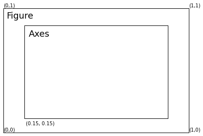
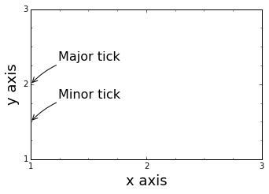

# Chapter 4: Figures
<!-- toc orderedList:0 depthFrom:1 depthTo:6 -->

* [Chapter 4: Figures](#chapter-4-figures)
* [Versions](#versions)

<!-- tocstop -->


---

Robert Johansson

Source code listings for [Numerical Python - A Practical Techniques Approach for Industry](http://www.apress.com/9781484205549) (ISBN 978-1-484205-54-9).

The source code listings can be downloaded from http://www.apress.com/9781484205549


```python
%matplotlib inline
import matplotlib.pyplot as plt
import matplotlib as mpl
```


```python
fig = plt.figure()

ax = fig.add_axes([0.05, 0.05, .88, .88])
ax.set_yticks([])
ax.set_xticks([])
ax.text(0.001, 0.01, "(0,0)")
ax.text(1.001, 0.01, "(1,0)")
ax.text(0.001, 1.01, "(0,1)")
ax.text(1.001, 1.01, "(1,1)")
ax.text(0.02, 0.92, "Figure", fontsize=18)

ax.text(0.12, 0.06, "(0.15, 0.15)")

ax = fig.add_axes([0.15, 0.15, 0.68, 0.66])
ax.text(0.03, 0.88, "Axes", fontsize=18)
ax.set_yticks([])
ax.set_xticks([])


fig.savefig("figure-axes-schematic.pdf");
```





```python
fig = plt.figure()


ax.text(0.12, 0.06, "(0.15, 0.15)")

ax = fig.add_axes([0.15, 0.15, 0.68, 0.66])
ax.set_yticks([1, 2, 3])
ax.set_xticks([1, 2, 3])

#ax.set_yticklabels(['', '', ''])

ax.set_xlabel("x axis", fontsize=18)
ax.set_ylabel("y axis", fontsize=18)

ax.set_xlim(1,3)
ax.set_ylim(1,3)

ax.xaxis.set_minor_locator(mpl.ticker.MultipleLocator(0.25))
ax.yaxis.set_minor_locator(mpl.ticker.MultipleLocator(0.25))

ax.annotate("Major tick",
         xy=(1, 2), xycoords='data',
         xytext=(+35, +30), textcoords='offset points', fontsize=16,
         arrowprops=dict(arrowstyle="->", connectionstyle="arc3, rad=.2"))

ax.annotate("Minor tick",
         xy=(1, 1.5), xycoords='data',
         xytext=(+35, +30), textcoords='offset points', fontsize=16,
         arrowprops=dict(arrowstyle="->", connectionstyle="arc3, rad=.2"))

fig.savefig("figure-axis-schematic.pdf");
```





# Versions


```python
%reload_ext version_information
```


```python
%version_information numpy, matplotlib
```


<table><tr><th>Software</th><th>Version</th></tr><tr><td>Python</td><td>2.7.13 64bit [MSC v.1500 64 bit (AMD64)]</td></tr><tr><td>IPython</td><td>5.1.0</td></tr><tr><td>OS</td><td>Windows 8.1 6.3.9600</td></tr><tr><td>numpy</td><td>1.9.3</td></tr><tr><td>matplotlib</td><td>1.4.3</td></tr><tr><td colspan='2'>Sun Mar 26 19:42:31 2017 Taipei Standard Time</td></tr></table>


```python

```
