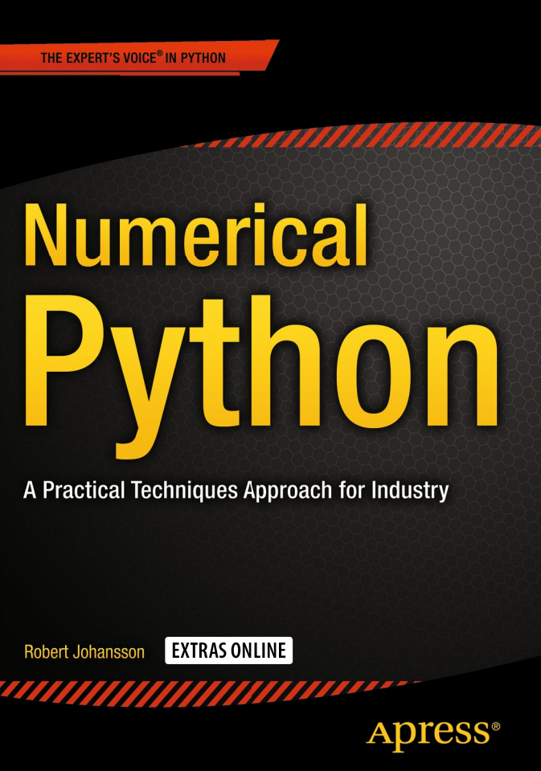

# Numerical Python
  

* [[Publisher]](http://www.apress.com/us/book/9781484205549)

## TOC
* [Chapter 1: Introduction to Computing with Python](Ch01_Introduction_to_Computing_with_Python.md)    
* [Chapter 2: Vectors, Matrices, and Multidimensional Arrays](Ch02_Vectors_Matrices_and_Multidimensional_Arrays.md)    
* [Chapter 3: Symbolic Computing](Ch03_Symbolic_Computing.md)    
* [Chapter 4: Plotting and Visualization](Ch04_Plotting_and_Visualization.md)    
* [Chapter 5: Equation Solving](Ch05_Equation_Solving.md)    
* [Chapter 6: Optimization](Ch06_Optimization.md)    
* [Chapter 7: Interpolation](Ch07_Interpolation.md)    
* [Chapter 8: Integration](Ch08_Integration.md)    
* [Chapter 9: Ordinary Differential Equations](Ch09_Ordinary_Differential_Equations.md)    
* [Chapter 10: Sparse Matrices and Graphs](Ch10_Sparse_Matrices_and_Graphs.md)    
* [Chapter 11: Partial Differential Equations](Ch11_Partial_Differential_Equations.md)    
* [Chapter 12: Data Processing and Analysis](Ch12_Data_Processing_and_Analysis.md)    
* [Chapter 13: Statistics](Ch13_Statistics.md)    
* [Chapter 14: Statistical Modeling](Ch14_Statistical_Modeling.md)    
* [Chapter 15: Machine Learning](Ch15_Machine_Learning.md)    
* [Chapter 16: Bayesian Statistics](Ch16_Bayesian_Statistics.md)    
* [Chapter 17: Signal Processing](Ch17_Signal_Processing.md)    
* [Chapter 18: Data Input and Output](Ch18_Data_Input_and_Output.md)    
* [Chapter 19: Code Optimization](Ch19_Code_Optimization.md)    