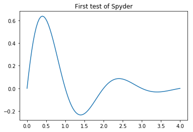
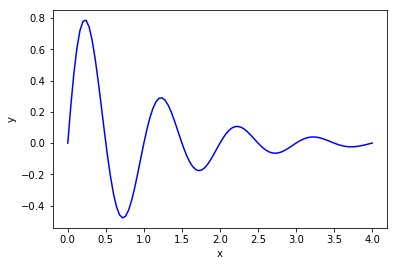

# A Getting Access to Python
<!-- toc orderedList:0 depthFrom:1 depthTo:6 -->

* [A Getting Access to Python](#a-getting-access-to-python)
  * [A.1 Required Software](#a1-required-software)
  * [A.2 Anaconda and Spyder](#a2-anaconda-and-spyder)
    * [A.2.1 Spyder on Mac](#a21-spyder-on-mac)
    * [A.2.2 Installation of Additional Packages](#a22-installation-of-additional-packages)
  * [A.3 How to Write and Run a Python Program](#a3-how-to-write-and-run-a-python-program)
    * [A.3.1 The Need for a Text Editor](#a31-the-need-for-a-text-editor)
    * [A.3.2 Text Editors](#a32-text-editors)
    * [A.3.3 Terminal Windows](#a33-terminal-windows)
    * [A.3.4 Using a Plain Text Editor and a Terminal Window](#a34-using-a-plain-text-editor-and-a-terminal-window)
    * [A.3.5 Spyder](#a35-spyder)
  * [A.4 The SageMathCloud and Wakari Web Services](#a4-the-sagemathcloud-and-wakari-web-services)
    * [A.4.1 Basic Intro to SageMathCloud](#a41-basic-intro-to-sagemathcloud)
    * [A.4.2 Basic Intro to Wakari](#a42-basic-intro-to-wakari)
    * [A.4.3 Installing Your Own Python Packages](#a43-installing-your-own-python-packages)
  * [A.5 Writing IPython Notebooks](#a5-writing-ipython-notebooks)
    * [A.5.1 A Simple Program in the Notebook](#a51-a-simple-program-in-the-notebook)
    * [A.5.2 Mixing Text, Mathematics, Code, and Graphics](#a52-mixing-text-mathematics-code-and-graphics)

<!-- tocstop -->


## A.1 Required Software

Python comes in two versions, version 2 and 3, and these are not fully compatible.
However, for the programs in this book, the differences are very small, the major one being print, which in Python 2 is a statement like


```python
print 'a:' , a, 'b:' , b
```

while in Python 3 it is a function call


```python
print( 'a:' , a, 'b:' , b)
```

## A.2 Anaconda and Spyder

### A.2.1 Spyder on Mac

### A.2.2 Installation of Additional Packages

## A.3 How to Write and Run a Python Program

### A.3.1 The Need for a Text Editor

### A.3.2 Text Editors

### A.3.3 Terminal Windows

### A.3.4 Using a Plain Text Editor and a Terminal Window

### A.3.5 Spyder


```python
import matplotlib.pyplot as plt
import numpy as np
x = np.linspace(0, 4, 101)
y = np.exp(-x)*np. sin(np. pi*x)
plt.plot(x, y)
plt.title('First test of Spyder' )
plt.savefig('tmp.png' )
plt.show()
```





## A.4 The SageMathCloud and Wakari Web Services

### A.4.1 Basic Intro to SageMathCloud

### A.4.2 Basic Intro to Wakari

### A.4.3 Installing Your Own Python Packages

## A.5 Writing IPython Notebooks

### A.5.1 A Simple Program in the Notebook


```python
g = 9.81
v0 = 5
t = 0.6
y = v0*t - 0.5*g*t**2
```

### A.5.2 Mixing Text, Mathematics, Code, and Graphics

Plot the curve $y=f(x) $, where
$$
f(x) = e^{-x}\sin (2\pi x),\quad x\in [0, 4]
$$


```python
# %matplotlib inline # make plots inline in the notebook
# %pyplot inline
import numpy as np
import matplotlib.pyplot as plt

x = np.linspace(0, 4, 101)
y = np.exp(-x)*np.sin(2*np.pi*x)
plt.plot(x, y, 'b-')
plt.xlabel('x')
plt.ylabel('y')
plt.show()
```





```python

```
