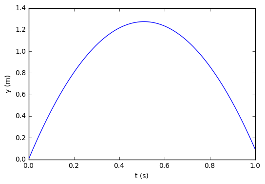
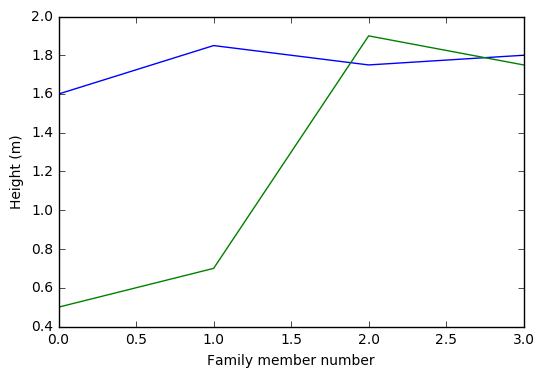

# Ch01 The First Few Steps
<!-- toc orderedList:0 depthFrom:1 depthTo:6 -->

* [Ch01 The First Few Steps](#ch01-the-first-few-steps)
* [1 The First Few Steps](#1-the-first-few-steps)
  * [1.1 What Is a Program? And What Is Programming?](#11-what-is-a-program-and-what-is-programming)
  * [1.2 A Python Program with Variables](#12-a-python-program-with-variables)
    * [1.2.1 The Program](#121-the-program)
    * [1.2.2 Dissection of the Program](#122-dissection-of-the-program)
    * [1.2.3 Why Not Just Use a Pocket Calculator?](#123-why-not-just-use-a-pocket-calculator)
    * [1.2.4 Why You Must Use a Text Editor to Write Programs](#124-why-you-must-use-a-text-editor-to-write-programs)
    * [1.2.5 Installation of Python](#125-installation-of-python)
    * [1.2.6 Write and Run Your First Program](#126-write-and-run-your-first-program)
  * [1.3 A Python Program with a Library Function](#13-a-python-program-with-a-library-function)
  * [1.4 A Python Program with Vectorization and Plotting](#14-a-python-program-with-vectorization-and-plotting)
  * [1.5 More Basic Concepts](#15-more-basic-concepts)
    * [1.5.1 Using Python Interactively](#151-using-python-interactively)
    * [1.5.2 Arithmetics, Parentheses and Rounding Errors](#152-arithmetics-parentheses-and-rounding-errors)
    * [1.5.3 Variables and Objects](#153-variables-and-objects)
    * [1.5.4 Integer Division](#154-integer-division)
    * [1.5.5 Formatting Text and Numbers](#155-formatting-text-and-numbers)
    * [1.5.6 Arrays](#156-arrays)
    * [1.5.7 Plotting](#157-plotting)
    * [1.5.8 Error Messages and Warnings](#158-error-messages-and-warnings)
    * [1.5.9 Input Data](#159-input-data)
    * [1.5.10 Symbolic Computations](#1510-symbolic-computations)
    * [1.5.11 Concluding Remarks](#1511-concluding-remarks)
  * [1.6 Exercises](#16-exercises)

<!-- tocstop -->


# 1 The First Few Steps

## 1.1 What Is a Program? And What Is Programming?

## 1.2 A Python Program with Variables
* http://www.perl.com/pub/2007/12/06/soto-11.html
* http://en.wikipedia.org/wiki/Ada_Lovelace

### 1.2.1 The Program


```python
# %load py/ball.py
# Program for computing the height of a ball in vertical motion

v0 = 5             # Initial velocity
g = 9.81           # Acceleration of gravity
t = 0.6            # Time

y = v0*t - 0.5*g*t**2        # Vertical position

print(y)
```


```python
%run py/ball.py
```

    1.2342


### 1.2.2 Dissection of the Program

### 1.2.3 Why Not Just Use a Pocket Calculator?

### 1.2.4 Why You Must Use a Text Editor to Write Programs

### 1.2.5 Installation of Python

### 1.2.6 Write and Run Your First Program
* http://continuum.io/downloads

## 1.3 A Python Program with a Library Function


```python
# %load py/ball_angle_first_try.py
from math import *

x = 10             # Horizontal position
y = 10             # Vertical position

angle = atan(y/x)

print((angle/pi)*180)
```


```python
%run py/ball_angle_first_try.py
```

    45.0


## 1.4 A Python Program with Vectorization and Plotting


```python
# %load py/ball_plot.py
from numpy import linspace

v0 = 5
g = 9.81
t = linspace(0, 1, 1001)

y = v0*t - 0.5*g*t**2

import matplotlib.pyplot as plt
plt.plot(t, y)
plt.xlabel('t (s)')
plt.ylabel('y (m)')
plt.show()

```


```python
%run py/ball_plot.py
```





## 1.5 More Basic Concepts

### 1.5.1 Using Python Interactively

### 1.5.2 Arithmetics, Parentheses and Rounding Errors

### 1.5.3 Variables and Objects

### 1.5.4 Integer Division

### 1.5.5 Formatting Text and Numbers


```python
# %load py/formatted_print.py
real = 12.89643
integer = 42
string = 'some message'
print('real=%.3f, integer=%d, string=%s' % (real, integer, string))
print('real=%9.3e, integer=%5d, string=%s' % (real, integer, string))
```


```python
%run py/formatted_print.py
```

    real=12.896, integer=42, string=some message
    real=1.290e+01, integer=   42, string=some message


### 1.5.6 Arrays

### 1.5.7 Plotting


```python
# %load py/plot_heights.py
from numpy import zeros
import matplotlib.pyplot as plt

h = zeros(4)
h[0] = 1.60; h[1] = 1.85; h[2] = 1.75; h[3] = 1.80
H = zeros(4)
H[0] = 0.50; H[1] = 0.70; H[2] = 1.90; H[3] = 1.75

family_member_no = zeros(4)
family_member_no[0] = 0; family_member_no[1] = 1
family_member_no[2] = 2; family_member_no[3] = 3

plt.plot(family_member_no, h, family_member_no, H)
plt.xlabel('Family member number')
plt.ylabel('Height (m)')
plt.show()

```


```python
%run py/plot_heights.py
```





```python
# %load py/matrix_vector_product.py
from numpy import zeros, mat, transpose

x = zeros(2)
x = mat(x)
x = transpose(x)
x[0] = 3;   x[1] = 2   # Pick some values

A = zeros((2,2))
A = mat(A)
A[0,0] = 1;  A[0,1] = 0
A[1,0] = 0;  A[1,1] = 1

# The following gives y = x since A = I, the identity matrix
y = A*x
print(y)

```


```python
%run py/matrix_vector_product.py
```

    [[ 3.]
     [ 2.]]


### 1.5.8 Error Messages and Warnings

### 1.5.9 Input Data

### 1.5.10 Symbolic Computations


```python
# %load py/example_symbolic.py
from sympy import *

x = Symbol('x')
y = Symbol('y')

print(2*x + 3*x - y)                # Algebraic computation
print(diff(x**2, x))                # Differentiates x**2 wrt. x
print(integrate(cos(x), x))         # Integrates cos(x) wrt. x
print(simplify((x**2 + x**3)/x**2)) # Simplifies expression
print(limit(sin(x)/x, x, 0))        # Finds limit of sin(x)/x as x->0
print(solve(5*x - 15, x))           # Solves 5*x = 15
```


```python
%run py/example_symbolic.py
```

    5*x - y
    2*x
    sin(x)
    x + 1
    1
    [3]


### 1.5.11 Concluding Remarks

## 1.6 Exercises

* Exercise 1.2: Volume of acube
* Exercise 1.3: Area and circumference of acircle
* Exercise 1.4: Volumes of three cubes
* Exercise 1.5: Average of integers
* Exercise 1.6: Interactive computing of volume and area
* Exercise 1.7 Peculiar results from division
* Exercise 1.8 Update variable at command prompt
* Exercise 1.9 Formatted print to screen
* Exercise 1.10 Python documentation and random numbers


```python

```
