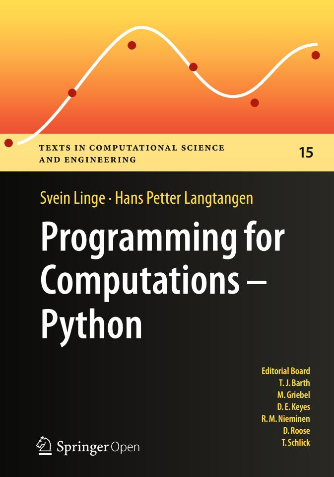

# Programming for Computations – Python

<!-- toc orderedList:0 depthFrom:1 depthTo:6 -->
<!-- tocstop -->

[Springer](http://www.springer.com/gp/book/9783319324272)
[github](https://github.com/hplgit/prog4comp)
[book site](http://hplgit.github.io/prog4comp/index.html)
[sphinx book](http://hplgit.github.io/prog4comp/doc/pub/p4c-sphinx-Python/)

# Toc
* [Ch01 The First Few Steps](Ch01_The_First_Few_Steps.md)
* [Ch02 Basic Constructions](Ch02_Basic_Constructions.md)
* [Ch03 Computing Integrals](Ch03_Computing_Integrals.md)
* [Ch04 Solving Ordinary Differential Equations](Ch04_Solving_Ordinary_Differential_Equations.md)
* [Ch05 Solving Partial Differential Equations](Ch05_Solving_Partial_Differential_Equations.md)
* [Ch06 Solving Nonlinear Algebraic Equations](Ch06_Solving_Nonlinear_Algebraic_Equations.md)
* [AppA Getting Access to Python](AppA_Getting_Access_to_Python.md)