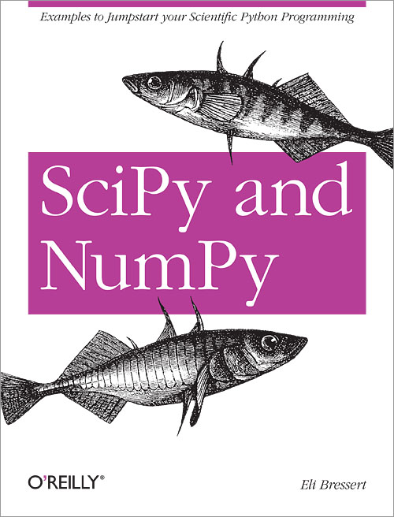

# SciPy NumPy

## info
* [publisher](http://shop.oreilly.com/product/0636920020219.do)

## toc
* [Chapter 1 Introduction](Ch01_Introduction.md)
* [Chapter 2 NumPy](Ch02_NumPy.md)
* [Chapter 3 SciPy](Ch03_SciPy.md)
* [Chapter 4 SciKit: Taking SciPy One Step Further](Ch04_SciKit_Taking_SciPy_One_Step_Further.md)
* [Chapter 5 Conclusion](Ch05_Conclusion.md)
